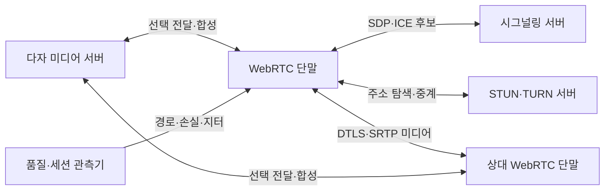
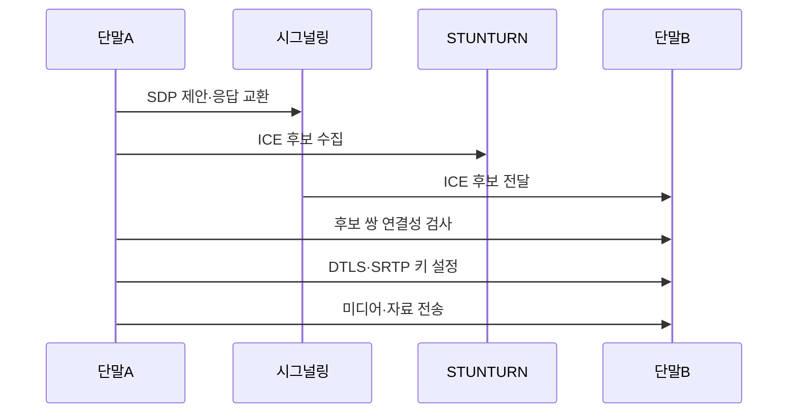

---
sidebar:
  order: 109
  label: "109. WebRTC (WebRTC)"
  badge:
    text: "기출 · 30%"
    variant: note
title: "WebRTC (WebRTC)"
date: "2026-07-25T00:45:00+09:00"
tags: ["notes-network"]
weight: 109
extra:
  question_no: "109"
  source_status: "기출"
  source_history: "122회"
  priority: 30
  priority_note: "설계형: 122회 비대면 WebRTC 구성"
---

## 미리 알고가기

- **웹 실시간 통신(Web Real-Time Communication, WebRTC)**: 브라우저와 응용이 별도 플러그인 없이 음성·영상·자료를 실시간·암호화 교환하는 기술 모음이다.
- **네트워크 주소 변환(Network Address Translation, NAT)**: ‘냇’으로 읽고 세 영문 단어의 머리글자를 딴 표기이며 내부 주소·포트를 외부 주소·포트로 바꿔 직접 연결 경로 탐색이 필요하게 한다.
- **사용자 데이터그램 프로토콜(User Datagram Protocol, UDP)**: ‘유디피’로 읽고 세 영문 단어의 머리글자를 딴 표기이며 지연에 민감한 WebRTC 미디어 패킷의 기본 전송을 담당한다.
- **전송 계층 보안(Transport Layer Security, TLS)**: ‘티엘에스’로 읽고 세 영문 단어의 머리글자를 딴 표기이며 직접 UDP 경로가 막힌 환경에서 TURN 중계 연결을 암호화한다.
- **데이터그램 전송 계층 보안(Datagram Transport Layer Security, DTLS)**: ‘디티엘에스’로 읽고 네 영문 핵심어의 머리글자를 딴 표기이며 WebRTC 단말을 인증하고 SRTP용 키를 합의한다.
- **단말 간 직접 통신(Peer-to-Peer, P2P)**: ‘피투피’로 읽고 두 Peer 사이를 숫자 2로 이은 표기이며 중앙 미디어 서버 없이 단말끼리 스트림을 교환한다.
- **세션 기술서 프로토콜(Session Description Protocol, SDP)**: 미디어 종류·코덱·전송 방향·후보 정보를 제안·응답 형식으로 표현한다.
- **상호 연결 설정(Interactive Connectivity Establishment, ICE)**: 단말들이 여러 후보 주소 쌍의 실제 연결성을 검사해 사용할 경로를 선택하는 절차다.
- **NAT 세션 통과 유틸리티(Session Traversal Utilities for NAT, STUN)**: NAT 밖에서 보이는 단말의 공인 주소·포트를 알려 주는 서버와 프로토콜이다.
- **NAT 중계 통과(Traversal Using Relays around NAT, TURN)**: 직접 연결이 실패할 때 미디어·자료를 대신 전달하는 중계 서버와 프로토콜이다.
- **보안 실시간 전송 프로토콜(Secure Real-time Transport Protocol, SRTP)**: 음성·영상 패킷을 암호화하고 무결성을 검증한다.
- **선택 전달 장치(Selective Forwarding Unit, SFU)**: 참여자의 미디어를 합성하지 않고 수신자별로 선택 전달하는 다자 회의 서버다.
- **다지점 제어 장치(Multipoint Control Unit, MCU)**: 여러 참여자의 미디어를 서버에서 디코딩·합성·재인코딩하는 다자 회의 서버다.
- **지터(Jitter)**: 미디어 패킷의 도착 간격이 일정하지 않게 변하는 정도다.

## Ⅰ. 개요

- **정의/개념**: 브라우저 간 실시간 음성·영상·자료 통신
- **배경/필요성**: NAT·방화벽 경로 탐색과 미디어 암호화

### 쉽게 이해하기 (학습용)

- 두 브라우저가 서로 통하는 직접 길을 찾고 막히면 중계 서버를 사용해 암호화된 통화를 시작한다.

## Ⅱ. 특징

- 시그널링은 응용이 정하고 미디어는 직접 교환한다.
- ICE가 실제 왕복 가능한 후보 쌍을 검사한다.
- 모든 미디어를 암호화해 평문 전송을 막는다.
- 다자 규모 증가 시 단말·중계 대역폭이 급증한다.

### 쉽게 이해하기 (학습용)

- 통화 조건을 알려 주는 길과 실제 영상이 흐르는 길이 다르며 영상 경로는 직접 연결을 먼저 찾는다.

## Ⅲ. 아키텍처 및 구성요소

| 설계 요소 | 설명 |
|:---|:---|
| WebRTC 단말 | 장치 권한·코덱·미디어·자료 처리 |
| 시그널링 서버 | SDP 제안·응답과 ICE 후보 전달 |
| STUN·TURN 서버 | 공인 주소 탐색·중계 경로 제공 |
| 상대 WebRTC 단말 | 협상된 경로에서 미디어 교환 |
| 다자 미디어 서버 | SFU 선택 전달·MCU 합성 수행 |
| 품질·세션 관측기 | 경로·손실·지터·중계 비율 수집 |

> 요약: 시그널링은 조건, ICE는 실제 경로 결정

### 쉽게 이해하기 (학습용)

- 시그널링 서버가 통화 조건과 후보를 교환하고 STUN·TURN이 연결을 도우며 선택된 경로에서 단말끼리 미디어를 보낸다.

## Ⅳ. 원리 및 절차 흐름도

| 절차 | 설명 |
|:---|:---|
| SDP 제안·응답 교환 | 코덱·방향·미디어 조건 합의 |
| ICE 후보 수집 | 호스트·공인·중계 주소 확보 |
| ICE 후보 전달 | 응용 시그널링으로 상대에 전달 |
| 후보 쌍 연결성 검사 | 실제 왕복 가능한 경로를 선택 |
| DTLS·SRTP 키 설정 | 상대 인증과 미디어 키 생성 |
| 미디어·자료 전송 | 선택 경로에서 암호화 교환 |

> 요약: SDP 협상·ICE 경로 선택 후 보안 전송

### 쉽게 이해하기 (학습용)

- 통화 형식을 합의하고 직접 주소와 중계 주소를 시험해 실제로 되는 길을 선택한 뒤 암호키를 만들고 미디어를 보낸다.

## Ⅴ. 종류 및 비교

| 판단 기준 | P2P 메시 | SFU | MCU |
|:---|:---|:---|:---|
| 핵심 특징 | 단말들이 서로 모든 스트림 직접 교환 | 서버가 수신자별 스트림을 선택 전달 | 서버가 미디어를 합성·변환 |
| 적용 기준 | 1:1·소수 참여자·서버 비용 최소 | 일반 다자 회의·단말 대역폭 절감 | 단일 합성 화면·코덱 변환 필요 |
| 주요 위험 | 참여자 증가 시 단말 대역폭 폭증 | 서버 송신량·경로 집중 | 높은 서버 연산·추가 지연 |

> 요약: 참여자 수·합성 필요·서버 자원으로 선택

### 쉽게 이해하기 (학습용)

- 소규모는 직접 연결, 일반 다자 회의는 SFU 전달, 합성 화면과 형식 변환이 필요하면 MCU를 사용한다.

## Ⅵ. 실무 사례

1. 기업망 직접 연결 실패를 TURN TLS로 중계
2. 다자 회의는 SFU가 수신 품질별 영상 선택

### 쉽게 이해하기 (학습용)

- UDP와 직접 경로가 막힌 기업망 사용자는 TLS로 연결되는 TURN 서버가 미디어를 대신 전달한다.
- SFU는 휴대폰과 고해상도 화면의 대역폭에 맞춰 서로 다른 품질의 영상 스트림을 골라 보낸다.

## Ⅶ. 결론

- 연결 성공률·중계 비용·참여자 수로 구조 선택

### 쉽게 이해하기 (학습용)

- WebRTC 품질은 영상이 보이는지뿐 아니라 직접·중계 경로 성공률과 다자 구조의 단말·서버 부담으로 판단해야 한다.
