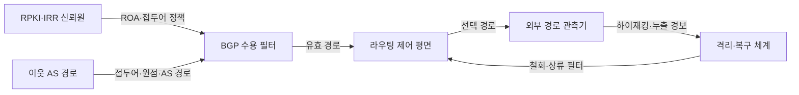
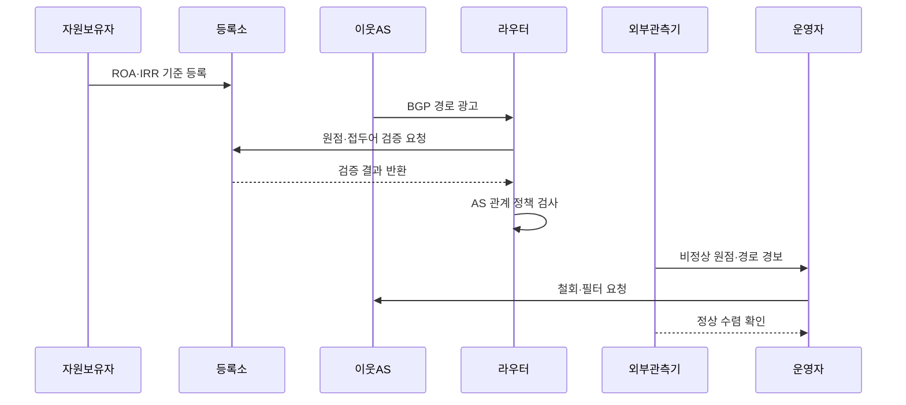

---
sidebar:
  order: 110
  label: "110. BGP 하이재킹 방지 (BGP Hijacking Prevention)"
  badge:
    text: "미출제 · 50%"
    variant: note
title: "BGP 하이재킹 방지 (BGP Hijacking Prevention)"
date: "2026-07-25T00:45:00+09:00"
tags: ["notes-network"]
weight: 110
extra:
  question_no: "110"
  source_status: "미출제"
  source_history: ""
  priority: 50
  priority_note: "보안·문제대책형: Hijack·Leak 다층 방어"
---

## 미리 알고가기

- **경계 경로 프로토콜(Border Gateway Protocol, BGP)**: 자율시스템들이 도달 가능한 IP 접두어와 자율시스템 경로를 교환하는 인터넷 경로 프로토콜이다.
- **인터넷 프로토콜(Internet Protocol, IP)**: 패킷에 출발지·목적지 주소를 부여하고 여러 네트워크를 거쳐 전달하는 네트워크 계층 프로토콜이다.
- **자율시스템(Autonomous System, AS)**: 하나의 관리 정책 아래 인터넷 경로를 운영하고 고유 번호로 식별되는 네트워크 집합이다.
- **접두어 하이재킹(Prefix Hijack)**: 권한 없는 자율시스템이 피해자의 IP 접두어를 자신이 시작한 경로처럼 광고하는 사고다.
- **더 구체적 접두어 하이재킹**: 피해 접두어보다 긴 하위 접두어를 광고해 IP 최장 일치 규칙으로 트래픽을 끌어오는 공격이다.
- **경로 누출(Route Leak)**: 정상적으로 배운 경로를 고객·제공자·동료 관계 정책에 어긋나게 다시 광고하는 사고다.
- **자원 공개키 기반구조(Resource Public Key Infrastructure, RPKI)**: IP 주소 자원 보유자가 허용한 원점 자율시스템을 서명해 공개하는 체계다.
- **경로 원점 인가(Route Origin Authorization, ROA)**: 접두어를 광고할 수 있는 원점 AS와 허용 최대 접두어 길이를 기록한 서명 객체다.
- **경로 원점 검증(Route Origin Validation, ROV)**: 수신 BGP 경로의 접두어·원점 AS를 ROA와 대조해 유효·미확인·무효로 판정하는 절차다.
- **인터넷 라우팅 등록소(Internet Routing Registry, IRR)**: 운영자가 접두어·AS 정책을 등록해 필터 생성에 사용하는 데이터베이스다.

## Ⅰ. 개요

- 정의/개념: 불법 접두어 광고의 트래픽 탈취·우회를 막는 다층 통제
- **배경/필요성**: BGP의 분산 신뢰·최장 접두어 선택 보완

### 쉽게 이해하기 (학습용)

- 인터넷에 가짜 길 안내가 퍼지지 않게 주소 소유 권한과 이웃 관계를 검사하고 외부 경로 변화를 계속 감시한다.

## Ⅱ. 특징

- 잘못된 광고가 여러 사업자로 빠르게 전파한다.
- 더 긴 접두어는 일반 경로 정책보다 먼저 선택한다.
- 원점 검증만으로 정상 원점의 경로 누출은 판별 곤란하다.
- 예방 필터·외부 탐지·사업자 협력이 모두 필요하다.

### 쉽게 이해하기 (학습용)

- 주소 주인이 맞아도 배포하면 안 되는 사업자 관계로 경로를 퍼뜨린 누출은 별도 정책 검사가 필요하다.

## Ⅲ. 아키텍처 및 구성요소

| 설계 요소 | 설명 |
|:---|:---|
| RPKI·IRR 신뢰원 | 원점 권한·허용 접두어 근거 제공 |
| BGP 수용 필터 | ROV·접두어·AS 관계 정책 검사 |
| 이웃 AS 경로 | 외부 접두어·원점·경로 광고 |
| 라우팅 제어 평면 | 유효 경로 선택·전파·철회 수행 |
| 외부 경로 관측기 | 인터넷 실제 원점·경로 변화 탐지 |
| 격리·복구 체계 | 상류 협력·필터·정상 수렴 확인 |

> 요약: 원점·접두어·AS 관계 검증과 외부 관측

### 쉽게 이해하기 (학습용)

- 라우터가 서명과 등록 정책으로 받은 경로를 검사하고 외부 관측점이 인터넷에서 실제 선택된 길을 확인한다.

## Ⅳ. 원리 및 절차 흐름도

| 절차 | 설명 |
|:---|:---|
| ROA·IRR 기준 등록 | 원점 AS·최대 길이·정책 공개 |
| BGP 경로 광고 | 이웃의 접두어·원점·경로 전달 |
| 원점·접두어 검증 요청 | 접두어·원점 AS를 ROA와 대조 요청 |
| 검증 결과 반환 | 유효·미확인·무효 상태 제공 |
| AS 관계 정책 검사 | 이웃별 허용 접두어·경로 관계 대조 |
| 비정상 원점·경로 경보 | 외부 전파 상태와 이상 근거 전달 |
| 철회·필터 요청 | 자사 광고 철회·상류 차단 요청 |
| 정상 수렴 확인 | 정상 경로 회복을 외부 관측으로 검증 |

> 요약: 광고 수용 전 검증하고 외부 전파를 협력 복구

### 쉽게 이해하기 (학습용)

- 주소 권한을 등록하고 받은 경로를 검사하며 사고가 퍼지면 상류 사업자와 함께 가짜 광고를 막고 정상 길로 돌아왔는지 확인한다.

## Ⅴ. 종류 및 비교

| 판단 기준 | 원점 하이재킹 | 더 구체적 하이재킹 | 경로 누출 |
|:---|:---|:---|:---|
| 핵심 특징 | 같은 접두어를 불법 원점이 광고 | 긴 하위 접두어로 최장 일치 유도 | 정상 경로를 금지 관계로 재광고 |
| 적용 기준 | 원점 AS가 ROA와 불일치 | 허용 최대 길이를 넘는 하위 광고 | 원점은 맞으나 AS 관계가 비정상 |
| 주요 위험 | 경로 경쟁에 따른 부분 탈취 | 대부분 트래픽의 빠른 탈취 | ROV 통과·광범위 우회·혼잡 |

> 요약: 원점·접두어 길이·AS 관계로 사고 분류

### 쉽게 이해하기 (학습용)

- 주소 주인을 속이면 원점 하이재킹, 더 자세한 주소를 내면 구체적 하이재킹, 정상 길을 잘못 유통하면 경로 누출이다.

## Ⅵ. 실무 사례

1. 자사 접두어의 **ROA 등록과 RPKI 원점 검증**

### 쉽게 이해하기 (학습용)

- 자사 IP 접두어의 정상 원점 AS와 최대 길이를 ROA로 등록해 통신사업자가 잘못된 원점 광고를 무효로 판정하게 한다.

## Ⅶ. 결론

- 원점·접두어·AS 관계 검증과 외부 관측 결합

### 쉽게 이해하기 (학습용)

- BGP 하이재킹은 RPKI 하나로 끝나지 않고 접두어 필터와 관계 정책, 외부 전파 탐지와 상류 복구 절차를 함께 운영해야 한다.
