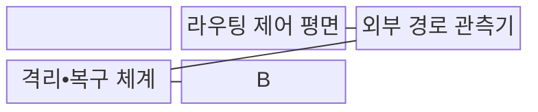
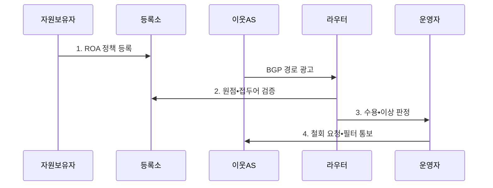

---
sidebar:
  order: 110
  label: "110. BGP 하이재킹 방지 (BGP Hijacking Prevention)"
  badge:
    text: "미출제 • 50%"
    variant: note
title: "BGP 하이재킹 방지 (BGP Hijacking Prevention)"
date: "2026-08-03T15:05:00+09:00"
tags: ["notes-network"]
weight: 110
extra:
  question_no: "110"
  source_status: "미출제"
  source_history: ""
  priority: 50
  priority_note: "보안•문제대책형: Hijack•Leak 다층 방어"
---

## Ⅰ. 개요

핵심 용어

- **경계 게이트웨이 프로토콜 하이재킹 방지(Border Gateway Protocol Hijacking Prevention, BGP 하이재킹 방지)**: 원점 권한•접두어 길이•AS 관계를 검증해 비인가 경로 전환을 막는 인터넷 라우팅 보안 체계다.
- **자율 시스템(Autonomous System, AS)**: 하나의 관리 정책 아래 운영되는 네트워크와 라우터의 집합이다.

- 정의/개념: **BGP 하이재킹 방지** 는 원점•접두어 길이•AS 관계를 검증해 권한 없는 광고의 트래픽 탈취와 비인가 경로 전환을 막는 **인터넷 라우팅 보안 체계**
- 배경/필요성: BGP는 **권한 검증 없이 최장 접두어 선택**

#### 한줄 요약

- 인터넷에 가짜 길 안내가 퍼지지 않게 주소 소유 권한과 이웃 관계를 검사하고 외부 경로 변화를 계속 감시한다.

## Ⅱ. 특징

핵심 용어

- **다층 검증(Multi-Layer Validation)**: 경로 기원 인가(Route Origin Authorization, ROA) 원점 권한•허용 접두어 길이•이웃 자율 시스템(Autonomous System, AS) 관계 정책과 외부 전파 상태를 함께 확인한다.

- 잘못된 광고의 **사업자 간 급속 전파**
- 긴 접두어의 **최장 일치 우선 선택**
- 원점•접두어•AS 관계의 **다층 검증**

#### 한줄 요약

- 주소 주인이 맞아도 배포하면 안 되는 사업자 관계로 경로를 퍼뜨린 누출은 별도 정책 검사가 필요하다.

## Ⅲ. 구조 및 구성요소

핵심 용어

- **BGP 수용 필터(Border Gateway Protocol Import Filter)**: 이웃에게 받은 경로를 경로 기원 검증(Route Origin Validation, ROV)•접두어 길이•AS 관계 정책과 대조해 수용•차단한다.
- **리소스 공개키 기반구조•인터넷 라우팅 등록소(Resource Public Key Infrastructure/Internet Routing Registry, RPKI•IRR)**: 경로 원점 권한과 라우팅 정책의 등록 근거를 제공하는 신뢰원이다.

| 구성요소 | 책임 |
|:---|:---|
| RPKI•IRR 신뢰원 | **원점 권한•허용 접두어** 근거 제공 |
| BGP 수용 필터 | **ROV•접두어•AS 관계** 정책 검사 |
| 라우팅 제어 평면 | 유효 경로 **선택•전파•철회** 수행 |
| 외부 경로 관측기 | 실제 **원점•경로 변화** 탐지 |
| 격리•복구 체계 | 상류 협력•필터•**정상 수렴** 확인 |

> 요약: 원점•접두어•AS 관계 검증과 외부 관측

#### 한줄 요약

- 라우터가 서명과 등록 정책으로 받은 경로를 검사하고 외부 관측점이 인터넷에서 실제 선택된 길을 확인한다.

## Ⅳ. 흐름도

핵심 용어

- **원점•접두어 검증(Origin/Prefix Validation)**: 라우터는 광고 접두어의 원점 AS와 길이를 ROA의 허용 원점•최대 길이와 대조한다.
- **경로 기원 인가•경계 게이트웨이 프로토콜(Route Origin Authorization/Border Gateway Protocol, ROA•BGP)**: 허용 원점•최대 길이 정책과 이를 전달하는 라우팅 프로토콜이다.

**동작 원리**

- **1. ROA 정책 등록**: 원점 AS•최대 길이•정책 공개
- **2. 원점•접두어 검증**: ROA와 원점•최대 길이를 대조
- **3. 수용•이상 판정**: AS 관계•외부 전파를 함께 확인
- **4. 철회 요청•필터 통보**: 상류 차단 후 정상 수렴 검증
> 요약: 광고 수용 전 검증하고 외부 전파를 협력 복구

#### 한줄 요약

- 주소 권한을 등록하고 받은 경로를 검사하며 사고가 퍼지면 상류 사업자와 함께 가짜 광고를 막고 정상 길로 돌아왔는지 확인한다.

## Ⅴ. 종류 및 비교

핵심 용어

- **경로 누출(Route Leak)**: 원점 자율 시스템(Autonomous System, AS)은 정상이지만 고객•제공자•동료 관계 정책에 어긋나게 배운 경로를 재광고하는 사고다.
- **경로 기원 인가•검증(Route Origin Authorization/Validation, ROA•ROV)**: 허용 원점•최대 길이를 등록하고 광고 경로와 대조하는 체계이다.

| 경로 사고 유형 | 원점 하이재킹 | 더 구체적 하이재킹 | 경로 누출 |
|:---|:---|:---|:---|
| 적용 기준 | 원점 AS가 **ROA와 불일치** | **허용 최대 길이** 를 넘는 하위 광고 | 원점은 맞으나 **AS 관계가 비정상** |
| 핵심 특징 | **불법 원점의 동일 접두어** | **긴 하위 접두어 최장 일치** | **금지 관계의 경로 재광고** |
| 한계 | 경로 경쟁에 따른 **부분 탈취** | 대부분 트래픽의 **빠른 탈취** | **ROV 통과**•광범위한 비인가 경로 전환 |

> 요약: 원점•접두어 길이•AS 관계로 사고 분류

#### 한줄 요약

- 주소 주인을 속이면 원점 하이재킹, 더 자세한 주소를 내면 구체적 하이재킹, 정상 길을 잘못 유통하면 경로 누출이다.

## Ⅵ. 실무 고려사항 및 대책

핵심 용어

- **외부 전파 지속(Continued External Propagation)**: 로컬에서 경로를 차단해도 다른 사업자가 잘못된 광고를 계속 선택•재전파하는 문제다.
- **요청 의견서•경로 기원 인가•검증(Request for Comments/Route Origin Authorization/Validation, RFC•ROA•ROV)**: 인터넷 표준 문서와 경로 원점 권한 등록•검증 체계이다.
- **제공자 역할 표시(Only-To-Customer, OTC)**: 고객에게만 전달해야 하는 경로임을 표시해 관계 위반 재광고를 탐지하는 속성이다.

| 문제 | 대책 | 효과 |
|:---|:---|:---|
| **불법 원점•긴 접두어 광고** | **RFC 9582 ROA•ROV 적용** | **원점 하이재킹 차단** |
| 정상 원점의 **경로 누출** | **RFC 9234 역할•OTC 검사** | **관계 위반 경로 차단** |
| 사고의 **외부 전파 지속** | **다중 관측•상류 철회 절차** | **복구 시간 단축** |

#### 한줄 요약

- 원점과 최대 길이를 ROA로 등록하고 AS 관계 정책과 외부 경로 관측을 결합해야 누출까지 통제할 수 있다.

## Ⅶ. 결론

핵심 용어

- **차단•철회(Block/Withdraw)**: 원점•최대 길이•자율 시스템(Autonomous System, AS) 관계가 불일치한 경로는 수용 필터로 차단하고 상류 사업자와 협력해 광고 철회와 정상 수렴을 확인한다.
- **리소스 공개키 기반구조(Resource Public Key Infrastructure, RPKI)**: 경로 기원 권한을 인증서와 서명 객체로 검증하는 기반구조이다.

- ROA•최대 길이•AS 관계 일치 경로만 **수용**, 불일치는 **차단•철회**

#### 한줄 요약

- BGP 하이재킹은 RPKI 하나로 끝나지 않고 접두어 필터와 관계 정책, 외부 전파 탐지와 상류 복구 절차를 함께 운영해야 한다.
