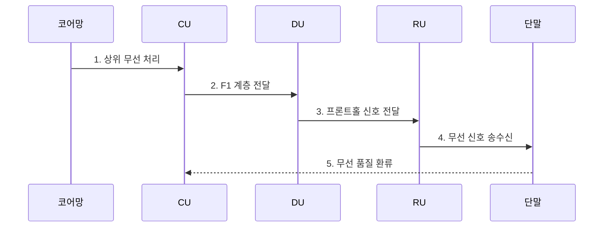

---
sidebar:
  order: 111
  label: "111. 네트워크 기능 분리"
  badge:
    text: "기출 · 30%"
    variant: note
title: "네트워크 기능 분리"
date: "2026-07-27T23:59:59+09:00"
tags:
  - "notes-network"
weight: 111
extra:
  question_no: "111"
  source_status: "기출"
  source_history: "132회"
  priority: 30
  priority_note: "132회 출제"
---

## 미리 알고가기

- **네트워크 기능 분리(Network Function Disaggregation)**: 통신 장비 기능을 독립 구성요소와 표준 인터페이스로 나눠 위치·자원·공급사를 유연하게 구성하는 구조다.
- **무선 접속망(Radio Access Network, RAN)**: 단말과 이동통신 핵심망 사이에서 무선 신호와 접속을 처리하는 망이다.
- **5세대 이동통신 기지국(gNodeB, gNB)**: 5세대 무선 접속을 제공하는 기지국이다.
- **중앙 장치(Central Unit, CU)**: 무선 자원 제어·패킷 처리 같은 상위 무선 계층을 중앙 처리하는 장치다.
- **분산 장치(Distributed Unit, DU)**: 짧은 응답 시간이 필요한 스케줄링과 상위 물리 계층을 현장 가까이에서 처리한다.
- **무선 장치(Radio Unit, RU)**: 디지털 신호와 무선 전파를 서로 변환하고 안테나에 연결하는 장치다.
- **3세대 파트너십 프로젝트(3rd Generation Partnership Project, 3GPP)**: 이동통신 무선·핵심망 규격을 제정하는 표준화 협력체다.
- **F1 인터페이스**: 3GPP가 CU와 DU 사이의 제어·사용자 평면 연결에 부여한 표준 인터페이스다.
- **개방 프론트홀(Open Fronthaul)**: DU와 RU를 여러 공급사 장비로 조합하도록 신호·제어·관리·동기를 규정한 연결 구간이다.
- **3GPP TS 38.401**: 차세대 무선 접속망과 gNB-CU·gNB-DU 구조를 규정한 공식 기술규격이다.
- **O-RAN WG4 CUS-Plane**: O-DU·O-RU 간 제어·사용자·동기 평면을 규정한 개방 프론트홀 규격이다.

## Ⅰ. 개요

- 정의: 기지국 기능의 **CU·DU·RU 표준 분리**
- 기존 한계: 일체형 장비의 **확장·다중 공급사 연동 곤란**

### 쉽게 이해하기 (학습용)

- 기지국 한 상자에 있던 두뇌·현장 제어·전파 변환 기능을 필요한 처리 시간과 위치에 따라 나눠 놓음

## Ⅱ. 특징

- **CU 중앙화**로 여러 DU가 상위 처리 자원을 공유한다.
- **DU·RU 현장 배치**로 스케줄링·물리 처리 시한을 충족한다.
- F1·개방 프론트홀의 **공급사 조합·엄격한 동기**

### 쉽게 이해하기 (학습용)

- 기능을 중앙에 모으면 자원을 함께 쓸 수 있지만 현장 장치와 더 빠르고 정확한 시간으로 통신해야 함

## Ⅲ. 구조 및 구성요소

| 설계 요소 | 설명 |
|:---|:---|
| 중앙 장치(CU) | **상위 무선 계층·정책 처리** |
| F1 인터페이스 | **CU·DU 제어·사용자 데이터 전달** |
| 분산 장치(DU) | **스케줄링·상위 물리 처리** |
| 개방 프론트홀 | **DU·RU 신호·제어·동기 전달** |
| 무선 장치(RU) | **하위 물리·전파 변환** |

> 요약: 처리 시한에 따라 중앙·현장 기능 경계 결정

### 쉽게 이해하기 (학습용)

- 느린 상위 처리는 중앙 장치가 모아 맡고 즉시 반응해야 하는 신호 처리는 안테나 가까운 분산·무선 장치가 맡음

## Ⅳ. 흐름도

| 절차 | 설명 |
|:---|:---|
| 상위 무선 처리 | CU가 정책과 상위 계층을 처리 |
| F1 계층 전달 | CU 결과를 DU에 전달 |
| 프론트홀 신호 전달 | DU가 스케줄링 후 RU로 전달 |
| 무선 신호 송수신 | RU가 변환한 전파를 단말과 교환 |
| 무선 품질 환류 | 측정 결과로 자원 정책을 보정 |

> 요약: 상위 처리를 CU에서 RU 전파 변환까지 전달

### 쉽게 이해하기 (학습용)

- 핵심망에서 받은 자료를 CU가 상위 계층으로 처리하고 DU가 무선 자원을 정한 뒤 RU가 전파로 바꿔 단말에 보냄

## Ⅴ. 종류 및 비교

| 기지국 기능 구조 | 일체형 | CU-DU 분리 | DU-RU 분리 |
|:---|:---|:---|:---|
| 적용 기준 | 소규모·단순 구축 | 다수 DU 자원 공유 | 개방형 다중 공급사 |
| 핵심 특징 | **기능의 단일 장비 결합** | **상위 기능 중앙화** | **물리 계층까지 분리** |
| 한계 | 확장성·공급사 종속 | F1 지연·용량 부족 | 동기·상호운용 실패 |

> 요약: 낮은 계층을 분리할수록 전송·동기 조건 강화

### 쉽게 이해하기 (학습용)

- 기능을 더 잘게 나눌수록 공급사를 섞고 자원을 공유하기 쉽지만 장치 사이 전송 지연과 시간 동기를 더 엄격히 맞춰야 함

## Ⅵ. 실무 고려사항 및 대책

| 고려사항 | 대책 | 효과 |
|:---|:---|:---|
| 기능 분리점의 지연 초과 | **처리 시한별 CU·DU·RU 배치** | 무선 응답성 확보 |
| 다중 공급사 연동 실패 | **O-RAN WG4 CUS 시험** | 프론트홀 상호운용 확보 |
| CU·DU 구조 해석 불일치 | **3GPP TS 38.401 준수** | 기지국 구조 정합성 확보 |

### 쉽게 이해하기 (학습용)

- 처리 시한과 프론트홀 품질을 먼저 산정하고 표준 준수·상호운용 시험을 통과한 분리점만 적용한다.

## Ⅶ. 결론

- **처리 시한·전송 품질·개방성**으로 분리점 결정

### 쉽게 이해하기 (학습용)

- 중앙화 이익만 보고 나누지 않고 각 기능의 응답 시한을 만족할 전송 지연·용량·동기를 확보할 수 있는 경계를 선택함
