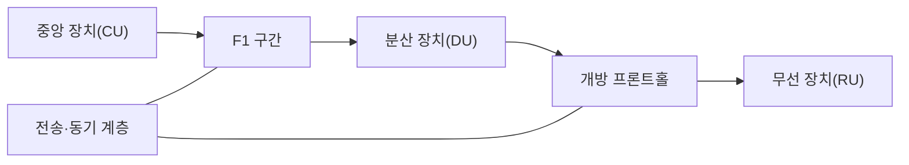
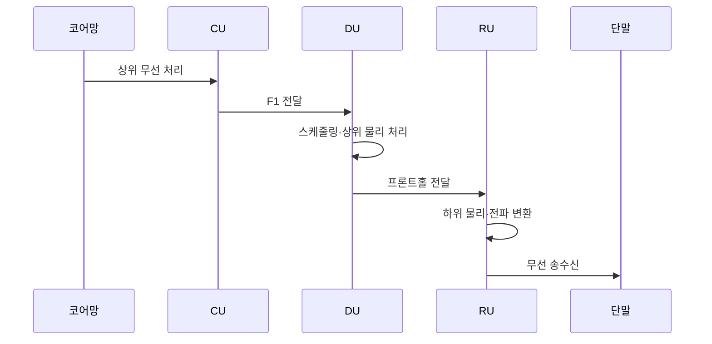

---
sidebar:
  order: 111
  label: "111. 네트워크 기능 분리"
  badge:
    text: "기출 · 30%"
    variant: note
title: "네트워크 기능 분리"
date: "2026-07-25T00:45:00+09:00"
tags:
  - "notes-network"
weight: 111
extra:
  question_no: "111"
  source_status: "기출"
  source_history: "132회"
  priority: 30
  priority_note: "132회 출제"
---

## 미리 알고가기

- **네트워크 기능 분리(Network Function Disaggregation)**: 하나의 통신 장비에 묶인 기능을 독립 구성요소와 표준 인터페이스로 나눠 서로 다른 위치·자원·공급사에 배치하는 구조
- **무선 접속망(Radio Access Network, RAN)**: 알에이엔으로 읽으며 단말과 이동통신 핵심망 사이에서 무선 신호와 접속을 처리하는 망
- **5세대 이동통신 기지국(gNodeB, gNB)**: 지노드비로 읽으며 g는 차세대, NodeB는 기지국을 뜻하고 5세대 무선 접속을 제공하는 장비
- **중앙 장치(Central Unit, CU)**: 씨유로 읽으며 무선 자원 제어·패킷 처리 같은 상위 무선 계층을 여러 분산 장치에 걸쳐 중앙 처리하는 장치
- **분산 장치(Distributed Unit, DU)**: 디유로 읽으며 짧은 응답 시간이 필요한 스케줄링과 상위 물리 계층 처리를 현장 가까이에서 담당하는 장치
- **무선 장치(Radio Unit, RU)**: 알유로 읽으며 디지털 신호와 무선 전파를 서로 변환하고 안테나에 연결하는 장치
- **3세대 파트너십 프로젝트(3rd Generation Partnership Project, 3GPP)**: 이동통신 무선·핵심망 규격을 제정하는 국제 표준 협력체
- **F1(에프원)**: 3GPP가 CU와 DU 사이의 제어·사용자 평면 연결에 붙인 표준 인터페이스 번호
- **개방 프론트홀(Open Fronthaul)**: DU와 RU를 여러 공급사 장비로 조합할 수 있도록 신호·제어·관리·동기 규격을 공개한 연결 구간

## Ⅰ. 개요

- **정의/개념**: 기지국 기능을 CU·DU·RU로 분할 배치하는 구조
- **배경/필요성**: 중앙 자원 공유·개방형 연동·현장 실시간 처리

### 쉽게 이해하기 (학습용)

- 기지국 한 상자에 있던 두뇌·현장 제어·전파 변환 기능을 필요한 처리 시간과 위치에 따라 나눠 놓음

## Ⅱ. 특징

- CU 중앙화로 여러 DU가 상위 처리 자원 공유한다.
- DU·RU 현장 배치로 짧은 응답 시한 충족한다.
- 표준 인터페이스로 공급사 조합 범위 확대한다.
- 하위 계층 분리일수록 전송·동기 요구 증가한다.

### 쉽게 이해하기 (학습용)

- 기능을 중앙에 모으면 자원을 함께 쓸 수 있지만 현장 장치와 더 빠르고 정확한 시간으로 통신해야 함

## Ⅲ. 아키텍처 및 구성요소

| 설계 요소 | 설명 |
|:---|:---|
| 중앙 장치(CU) | 상위 무선 계층과 정책 처리 |
| F1 구간 | CU와 DU의 제어·데이터 전달 |
| 분산 장치(DU) | 스케줄링과 상위 물리 처리 |
| 개방 프론트홀 | DU와 RU의 표준 신호 전달 |
| 무선 장치(RU) | 하위 물리·전파 변환 수행 |
| 전송·동기 계층 | 지연·용량·시각 동기 보장 |

> 요약: 처리 시한에 따라 중앙·현장 기능 경계 결정

### 쉽게 이해하기 (학습용)

- 느린 상위 처리는 중앙 장치가 모아 맡고 즉시 반응해야 하는 신호 처리는 안테나 가까운 분산·무선 장치가 맡음

## Ⅳ. 원리 및 절차 흐름도

| 절차 | 설명 |
|:---|:---|
| 상위 무선 처리 | CU가 정책과 상위 계층을 처리 |
| F1 전달 | CU 결과를 DU에 전달 |
| 스케줄링·상위 물리 처리 | DU가 무선 자원과 신호를 처리 |
| 프론트홀 전달 | DU 결과를 RU에 전달 |
| 하위 물리·전파 변환 | RU가 전파 신호로 변환 |
| 무선 송수신 | RU와 단말이 신호를 교환 |

> 요약: 상위 처리를 CU에서 RU 전파 변환까지 전달

### 쉽게 이해하기 (학습용)

- 핵심망에서 받은 자료를 CU가 상위 계층으로 처리하고 DU가 무선 자원을 정한 뒤 RU가 전파로 바꿔 단말에 보냄

## Ⅴ. 종류 및 비교

| 판단 기준 | 일체형 | CU-DU 분리 | DU-RU 분리 |
|:---|:---|:---|:---|
| 핵심 특징 | 기능을 한 장비에 결합 | 상위 기능을 중앙화 | 물리 계층까지 분리 |
| 적용 기준 | 소규모·단순 구축 | 다수 DU 자원 공유 | 개방형 다중 공급사 |
| 주요 위험 | 확장성·공급사 종속 | F1 지연·용량 부족 | 동기·상호운용 실패 |

> 요약: 낮은 계층을 분리할수록 전송·동기 조건 강화

### 쉽게 이해하기 (학습용)

- 기능을 더 잘게 나눌수록 공급사를 섞고 자원을 공유하기 쉽지만 장치 사이 전송 지연과 시간 동기를 더 엄격히 맞춰야 함

## Ⅵ. 실무 사례

1. 도심 기지국은 여러 DU가 CU 자원 공동 사용
2. 다중 공급사는 DU·RU 조합별 연동 검증

### 쉽게 이해하기 (학습용)

- 도심의 여러 현장 장치가 한 중앙 장치의 처리 자원을 함께 써 기지국마다 같은 상위 기능을 두지 않음
- 서로 다른 공급사의 분산 장치와 무선 장치를 실제로 연결해 신호·제어·동기가 표준대로 맞는지 확인함

## Ⅶ. 결론

- 기능 시한·전송 조건으로 분리 경계 결정

### 쉽게 이해하기 (학습용)

- 중앙화 이익만 보고 나누지 않고 각 기능의 응답 시한을 만족할 전송 지연·용량·동기를 확보할 수 있는 경계를 선택함
