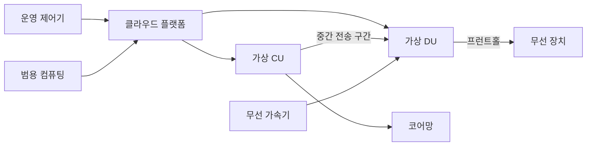
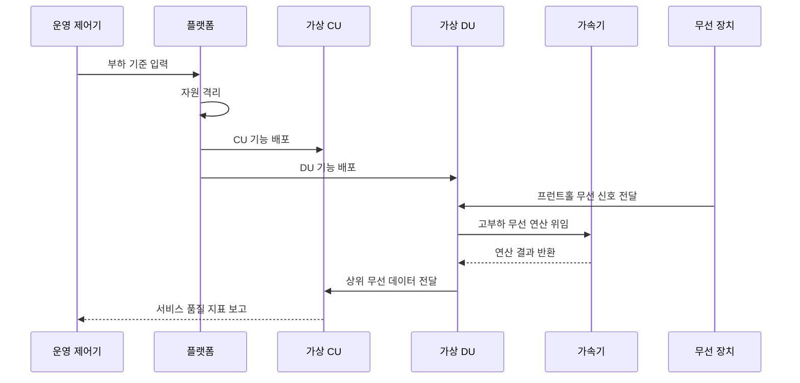

---
sidebar:
  order: 112
  label: "112. 가상 기지국 vRAN"
  badge:
    text: "기출 · 50%"
    variant: note
title: "가상 기지국 vRAN"
date: "2026-07-25T00:45:00+09:00"
tags:
  - "notes-network"
weight: 112
extra:
  question_no: "112"
  source_status: "기출"
  source_history: "132회"
  priority: 50
  priority_note: "132회 출제"
---

## 미리 알고가기

- **가상화 무선 접속망 vRAN(브이란, virtualized Radio Access Network)**: virtualized와 RAN을 붙인 표기로 기지국 기능을 범용 서버에서 실행함
- **중앙 장치 CU(씨유, Central Unit)**: 영어 두 낱말의 첫 글자를 쓴 표기로 상위 무선 계층을 중앙 처리함
- **분산 장치 DU(디유, Distributed Unit)**: 영어 두 낱말의 첫 글자를 쓴 표기로 실시간 제어와 상위 물리 처리를 담당함
- **범용 서버**: 표준 중앙 처리 장치(Central Processing Unit, CPU)·메모리 기반 장비임
- **가속기**: 무선 연산을 전담하는 장치
- **지터**: 처리 시간이 불규칙하게 흔들리는 현상
- **프런트홀**: DU와 무선 장치 사이의 디지털 무선 신호 전송 구간
- **코어망**: 가입자 인증·이동성·데이터 연결을 제공하는 이동통신 중심망

## Ⅰ. 개요

- **vRAN**: 기지국 기능을 범용 서버에서 구동하는 가상화 무선망

### 쉽게 이해하기 (학습용)

- 전용 기지국을 서버용 프로그램으로 바꾼다.

## Ⅱ. 특징

- **소프트웨어 실행**: CU·DU 기능을 서버에서 구동한다.
- **배치 유연성**: CU를 중앙, DU를 무선 장치 근처에 둔다.
- **실시간 보장**: 전용 자원과 가속기로 지터를 낮춘다.
- **자동 운영**: 배포·확장·복구를 정책으로 수행한다.

### 쉽게 이해하기 (학습용)

- 유연한 서버에서도 무선 처리 시한은 지켜야 한다.

## Ⅲ. 아키텍처 및 구성요소

| 구성요소 | 역할 |
|:---|:---|
| 운영 제어기 | 배포·확장·복구 정책 실행 |
| 클라우드 플랫폼 | 자원 격리와 실행 환경 제공 |
| 가상 CU | 상위 무선 계층과 코어망 연동 기능 실행 |
| 가상 DU | 실시간 제어와 상위 물리 계층 기능 실행 |
| 범용 컴퓨팅 | CPU·메모리·망 자원 제공 |
| 무선 가속기 | 고부하 무선 연산을 전담 |
| 무선 장치 | 전파 변환과 안테나 연결 |

### 쉽게 이해하기 (학습용)

- 플랫폼이 서버 자원을 CU·DU에 나누어 배정한다.

## Ⅳ. 원리 및 절차 흐름도

| 절차 | 핵심 내용 |
|:---|:---|
| 부하 기준 입력 | 셀 부하와 처리 시한 설정 |
| 자원 격리 | 전용 CPU·메모리 경로 확보 |
| CU·DU 기능 배포 | 분리한 CU·DU 소프트웨어 실행 |
| 프런트홀 신호 전달 | 무선 장치가 DU에 디지털 무선 신호 전달 |
| 무선 연산 위임 | 고부하 연산을 가속기로 전달 |
| 처리 결과 반환 | 가속 결과를 무선 기능에 제공 |
| 상위 데이터 전달 | DU가 처리 데이터를 CU에 전달 |
| 품질 지표 보고 | CU가 지연·손실·부하 상태 보고 |

> 실시간 자원 보장이 가상화의 전제이다.

### 쉽게 이해하기 (학습용)

- 자원을 고정한 뒤 무선 품질을 계속 확인한다.

## Ⅴ. 종류 및 비교

| 비교 기준 | 전용 기지국 | 가상머신 vRAN | 컨테이너 vRAN |
|:---|:---|:---|:---|
| 핵심 특징 | 전용 장비에 기능 결합 | 가상머신별 기능 격리 | 경량 단위로 기능 배포 |
| 적용 기준 | 고정 부하·단순 운영 | 기존 가상화 환경 전환 | 빠른 확장·자동 운영 |
| 주요 위험 | 확장 지연·장비 종속 | 자원 낭비·기동 지연 | 격리 부족·지터 증가 |

> 실행 방식보다 무선 처리 시한이 우선이다.

### 쉽게 이해하기 (학습용)

- 유연성이 커질수록 자원 격리가 중요해진다.

## Ⅵ. 실무 사례

1. **장애 여유 확보**: 노드 장애 후에도 셀 부하를 수용한다.
2. **조합 인증**: 서버·가속기·드라이버 조합을 검증한다.

### 쉽게 이해하기 (학습용)

- 정상 부하가 아닌 장애 후 용량까지 계산한다.
- 실제 부품 조합별 처리 시한을 확인한다.

## Ⅶ. 결론

- 실시간 자원 격리와 가속 조건을 검증하여 vRAN을 배치한다.

### 쉽게 이해하기 (학습용)

- 가상화보다 무선 품질 보장이 먼저이다.
