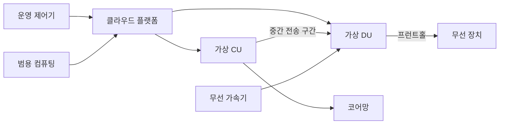
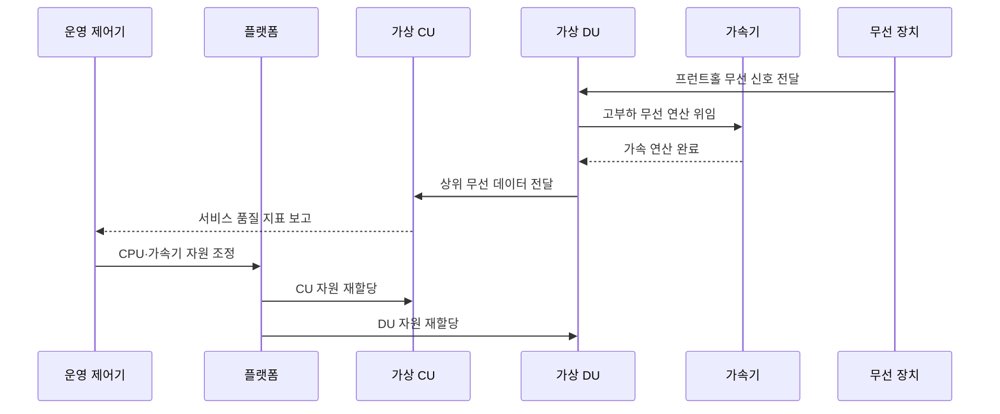

---
sidebar:
  order: 112
  label: "112. 가상 기지국 vRAN"
  badge:
    text: "기출 · 50%"
    variant: note
title: "가상 기지국 vRAN"
date: "2026-07-27T23:59:59+09:00"
tags:
  - "notes-network"
weight: 112
extra:
  question_no: "112"
  source_status: "기출"
  source_history: "132회"
  priority: 50
  priority_note: "132회 출제"
---

## 미리 알고가기

- **가상화 무선 접속망(virtualized Radio Access Network, vRAN)**: ‘브이랜’으로 읽고 가상화를 뜻하는 소문자 v와 RAN을 결합한 표기이며 기지국 기능을 범용 서버에서 실행함
- **중앙 장치 CU(씨유, Central Unit)**: 영어 두 낱말의 첫 글자를 쓴 표기로 상위 무선 계층을 중앙 처리함
- **분산 장치 DU(디유, Distributed Unit)**: 영어 두 낱말의 첫 글자를 쓴 표기로 실시간 제어와 상위 물리 처리를 담당함
- **범용 서버**: 표준 중앙 처리 장치(Central Processing Unit, CPU)·메모리 기반 장비임
- **가속기**: 무선 연산을 전담하는 장치
- **지터**: 처리 시간이 불규칙하게 흔들리는 현상
- **프런트홀**: DU와 무선 장치 사이의 디지털 무선 신호 전송 구간
- **코어망**: 가입자 인증·이동성·데이터 연결을 제공하는 이동통신 중심망
- **가상머신(Virtual Machine, VM)**: ‘브이엠’으로 읽고 두 영문 단어의 머리글자를 딴 표기이며 가상 하드웨어 단위로 운영체제와 무선 기능을 격리함
- **컨테이너(Container)**: 운영체제 커널을 공유하며 무선 기능을 경량 실행·배포하는 단위

## Ⅰ. 개요

- 정의/개념: CU·DU 기능을 **범용 서버·가속기에서 소프트웨어로 실행**
- **배경/필요성**: 전용 기지국은 **자원 공유·신속한 배포·탄력 확장 곤란**

### 쉽게 이해하기 (학습용)

- 전용 기지국을 서버용 프로그램으로 바꾼다.

## Ⅱ. 특징

- **소프트웨어 CU·DU**를 범용 컴퓨팅에 독립 배치·확장한다.
- **전용 자원·무선 가속기**로 처리 시한과 지터를 제어한다.
- **클라우드 오케스트레이션**으로 배포·확장·복구를 자동화한다.

### 쉽게 이해하기 (학습용)

- 유연한 서버에서도 무선 처리 시한은 지켜야 한다.

## Ⅲ. 아키텍처 및 구성요소

| 구성요소 | 역할 |
|:---|:---|
| 운영 제어기 | **배포·확장·복구 정책 실행** |
| 클라우드 플랫폼 | **자원 격리·실행 환경 제공** |
| 가상 CU | **상위 무선 계층·코어망 연동** |
| 가상 DU | **실시간 제어·상위 물리 처리** |
| 범용 컴퓨팅 | **CPU·메모리·망 자원 제공** |
| 무선 가속기 | **고부하 무선 연산 전담** |
| 무선 장치 | **전파 변환·안테나 연결** |

### 쉽게 이해하기 (학습용)

- 플랫폼이 서버 자원을 CU·DU에 나누어 배정한다.

## Ⅳ. 원리 및 절차 흐름도

| 절차 | 핵심 내용 |
|:---|:---|
| 프런트홀 무선 신호 전달 | 무선 장치가 DU에 디지털 신호 전달 |
| 고부하 무선 연산 위임 | 고부하 연산을 가속기로 전달 |
| 가속 연산 완료 | 가속기가 처리한 결과를 DU 기능에 반영 |
| 상위 무선 데이터 전달 | DU가 처리 데이터를 CU에 전달 |
| 서비스 품질 지표 보고 | CU가 지연·손실·부하 상태 보고 |
| 자원 조정·재할당 | 품질·부하에 따라 CU·DU의 CPU·가속기 자원을 조정 |

> 실시간 자원 보장이 가상화의 전제이다.

### 쉽게 이해하기 (학습용)

- 자원을 고정한 뒤 무선 품질을 계속 확인한다.

## Ⅴ. 종류 및 비교

| vRAN 실행 방식 | 전용 기지국 | 가상머신 vRAN | 컨테이너 vRAN |
|:---|:---|:---|:---|
| 적용 기준 | 고정 부하·단순 운영 | 기존 가상화 환경 전환 | 빠른 확장·자동 운영 |
| 핵심 특징 | 전용 장비에 기능 결합 | 가상머신별 기능 격리 | 경량 단위 기능 배포 |
| 한계 | 확장 지연·장비 종속 | 자원 낭비·기동 지연 | 격리 부족·지터 증가 |

> 실행 방식보다 무선 처리 시한이 우선이다.

### 쉽게 이해하기 (학습용)

- 유연성이 커질수록 자원 격리가 중요해진다.

## Ⅵ. 실무 사례

1. 상용 서버 장애 시 **잔여 노드의 셀 부하 수용**

### 쉽게 이해하기 (학습용)

- vRAN 서버 한 대가 고장 나도 남은 서버가 셀 처리량과 실시간 처리 시한을 유지하도록 장애 후 용량을 확보한다.

## Ⅶ. 결론

- 전용 기지국 자원의 경직성을 극복하기 위해 실시간 처리·가속기·장애 후 용량·자동 확장·운영 역량을 검토하여, 무선 품질을 보장할 수 있는 환경에 vRAN을 적용해야 한다.

### 쉽게 이해하기 (학습용)

- 가상화보다 무선 품질 보장이 먼저이다.
