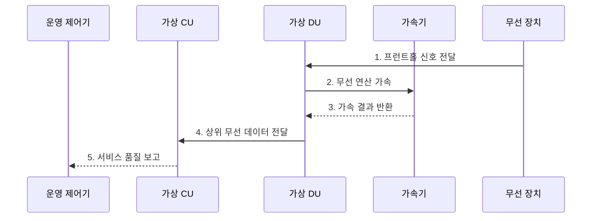

---
sidebar:
  order: 112
  label: "112. 가상 기지국 vRAN"
  badge:
    text: "기출 · 50%"
    variant: note
title: "가상 기지국 vRAN"
date: "2026-07-27T23:59:59+09:00"
tags:
  - "notes-network"
weight: 112
extra:
  question_no: "112"
  source_status: "기출"
  source_history: "132회"
  priority: 50
  priority_note: "132회 출제"
---

## 미리 알고가기

- **가상화 무선 접속망(virtualized Radio Access Network, vRAN)**: 기지국 기능을 범용 서버와 가속기에서 소프트웨어로 실행하는 무선 접속망이다.
- **중앙 장치(Central Unit, CU)**: 상위 무선 계층과 코어망 연동을 중앙 처리하는 장치다.
- **분산 장치(Distributed Unit, DU)**: 실시간 제어와 상위 물리 처리를 현장 가까이에서 담당하는 장치다.
- **범용 서버**: 표준 중앙처리장치·메모리·망 자원을 제공하는 상용 장비다.
- **가속기**: 처리 시한이 엄격한 무선 연산을 전담하는 장치다.
- **지터(Jitter)**: 무선 기능의 처리 시간이 불규칙하게 흔들리는 현상이다.
- **프런트홀(Fronthaul)**: DU와 무선 장치 사이에서 디지털 무선 신호를 전달하는 구간이다.
- **코어망(Core Network)**: 가입자 인증·이동성·데이터 연결을 제공하는 이동통신 중심망이다.
- **가상머신(Virtual Machine, VM)**: 가상 하드웨어 단위로 운영체제와 무선 기능을 격리한다.
- **컨테이너(Container)**: 운영체제 커널을 공유하며 무선 기능을 경량 실행·배포하는 단위다.
- **3GPP TS 38.401**: 차세대 무선 접속망의 CU·DU 구조와 인터페이스를 규정한 공식 기술규격이다.

## Ⅰ. 개요

- 정의: CU·DU의 **범용 서버·가속기 소프트웨어 실행**
- 기존 한계: 전용 장비의 **자원 공유·탄력 확장 곤란**

### 쉽게 이해하기 (학습용)

- 전용 기지국을 서버용 프로그램으로 바꾼다.

## Ⅱ. 특징

- **소프트웨어 CU·DU**를 범용 컴퓨팅에 독립 배치·확장한다.
- **전용 자원·무선 가속기**로 처리 시한과 지터를 제어한다.
- **클라우드 오케스트레이션**으로 배포·확장·복구를 자동화한다.

### 쉽게 이해하기 (학습용)

- 유연한 서버에서도 무선 처리 시한은 지켜야 한다.

## Ⅲ. 구조 및 구성요소

| 구성요소 | 역할 |
|:---|:---|
| 운영·클라우드 플랫폼 | **배포·격리·확장·복구 실행** |
| 가상 CU | **상위 무선 계층·코어망 연동** |
| 가상 DU | **실시간 제어·상위 물리 처리** |
| 범용 컴퓨팅·가속기 | **일반 자원·무선 연산 제공** |
| 무선 장치 | **전파 변환·안테나 연결** |

### 쉽게 이해하기 (학습용)

- 플랫폼이 범용 자원과 가속기를 CU·DU에 격리 배정하고 처리 시한을 감시한다.

## Ⅳ. 흐름도

| 절차 | 핵심 내용 |
|:---|:---|
| 프런트홀 신호 전달 | 무선 장치가 DU에 디지털 신호 전달 |
| 무선 연산 가속 | 고부하 연산을 가속기로 위임 |
| 가속 결과 반환 | 처리 결과를 DU 기능에 반영 |
| 상위 무선 데이터 전달 | DU가 처리 데이터를 CU에 전달 |
| 서비스 품질 보고 | CU가 지연·손실·부하 상태 보고 |

> 실시간 자원 보장이 가상화의 전제이다.

### 쉽게 이해하기 (학습용)

- 자원을 고정한 뒤 무선 품질을 계속 확인한다.

## Ⅴ. 종류 및 비교

| vRAN 실행 방식 | 전용 기지국 | 가상머신 vRAN | 컨테이너 vRAN |
|:---|:---|:---|:---|
| 적용 기준 | 고정 부하·단순 운영 | 기존 가상화 환경 전환 | 빠른 확장·자동 운영 |
| 핵심 특징 | **전용 장비 기능 결합** | **가상머신별 기능 격리** | **경량 단위 기능 배포** |
| 한계 | 확장 지연·장비 종속 | 자원 낭비·기동 지연 | 격리 부족·지터 증가 |

> 실행 방식보다 무선 처리 시한이 우선이다.

### 쉽게 이해하기 (학습용)

- 유연성이 커질수록 자원 격리가 중요해진다.

## Ⅵ. 실무 고려사항 및 대책

| 고려사항 | 대책 | 효과 |
|:---|:---|:---|
| 공유 CPU의 지터·시한 초과 | **전용 코어·가속기 자원 격리** | 무선 처리시간 보장 |
| 서버 장애의 셀 용량 부족 | **장애 후 잔여 용량 확보** | 서비스 연속성 유지 |
| CU·DU 구조 정합성 | **3GPP TS 38.401 준수** | 망 연동 일관성 확보 |

### 쉽게 이해하기 (학습용)

- 공유 자원을 격리하고 서버 한 대가 고장 나도 남은 노드가 셀 부하와 처리 시한을 수용하도록 설계한다.

## Ⅶ. 결론

- **처리 시한·격리·장애 후 용량**으로 vRAN 결정

### 쉽게 이해하기 (학습용)

- 가상화보다 무선 품질 보장이 먼저이다.
