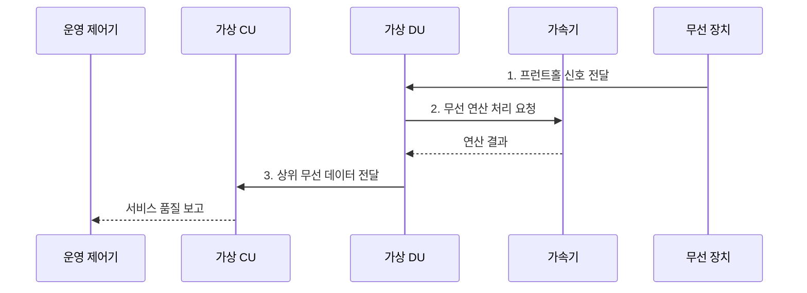

---
sidebar:
  order: 112
  label: "112. 가상 기지국 vRAN"
  badge:
    text: "기출 • 50%"
    variant: note
title: "가상 기지국 vRAN"
date: "2026-08-03T15:05:00+09:00"
tags:
  - "notes-network"
weight: 112
extra:
  question_no: "112"
  source_status: "기출"
  source_history: "132회"
  priority: 50
  priority_note: "132회 출제"
---

## Ⅰ. 개요

핵심 용어

- **가상 무선접속망(Virtualized Radio Access Network, vRAN)**: 기지국 중앙•분산 장치(Central/Distributed Unit, CU•DU) 기능을 범용 서버와 가속기에서 소프트웨어로 실행하는 구조이다.

- 정의/개념: 기지국 CU•DU 기능을 **범용 서버•가속기** 에서 소프트웨어로 실행하는 RAN 구조
- 배경/필요성: 전용 장비의 **자원 공유•탄력 확장 곤란**

#### 한줄 요약

- 전용 기지국을 서버용 프로그램으로 바꾼다.

## Ⅱ. 특징

핵심 용어

- **무선 가속기(Radio Accelerator)**: 처리 시한이 엄격한 물리 계층 연산을 범용 중앙처리장치(Central Processing Unit, CPU) 대신 전담하는 장치이다.
- **중앙•분산 장치(Central/Distributed Unit, CU•DU)**: 상위 무선 계층과 시간 민감 제어•물리 처리를 각각 담당하는 기능이다.
- **클라우드 오케스트레이션**: 소프트웨어 CU•DU의 배포•확장•복구를 자원 상태와 정책에 따라 자동화하는 기능이다.

- **소프트웨어 CU•DU** 의 범용 컴퓨팅 독립 배치•확장
- **전용 자원•무선 가속기** 를 통한 처리 시한•지터 통제
- **클라우드 오케스트레이션** 기반 배포•확장•복구 자동화

#### 한줄 요약

- 유연한 서버에서도 무선 처리 시한은 지켜야 한다.

## Ⅲ. 구조 및 구성요소

핵심 용어

- **가상 중앙•분산 장치(Virtualized Central/Distributed Unit, 가상 CU•DU)**: 가상 CU는 상위 무선 계층•코어 연동을, 가상 DU는 실시간 제어•상위 물리 처리를 수행한다.
- **중앙처리장치(Central Processing Unit, CPU)**: 범용 서버에서 소프트웨어 무선 기능을 실행하는 연산 장치이다.
- **범용 컴퓨팅**: 표준 CPU•메모리•네트워크 자원을 소프트웨어 무선 기능에 제공하는 상용 서버 기반이다.

| 구성요소 | 책임 |
|:---|:---|
| 운영•클라우드 플랫폼 | **배포•격리•확장•복구 실행** |
| 가상 CU | **상위 무선 계층•코어망 연동** |
| 가상 DU | **실시간 제어•상위 물리 처리** |
| 범용 컴퓨팅•가속기 | **일반 자원•무선 연산 제공** |
| 무선 장치 | **전파 변환•안테나 연결** |

#### 한줄 요약

- 플랫폼이 범용 자원과 가속기를 CU•DU에 격리 배정하고 처리 시한을 감시한다.

## Ⅳ. 흐름도

핵심 용어

- **프런트홀**: DU와 무선 장치 사이에서 디지털 무선 신호와 제어 정보를 전달하는 구간이다.
- **서비스 품질 보고**: CU•DU 처리 지연과 무선 품질을 운영 제어기에 전달해 자원 조정을 유도하는 정보이다.
- **중앙•분산 장치(Central/Distributed Unit, CU•DU)**: 프런트홀 신호 처리와 상위 무선 데이터 처리를 분담하는 기능이다.

**동작 원리**

- **1. 프런트홀 신호 전달**: 무선 장치가 DU에 디지털 신호 전달
- **2. 무선 연산 처리 요청**: DU가 고부하 연산을 가속기에 위임
- **3. 상위 무선 데이터 전달**: DU가 처리 데이터를 CU에 전달

#### 한줄 요약

- 자원을 고정한 뒤 무선 품질을 계속 확인한다.

## Ⅴ. 종류 및 비교

핵심 용어

- **가상머신•컨테이너 가상 무선접속망(Virtual Machine/Container Virtualized Radio Access Network, 가상머신•컨테이너 vRAN)**: 가상머신은 운영체제 단위로 강하게 격리하고 컨테이너는 커널을 공유해 가볍게 배포한다.
- **처리 지터**: 공유 자원 경쟁으로 무선 기능의 실행 시간이 주기마다 불규칙하게 흔들리는 현상이다.

| vRAN 실행 방식 | 전용 기지국 | 가상머신 vRAN | 컨테이너 vRAN |
|:---|:---|:---|:---|
| 적용 기준 | **고정 부하•단순 운영** | 기존 **가상화 환경 전환** | **빠른 확장•자동 운영** |
| 핵심 특징 | **전용 장비 기능 결합** | **가상머신별 기능 격리** | **경량 단위 기능 배포** |
| 한계 | **확장 지연•장비 종속** | **자원 낭비•기동 지연** | **격리 부족•지터** 증가 |

> 요약: 실행 방식보다 **무선 처리 시한** 우선

#### 한줄 요약

- 유연성이 커질수록 자원 격리가 중요해진다.

## Ⅵ. 실무 고려사항 및 대책

핵심 용어

- **자원 격리(Resource Isolation)**: 전용 중앙처리장치(Central Processing Unit, CPU) 코어•메모리•가속기를 배정해 다른 워크로드의 경쟁 영향을 차단하는 방식이다.
- **3GPP 기술규격 38.401(3rd Generation Partnership Project Technical Specification 38.401, 3GPP TS 38.401)**: 차세대 무선접속망과 CU•DU 구조를 규정한 기술규격이다.
- **잔여 용량**: 서버 장애 뒤 남은 노드가 셀 부하를 계속 처리할 수 있는 여유 자원이다.

| 문제 | 대책 | 효과 |
|:---|:---|:---|
| 공유 CPU의 **지터•시한 초과** | **전용 코어•가속기 자원 격리** | **무선 처리시간** 보장 |
| 서버 장애 시 **셀 용량 부족** | **장애 후 잔여 용량 확보** | **서비스 연속성** 유지 |
| **CU•DU 구조 정합성** | **3GPP TS 38.401 준수** | **망 연동 일관성** 확보 |

#### 한줄 요약

- 공유 자원을 격리하고 서버 한 대가 고장 나도 남은 노드가 셀 부하와 처리 시한을 수용하도록 설계한다.

## Ⅶ. 결론

핵심 용어

- **가상 무선접속망 적용 조건(Virtualized Radio Access Network Deployment Condition, vRAN 적용 조건)**: 처리 시한•자원 격리•장애 후 잔여 용량을 모두 만족하는 배치 조건이다.

- 처리 시한•격리•장애 용량 충족 시 **vRAN 적용**, 미충족 시 **전용 기지국 유지**

#### 한줄 요약

- 가상화보다 무선 품질 보장이 먼저이다.
