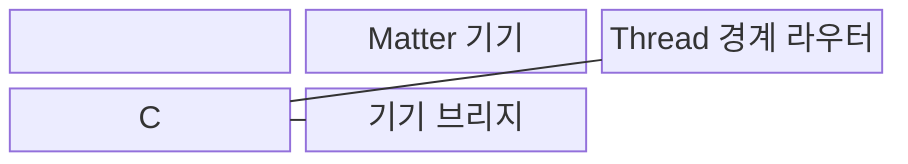
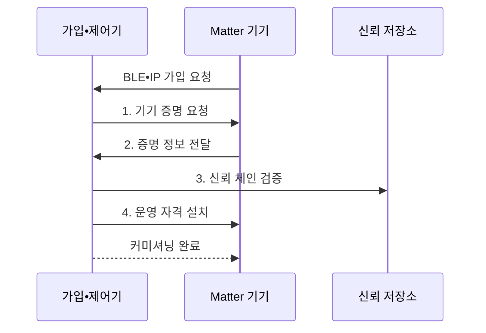

---
sidebar:
  order: 113
  label: "113. 스마트 홈 통합 Matter"
  badge:
    text: "기출 • 50%"
    variant: note
title: "스마트 홈 통합 Matter"
date: "2026-08-03T15:05:00+09:00"
tags:
  - "notes-network"
weight: 113
extra:
  question_no: "113"
  source_status: "기출"
  source_history: "131회"
  priority: 50
  priority_note: "131회 출제"
---

## Ⅰ. 개요

핵심 용어

- **Matter 표준(Matter Standard)**: 인터넷 프로토콜(Internet Protocol, IP)망에서 서로 다른 제조사의 스마트 홈 기기 모델•명령•가입 보안을 통일하는 응용 계층 표준이다.

- 정의/개념: IP망에서 서로 다른 제조사의 스마트 홈 기기 **모델•명령•가입 보안** 을 통일하는 **응용 계층 표준**
- 배경/필요성: 제조사별 **명령•가입•권한 상호운용 곤란**

#### 한줄 요약

- 제조사가 달라도 같은 방식으로 기기를 제어한다.

## Ⅱ. 특징

핵심 용어

- **공통 데이터 모델**: 제조사와 전송망이 달라도 기기의 기능•속성•명령 의미를 동일하게 표현하는 규격이다.
- **다중 관리자**: 여러 생태계의 관리자가 하나의 Matter 기기를 각 패브릭에서 제어하는 기능이다.
- **무선 근거리망(Wireless Fidelity, Wi-Fi)**: Matter 기기에 고대역 IP 연결을 제공하는 무선망이다.

- **공통 데이터 모델** 을 통한 기능•속성•명령 통일
- IP 기반 **Wi-Fi•유선망•Thread 연결**
- **기기 증명•운영 인증서** 기반 안전한 가입•다중 관리자 제공

#### 한줄 요약

- 연결과 명령, 가입 보안을 하나의 규칙으로 묶는다.

## Ⅲ. 구조 및 구성요소

핵심 용어

- **패브릭**: Matter 기기와 관리자가 운영 인증서•키•권한을 공유하는 신뢰 영역이다.
- **Thread 경계 라우터•기기 브리지(Thread Border Router/Device Bridge)**: 경계 라우터는 Thread와 외부 인터넷 프로토콜(Internet Protocol, IP)망을 연결하고 브리지는 비 Matter 기기 모델을 변환한다.

| 구성요소 | 책임 |
|:---|:---|
| 가입•패브릭 제어기 | **기기 가입•인증서•권한 관리** |
| Matter 기기 | **공통 기능•속성•명령 제공** |
| IP 연결 계층 | **주소 기반 연결 제공** |
| Thread 경계 라우터 | **Thread•외부 IP망 라우팅** |
| 기기 브리지 | **비 Matter 기기 모델 변환** |

#### 한줄 요약

- 제어기는 패브릭 인증서와 권한으로 기기를 가입시키고 IP 경로에서 공통 명령을 수행한다.

## Ⅳ. 흐름도

핵심 용어

- **커미셔닝**: 새 기기의 진위를 확인하고 패브릭 운영 자격과 접근 권한을 설치하는 가입 절차이다.
- **신뢰 저장소**: 제조사 인증기관 정보를 보관해 기기 증명서의 신뢰 체인을 검증하는 저장소이다.
- **저전력 블루투스•인터넷 프로토콜(Bluetooth Low Energy/Internet Protocol, BLE•IP)**: 초기 기기 가입과 운영망 통신에 각각 사용하는 연결 기술이다.

**동작 원리**

- **1. 기기 증명 요청**: 제어기가 제품 인증 정보 제출을 요구
- **2. 증명 정보 전달**: 기기가 제품 인증서와 증명값 제공
- **3. 신뢰 체인 검증**: 제조사 인증기관과 제품 정보를 확인
- **4. 운영 자격 설치**: 패브릭 인증서와 접근 권한을 기기에 등록

#### 한줄 요약

- 제품 확인과 사용자 권한 부여를 나눠 수행한다.

## Ⅴ. 종류 및 비교

핵심 용어

- **Thread•Wi-Fi 연결(Thread/Wireless Fidelity Connectivity)**: Thread는 저전력 인터넷 프로토콜 버전 6(Internet Protocol version 6, IPv6) 메시 경로를, Wi-Fi는 고대역 IP 직접 연결을 Matter 기기에 제공한다.
- **기기 브리지**: 기존 비 Matter 기기의 기능과 명령을 Matter 데이터 모델로 변환하는 장치이다.

| Matter 연결 방식 | Thread | Wi-Fi•유선망 | 기기 브리지 |
|:---|:---|:---|:---|
| 적용 기준 | **센서•스위치** | **카메라•허브** | 기존 **비 Matter 기기** |
| 핵심 특징 | **저전력 IPv6 메시** | **고속 IP 직접 연결** | **비 Matter 모델 변환** |
| 한계 | **경계 라우터** 의존 | **무선 혼잡•망 노출** | **기능 손실•권한 검증 누락** |

> 요약: **전력•대역폭** 과 기존 자산을 기준으로 연결 방식 선택

#### 한줄 요약

- 저전력은 Thread, 고속 전송은 Wi-Fi가 적합하다.

## Ⅵ. 실무 고려사항 및 대책

핵심 용어

- **서명 무선 갱신(Signed Over-the-Air Update, 서명 OTA)**: 디지털 서명으로 출처와 무결성을 검증한 소프트웨어만 기기에 원격 설치하는 갱신 방식이다.
- **기기 발견 트래픽**: 제어기가 같은 IP망에서 Matter 기기와 서비스를 찾기 위해 교환하는 탐색 메시지이다.
- **연결 표준 연합•전기전자공학자협회(Connectivity Standards Alliance/Institute of Electrical and Electronics Engineers, CSA•IEEE)**: Matter 규격과 저전력 무선 규격의 표준화 조직이다.

| 문제 | 대책 | 효과 |
|:---|:---|:---|
| 제조사별 **명령•가입 불일치** | **CSA Matter 1.6 준수 시험** | **생태계 상호운용** 확보 |
| Thread **저전력망 품질 저하** | **IEEE 802.15.4 채널 설계** | **간섭•손실 완화** |
| 업무망과 기기망의 **과도한 연결** | 필요한 **기기 발견 트래픽만 허용** | **공격면 최소화** |
| 기기 취약점의 **장기 잔존** | **서명 OTA•롤백 검증** | **위변조 갱신 차단** |

#### 한줄 요약

- 기기망은 업무망과 격리하고 표준 상호운용 시험과 저전력 채널 측정 뒤 필요한 발견 경로만 허용한다.

## Ⅶ. 결론

핵심 용어

- **연결 방식 선택**: 기기의 전력•대역폭•기존 자산 호환성을 비교해 Thread•Wi-Fi•브리지를 결정하는 과정이다.
- **무선 근거리망(Wireless Fidelity, Wi-Fi)**: 고대역폭 Matter 기기의 IP 연결에 사용하는 무선망이다.

- 저전력은 **Thread**, 고대역은 **Wi-Fi**, 기존 비 Matter 기기는 브리지 선택

#### 한줄 요약

- 같은 망보다 같은 의미와 신뢰 절차가 핵심이다.
