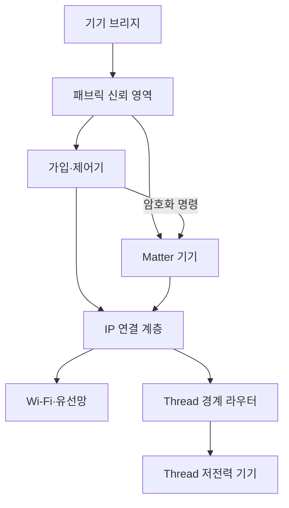
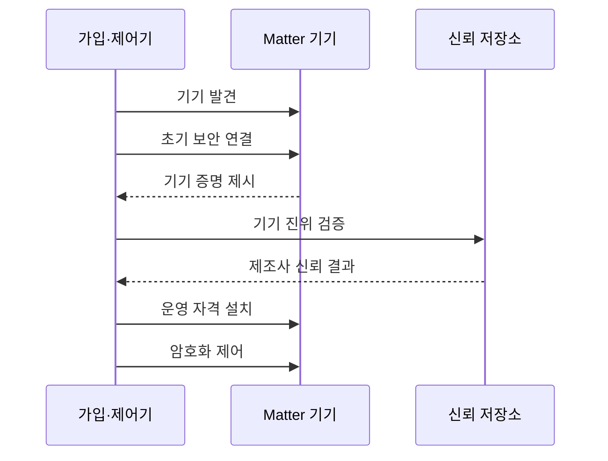

---
sidebar:
  order: 113
  label: "113. 스마트 홈 통합 Matter"
  badge:
    text: "기출 · 50%"
    variant: note
title: "스마트 홈 통합 Matter"
date: "2026-07-27T23:59:59+09:00"
tags:
  - "notes-network"
weight: 113
extra:
  question_no: "113"
  source_status: "기출"
  source_history: "131회"
  priority: 50
  priority_note: "131회 출제"
---

## 미리 알고가기

- **매터(Matter)**: ‘매터’로 읽는 공식 표준 이름으로 별도 약어 확장을 만들지 않으며 서로 다른 제조사의 스마트 홈 기기를 안전하게 연동하는 응용 계층 표준임
- **인터넷 프로토콜(Internet Protocol, IP)**: ‘아이피’로 읽고 두 영문 단어의 머리글자를 딴 표기이며 주소 기반 패킷 전달 규약임
- **스레드(Thread)**: 저전력 IP 메시 통신 규격으로 Matter 기기의 직접 연결 경로를 제공함
- **저전력 블루투스(Bluetooth Low Energy, BLE)**: ‘비엘이’로 읽고 세 영문 단어의 머리글자를 딴 표기이며 저전력 근거리 기기 발견과 초기 설정에 사용함
- **패브릭**: 기기와 관리자의 신뢰 영역
- **다중 관리자**: 여러 생태계가 한 기기를 제어
- **무선 갱신**: 통신망으로 기기 기능을 갱신
- **커미셔닝**: 새 기기의 진위를 확인하고 패브릭 운영 자격을 설치하는 가입 절차
- **신뢰 저장소(Trust Store)**: 제조사 인증기관 정보를 보관해 기기 증명서의 신뢰 체인을 검증하는 저장소

## Ⅰ. 개요

- 정의/개념: IP망에서 **공통 기기 모델·명령·보안**을 제공하는 표준
- **배경/필요성**: 제조사별 생태계는 **기기 명령·가입·권한 상호운용 곤란**

### 쉽게 이해하기 (학습용)

- 제조사가 달라도 같은 방식으로 기기를 제어한다.

## Ⅱ. 특징

- **공통 데이터 모델**로 기능·속성·명령을 통일한다.
- **IP 기반 연결**로 Wi-Fi·유선망·Thread를 함께 사용한다.
- **기기 증명·운영 인증서**로 안전한 가입·다중 관리자를 제공한다.

### 쉽게 이해하기 (학습용)

- 연결과 명령, 가입 보안을 하나의 규칙으로 묶는다.

## Ⅲ. 아키텍처 및 구성요소

| 구성요소 | 역할 |
|:---|:---|
| 가입·제어기 | **기기 가입·Matter 명령 수행** |
| 패브릭 신뢰 영역 | **인증서·접근 권한 관리** |
| Matter 기기 | **공통 기능·속성·명령 제공** |
| IP 연결 계층 | **주소 기반 연결 제공** |
| Wi-Fi·유선망 | **고대역폭 기기 연결** |
| Thread 경계 라우터 | **Thread·외부 IP망 라우팅** |
| 기기 브리지 | **비 Matter 기기 모델 변환** |

### 쉽게 이해하기 (학습용)

- 제어기는 신뢰 영역 안에서 기기를 안전하게 다룬다.

## Ⅳ. 원리 및 절차 흐름도

| 절차 | 핵심 내용 |
|:---|:---|
| 기기 발견 | 코드·BLE로 가입 대상을 식별 |
| 초기 보안 연결 | 일회용 정보로 안전한 경로 생성 |
| 기기 증명 제시 | 제품 인증 정보를 전달 |
| 기기 진위 검증 | 신뢰 체인과 제조 정보를 확인 |
| 신뢰 결과 반환 | 저장소가 제조사 신뢰 여부를 제공 |
| 운영 자격 설치 | 패브릭 인증서와 권한 저장 |
| 암호화 제어 | 상호 인증 후 명령 교환 |

> 가입 때 진위를 확인한 뒤 운영 권한을 준다.

### 쉽게 이해하기 (학습용)

- 제품 확인과 사용자 권한 부여를 나눠 수행한다.

## Ⅴ. 종류 및 비교

| Matter 연결 방식 | Thread | Wi-Fi·유선망 | 기기 브리지 |
|:---|:---|:---|:---|
| 적용 기준 | 센서·스위치 | 카메라·허브 | 기존 비 Matter 기기 |
| 핵심 특징 | 저전력 IPv6 메시 | 고속 IP 직접 연결 | 비 Matter 모델 변환 |
| 한계 | 경계 라우터 의존 | 무선 혼잡·망 노출 | 기능 손실·권한 우회 |

> 전력·대역폭·기존 자산으로 방식을 고른다.

### 쉽게 이해하기 (학습용)

- 저전력은 Thread, 고속 전송은 Wi-Fi가 적합하다.

## Ⅵ. 실무 사례

1. IoT 분리망은 **격리하되 발견 경로 허용**
2. 소유권 이전은 **기존 패브릭 자격 제거 후 재가입**

### 쉽게 이해하기 (학습용)

- 격리 정책이 기기 발견까지 막지 않게 한다.
- 중고 이전 때 이전 사용자의 권한을 지운다.

## Ⅶ. 결론

- 저전력 센서는 **Thread**, 고속 기기는 **Wi-Fi**, 기존 기기는 **브리지**

### 쉽게 이해하기 (학습용)

- 같은 망보다 같은 의미와 신뢰 절차가 핵심이다.
