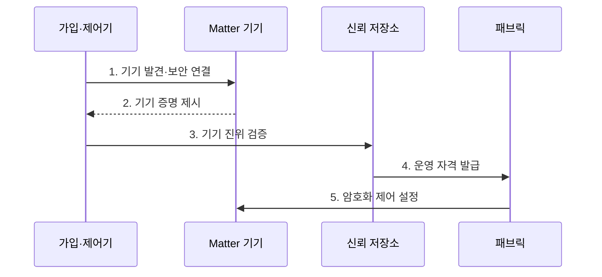

---
sidebar:
  order: 113
  label: "113. 스마트 홈 통합 Matter"
  badge:
    text: "기출 · 50%"
    variant: note
title: "스마트 홈 통합 Matter"
date: "2026-07-27T23:59:59+09:00"
tags:
  - "notes-network"
weight: 113
extra:
  question_no: "113"
  source_status: "기출"
  source_history: "131회"
  priority: 50
  priority_note: "131회 출제"
---

## 미리 알고가기

- **매터(Matter)**: 서로 다른 제조사의 스마트 홈 기기를 안전하게 연동하는 응용 계층 표준이다.
- **인터넷 프로토콜(Internet Protocol, IP)**: 주소 기반으로 패킷을 목적지까지 전달하는 네트워크 계층 규약이다.
- **스레드(Thread)**: 저전력 IP 메시 통신으로 Matter 기기의 연결 경로를 제공하는 규격이다.
- **저전력 블루투스(Bluetooth Low Energy, BLE)**: 저전력 근거리 기기 발견과 초기 설정에 사용하는 통신 기술이다.
- **패브릭(Fabric)**: Matter 기기와 관리자가 인증서·권한을 공유하는 신뢰 영역이다.
- **다중 관리자(Multi-Admin)**: 여러 생태계의 관리자가 한 기기를 각 패브릭에서 제어하는 기능이다.
- **무선 갱신(Over-the-Air Update)**: 통신망으로 기기 소프트웨어와 기능을 갱신하는 방식이다.
- **커미셔닝(Commissioning)**: 새 기기의 진위를 확인하고 패브릭 운영 자격을 설치하는 가입 절차다.
- **신뢰 저장소(Trust Store)**: 제조사 인증기관 정보를 보관해 기기 증명서의 신뢰 체인을 검증하는 저장소다.
- **CSA Matter 1.6**: 공통 기기 모델·가입·다중 생태계 제어를 규정한 최신 공식 표준이다.
- **IEEE 802.15.4**: Thread가 활용하는 저전력 무선 물리·매체접근 계층 표준이다.

## Ⅰ. 개요

- 정의: IP망의 **공통 기기 모델·명령·보안 표준**
- 기존 한계: 제조사별 **명령·가입·권한 상호운용 곤란**

### 쉽게 이해하기 (학습용)

- 제조사가 달라도 같은 방식으로 기기를 제어한다.

## Ⅱ. 특징

- **공통 데이터 모델**로 기능·속성·명령을 통일한다.
- IP 기반 **Wi-Fi·유선망·Thread 연결**
- **기기 증명·운영 인증서**로 안전한 가입·다중 관리자를 제공한다.

### 쉽게 이해하기 (학습용)

- 연결과 명령, 가입 보안을 하나의 규칙으로 묶는다.

## Ⅲ. 구조 및 구성요소

| 구성요소 | 역할 |
|:---|:---|
| 가입·패브릭 제어기 | **기기 가입·인증서·권한 관리** |
| Matter 기기 | **공통 기능·속성·명령 제공** |
| IP 연결 계층 | **주소 기반 연결 제공** |
| Thread 경계 라우터 | **Thread·외부 IP망 라우팅** |
| 기기 브리지 | **비 Matter 기기 모델 변환** |

### 쉽게 이해하기 (학습용)

- 제어기는 패브릭 인증서와 권한으로 기기를 가입시키고 IP 경로에서 공통 명령을 수행한다.

## Ⅳ. 흐름도

| 절차 | 핵심 내용 |
|:---|:---|
| 기기 발견·보안 연결 | 코드·BLE로 식별 후 안전한 경로 생성 |
| 기기 증명 제시 | 제품 인증 정보를 전달 |
| 기기 진위 검증 | 신뢰 체인과 제조 정보를 확인 |
| 운영 자격 발급 | 패브릭 인증서와 권한 생성 |
| 암호화 제어 설정 | 상호 인증 후 명령 경로 수립 |

> 가입 때 진위를 확인한 뒤 운영 권한을 준다.

### 쉽게 이해하기 (학습용)

- 제품 확인과 사용자 권한 부여를 나눠 수행한다.

## Ⅴ. 종류 및 비교

| Matter 연결 방식 | Thread | Wi-Fi·유선망 | 기기 브리지 |
|:---|:---|:---|:---|
| 적용 기준 | 센서·스위치 | 카메라·허브 | 기존 비 Matter 기기 |
| 핵심 특징 | **저전력 IPv6 메시** | **고속 IP 직접 연결** | **비 Matter 모델 변환** |
| 한계 | 경계 라우터 의존 | 무선 혼잡·망 노출 | 기능 손실·권한 우회 |

> 전력·대역폭·기존 자산으로 방식을 고른다.

### 쉽게 이해하기 (학습용)

- 저전력은 Thread, 고속 전송은 Wi-Fi가 적합하다.

## Ⅵ. 실무 고려사항 및 대책

| 고려사항 | 대책 | 효과 |
|:---|:---|:---|
| 제조사별 명령·가입 불일치 | **CSA Matter 1.6 준수 시험** | 생태계 상호운용 확보 |
| Thread 저전력망 품질 저하 | **IEEE 802.15.4 채널 설계** | 간섭·손실 완화 |
| 업무망과 기기망의 과도한 연결 | **발견 경로만 선택 허용** | 공격면 최소화 |

### 쉽게 이해하기 (학습용)

- 기기망은 업무망과 격리하고 표준 상호운용 시험과 저전력 채널 측정 뒤 필요한 발견 경로만 허용한다.

## Ⅶ. 결론

- **전력·대역폭·기존 자산**으로 Matter 연결 결정

### 쉽게 이해하기 (학습용)

- 같은 망보다 같은 의미와 신뢰 절차가 핵심이다.
