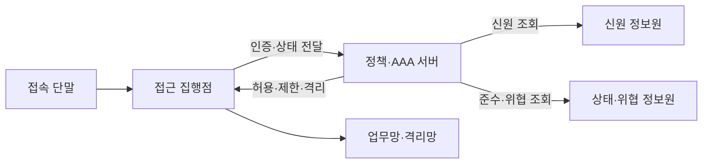
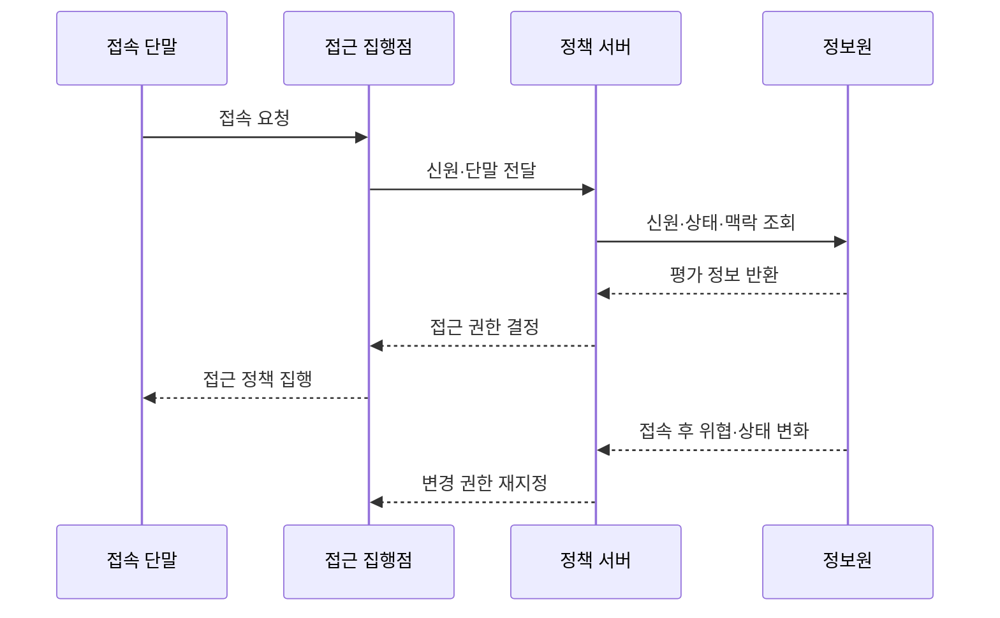

---
sidebar:
  order: 114
  label: "114. 네트워크 접근 제어 NAC"
  badge:
    text: "미출제 · 50%"
    variant: note
title: "네트워크 접근 제어 NAC"
date: "2026-07-25T00:45:00+09:00"
tags:
  - "notes-network"
weight: 114
extra:
  question_no: "114"
  source_status: "미출제"
  source_history: ""
  priority: 50
  priority_note: "접근 보안 핵심 주제"
---

## 미리 알고가기

- **네트워크 접근 제어 NAC(엔에이씨, Network Access Control)**: 영어 세 낱말의 첫 글자를 쓴 표기로 단말의 망 접근을 통제하는 체계임
- **인증·인가·과금 AAA(에이에이에이, Authentication, Authorization, Accounting)**: 영어 세 낱말의 첫 글자를 쓴 표기로 신원 확인·권한 부여·사용 기록 관리를 담당함
- **IEEE 802.1X(팔공이 점 일 엑스)**: IEEE의 802.1 작업반 표준 번호 표기로 네트워크 포트 기반 인증을 수행함
- **상태 점검**: 단말의 보안 정책 충족 확인
- **프로파일링**: 관측 정보로 단말 유형 추정
- **권한 재지정**: 연결 중 접근 권한 변경
- **접근 목록**: 허용·차단 통신 규칙
- **매체 접근 제어 주소 MAC(맥, Media Access Control)**: 네트워크 인터페이스를 식별하는 링크 계층 주소
- **격리망**: 정책 미준수 단말의 업무 자원 접근을 막고 치료 자원만 제공하는 망

## Ⅰ. 개요

- **NAC**: 사용자 신원과 단말 상태에 따라 네트워크 접근을 통제하는 체계

### 쉽게 이해하기 (학습용)

- 신분과 기기 상태에 따라 출입 구역을 정한다.

## Ⅱ. 특징

- **통합 식별**: 사용자와 단말 정보를 함께 확인한다.
- **상태 기반 판단**: 보안 준수 여부를 권한에 반영한다.
- **동적 집행**: 망 구역과 접근 목록을 자동 적용한다.
- **지속 통제**: 위협 발생 시 연결 중 권한을 낮춘다.

### 쉽게 이해하기 (학습용)

- 한 번 통과한 단말도 상태가 나빠지면 격리한다.

## Ⅲ. 아키텍처 및 구성요소

| 구성요소 | 역할 |
|:---|:---|
| 접속 단말 | 자격과 보안 상태 제시 |
| 접근 집행점 | 인증 중계와 접근 정책 적용 |
| 정책·AAA 서버 | 인증과 최종 권한 결정 |
| 신원 정보원 | 사용자·단말 등록 정보 제공 |
| 상태·위협 정보원 | 보안 준수와 위협 정보 제공 |
| 업무망·격리망 | 권한별 접근 영역 제공 |

### 쉽게 이해하기 (학습용)

- 정책 서버가 판단하고 접속 장비가 문을 연다.

## Ⅳ. 원리 및 절차 흐름도

| 절차 | 핵심 내용 |
|:---|:---|
| 접속 요청 | 단말이 네트워크 연결 시도 |
| 신원·단말 전달 | 집행점이 식별 정보를 중계 |
| 상태·맥락 조회 | 등록·보안·위협 상태 확인 |
| 평가 정보 반환 | 정책 판단 자료를 제공 |
| 접근 권한 결정 | 허용·제한·격리 정책 선택 |
| 접근 정책 집행 | 망 구역과 접근 목록 적용 |
| 상태 변화 통지 | 접속 후 위협과 정책 준수 변화를 전달 |
| 권한 재지정 | 상태 변화에 따라 권한 변경 |

> 접속 전 판단과 접속 후 통제를 연결한다.

### 쉽게 이해하기 (학습용)

- 인증 결과가 실제 망 권한으로 이어져야 한다.

## Ⅴ. 종류 및 비교

| 비교 기준 | MAC 주소 기반 통제 | 802.1X 인증 | 통합 NAC |
|:---|:---|:---|:---|
| 핵심 특징 | 단말 주소로 허용 판단 | 자격으로 포트 인증 | 상태·맥락까지 종합 |
| 적용 기준 | 단순·폐쇄형 단말 | 관리 가능한 사용자망 | 혼합 단말·지속 통제 |
| 주요 위험 | 주소 위조 | 인증 장애·예외 단말 | 정책 복잡성·오분류 |

> 판단 정보가 많을수록 세밀한 통제가 가능하다.

### 쉽게 이해하기 (학습용)

- 혼합 환경일수록 통합 판단이 필요하다.

## Ⅵ. 실무 사례

1. 기업망 NAC의 **관찰 모드 기반 단계적 도입**

### 쉽게 이해하기 (학습용)

- 즉시 접속을 차단하지 않고 단말 유형과 보안 상태를 관찰해 오분류와 업무 예외를 정리한 뒤 차단 정책을 적용한다.

## Ⅶ. 결론

- 사용자 신원과 단말 상태를 지속 평가하여 최소 권한을 집행한다.

### 쉽게 이해하기 (학습용)

- 망에 머무는 동안에도 신뢰를 계속 확인한다.
