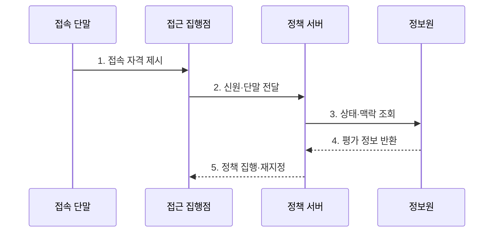

---
sidebar:
  order: 114
  label: "114. 네트워크 접근 제어 NAC"
  badge:
    text: "미출제 · 50%"
    variant: note
title: "네트워크 접근 제어 NAC"
date: "2026-07-30T18:30:00+09:00"
tags:
  - "notes-network"
weight: 114
extra:
  question_no: "114"
  source_status: "미출제"
  source_history: ""
  priority: 50
  priority_note: "접근 보안 핵심 주제"
---

## 미리 알고가기

- **네트워크 접근 제어(Network Access Control, NAC)**: 사용자 신원·단말 상태·접속 맥락에 따라 망 접근을 통제하는 체계다.
- **인증·인가·과금(Authentication, Authorization, Accounting, AAA)**: 신원 확인·권한 부여·사용 기록 관리를 담당하는 보안 기능이다.
- **IEEE 802.1X**: 네트워크 포트에 연결된 단말의 인증과 접근 통제를 규정한 표준이다.
- **상태 점검(Posture Assessment)**: 단말이 보안 정책의 필수 상태를 충족하는지 확인하는 절차다.
- **프로파일링(Profiling)**: 관측 정보로 단말 유형·운영체제·위험 특성을 추정하는 기능이다.
- **권한 재지정(Reauthorization)**: 연결 중 상태 변화에 따라 접근 권한을 변경하는 조치다.
- **접근 목록(Access Control List, ACL)**: 주소·포트·프로토콜별 허용·차단 통신 규칙이다.
- **매체 접근 제어 주소(Media Access Control Address, MAC Address)**: 네트워크 인터페이스를 식별하는 링크 계층 주소다.
- **격리망(Quarantine Network)**: 비준수 단말의 업무 자원 접근을 막고 치료 자원만 제공하는 망이다.
- **IEEE 802.1X-2020**: 포트 기반 네트워크 접근 제어의 구조와 프로토콜을 규정한 활성 표준이다.
- **IETF RFC 2865**: 인증·인가 결과를 전달하는 RADIUS 메시지와 속성을 규정한 표준 문서다.

## Ⅰ. 개요

- 정의/개념: 신원·단말 상태 기반 **네트워크 접근 통제**
- 배경/필요성: 접속 이후 단말 변화의 **지속 통제 필요**

### 쉽게 이해하기 (학습용)

- 신분과 기기 상태에 따라 출입 구역을 정한다.

## Ⅱ. 특징

- 사용자·단말의 **통합 식별**
- 보안 준수의 **상태 기반 권한 판단**
- 위협 변화의 **동적 재평가·재지정**

### 쉽게 이해하기 (학습용)

- 한 번 통과한 단말도 상태가 나빠지면 격리한다.

## Ⅲ. 구조 및 구성요소

| 구성요소 | 책임 |
|:---|:---|
| 접속 단말 | 자격과 보안 상태 제시 |
| 접근 집행점 | 인증 중계와 접근 정책 적용 |
| 정책·AAA 서버 | 인증과 최종 권한 결정 |
| 신원·상태 정보원 | 등록·보안 준수·위협 정보 제공 |
| 업무망·격리망 | 권한별 접근 영역 제공 |

### 쉽게 이해하기 (학습용)

- 정책 서버가 판단하고 접속 장비가 문을 연다.

## Ⅳ. 흐름도

**동작 원리**

- **1. 접속 자격 제시**: 단말이 네트워크 자격 전달
- **2. 신원·단말 전달**: 집행점이 식별 정보를 중계
- **3. 상태·맥락 조회**: 등록·보안·위협 상태 확인
- **4. 평가 정보 반환**: 정책 판단용 신원·상태 제공
- **5. 정책 집행·재지정**: 망 구역 적용 후 변화 시 변경

### 쉽게 이해하기 (학습용)

- 인증 결과가 실제 망 권한으로 이어져야 한다.

## Ⅴ. 종류 및 비교

| 접근 통제 방식 | MAC 주소 기반 통제 | 802.1X 인증 | 통합 NAC |
|:---|:---|:---|:---|
| 적용 기준 | 단순·폐쇄형 단말 | 관리 가능한 사용자망 | 혼합 단말·지속 통제 |
| 핵심 특징 | **단말 주소 기반 허용** | **자격 기반 포트 인증** | **상태·맥락 종합 판단** |
| 한계 | 주소 위조 | 인증 장애·예외 단말 | 정책 복잡성·오분류 |

> 판단 정보가 많을수록 세밀한 통제가 가능하다.

### 쉽게 이해하기 (학습용)

- 혼합 환경일수록 통합 판단이 필요하다.

## Ⅵ. 실무 고려사항 및 대책

| 고려사항 | 대책 | 효과 |
|:---|:---|:---|
| 미관리 단말의 인증 예외 | **프로파일링·기한부 최소 권한** | 우회 접속 최소화 |
| 포트·인증 서버 연동 차이 | **IEEE 802.1X-2020 시험** | 접속 상호운용 확보 |
| 초기 오분류의 업무 차단 | **관찰 모드·단계적 집행** | 운영 충격 감소 |

### 쉽게 이해하기 (학습용)

- 관찰 모드에서 단말 유형과 상태를 확인하고 표준 인증 시험 뒤 예외에 수명을 부여해 단계적으로 차단한다.

## Ⅶ. 결론

- **신원·단말 상태·위험도**로 NAC 권한 결정

### 쉽게 이해하기 (학습용)

- 망에 머무는 동안에도 신뢰를 계속 확인한다.
