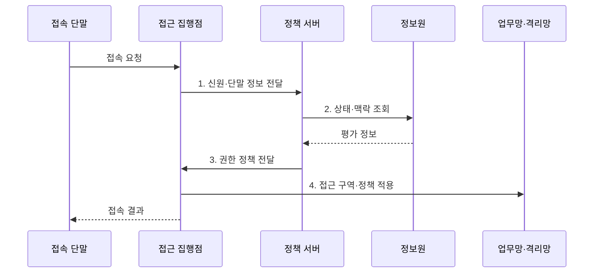

---
sidebar:
  order: 114
  label: "114. 네트워크 접근 제어 NAC"
  badge:
    text: "미출제 · 50%"
    variant: note
title: "네트워크 접근 제어 NAC"
date: "2026-07-31T11:09:47+09:00"
tags:
  - "notes-network"
weight: 114
extra:
  question_no: "114"
  source_status: "미출제"
  source_history: ""
  priority: 50
  priority_note: "접근 보안 핵심 주제"
---

## Ⅰ. 개요

핵심 용어

- **네트워크 접근 제어(Network Access Control, NAC)**: 사용자 신원·단말 상태·접속 맥락을 평가해 네트워크 접근 권한을 지속적으로 부여·변경하는 보안 통제 체계이다.

- 정의/개념: 사용자 신원·단말 상태·접속 맥락을 평가해 **네트워크 접근 권한을 지속 부여·변경**하는 **보안 통제 체계**
- 배경/필요성: 최초 인증만으로는 접속 후 상태 악화·위협 변화를 **권한에 반영 불가**

#### 한줄 요약

- 신분과 기기 상태에 따라 출입 구역을 정한다.

## Ⅱ. 특징

핵심 용어

- **상태 점검**: 단말의 패치·보안 설정 등이 접근 정책의 필수 상태를 충족하는지 확인하는 절차이다.
- **권한 재지정**: 연결 중 단말 상태나 위협이 변하면 업무망·격리망 접근 권한을 다시 부여하는 조치이다.
- **통합 식별(Unified Identification)**: 사용자 계정과 단말 식별자 및 접속 세션을 하나의 접근 주체로 연결하는 활동이다.

- 사용자·단말의 **통합 식별**
- 보안 준수의 **상태 기반 권한 판단**
- 위협 변화의 **동적 재평가·재지정**

#### 한줄 요약

- 한 번 통과한 단말도 상태가 나빠지면 격리한다.

## Ⅲ. 구조 및 구성요소

핵심 용어

- **접근 집행점**: 인증을 중계하고 정책 서버의 결정에 따라 VLAN·ACL·접근 영역을 적용하는 네트워크 장비이다.
- **정책·AAA 서버**: 신원 인증·권한 부여·사용 기록과 상태 정보를 결합해 최종 접근 권한을 결정한다.
- **인증·인가·계정관리(Authentication, Authorization, Accounting, AAA)**: 접속 주체를 확인하고 허용 권한을 결정하며 사용 이력을 기록하는 보안 기능이다.
- **가상 근거리 통신망(Virtual Local Area Network, VLAN)**: 하나의 물리 망을 논리적 브로드캐스트 영역으로 분리하는 기술이다.
- **접근 제어 목록(Access Control List, ACL)**: 주소·포트·프로토콜 조건에 따라 통신 허용·차단을 정한 규칙 목록이다.

| 구성요소 | 책임 |
|:---|:---|
| 접속 단말 | **자격·보안 상태** 제시 |
| 접근 집행점 | 인증 중계와 **VLAN·ACL** 적용 |
| 정책·AAA 서버 | **인증·인가** 와 최종 권한 결정 |
| 신원·상태 정보원 | 등록·보안 준수·**위협 정보** 제공 |
| 업무망·격리망 | 권한별 **접근 영역** 제공 |

#### 한줄 요약

- 정책 서버가 판단하고 접속 장비가 문을 연다.

## Ⅳ. 흐름도

핵심 용어

- **접속 맥락**: 사용자·단말 유형·보안 상태·위협·접속 위치를 묶어 접근 권한을 판단하는 정보이다.
- **격리망**: 비준수 단말의 업무 자원 접근을 막고 패치·치료 자원만 제공하는 제한 네트워크이다.
- **1. 신원·단말 정보 전달**: 집행점이 사용자 자격과 단말 식별 정보를 정책 서버에 중계하는 단계이다.
- **2. 상태·맥락 조회**: 등록 여부·보안 준수·위협·접속 위치를 확인하는 단계이다.
- **3. 권한 정책 전달**: 정책 서버가 허용·격리·재지정 결정을 집행점에 보내는 단계이다.
- **4. 접근 구역·정책 적용**: 집행점이 VLAN·ACL과 접근 영역을 실제 연결에 설정하는 단계이다.

**동작 원리**

- **1. 신원·단말 정보 전달**: 집행점이 자격과 식별 정보를 정책 서버에 중계
- **2. 상태·맥락 조회**: 등록·보안 준수·위협 상태 확인
- **3. 권한 정책 전달**: 정책 서버가 허용·격리·재지정 결과 제공
- **4. 접근 구역·정책 적용**: 집행점이 VLAN·ACL과 접근 영역 설정

#### 한줄 요약

- 인증 결과가 실제 망 권한으로 이어져야 한다.

## Ⅴ. 종류 및 비교

핵심 용어

- **MAC 기반·802.1X·통합 NAC**: 각각 단말 주소, 인증 자격, 신원·상태·맥락 전체를 기준으로 접근을 통제한다.
- **프로파일링**: 관측 정보로 단말 유형·운영체제·위험 특성을 추정하는 기능이다.
- **매체 접근 제어 주소(Media Access Control Address, MAC 주소)**: 근거리 망에서 네트워크 인터페이스를 식별하는 링크 계층 주소이다.
- **포트 기반 네트워크 접근 제어(Port-Based Network Access Control, IEEE 802.1X)**: 단말 자격 인증을 통과한 뒤 스위치·무선 접속 포트를 개방하는 표준이다.

| 접근 통제 방식 | MAC 주소 기반 통제 | 802.1X 인증 | 통합 NAC |
|:---|:---|:---|:---|
| 적용 기준 | **단순·폐쇄형 단말** | 관리 가능한 **사용자망** | **혼합 단말·지속 통제** |
| 핵심 특징 | **단말 주소 기반 허용** | **자격 기반 포트 인증** | **상태·맥락 종합 판단** |
| 한계 | **주소 위조** | **인증 장애·예외 단말** | **정책 복잡성·오분류** |

> 요약: **판단 정보의 범위** 에 따른 접근 통제 세분화

#### 한줄 요약

- 혼합 환경일수록 통합 판단이 필요하다.

## Ⅵ. 실무 고려사항 및 대책

핵심 용어

- **관찰 모드**: 접근을 즉시 차단하지 않고 단말 분류와 정책 판정 결과를 수집해 오분류를 보정하는 도입 단계이다.
- **기한부 최소 권한**: 인증 예외 단말에 필요한 최소 접근만 제한된 기간 동안 부여하는 정책이다.
- **원격 인증 전화접속 사용자 서비스(Remote Authentication Dial-In User Service, RADIUS)**: 네트워크 장비와 인증 서버 사이에서 인증·인가·계정 정보를 교환하는 프로토콜이다.

| 문제 | 대책 | 효과 |
|:---|:---|:---|
| 미관리 단말의 **인증 예외** | **프로파일링·기한부 최소 권한** | **미인가 접속 최소화** |
| 포트·인증 서버 **연동 차이** | **802.1X·RFC 2865 RADIUS 시험** | **접속 상호운용** 확보 |
| 초기 오분류의 **업무 차단** | **관찰 모드·단계적 집행** | **운영 충격 감소** |

#### 한줄 요약

- 관찰 모드에서 단말 유형과 상태를 확인하고 표준 인증 시험 뒤 예외에 수명을 부여해 단계적으로 차단한다.

## Ⅶ. 결론

핵심 용어

- **지속 통제**: 최초 인증 뒤에도 신원·단말 상태·위험 변화를 재평가해 권한을 조정하는 접근 제어 방식이다.

- 신원·상태·위험도 충족 시 **업무망 권한**, 미충족 시 **격리·치료**

#### 한줄 요약

- 망에 머무는 동안에도 신뢰를 계속 확인한다.
