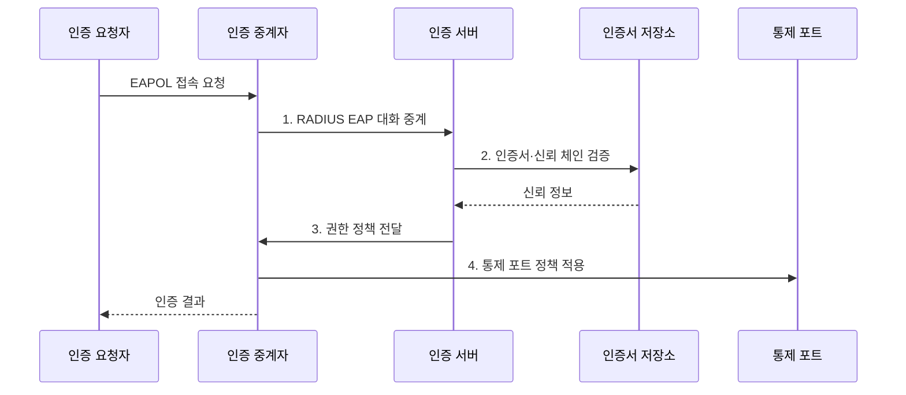

---
sidebar:
  order: 115
  label: "115. 802.1X EAP 인증"
  badge:
    text: "기출 · 50%"
    variant: note
title: "802.1X EAP 인증"
date: "2026-07-31T11:10:10+09:00"
tags:
  - "notes-network"
weight: 115
extra:
  question_no: "115"
  source_status: "기출"
  source_history: "134회"
  priority: 50
  priority_note: "134회 출제"
---

## Ⅰ. 개요

핵심 용어

- **IEEE 802.1X**: EAP 인증 결과에 따라 네트워크 통제 포트의 접근 권한을 부여하는 포트 기반 접근 제어 표준이다.

- 정의/개념: EAP 인증 결과로 **통제 포트 접근 권한**을 부여하는 포트 기반 접근 제어
- 배경/필요성: 물리 접속·공유 암호의 **개별 통제 곤란**

### 쉽게 이해하기 (학습용)

- 신분 확인이 끝난 뒤 네트워크 문을 연다.

## Ⅱ. 특징

핵심 용어

- **요청자·중계자·인증 서버**: 단말은 자격을 제시하고 접속 장비는 인증을 중계·집행하며 서버는 자격과 권한을 판정한다.
- **동적 권한**: 인증 결과에 따라 VLAN·ACL 등 단말의 네트워크 접근 정책을 접속 시점에 적용하는 권한이다.

- **요청자·중계자·인증 서버** 간 인증·집행 역할 분리
- **EAPOL·RADIUS**를 통한 단말 EAP 인증 대화 중계
- **통제 포트·동적 권한** 기반 승인 후 망 구역·정책 적용

### 쉽게 이해하기 (학습용)

- 스위치는 인증 대화를 전달하고 결과를 집행한다.

## Ⅲ. 구조 및 구성요소

핵심 용어

- **EAPOL·RADIUS**: EAPOL은 단말과 접속 장비 사이에서, RADIUS는 접속 장비와 인증 서버 사이에서 인증 정보를 운반한다.
- **통제 포트**: 인증 결과에 따라 일반 데이터 통신의 허용 여부가 바뀌는 논리 포트이다.

| 구성요소 | 책임 |
|:---|:---|
| 인증 요청자 | **자격·EAP 응답 제시** |
| 인증 중계자 | **인증 중계·포트 상태 집행** |
| 인증 서버 | **자격 검증·권한 결정** |
| 신원·인증서 저장소 | **계정·신뢰 정보 제공** |
| 통제 포트 | **승인 후 일반 데이터 허용** |

### 쉽게 이해하기 (학습용)

- 인증 서버의 판단을 접속 장비가 포트에 적용한다.

## Ⅳ. 흐름도

핵심 용어

- **EAP-TLS**: 단말과 인증 서버가 인증서로 상호 신원을 검증하는 EAP 인증 방식이다.
- **신뢰 체인 검증**: 인증서 서명을 신뢰 저장소의 인증기관까지 확인해 상대 신원의 유효성을 판정하는 과정이다.

**동작 원리**

- **1. RADIUS EAP 대화 중계**: 중계자가 EAP 요청·응답을 인증 서버에 전달
- **2. 인증서·신뢰 체인 검증**: 단말·서버 인증서와 신뢰점 확인
- **3. 권한 정책 전달**: 인증 서버가 승인 여부와 망 정책 제공
- **4. 통제 포트 정책 적용**: 승인 구역 개방·주기 재인증

### 쉽게 이해하기 (학습용)

- 서버의 승인 뒤에만 일반 통신이 열린다.

## Ⅴ. 종류 및 비교

핵심 용어

- **터널형 EAP**: 서버 인증으로 보호 터널을 만든 뒤 그 안에서 계정 자격을 검증하는 EAP 방식이다.
- **MAB**: 802.1X를 지원하지 않는 장비의 MAC 주소만 확인해 제한적으로 접근을 허용하는 예외 방식이다.

| 802.1X 인증 방식 | EAP-TLS | 터널형 EAP | MAC 인증 우회(MAB) |
|:---|:---|:---|:---|
| 적용 기준 | **관리 단말·강한 보안** | **계정 중심 기존 환경** | **인증 미지원 장비** |
| 핵심 특징 | **양쪽 인증서 상호 인증** | **보호 터널 내 계정 인증** | **단말 주소만 확인** |
| 한계 | **인증서 운영** 실패 | **가짜 서버·계정 탈취** | **주소 위조·낮은 신뢰** |

> 요약: 관리 단말에는 **인증서 상호 인증** 우선

### 쉽게 이해하기 (학습용)

- 주소 기반 우회는 예외 장비에만 제한한다.

## Ⅵ. 실무 고려사항 및 대책

핵심 용어

- **인증서 폐기 상태**: 만료 전 신뢰가 철회된 인증서를 인증 과정에서 거부하도록 제공하는 상태 정보이다.
- **상호운용 시험**: 단말·접속 장비·RADIUS 서버가 표준 EAP와 포트 정책을 일관되게 처리하는지 검증하는 시험이다.

| 문제 | 대책 | 효과 |
|:---|:---|:---|
| **가짜 인증 서버 접속** | **RFC 9190 상호 인증·신뢰점** | **서버 위장 차단** |
| 포트 상태의 **집행 불일치** | **IEEE 802.1X-2020 시험** | 인증 후 **권한 일관성** |
| 인증서 **만료·폐기 지연** | **자동 갱신·폐기 상태 확인** | **접속 장애·탈취 방지** |

### 쉽게 이해하기 (학습용)

- 단말과 서버에 신뢰점·인증서를 자동 배포하고 표준 상호운용과 만료·폐기 경로를 함께 검증한다.

## Ⅶ. 결론

핵심 용어

- **최소 권한 MAB**: 인증 미지원 장비에 주소 기반 예외를 적용하되 필요한 망 영역과 기간만 허용하는 통제이다.

- 관리 단말은 **EAP-TLS**, 802.1X 미지원 장비는 **MAB 최소 권한** 적용

### 쉽게 이해하기 (학습용)

- 인증 방식과 문을 여는 절차를 함께 설계한다.
