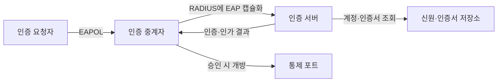
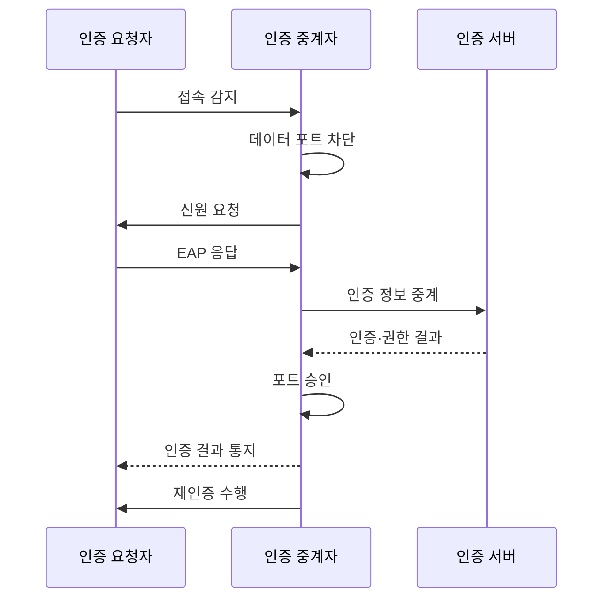

---
sidebar:
  order: 115
  label: "115. 802.1X EAP 인증"
  badge:
    text: "기출 · 50%"
    variant: note
title: "802.1X EAP 인증"
date: "2026-07-27T23:59:59+09:00"
tags:
  - "notes-network"
weight: 115
extra:
  question_no: "115"
  source_status: "기출"
  source_history: "134회"
  priority: 50
  priority_note: "134회 출제"
---

## 미리 알고가기

- **IEEE 802.1X(팔공이 점 일 엑스)**: IEEE의 802.1 작업반 표준 번호 표기로 네트워크 포트 기반 인증을 수행함
- **확장 인증 프로토콜 EAP(이에이피, Extensible Authentication Protocol)**: 영어 세 낱말의 첫 글자를 쓴 표기로 다양한 인증 방식을 운반하는 틀임
- **랜 상의 EAP EAPOL(이애폴, EAP over LAN)**: EAP와 LAN을 붙인 표기로 단말과 접속 장비 사이에 EAP 메시지를 전달함
- **원격 인증 다이얼인 사용자 서비스 RADIUS(레이디어스, Remote Authentication Dial-In User Service)**: 영어 낱말의 첫 글자를 쓴 표기로 접속 장비와 인증 서버의 인증·인가 정보를 교환함
- **EAP-전송 계층 보안 EAP-TLS(이에이피 티엘에스, EAP-Transport Layer Security)**: EAP와 TLS를 하이픈으로 결합한 표기로 인증서로 상호 인증함
- **인증 요청자**: 접속 자격을 제시하는 단말
- **인증 중계자**: 인증 전달과 포트 통제 장비
- **통제 포트**: 인증 결과에 따라 일반 데이터 통신의 허용 여부가 바뀌는 논리 포트

## Ⅰ. 개요

- **정의/개념**: EAP로 단말을 인증한 뒤 **통제 포트 접근 권한 부여**
- **배경/필요성**: 물리 접속·공유 암호만으로는 **사용자·단말별 접근 통제 곤란**

### 쉽게 이해하기 (학습용)

- 신분 확인이 끝난 뒤 네트워크 문을 연다.

## Ⅱ. 특징

- **요청자·중계자·인증 서버**가 인증·집행 역할을 분리한다.
- **EAPOL·RADIUS**로 단말의 EAP 인증 대화를 중계한다.
- **통제 포트·동적 권한**으로 승인 후 망 구역·정책을 적용한다.

### 쉽게 이해하기 (학습용)

- 스위치는 인증 대화를 전달하고 결과를 집행한다.

## Ⅲ. 아키텍처 및 구성요소

| 구성요소 | 역할 |
|:---|:---|
| 인증 요청자 | **자격·EAP 응답 제시** |
| 인증 중계자 | **인증 중계·포트 상태 집행** |
| 인증 서버 | **자격 검증·권한 결정** |
| 신원·인증서 저장소 | **계정·신뢰 정보 제공** |
| 통제 포트 | **승인 후 일반 데이터 허용** |

### 쉽게 이해하기 (학습용)

- 인증 서버의 판단을 접속 장비가 포트에 적용한다.

## Ⅳ. 원리 및 절차 흐름도

| 절차 | 핵심 내용 |
|:---|:---|
| 접속 감지 | 일반 통신을 막고 인증 시작 |
| 데이터 포트 차단 | 인증 통신 외 일반 데이터 통신 차단 |
| 신원 요청 | 중계자가 단말 식별을 요구 |
| EAP 응답 | 단말이 선택 방식의 자격 제시 |
| 인증 정보 중계 | 서버에 인증 대화를 전달 |
| 인증·권한 결과 | 서버가 승인과 정책 반환 |
| 포트 승인 | 승인된 망 구역과 접근 규칙으로 개방 |
| 인증 결과 통지 | 중계자가 단말에 성공·실패 결과 전달 |
| 재인증 수행 | 주기·상태 변화 때 다시 검증 |

> 인증과 포트 집행의 역할을 분리한다.

### 쉽게 이해하기 (학습용)

- 서버의 승인 뒤에만 일반 통신이 열린다.

## Ⅴ. 종류 및 비교

| 802.1X 인증 방식 | EAP-TLS | 터널형 EAP | 주소 기반 우회 |
|:---|:---|:---|:---|
| 적용 기준 | 관리 단말·강한 보안 | 계정 중심 기존 환경 | 인증 미지원 장비 |
| 핵심 특징 | 양쪽 인증서 상호 인증 | 보호 터널 내 계정 인증 | 단말 주소만 확인 |
| 한계 | 인증서 운영 실패 | 가짜 서버·계정 탈취 | 주소 위조·낮은 신뢰 |

> 관리 단말에는 상호 인증이 가장 강하다.

### 쉽게 이해하기 (학습용)

- 주소 기반 우회는 예외 장비에만 제한한다.

## Ⅵ. 실무 사례

1. 가짜 서버 차단은 **서버 이름·신뢰점 배포**
2. 접속 가용성은 **서버 이중화·인증서 자동 갱신**

### 쉽게 이해하기 (학습용)

- 단말이 서버도 검증해야 자격 노출을 막는다.
- 인증 기반 장애가 전체 접속 장애가 되지 않게 한다.

## Ⅶ. 결론

- 관리 단말은 **EAP-TLS**, 미지원 장비만 **제한적 주소 우회**

### 쉽게 이해하기 (학습용)

- 인증 방식과 문을 여는 절차를 함께 설계한다.
