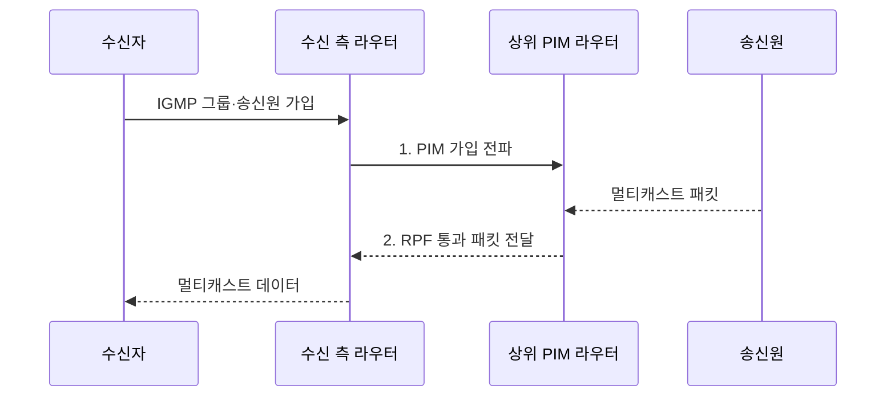

---
sidebar:
  order: 116
  label: "116. 멀티캐스트 IGMP·PIM"
  badge:
    text: "기출 · 50%"
    variant: note
title: "멀티캐스트 IGMP·PIM"
date: "2026-07-31T01:49:00+09:00"
tags:
  - "notes-network"
weight: 116
extra:
  question_no: "116"
  source_status: "기출"
  source_history: "132회"
  priority: 50
  priority_note: "132회 출제"
---

## 미리 알고가기

- **멀티캐스트(Multicast)**: 하나의 송신 패킷을 가입한 여러 수신자 경로의 분기점에서 복제하는 전송 방식이다.
- **인터넷 그룹 관리 프로토콜(Internet Group Management Protocol, IGMP)**: 단말의 IPv4 멀티캐스트 그룹 가입·탈퇴를 인접 라우터에 알린다.
- **프로토콜 독립형 멀티캐스트(Protocol Independent Multicast, PIM)**: 기존 유니캐스트 경로 정보를 활용해 라우터 간 멀티캐스트 분배 트리를 구성한다.
- **역방향 경로 전달(Reverse Path Forwarding, RPF)**: 송신원으로 가는 최적 경로의 인터페이스로 들어온 패킷만 전달한다.
- **집결점(Rendezvous Point, RP)**: 임의 송신원 멀티캐스트의 공유 트리 중심을 제공하는 라우터다.
- **임의 송신원 멀티캐스트(Any-Source Multicast, ASM)**: 그룹에 보내는 모든 송신원을 허용하는 서비스 모델이다.
- **특정 송신원 멀티캐스트(Source-Specific Multicast, SSM)**: 수신자가 특정 송신원과 그룹 조합만 선택하는 서비스 모델이다.
- **IGMP 스누핑(IGMP Snooping)**: 스위치가 가입 보고를 읽어 가입 포트에만 멀티캐스트를 전달하는 기능이다.
- **분배 트리(Distribution Tree)**: 송신원 또는 RP에서 수신자 방향으로 패킷을 복제·전달하는 경로 구조다.
- **PIM 희소 모드(PIM Sparse Mode, PIM-SM)**: RP 중심 공유 트리와 명시적 가입으로 희소 수신자를 연결한다.
- **PIM 밀집 모드(PIM Dense Mode, PIM-DM)**: 먼저 범람한 뒤 수신자 없는 가지를 제거한다.
- **IETF RFC 3376**: IPv4 호스트와 라우터의 IGMP 버전 3 그룹·송신원 가입을 규정한 표준 문서다.
- **IETF RFC 7761(STD 83)**: PIM 희소 모드의 공유·송신원 트리 절차를 규정한 인터넷 표준이다.

## Ⅰ. 개요

- 정의/개념: 가입 수신자 경로의 분기점에서 **패킷을 선택 복제**
- 배경/필요성: 개별 전송의 **동일 콘텐츠·대역폭 중복**

### 쉽게 이해하기 (학습용)

- 필요한 갈림길에서만 같은 방송을 복제한다.

## Ⅱ. 특징

- **IGMP**가 접속망의 그룹 가입·탈퇴 상태를 관리한다.
- **PIM**이 라우터 간 공유·송신원 분배 트리를 구성한다.
- RPF·IGMP 스누핑 기반 **오유입·불필요 전달 차단**

### 쉽게 이해하기 (학습용)

- 가입은 IGMP, 라우터 경로는 PIM이 담당한다.

## Ⅲ. 구조 및 구성요소

| 구성요소 | 책임 |
|:---|:---|
| 멀티캐스트 송신원 | **그룹 주소로 원본 패킷 전송** |
| PIM 라우팅 도메인 | **RPF 기반 분배 트리 구성** |
| 집결점(RP) | **ASM 공유 트리 접점 제공** |
| IGMP 접속망 | **그룹 상태·가입 포트 관리** |
| 멀티캐스트 수신자 | **그룹 가입·수신** |

### 쉽게 이해하기 (학습용)

- 가입 정보가 스위치와 라우터의 경로를 만든다.

## Ⅳ. 흐름도

**동작 원리**

- **1. PIM 가입 전파**: 수신 측 라우터가 상위 경로에 가입 요청
- **2. RPF 통과 패킷 전달**: 정상 유입 패킷만 가입 가지로 복제

### 쉽게 이해하기 (학습용)

- 가입은 위로 전파되고 데이터는 아래로 복제된다.

## Ⅴ. 종류 및 비교

| 멀티캐스트 트리 방식 | ASM·PIM-SM | SSM | PIM-DM |
|:---|:---|:---|:---|
| 적용 기준 | **송신원 탐색** 필요 | **송신원 사전 지정** | 수신자가 많은 **폐쇄망** |
| 핵심 특징 | **RP 중심 공유 트리** | **송신원 지정 최단 트리** | **범람 후 가지 제거** |
| 한계 | **RP 장애·복잡한 상태** | **송신원 정보** 배포 오류 | 불필요한 **범람 트래픽** 반복 |

> 송신원을 알 수 있으면 SSM이 단순하고 효율적이다.

### 쉽게 이해하기 (학습용)

- 불특정 송신원은 ASM, 지정 송신원은 SSM이다.

## Ⅵ. 실무 고려사항 및 대책

| 고려사항 | 대책 | 효과 |
|:---|:---|:---|
| 비가입 포트의 방송 범람 | **IGMP 스누핑·질의자 이중화** | 접속망 대역폭 절감 |
| 잘못된 유입 경로의 중복 | **RPF 경로·유니캐스트 정합** | 루프·중복 복제 방지 |
| 송신원·트리 방식 불일치 | **RFC 3376·7761 준수 시험** | 가입·전달 상호운용 확보 |

### 쉽게 이해하기 (학습용)

- IGMP 가입과 PIM 트리 상태를 함께 점검하고 RPF 경로와 스누핑 포트가 일치하는지 지속 검증한다.

## Ⅶ. 결론

- 송신원 지정 시 **SSM**, 미지정 시 **ASM·PIM-SM**, 고밀도 폐쇄망은 PIM-DM 선택

### 쉽게 이해하기 (학습용)

- 가입 정보와 라우터 경로가 함께 맞아야 한다.
