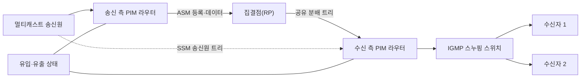
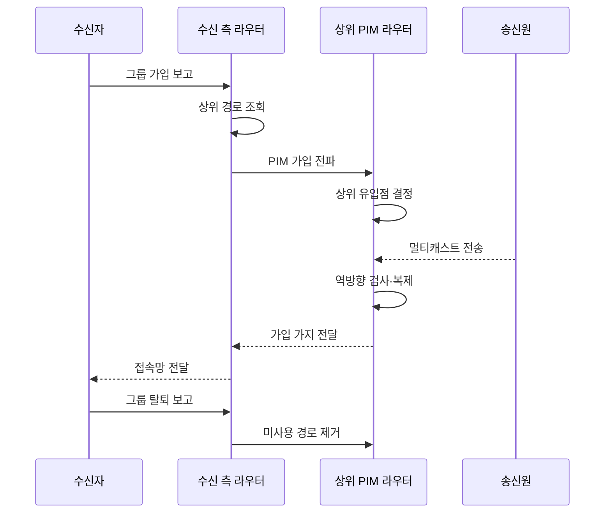

---
sidebar:
  order: 116
  label: "116. 멀티캐스트 IGMP·PIM"
  badge:
    text: "기출 · 50%"
    variant: note
title: "멀티캐스트 IGMP·PIM"
date: "2026-07-27T23:59:59+09:00"
tags:
  - "notes-network"
weight: 116
extra:
  question_no: "116"
  source_status: "기출"
  source_history: "132회"
  priority: 50
  priority_note: "132회 출제"
---

## 미리 알고가기

- **멀티캐스트**: 하나의 송신 패킷을 가입한 여러 수신자에게 분기 복제하는 전송 방식
- **인터넷 그룹 관리 프로토콜 IGMP(아이지엠피, Internet Group Management Protocol)**: 영어 네 낱말의 첫 글자를 쓴 표기로 단말의 멀티캐스트 그룹 가입을 라우터에 알림
- **프로토콜 독립형 멀티캐스트 PIM(핌, Protocol Independent Multicast)**: 영어 세 낱말의 첫 글자를 쓴 표기로 라우터 간 멀티캐스트 분배 트리를 구성함
- **역방향 경로 전달(Reverse Path Forwarding, RPF)**: ‘알피에프’로 읽고 세 영문 단어의 머리글자를 딴 표기이며 송신원으로 가는 최적 경로의 인터페이스로 들어온 패킷만 전달함
- **집결점 RP(알피, Rendezvous Point)**: 영어 두 낱말의 첫 글자를 쓴 표기로 공유 트리의 중심 라우터임
- **임의 송신원 멀티캐스트 ASM(에이에스엠, Any-Source Multicast)**: 영어 세 낱말의 첫 글자를 쓴 표기로 모든 송신원을 허용하는 그룹 방식임
- **특정 송신원 멀티캐스트 SSM(에스에스엠, Source-Specific Multicast)**: 영어 세 낱말의 첫 글자를 쓴 표기로 특정 송신원만 선택하는 그룹 방식임
- **IGMP 스누핑**: 스위치가 IGMP 가입 보고를 읽어 가입 포트에만 멀티캐스트를 전달하는 기능임
- **분배 트리**: 송신원 또는 RP에서 수신자 방향으로 패킷을 복제·전달하는 경로 구조
- **PIM 희소 모드(PIM Sparse Mode, PIM-SM)**: ‘핌 에스엠’으로 읽고 PIM 뒤에 Sparse Mode의 머리글자를 붙인 표기이며 RP 중심 공유 트리와 명시적 가입을 사용함
- **PIM 밀집 모드(PIM Dense Mode, PIM-DM)**: ‘핌 디엠’으로 읽고 PIM 뒤에 Dense Mode의 머리글자를 붙인 표기이며 먼저 범람한 뒤 수신자 없는 가지를 제거함

## Ⅰ. 개요

- 정의/개념: 가입 수신자 경로의 분기점에서 **패킷을 선택 복제**
- **배경/필요성**: 유니캐스트 개별 전송은 **동일 콘텐츠의 송신·망 대역폭 중복**

### 쉽게 이해하기 (학습용)

- 필요한 갈림길에서만 같은 방송을 복제한다.

## Ⅱ. 특징

- **IGMP**가 접속망의 그룹 가입·탈퇴 상태를 관리한다.
- **PIM**이 라우터 간 공유·송신원 분배 트리를 구성한다.
- **RPF·IGMP 스누핑**으로 잘못된 유입과 불필요한 포트 전달을 차단한다.

### 쉽게 이해하기 (학습용)

- 가입은 IGMP, 라우터 경로는 PIM이 담당한다.

## Ⅲ. 아키텍처 및 구성요소

| 구성요소 | 역할 |
|:---|:---|
| 멀티캐스트 송신원 | **그룹 주소로 원본 패킷 전송** |
| PIM 라우터 | **RPF 기반 분배 트리 구성** |
| 집결점(RP) | **ASM 공유 트리 접점 제공** |
| 수신 측 라우터 | **IGMP 가입을 PIM으로 변환** |
| IGMP 스누핑 스위치 | **가입 포트에만 프레임 전달** |
| 멀티캐스트 수신자 | **그룹 가입·수신** |
| 멀티캐스트 상태 | **유입·유출 인터페이스 유지** |

### 쉽게 이해하기 (학습용)

- 가입 정보가 스위치와 라우터의 경로를 만든다.

## Ⅳ. 원리 및 절차 흐름도

| 절차 | 핵심 내용 |
|:---|:---|
| 그룹 가입 보고 | 수신자가 원하는 그룹을 알림 |
| 상위 경로 조회 | 수신 측 라우터가 RP·송신원 방향을 조회 |
| PIM 가입 전파 | 라우터가 상위 경로에 가입 요청 |
| 상위 유입점 결정 | 상위 라우터가 정상 유입 인터페이스 선택 |
| 멀티캐스트 전송 | 송신원이 그룹 패킷 발송 |
| 역방향 검사·복제 | 정상 유입 패킷을 가입 가지별로 복제 |
| 가입 가지 전달 | 상위 라우터가 수신 측 라우터로 전달 |
| 접속망 전달 | 수신 측 라우터가 가입 수신자에게 전달 |
| 그룹 탈퇴 보고 | 수신자가 수신 종료를 알림 |
| 미사용 경로 제거 | 가입자 없는 가지를 삭제 |

> 가입 상태에 따라 전달 트리가 변한다.

### 쉽게 이해하기 (학습용)

- 가입은 위로 전파되고 데이터는 아래로 복제된다.

## Ⅴ. 종류 및 비교

| 멀티캐스트 트리 방식 | ASM·PIM-SM | SSM | PIM-DM |
|:---|:---|:---|:---|
| 적용 기준 | 송신원 탐색 필요 | 송신원 사전 지정 | 수신자가 매우 많은 폐쇄망 |
| 핵심 특징 | RP 중심 공유 트리 | 송신원 지정 최단 트리 | 범람 후 가지 제거 |
| 한계 | RP 장애·복잡한 상태 | 송신원 정보 배포 오류 | 불필요한 트래픽 반복 |

> 송신원을 알 수 있으면 SSM이 단순하고 효율적이다.

### 쉽게 이해하기 (학습용)

- 불특정 송신원은 ASM, 지정 송신원은 SSM이다.

## Ⅵ. 실무 사례

1. IPTV 멀티캐스트의 **IGMP 가입·PIM 전달 경로 구성**

### 쉽게 이해하기 (학습용)

- 가입자 셋톱박스가 IGMP로 채널 그룹에 가입하면 라우터가 PIM으로 송신원까지 트리를 구성해 해당 수신 구간에만 방송을 복제한다.

## Ⅶ. 결론

- 송신원 미지정은 **ASM**, 지정 가능하면 **SSM**

### 쉽게 이해하기 (학습용)

- 가입 정보와 라우터 경로가 함께 맞아야 한다.
