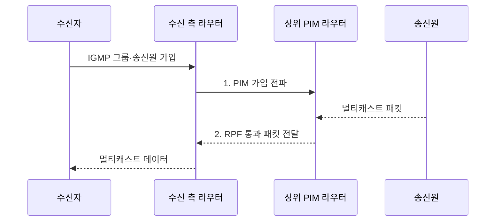

---
sidebar:
  order: 116
  label: "116. 멀티캐스트 IGMP·PIM"
  badge:
    text: "기출 · 50%"
    variant: note
title: "멀티캐스트 IGMP·PIM"
date: "2026-07-31T11:10:31+09:00"
tags:
  - "notes-network"
weight: 116
extra:
  question_no: "116"
  source_status: "기출"
  source_history: "132회"
  priority: 50
  priority_note: "132회 출제"
---

## Ⅰ. 개요

핵심 용어

- **멀티캐스트**: 하나의 송신 패킷을 가입한 여러 수신자 경로의 분기점에서 선택적으로 복제하는 일대다 전송 방식이다.
- **멀티캐스트 그룹(Multicast Group)**: 같은 그룹 주소의 데이터를 수신하겠다고 가입한 수신자들의 논리적 집합이다.

- 정의/개념: 하나의 송신 패킷을 가입 수신자 경로의 분기점에서 **선택 복제**하는 **일대다 전송 방식**
- 배경/필요성: 개별 전송은 동일 콘텐츠 반복으로 **대역폭 중복 사용**

#### 한줄 요약

- 필요한 갈림길에서만 같은 방송을 복제한다.

## Ⅱ. 특징

핵심 용어

- **인터넷 그룹 관리 프로토콜(Internet Group Management Protocol, IGMP)**: 접속망의 단말과 라우터 사이에서 멀티캐스트 그룹 가입·탈퇴 상태를 관리하는 프로토콜이다.
- **프로토콜 독립 멀티캐스트(Protocol Independent Multicast, PIM)**: 기존 유니캐스트 경로 정보를 이용해 라우터 간 멀티캐스트 분배 트리를 구성하는 프로토콜이다.
- **역방향 경로 전달(Reverse Path Forwarding, RPF)**: 송신원으로 돌아가는 최적 경로의 인터페이스로 들어온 멀티캐스트 패킷만 전달하는 검사이다.

- **IGMP** 기반 접속망의 그룹 가입·탈퇴 상태 관리
- **PIM** 기반 라우터 간 공유·송신원 분배 트리 구성
- RPF·IGMP 스누핑 기반 **오유입·불필요 전달 차단**

#### 한줄 요약

- 가입은 IGMP, 라우터 경로는 PIM이 담당한다.

## Ⅲ. 구조 및 구성요소

핵심 용어

- **분배 트리**: 송신원 또는 RP에서 가입 수신자 방향으로 패킷을 복제·전달하는 경로 구조이다.
- **집결점(Rendezvous Point, RP)**: 임의 송신원 멀티캐스트의 공유 트리 중심을 제공하는 라우터이다.
- **임의 송신원 멀티캐스트(Any-Source Multicast, ASM)**: 수신자가 그룹에 가입하면 여러 송신원의 트래픽을 받을 수 있는 방식이다.

| 구성요소 | 책임 |
|:---|:---|
| 멀티캐스트 송신원 | **그룹 주소로 원본 패킷 전송** |
| PIM 라우팅 도메인 | **RPF 기반 분배 트리 구성** |
| 집결점(RP) | **ASM 공유 트리 접점 제공** |
| IGMP 접속망 | **그룹 상태·가입 포트 관리** |
| 멀티캐스트 수신자 | **그룹 가입·수신** |

#### 한줄 요약

- 가입 정보가 스위치와 라우터의 경로를 만든다.

## Ⅳ. 흐름도

핵심 용어

- **PIM 가입 전파**: 수신 측 라우터가 상위 경로에 멀티캐스트 그룹·송신원 트리 참여를 요청하는 과정이다.
- **가입 가지**: 분배 트리에서 실제 수신자가 존재해 멀티캐스트 패킷을 전달해야 하는 경로이다.
- **1. PIM 가입 전파**: 수신 측 라우터가 상위 경로에 그룹·송신원 트리 참여를 요청하는 단계이다.
- **2. RPF 통과 패킷 전달**: 정상 유입 인터페이스로 들어온 패킷만 가입 가지에 복제하는 단계이다.

**동작 원리**

- **1. PIM 가입 전파**: 수신 측 라우터가 상위 경로에 가입 요청
- **2. RPF 통과 패킷 전달**: 정상 유입 패킷만 가입 가지로 복제

#### 한줄 요약

- 가입은 위로 전파되고 데이터는 아래로 복제된다.

## Ⅴ. 종류 및 비교

핵심 용어

- **임의 송신원 멀티캐스트(Any-Source Multicast, ASM)**: 모든 송신원을 허용하고 집결점 중심 공유 트리로 송신원을 찾는 방식이다.
- **송신원 지정 멀티캐스트(Source-Specific Multicast, SSM)**: 수신자가 특정 송신원·그룹 조합만 선택해 가입하는 방식이다.
- **PIM 희소 모드(PIM Sparse Mode, PIM-SM)**: 명시적 가입으로 희소한 수신자를 공유·최단 경로 트리에 연결하는 방식이다.
- **PIM 밀집 모드(PIM Dense Mode, PIM-DM)**: 먼저 트래픽을 범람시킨 뒤 수신자가 없는 가지를 제거하는 방식이다.

| 멀티캐스트 트리 방식 | ASM·PIM-SM | SSM | PIM-DM |
|:---|:---|:---|:---|
| 적용 기준 | **송신원 탐색** 필요 | **송신원 사전 지정** | 수신자가 많은 **폐쇄망** |
| 핵심 특징 | **RP 중심 공유 트리** | **송신원 지정 최단 트리** | **범람 후 가지 제거** |
| 한계 | **RP 장애·복잡한 상태** | **송신원 정보** 배포 오류 | 불필요한 **범람 트래픽** 반복 |

> 요약: 송신원 지정 가능 시 **SSM** 우선

#### 한줄 요약

- 불특정 송신원은 ASM, 지정 송신원은 SSM이다.

## Ⅵ. 실무 고려사항 및 대책

핵심 용어

- **질의자 이중화**: 그룹 가입 상태를 주기적으로 확인하는 IGMP 질의자 장애에 대비해 예비 장비를 구성하는 방식이다.
- **IGMP 스누핑(IGMP Snooping)**: 스위치가 IGMP 가입 보고를 관찰해 가입한 포트에만 멀티캐스트를 전달하는 기능이다.
- **의견 요청 문서(Request for Comments, RFC)**: 인터넷 프로토콜과 운영 규칙을 공개 정의하는 표준 문서 계열이다.

| 문제 | 대책 | 효과 |
|:---|:---|:---|
| 비가입 포트의 **방송 범람** | **IGMP 스누핑·질의자 이중화** | **접속망 대역폭 절감** |
| 잘못된 **유입 경로 중복** | **RPF 경로·유니캐스트 정합** | **루프·중복 복제 방지** |
| 송신원·트리 **방식 불일치** | **RFC 3376·7761 준수 시험** | **가입·전달 상호운용** 확보 |

#### 한줄 요약

- IGMP 가입과 PIM 트리 상태를 함께 점검하고 RPF 경로와 스누핑 포트가 일치하는지 지속 검증한다.

## Ⅶ. 결론

핵심 용어

- **멀티캐스트 방식 선택**: 송신원 지정 가능성·수신자 밀도·RP 운영 여부를 기준으로 SSM·PIM-SM·PIM-DM을 결정하는 과정이다.

- 송신원 지정 시 **SSM**, 미지정 시 **ASM·PIM-SM**, 고밀도 폐쇄망은 PIM-DM 선택

#### 한줄 요약

- 가입 정보와 라우터 경로가 함께 맞아야 한다.
