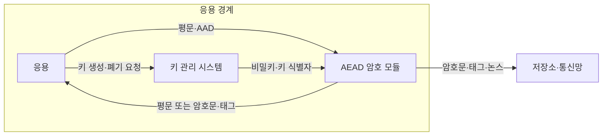
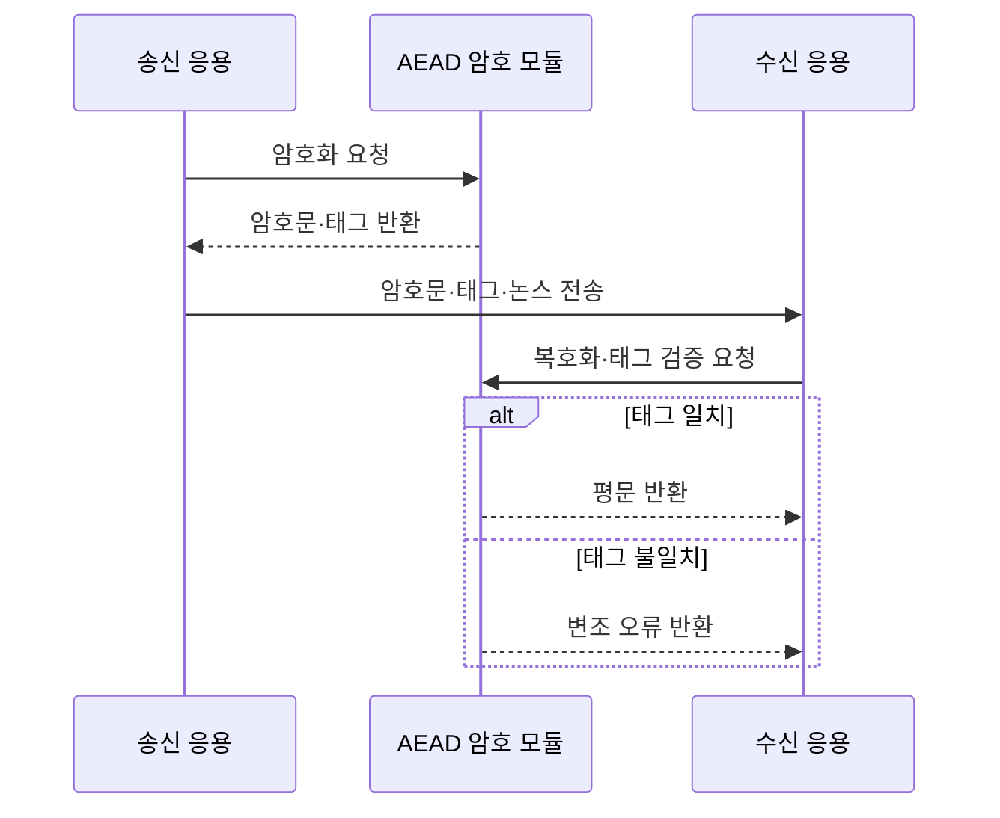

---
sidebar:
  order: 1
  label: "001. 대칭 암호화 (Symmetric Encryption)"
  badge:
    text: "기출 · 50%"
    variant: note
title: "대칭 암호화 (Symmetric Encryption)"
date: "2026-07-27T23:59:59+09:00"
tags:
  - "notes-security"
weight: 1
extra:
  question_no: "001"
  source_status: "기출"
  source_history: "122회"
  priority: 50
  priority_note: "122회 비교 기출이나 최신 독립 재출제 축은 약함"
---

## 미리 알고가기

- **대칭 암호화(Symmetric Encryption)**: 송신자와 수신자가 같은 비밀키로 데이터를 암호화하고 복호화하는 방식
- **평문(Plaintext)**: 암호화하기 전의 원본 데이터
- **암호문(Ciphertext)**: 비밀키 없이는 원문을 알기 어렵게 변환한 데이터
- **블록 암호(Block Cipher)**: 평문을 고정 길이 블록으로 나눠 비밀키로 변환하는 암호
- **스트림 암호(Stream Cipher)**: 비밀키로 만든 키스트림과 평문을 결합해 연속적으로 변환하는 암호
- **운영 모드(Block Cipher Mode)**: 블록 암호를 여러 블록의 데이터에 안전하게 적용하는 규칙
- **인증 암호화(Authenticated Encryption with Associated Data, AEAD)**: '에이이이에이디'로 읽고 영문 머리글자로 인증과 암호화를 함께 제공함을 표시하며 평문과 부가 데이터를 태그로 검증
- **부가 인증 데이터(Additional Authenticated Data, AAD)**: '에이에이디'로 읽고 영문 머리글자로 암호화하지 않고 태그 계산에만 넣는 부가 데이터를 표시
- **인증 태그(Authentication Tag)**: 암호문과 부가 인증 데이터가 바뀌지 않았음을 검증하는 값
- **초기화 벡터(Initialization Vector, IV)**: '아이브이'로 읽고 영문 머리글자로 초기 입력값임을 표시하며 같은 키의 암호화 결과를 다르게 만듦
- **논스(Nonce)**: 특정 키에서 반복 사용하지 않도록 관리하는 일회성 입력값
- **키 관리 시스템(Key Management System, KMS)**: '케이엠에스'로 읽고 영문 머리글자로 키 관리 체계임을 표시하며 비밀키의 생성·보관·교체·폐기를 통제
- **고급 암호화 표준 갈루아·카운터 모드(Advanced Encryption Standard-Galois/Counter Mode, AES-GCM)**: '에이에스 지시엠'으로 읽고 하이픈으로 암호와 운영 모드를 연결해 기밀성·무결성을 함께 제공
- **차차20-폴리1305(ChaCha20-Poly1305)**: '차차 이십 폴리 천삼백오'로 읽고 하이픈으로 스트림 암호와 인증 함수를 연결해 암호문과 태그를 생성
- **고급 암호화 표준 XTS 모드(Advanced Encryption Standard-XEX Tweakable Block Cipher with Ciphertext Stealing, AES-XTS)**: '에이에스 엑스티에스'로 읽고 하이픈으로 암호와 저장용 모드를 연결해 블록 위치별 기밀성을 제공
- **전송 계층 보안(Transport Layer Security, TLS)**: '티엘에스'로 읽고 영문 머리글자로 전송 보안 규약임을 표시하며 상대 인증·암호화·무결성을 제공

## Ⅰ. 개요

- 정의/개념: 같은 비밀키로 **평문 암호화·암호문 복호화**
- **배경/필요성**: 비대칭 암호의 **대용량 처리 성능 한계** 해소

### 쉽게 이해하기 (학습용)

- 한 열쇠로 잠그고 여는 금고처럼 송수신자가 같은 비밀키를 공유하므로, 키가 새면 누구나 암호문을 열 수 있다.

## Ⅱ. 특징

- 동일 키의 **암호화·복호화 사용**
- 블록·스트림 암호의 **고속 대용량 처리**
- AEAD의 **기밀성·무결성 동시 보호**

### 쉽게 이해하기 (학습용)

- 강한 암호 알고리즘도 같은 키와 논스를 되풀이하면 암호문 사이의 규칙이 드러나므로, 키뿐 아니라 논스의 유일성도 보장해야 한다.

## Ⅲ. 아키텍처 및 구성요소

| 설계 요소 | 설명 |
|:---|:---|
| 응용 | 평문·AAD와 암호화 정책을 전달 |
| AEAD 암호 모듈 | 암호문·태그 생성과 태그 검증 |
| 키 관리 시스템 | 비밀키 수명주기와 접근권한 통제 |

> 요약: KMS의 키로 AEAD 암호문·태그 생성

### 쉽게 이해하기 (학습용)

- 응용은 열쇠를 직접 보관하지 않고 키 관리 시스템에서 허가받은 키를 암호 모듈에 맡기며, 암호 모듈은 데이터와 위조 확인표를 함께 만든다.

## Ⅳ. 원리 및 절차 흐름도

| 절차 | 설명 |
|:---|:---|
| 암호화 요청 | 키·논스·AAD로 AEAD 연산 |
| 암호문·태그 반환 | 기밀성 데이터와 검증값 생성 |
| 암호문·태그·논스 전송 | 수신 측 복호화 입력 전달 |
| 복호화·태그 검증 요청 | 평문 반환 전 무결성 판정 |
| 평문 반환 | 태그 일치 시 평문 공개 |
| 변조 오류 반환 | 태그 불일치 시 평문 폐기 |

> 요약: 태그 검증 성공 후에만 평문 반환

### 쉽게 이해하기 (학습용)

- 자물쇠가 열렸어도 봉인표가 다르면 내용이 바뀐 것이므로, 태그가 맞을 때만 복호화한 평문을 응용에 넘긴다.

## Ⅴ. 종류 및 비교

| 대칭 암호 방식 | AES-GCM | ChaCha20-Poly1305 | AES-XTS |
|:---|:---|:---|:---|
| 적용 기준 | AES 가속 통신·저장 데이터 | AES 가속 없는 통신 환경 | 디스크 섹터 암호화 |
| 핵심 특징 | AES 블록 암호 기반 AEAD | 스트림 암호 기반 AEAD | 저장 위치별 기밀성 |
| 한계 | 논스 재사용 시 기밀성 훼손 | 논스 재사용 시 기밀성 훼손 | 무결성 별도 통제 |

> 요약: 통신은 AEAD, 디스크는 XTS 선택

### 쉽게 이해하기 (학습용)

- 통신 데이터에는 내용과 위조 여부를 함께 확인하는 AEAD가 맞고, 디스크 섹터에는 위치별 기밀성을 제공하는 XTS가 맞으므로 보호 대상에 따라 선택이 갈린다.

## Ⅵ. 실무 사례

1. TLS 통신은 AES-GCM으로 레코드 보호

### 쉽게 이해하기 (학습용)

- 웹 통신은 데이터가 바뀌었는지도 확인해야 하므로 암호문과 태그를 함께 만드는 AES-GCM을 사용한다.

## Ⅶ. 결론

- 대용량 데이터의 기밀성과 무결성을 효율적으로 보호하기 위해 데이터 특성·운영 모드·키 수명·논스 유일성을 검토하여, 용도에 맞는 대칭키 암호와 AEAD를 선택해야 한다.

### 쉽게 이해하기 (학습용)

- 암호 이름만 정해서는 끝나지 않으며, 통신인지 디스크인지에 맞는 방식과 키·논스를 되풀이하지 않는 운영 규칙을 함께 정해야 한다.
