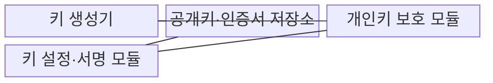
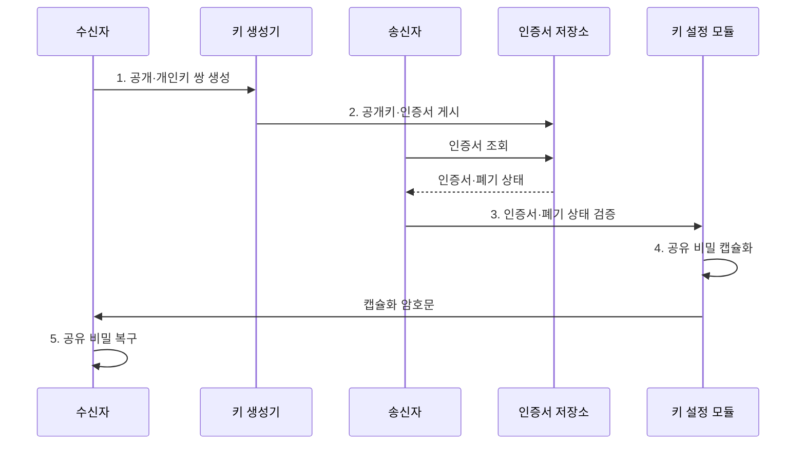

---
sidebar:
  order: 2
  label: "002. 비대칭 암호화 (Asymmetric Encryption)"
  badge:
    text: "기출 · 50%"
    variant: note
title: "비대칭 암호화 (Asymmetric Encryption)"
date: "2026-07-31T02:24:00+09:00"
tags:
  - "notes-security"
weight: 2
extra:
  question_no: "002"
  source_status: "기출"
  source_history: "122회"
  priority: 50
  priority_note: "122회 기출이며 PKI·PQC 비교의 기반으로 재사용됨"
---

## 미리 알고가기

- **비대칭 암호화(Asymmetric Encryption)**: 공개해도 되는 키와 소유자만 보관하는 키를 서로 다른 역할에 사용하는 암호 방식이다.
- **공개키(Public Key)**: 누구나 받아 암호화나 서명 검증에 사용할 수 있는 키다.
- **개인키(Private Key)**: 소유자만 보관해 복호화나 서명 생성에 사용하는 키다.
- **공개키 기반구조(Public Key Infrastructure, PKI)**: 인증서 발급·검증·폐지로 공개키와 소유자 신원을 연결하는 신뢰 체계다.
- **인증서(Certificate)**: 공개키·소유자·유효기간을 인증기관의 서명으로 묶은 전자 문서다.
- **하드웨어 보안 모듈(Hardware Security Module, HSM)**: 개인키를 외부로 노출하지 않고 내부에서 암호 연산을 수행하는 전용 장치다.
- **키 설정(Key Establishment)**: 통신 당사자가 이후 대칭 암호에 사용할 공유 비밀이나 세션키를 만드는 과정이다.
- **키 캡슐화 메커니즘(Key Encapsulation Mechanism, KEM)**: 공개키로 공유 비밀을 캡슐화하고 개인키로 복구하는 키 설정 방식이다.
- **RSA 최적 비대칭 암호 패딩(Rivest-Shamir-Adleman Optimal Asymmetric Encryption Padding, RSA-OAEP)**: RSA 암호화에 무작위 패딩을 적용해 반복·구조 노출을 막는 방식이다.
- **임시 타원곡선 디피-헬먼(Elliptic Curve Diffie-Hellman Ephemeral, ECDHE)**: 연결마다 임시 타원곡선 키를 생성해 순방향 비밀성을 제공하는 키 합의 방식이다.
- **모듈 격자 키 캡슐화 메커니즘(Module-Lattice-Based Key-Encapsulation Mechanism, ML-KEM)**: 모듈 격자 문제를 기반으로 양자 공격에 대응하는 키 캡슐화 방식이다.
- **순방향 비밀성(Forward Secrecy)**: 장기 개인키가 나중에 유출돼도 과거 세션키가 복구되지 않는 성질이다.
- **양자 내성 암호(Post-Quantum Cryptography, PQC)**: 양자컴퓨터의 공격에도 안전하도록 설계된 공개키 암호 기술이다.
- **전송 계층 보안(Transport Layer Security, TLS)**: 통신 상대를 인증하고 전송 자료의 기밀성과 무결성을 보호하는 프로토콜이다.
- **IETF RFC 8017**: RSA-OAEP 암호화와 RSA-PSS 서명 등 PKCS #1 버전 2.2를 규정한다.
- **NIST FIPS 203**: 양자 내성 키 캡슐화 방식인 ML-KEM을 규정한 연방 표준이다.

## Ⅰ. 개요

- 정의/개념: 공개키·개인키 쌍을 역할별로 쓰는 **키 설정·전자서명 방식**
- 배경/필요성: 대칭키의 **사전 안전 공유 한계** 해소

### 쉽게 이해하기 (학습용)

- 누구나 우편함에 편지를 넣지만 소유자만 열 수 있듯 공개키는 배포하고 개인키는 숨기며, 우편함의 실제 주인이 누구인지 인증서로 확인해야 한다.

## Ⅱ. 특징

- 공개키 배포와 **개인키 격리**
- 공개키 기반 **키 설정·전자서명**
- 인증서 기반 **공개키 소유자 검증**

### 쉽게 이해하기 (학습용)

- 공개키 파일만 받으면 공격자가 바꿔치기했는지 알 수 없으므로, 신뢰하는 인증기관의 서명과 유효기간을 확인한 뒤 사용한다.

## Ⅲ. 구조 및 구성요소

| 구성요소 | 책임 |
|:---|:---|
| 키 생성기 | **공개키·개인키 쌍** 생성 |
| 공개키·인증서 저장소 | **공개키 소유자·유효기간** 제공 |
| 개인키 보호 모듈 | **개인키 반출 없는 암호 연산** 수행 |
| 키 설정·서명 모듈 | **공유 비밀 설정·서명 생성** 수행 |

### 쉽게 이해하기 (학습용)

- 공개키는 이름표가 붙은 자물쇠처럼 배포하고 개인키는 HSM 안에 둔 채, 응용은 열쇠 원본이 아니라 HSM이 만든 복호화·서명 결과만 받는다.

## Ⅳ. 흐름도

**동작 원리**

1. **공개·개인키 쌍 생성**: 공개키 배포·개인키 격리
2. **공개키·인증서 게시**: 키와 소유자 신원 정보 제공
3. **인증서·폐기 상태 검증**: 서명·유효기간·폐기 여부 판정
4. **공유 비밀 캡슐화**: 검증 공개키로 비밀과 암호문 생성
5. **공유 비밀 복구**: 개인키로 동일 비밀 복구

### 쉽게 이해하기 (학습용)

- 공개키의 주인을 확인하지 않으면 공격자가 자기 자물쇠를 상대 것처럼 내밀 수 있으므로, 인증서 검증 뒤에만 공유 비밀을 만든다.

## Ⅴ. 종류 및 비교

| 공개키 키 설정 방식 | RSA-OAEP | ECDHE | ML-KEM |
|:---|:---|:---|:---|
| 적용 기준 | 기존 **RSA 키 전송 호환** | **순방향 비밀성**이 필요한 TLS | **양자 공격 대비 키 설정** |
| 핵심 특징 | **RFC 8017 RSA-OAEP** | **임시 키 공유 비밀 합의** | **FIPS 203 ML-KEM** |
| 한계 | 개인키 유출 시 **과거 복호화** | 인증 없으면 **중간자 공격** | **키·암호문 크기 증가** |

> 요약: 호환성·순방향 비밀성·양자 대응으로 선택

### 쉽게 이해하기 (학습용)

- RSA-OAEP는 정한 열쇠를 포장하고, ECDHE는 양쪽이 임시 재료로 새 열쇠를 만들며, ML-KEM은 양자 공격을 고려해 비밀을 캡슐화한다.

## Ⅵ. 실무 고려사항 및 대책

| 고려사항 | 대책 | 효과 |
|:---|:---|:---|
| **공개키 바꿔치기** | **인증서·폐기 상태 검증** | **중간자 공격 차단** |
| **장기 개인키 노출** | **HSM 격리·임시 키 합의** | **과거 세션 보호** |
| **양자 위협 전환** | **FIPS 203 ML-KEM 병행 시험** | **암호 민첩성** 확보 |

### 쉽게 이해하기 (학습용)

- 검증된 공개키만 사용하고 개인키는 HSM에 격리하며 고가치 연결부터 양자 내성 전환을 시험한다.

## Ⅶ. 결론

- 순방향 비밀성은 **ECDHE**, 양자 위협 대응은 **ML-KEM** 선택

### 쉽게 이해하기 (학습용)

- 공개키 암호는 어려운 수학만으로 안전해지지 않으며, 공개키 주인 확인과 개인키 격리 뒤에 필요한 키 설정 방식을 선택해야 한다.
