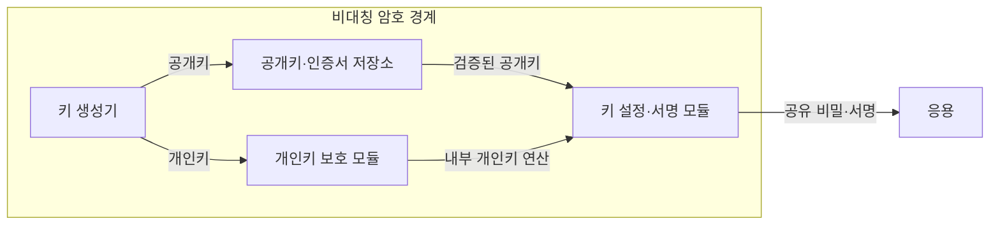
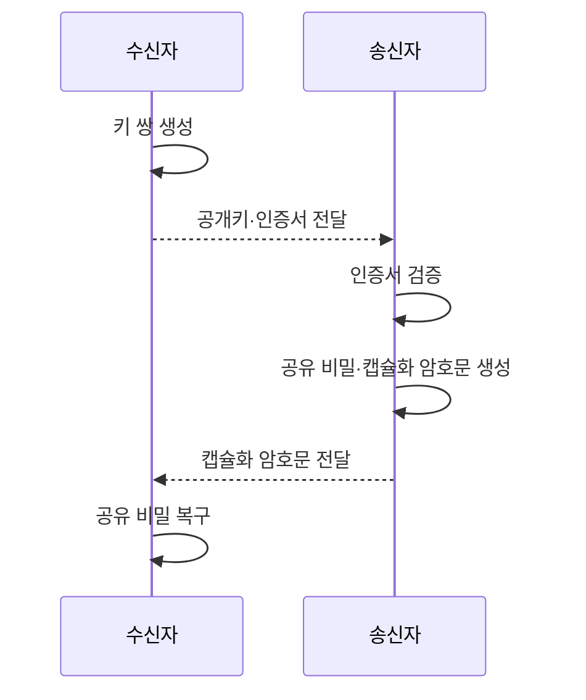

---
sidebar:
  order: 2
  label: "002. 비대칭 암호화 (Asymmetric Encryption)"
  badge:
    text: "기출 · 50%"
    variant: note
title: "비대칭 암호화 (Asymmetric Encryption)"
date: "2026-07-27T23:59:59+09:00"
tags:
  - "notes-security"
weight: 2
extra:
  question_no: "002"
  source_status: "기출"
  source_history: "122회"
  priority: 50
  priority_note: "122회 기출이며 PKI·PQC 비교의 기반으로 재사용됨"
---

## 미리 알고가기

- **비대칭 암호화(Asymmetric Encryption)**: 공개해도 되는 키와 소유자만 보관하는 키를 서로 다른 역할에 사용하는 암호 방식
- **공개키(Public Key)**: 누구나 받아 암호화나 서명 검증에 사용할 수 있는 키
- **개인키(Private Key)**: 소유자만 보관해 복호화나 서명 생성에 사용하는 키
- **공개키 기반구조(Public Key Infrastructure, PKI)**: 인증서의 발급·검증·폐지를 통해 공개키와 소유자의 신원을 연결하는 신뢰 체계
- **인증서(Certificate)**: 공개키·소유자·유효기간을 인증기관의 서명으로 묶은 전자 문서
- **하드웨어 보안 모듈(Hardware Security Module, HSM)**: 개인키를 외부로 노출하지 않고 내부에서 암호 연산을 수행하는 전용 보안 장치
- **키 설정(Key Establishment)**: 통신 당사자가 이후 대칭 암호에 사용할 공유 비밀이나 세션키를 만드는 과정
- **키 캡슐화 메커니즘(Key Encapsulation Mechanism, KEM)**: 공개키로 공유 비밀을 캡슐화하고 개인키로 복구하는 키 설정 방식
- **RSA 최적 비대칭 암호 패딩(Rivest-Shamir-Adleman Optimal Asymmetric Encryption Padding, RSA-OAEP)**: RSA 암호화에 무작위 패딩을 적용하여 동일 평문의 암호문 반복과 구조 노출을 방지하는 방식
- **임시 타원곡선 디피-헬먼(Elliptic Curve Diffie-Hellman Ephemeral, ECDHE)**: 연결마다 임시 타원곡선 키를 생성하여 순방향 비밀성을 제공하는 키 합의 방식
- **모듈 격자 키 캡슐화 메커니즘(Module-Lattice-Based Key-Encapsulation Mechanism, ML-KEM)**: 모듈 격자 문제를 기반으로 양자 공격에 대응하는 키 캡슐화 방식
- **순방향 비밀성(Forward Secrecy)**: 장기 개인키가 나중에 유출돼도 과거 세션키가 복구되지 않는 성질
- **양자 내성 암호(Post-Quantum Cryptography, PQC)**: 양자컴퓨터의 공격에도 안전하도록 설계된 공개키 암호 기술
- **인증 암호화(Authenticated Encryption with Associated Data, AEAD)**: 데이터의 기밀성과 무결성을 함께 보장하는 대칭키 암호 방식
- **전송 계층 보안(Transport Layer Security, TLS)**: 통신 상대를 인증하고 전송 데이터의 기밀성과 무결성을 보호하는 프로토콜

## Ⅰ. 개요

- 정의/개념: 공개키·개인키 쌍의 **키 설정·전자서명**
- **배경/필요성**: 대칭키의 **사전 안전 공유 한계** 해소

### 쉽게 이해하기 (학습용)

- 누구나 우편함에 편지를 넣지만 소유자만 열 수 있듯 공개키는 배포하고 개인키는 숨기며, 우편함의 실제 주인이 누구인지 인증서로 확인해야 한다.

## Ⅱ. 특징

- 공개키 배포와 **개인키 격리**
- 공개키 기반 **키 설정·전자서명**
- 인증서 기반 **공개키 소유자 검증**

### 쉽게 이해하기 (학습용)

- 공개키 파일만 받으면 공격자가 바꿔치기했는지 알 수 없으므로, 신뢰하는 인증기관의 서명과 유효기간을 확인한 뒤 사용한다.

## Ⅲ. 아키텍처 및 구성요소

| 설계 요소 | 설명 |
|:---|:---|
| 키 생성기 | 공개키·개인키 쌍 생성 |
| 공개키·인증서 저장소 | 공개키 소유자·유효기간 제공 |
| 개인키 보호 모듈 | 개인키 반출 없이 암호 연산 |
| 키 설정·서명 모듈 | 공유 비밀 설정·서명 생성 |

> 요약: 공개키는 검증하고 개인키는 격리

### 쉽게 이해하기 (학습용)

- 공개키는 이름표가 붙은 자물쇠처럼 배포하고 개인키는 HSM 안에 둔 채, 응용은 열쇠 원본이 아니라 HSM이 만든 복호화·서명 결과만 받는다.

## Ⅳ. 원리 및 절차 흐름도

| 절차 | 설명 |
|:---|:---|
| 키 쌍 생성 | 공개키 배포·개인키 격리 |
| 공개키·인증서 전달 | 수신자 키와 신원 정보 제공 |
| 인증서 검증 | 서명·유효기간·폐기 상태 판정 |
| 공유 비밀·캡슐화 암호문 생성 | 공개키로 공유 비밀 캡슐화 |
| 캡슐화 암호문 전달 | 개인키 소유자에게 복구값 전달 |
| 공유 비밀 복구 | 개인키로 같은 공유 비밀 도출 |

> 요약: 인증된 공개키로 공유 비밀 설정

### 쉽게 이해하기 (학습용)

- 공개키의 주인을 확인하지 않으면 공격자가 자기 자물쇠를 상대 것처럼 내밀 수 있으므로, 인증서 검증 뒤에만 공유 비밀을 만든다.

## Ⅴ. 종류 및 비교

| 공개키 키 설정 방식 | RSA-OAEP | ECDHE | ML-KEM |
|:---|:---|:---|:---|
| 적용 기준 | 기존 RSA 키 전송 호환 | 순방향 비밀성이 필요한 TLS | 양자 공격 대비 키 설정 |
| 핵심 특징 | 공개키로 키 재료 암호화 | 임시 키로 공유 비밀 합의 | 공유 비밀 캡슐화 |
| 한계 | 개인키 유출 시 과거 복호화 | 인증 없으면 중간자 공격 | 키·암호문 크기 증가 |

> 요약: 호환성·순방향 비밀성·양자 대응으로 선택

### 쉽게 이해하기 (학습용)

- RSA-OAEP는 정한 열쇠를 포장하고, ECDHE는 양쪽이 임시 재료로 새 열쇠를 만들며, ML-KEM은 양자 공격을 고려해 비밀을 캡슐화한다.

## Ⅵ. 실무 사례

1. TLS는 ECDHE로 임시 세션키 합의

### 쉽게 이해하기 (학습용)

- TLS는 인증서로 상대를 확인하고 ECDHE로 연결마다 새 세션키를 만들어, 장기 개인키가 유출돼도 과거 통신 복호화를 제한한다.

## Ⅶ. 결론

- 사전 공유키의 배포 한계를 극복하기 위해 인증 목적·성능·순방향 비밀성·양자 위협을 검토하여, 키 합의와 서명 역할에 맞는 비대칭키 방식을 선택해야 한다.

### 쉽게 이해하기 (학습용)

- 공개키 암호는 어려운 수학만으로 안전해지지 않으며, 공개키 주인 확인과 개인키 격리 뒤에 필요한 키 설정 방식을 선택해야 한다.
