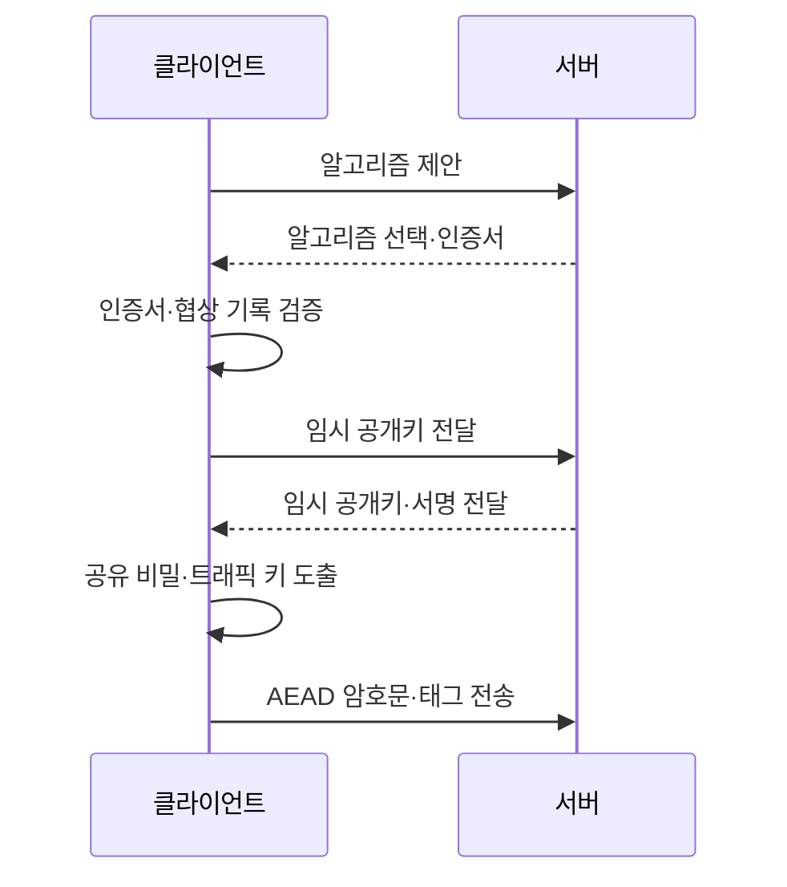

---
sidebar:
  order: 3
  label: "003. 하이브리드 암호 (Hybrid Cryptography)"
  badge:
    text: "기출 · 30%"
    variant: note
title: "하이브리드 암호 (Hybrid Cryptography)"
date: "2026-07-25T01:05:00+09:00"
tags:
  - "notes-security"
weight: 3
extra:
  question_no: "003"
  source_status: "기출"
  source_history: "122회"
  priority: 30
  priority_note: "122회 기출이나 대칭·비대칭 결합 설명에 흡수됨"
---

## 미리 알고가기

- **하이브리드 암호(Hybrid Cryptography)**: 공개키 암호로 임시 비밀을 설정하고 대칭키 암호로 실제 데이터를 보호하는 결합 방식
- **세션키(Session Key)**: 한 통신 연결이나 제한된 기간의 데이터 암호화에 사용하는 임시 대칭키
- **키 캡슐화 메커니즘(Key Encapsulation Mechanism, KEM)**: '켐'으로 읽고 영문 머리글자로 키 캡슐화임을 표시하며 공개키 암호문으로 공유 비밀을 설정
- **데이터 캡슐화 메커니즘(Data Encapsulation Mechanism, DEM)**: '뎀'으로 읽고 영문 머리글자로 데이터 캡슐화임을 표시하며 KEM의 대칭키로 본문을 암호화
- **키 유도 함수(Key Derivation Function, KDF)**: '케이디에프'로 읽고 영문 머리글자로 키 도출 함수임을 표시하며 공유 비밀에서 용도·방향별 키를 생성
- **인증 암호화(Authenticated Encryption with Associated Data, AEAD)**: '에이이이에이디'로 읽고 영문 머리글자로 암호화·인증 결합을 표시하며 평문과 부가 데이터를 태그로 검증
- **키 스케줄(Key Schedule)**: 하나의 공유 비밀에서 연결 단계와 용도별 키를 순서대로 도출·갱신하는 규칙
- **완전 순방향 비밀성(Perfect Forward Secrecy, PFS)**: '피에프에스'로 읽고 영문 머리글자로 과거 세션 보호 성질임을 표시하며 장기 개인키 유출 뒤에도 과거 복호화를 제한
- **임시 타원곡선 디피-헬먼(Elliptic Curve Diffie-Hellman Ephemeral, ECDHE)**: '이시디에이치이'로 읽고 영문 머리글자로 임시 타원곡선 합의임을 표시해 연결마다 공유 비밀을 생성
- **전송 계층 보안(Transport Layer Security, TLS)**: '티엘에스'로 읽고 영문 머리글자로 전송 보안 규약임을 표시하며 인증·키 설정·대칭 암호를 결합
- **양자 내성 암호(Post-Quantum Cryptography, PQC)**: '피큐시'로 읽고 영문 머리글자로 양자 이후 암호임을 표시하는 공개키 기술
- **리베스트·샤미르·애들먼 암호(Rivest-Shamir-Adleman, RSA)**: '알에스에이'로 읽고 발명자 성의 머리글자로 공개키 암호를 표시하며 기존 키 전송 방식에 사용
- **다운그레이드 공격(Downgrade Attack)**: 통신 협상 정보를 조작해 양측이 지원하는 방식보다 약한 알고리즘을 쓰게 하는 공격

## Ⅰ. 개요

- **정의/개념**: 공개키로 키 설정 후 대칭키로 본문 보호
- **배경/필요성**: 안전한 키 분배와 대용량 암호화 결합

### 쉽게 이해하기 (학습용)

- 공개키 암호는 처음 만난 상대와 열쇠를 정할 때만 쓰고, 이후 큰 짐은 빠른 대칭키 암호로 계속 운반한다.

## Ⅱ. 특징

- 공개키 연산을 키 설정 구간에 한정한다
- 용도별 키 분리는 유출 영향 범위를 제한한다
- 상대 미인증은 공격자와 별도 키를 설정한다

### 쉽게 이해하기 (학습용)

- 열쇠를 안전하게 합의해도 상대 신원을 확인하지 않으면 공격자가 양쪽과 각각 열쇠를 만들어 대화를 중간에서 읽을 수 있다.

## Ⅲ. 아키텍처 및 구성요소

| 설계 요소 | 설명 |
|:---|:---|
| 인증 모듈 | 공개키 소유자와 협상 기록 검증 |
| 키 설정 모듈 | 키 합의·KEM으로 공유 비밀 생성 |
| KDF·키 스케줄 | 단계·방향별 대칭키 분리 |
| AEAD 모듈 | 본문 암호화와 태그 검증 |

> 요약: 인증된 비밀에서 AEAD 키 도출

### 쉽게 이해하기 (학습용)

- 하나의 공유 비밀을 그대로 모든 곳에 쓰지 않고, KDF가 송신·수신과 연결 단계마다 다른 키를 만들어 한 키의 노출이 번지는 범위를 줄인다.

## Ⅳ. 원리 및 절차 흐름도

| 절차 | 설명 |
|:---|:---|
| 알고리즘 제안 | 지원하는 키 설정·AEAD 제시 |
| 알고리즘 선택·인증서 | 선택 결과와 서버 신원 전달 |
| 인증서·협상 기록 검증 | 신원·다운그레이드 여부 판정 |
| 임시 공개키 전달 | 클라이언트 키 합의값 전송 |
| 임시 공개키·서명 전달 | 서버 합의값과 소유 증명 전송 |
| 공유 비밀·트래픽 키 도출 | 같은 비밀에서 방향별 키 생성 |
| AEAD 암호문·태그 전송 | 본문 기밀성·무결성 보호 |

> 요약: 인증된 키 합의 후 AEAD 전환

### 쉽게 이해하기 (학습용)

- 양측이 주고받은 알고리즘 목록까지 서명 검증에 포함해야 공격자가 중간에서 강한 방식을 지우고 약한 암호를 쓰게 할 수 없다.

## Ⅴ. 종류 및 비교

| 판단 기준 | ECDHE 기반 | RSA 키 전송 | ECDHE·PQC KEM 결합 |
|:---|:---|:---|:---|
| 핵심 특징 | 임시 키 합의 후 AEAD 적용 | 세션키를 RSA 공개키로 암호화 | 두 공유 비밀을 KDF로 결합 |
| 적용 기준 | 순방향 비밀성이 필요한 통신 | 기존 RSA 키 전송 호환 | 양자 대응 전환기 통신 |
| 주요 위험 | 인증 없으면 중간자 공격 | 개인키 유출 시 과거 복호화 | 실패 시 자동 약화 위험 |

> 요약: 인증·과거 보호·양자 대응으로 선택

### 쉽게 이해하기 (학습용)

- 기존 키 합의와 새 KEM을 함께 쓸 때는 두 비밀을 정해진 KDF로 결합해야 하며, 새 방식 실패를 숨기고 기존 방식만 쓰면 양자 대응이 사라진다.

## Ⅵ. 실무 사례

1. TLS는 ECDHE 키 합의 후 AEAD 적용
2. PQC 전환은 ECDHE·KEM 비밀 결합

### 쉽게 이해하기 (학습용)

- TLS는 공개키 연산을 상대 인증과 임시 키 합의에만 쓰고, 실제 응용 데이터는 도출한 대칭키로 빠르게 보호한다.
- 양자 대응 전환에서는 기존 비밀과 새 KEM 비밀을 함께 결합하고, 새 방식이 실패하면 연결을 중단해 몰래 약한 방식으로 내려가지 않게 한다.

## Ⅶ. 결론

- 인증·키 결합·AEAD 실패 정책을 함께 설계

### 쉽게 이해하기 (학습용)

- 공개키와 대칭키를 함께 썼다는 사실만으로 충분하지 않으며, 상대 인증부터 키 결합과 데이터 보호까지 각 결과가 다음 단계의 신뢰 근거가 되어야 한다.
