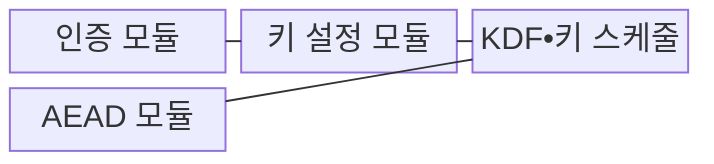
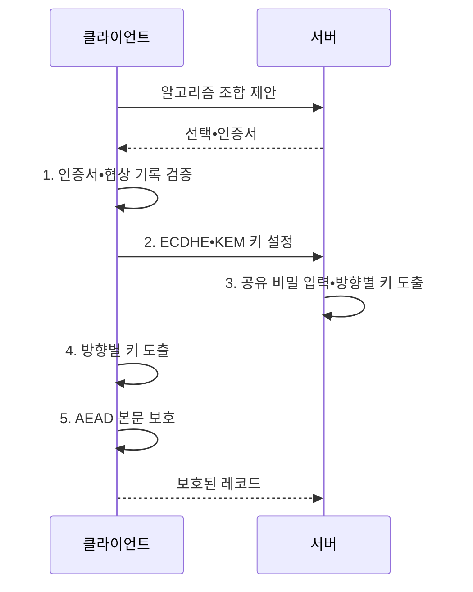

---
sidebar:
  order: 3
  label: "003. 하이브리드 암호 (Hybrid Cryptography)"
  badge:
    text: "기출 • 30%"
    variant: note
title: "하이브리드 암호 (Hybrid Cryptography)"
date: "2026-08-03T08:48:47+09:00"
tags:
  - "notes-security"
weight: 3
extra:
  question_no: "003"
  source_status: "기출"
  source_history: "122회"
  priority: 30
  priority_note: "122회 기출이나 대칭•비대칭 결합 설명에 흡수됨"
---

## Ⅰ. 개요

핵심 용어

- **하이브리드 암호** 는 공개키 암호로 임시 공유 비밀을 설정하고 대칭키 암호로 실제 데이터를 보호하는 결합 방식이다.
- **KEM과 DEM** 은 각각 공개키로 공유 비밀을 설정하고 그 비밀에서 얻은 대칭키로 본문을 암호화한다.

- 정의/개념: **하이브리드 암호** 는 공개키 KEM으로 세션키를 안전하게 설정하고 대칭키 DEM으로 대용량 본문을 보호하는 결합 암호 방식
- 배경/필요성: 공개키 암호의 **대용량 처리 한계** 해소

#### 한줄 요약

- 공개키 암호는 처음 만난 상대와 열쇠를 정할 때만 쓰고, 이후 큰 짐은 빠른 대칭키 암호로 계속 운반한다.

## Ⅱ. 특징

핵심 용어

- **세션키** 는 하나의 통신 연결이나 제한된 기간의 데이터 보호에 사용하는 임시 대칭키이다.
- **KDF** 는 공유 비밀에서 용도와 통신 방향별로 서로 다른 암호키를 생성한다.

- 공개키 연산의 **키 설정 구간 한정**
- 대칭키의 **고속 본문 암호화**
- KDF 기반 **용도•방향별 키 분리**

#### 한줄 요약

- 열쇠를 안전하게 합의해도 상대 신원을 확인하지 않으면 공격자가 양쪽과 각각 열쇠를 만들어 대화를 중간에서 읽을 수 있다.

## Ⅲ. 구조 및 구성요소

핵심 용어

- **키 스케줄** 은 하나의 공유 비밀에서 연결 단계와 용도별 키를 순서대로 도출하고 갱신한다.
- **KEM** 은 공개키로 공유 비밀을 캡슐화하고 개인키로 같은 비밀을 복구하는 키 설정 방식이다.
- **AEAD** 는 본문의 기밀성과 본문•부가 데이터의 무결성을 함께 보호한다.

| 구성요소 | 책임 |
|:---|:---|
| 인증 모듈 | **공개키 소유자•협상 기록** 검증 |
| 키 설정 모듈 | **키 합의•KEM 공유 비밀** 생성 |
| KDF•키 스케줄 | **단계•방향별 대칭키** 분리 |
| AEAD 모듈 | **본문 암호화•태그 검증** 수행 |

#### 한줄 요약

- 하나의 공유 비밀을 그대로 모든 곳에 쓰지 않고, KDF가 송신•수신과 연결 단계마다 다른 키를 만들어 한 키의 노출이 번지는 범위를 줄인다.

## Ⅳ. 흐름도

핵심 용어

- **협상 기록 인증** 은 양측이 교환한 알고리즘 제안과 선택 결과를 검증하여 다운그레이드 조작을 탐지한다.
- **ECDHE** 는 연결마다 임시 타원곡선 키를 만들어 공유 비밀을 합의한다.
- **KEM•KDF** 는 공유 비밀을 캡슐화하고 그 결과에서 통신 방향과 용도별 키를 도출한다.
- **AEAD 본문 보호** 는 도출한 대칭키로 본문의 기밀성과 무결성을 함께 보장한다.

**동작 원리**

1. **인증서•협상 기록 검증**: 신원•다운그레이드 여부 판정
2. **ECDHE•KEM 키 설정**: 임시 키 합의•비밀 캡슐화
3. **공유 비밀 입력**: 키 설정 결과를 키 스케줄에 제공
4. **방향별 키 도출**: 같은 비밀에서 용도별 키 생성
5. **AEAD 본문 보호**: 본문 기밀성•무결성 보호

#### 한줄 요약

- 양측이 주고받은 알고리즘 목록까지 서명 검증에 포함해야 공격자가 중간에서 강한 방식을 지우고 약한 암호를 쓰게 할 수 없다.

## Ⅴ. 종류 및 비교

핵심 용어

- **순방향 비밀성** 은 장기 개인키가 유출되어도 이전 세션키와 암호문을 보호하는 성질이다.
- **RSA 키 전송** 은 수신자의 RSA 공개키로 세션키를 암호화하여 전달하므로 장기 개인키 유출 시 과거 복호화 위험이 있다.
- **PQC KEM 결합** 은 기존 키 합의와 양자 내성 KEM의 두 비밀을 KDF로 결합한다.

| 하이브리드 키 설정 | ECDHE 기반 | RSA 키 전송 | ECDHE•PQC KEM 결합 |
|:---|:---|:---|:---|
| 적용 기준 | **순방향 비밀성** 이 필요한 통신 | 기존 **RSA 키 전송 호환** | **양자 대응 전환기 통신** |
| 핵심 특징 | **임시 키 합의 후 AEAD** | **RSA 공개키 세션키 암호화** | **두 비밀의 KDF 결합** |
| 한계 | 인증 없으면 **중간자 공격** | 개인키 유출 시 **과거 복호화** | 실패 시 **자동 약화 위험** |

> 요약: 인증•과거 보호•양자 대응으로 선택

#### 한줄 요약

- 기존 키 합의와 새 KEM을 함께 쓸 때는 두 비밀을 정해진 KDF로 결합해야 하며, 새 방식 실패를 숨기고 기존 방식만 쓰면 양자 대응이 사라진다.

## Ⅵ. 실무 고려사항 및 대책

핵심 용어

- **다운그레이드 공격** 은 협상 정보를 조작하여 양측이 지원하는 방식보다 약한 알고리즘을 선택하게 한다.
- **영역 분리** 는 같은 공유 비밀에서 파생한 키가 용도와 방향에 따라 서로 대체되지 않도록 구분한다.
- **RFC 9180** 은 HPKE의 KDF 영역 분리와 키 스케줄을 규정하고, **RFC 9846** 은 TLS 1.3의 하이브리드 키 교환 방식을 규정한다.

| 문제 | 대책 | 효과 |
|:---|:---|:---|
| 협상 조작의 **약한 조합 선택** | **협상 기록 인증•최소 조합** | **다운그레이드 차단** |
| 키 설정과 본문 **키 재사용** | **RFC 9180 KDF 영역 분리** | **키 용도 혼용 방지** |
| **구형 TLS 설계 잔존** | **RFC 9846 기준 전환** | **순방향 비밀성** 확보 |

#### 한줄 요약

- 상대와 협상 기록을 인증하고 공유 비밀에서 방향•용도별 키를 분리한 뒤 본문을 AEAD로 보호한다.

## Ⅶ. 결론

핵심 용어

- **TLS형 하이브리드 보호** 는 상대 인증, 임시 키 설정, 키 스케줄과 AEAD 본문 보호를 연속된 신뢰 과정으로 결합한다.
- **ECDHE•AEAD와 ECDHE•PQC KEM 선택** 은 현재 통신에는 임시 키 합의와 인증 암호를, 양자 전환기에는 양자 내성 KEM을 함께 적용하는 판단이다.

- 현재 통신은 **ECDHE•AEAD**, 양자 전환은 **ECDHE•PQC KEM** 선택

#### 한줄 요약

- 공개키와 대칭키를 함께 썼다는 사실만으로 충분하지 않으며, 상대 인증부터 키 결합과 데이터 보호까지 각 결과가 다음 단계의 신뢰 근거가 되어야 한다.
