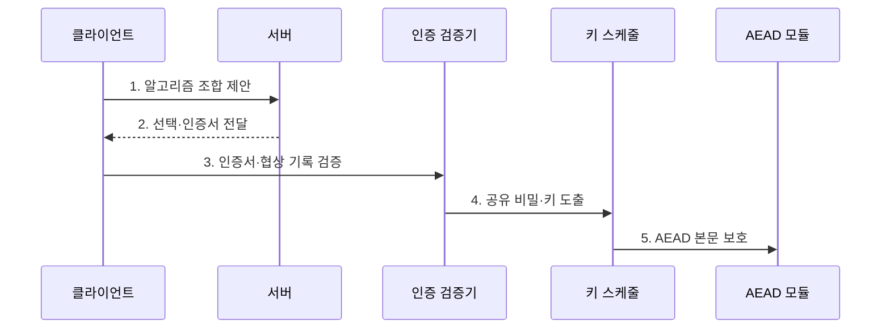

---
sidebar:
  order: 3
  label: "003. 하이브리드 암호 (Hybrid Cryptography)"
  badge:
    text: "기출 · 30%"
    variant: note
title: "하이브리드 암호 (Hybrid Cryptography)"
date: "2026-07-27T23:59:59+09:00"
tags:
  - "notes-security"
weight: 3
extra:
  question_no: "003"
  source_status: "기출"
  source_history: "122회"
  priority: 30
  priority_note: "122회 기출이나 대칭·비대칭 결합 설명에 흡수됨"
---

## 미리 알고가기

- **하이브리드 암호(Hybrid Cryptography)**: 공개키 암호로 임시 비밀을 설정하고 대칭키 암호로 실제 자료를 보호하는 결합 방식이다.
- **세션키(Session Key)**: 한 통신 연결이나 제한된 기간의 자료 암호화에 사용하는 임시 대칭키다.
- **키 캡슐화 메커니즘(Key Encapsulation Mechanism, KEM)**: 공개키 암호로 공유 비밀을 안전하게 설정하는 방식이다.
- **데이터 캡슐화 메커니즘(Data Encapsulation Mechanism, DEM)**: KEM에서 얻은 대칭키로 본문 자료를 암호화하는 방식이다.
- **키 유도 함수(Key Derivation Function, KDF)**: 공유 비밀에서 용도와 통신 방향별 암호키를 생성하는 함수다.
- **인증 암호화(Authenticated Encryption with Associated Data, AEAD)**: 평문의 기밀성과 평문·부가 자료의 무결성을 함께 보장하는 방식이다.
- **키 스케줄(Key Schedule)**: 하나의 공유 비밀에서 연결 단계와 용도별 키를 순서대로 도출·갱신하는 규칙이다.
- **완전 순방향 비밀성(Perfect Forward Secrecy, PFS)**: 장기 개인키가 유출돼도 이전 세션키와 암호문을 보호하는 보안 특성이다.
- **임시 타원곡선 디피-헬먼(Elliptic Curve Diffie-Hellman Ephemeral, ECDHE)**: 연결마다 임시 타원곡선 키를 생성해 공유 비밀을 합의하는 방식이다.
- **전송 계층 보안(Transport Layer Security, TLS)**: 인증·키 합의·대칭키 암호를 결합해 전송 구간을 보호하는 프로토콜이다.
- **양자 내성 암호(Post-Quantum Cryptography, PQC)**: 양자컴퓨터의 공격에도 안전하도록 설계된 공개키 암호 기술이다.
- **리베스트·샤미르·애들먼 암호(Rivest-Shamir-Adleman, RSA)**: 큰 정수의 소인수분해 난도를 기반으로 암호화와 전자서명을 제공한다.
- **다운그레이드 공격(Downgrade Attack)**: 협상 정보를 조작해 양측이 지원하는 방식보다 약한 알고리즘을 쓰게 하는 공격이다.
- **IETF RFC 9846**: TLS 1.3의 인증·임시 키 합의·키 스케줄·AEAD 보호를 규정한 현행 표준이다.
- **IRTF RFC 9180**: KEM·KDF·AEAD를 결합하는 하이브리드 공개키 암호 방식을 규정한다.

## Ⅰ. 개요

- 정의/개념: 공개키 **키 설정**과 대칭키 **본문 보호** 결합
- **배경/필요성**: 공개키 암호의 **대용량 처리 한계** 해소

### 쉽게 이해하기 (학습용)

- 공개키 암호는 처음 만난 상대와 열쇠를 정할 때만 쓰고, 이후 큰 짐은 빠른 대칭키 암호로 계속 운반한다.

## Ⅱ. 특징

- 공개키 연산의 **키 설정 구간 한정**
- 대칭키의 **고속 본문 암호화**
- KDF 기반 **용도·방향별 키 분리**

### 쉽게 이해하기 (학습용)

- 열쇠를 안전하게 합의해도 상대 신원을 확인하지 않으면 공격자가 양쪽과 각각 열쇠를 만들어 대화를 중간에서 읽을 수 있다.

## Ⅲ. 구조 및 구성요소

| 설계 요소 | 설명 |
|:---|:---|
| 인증 모듈 | 공개키 소유자와 협상 기록 검증 |
| 키 설정 모듈 | 키 합의·KEM으로 공유 비밀 생성 |
| KDF·키 스케줄 | 단계·방향별 대칭키 분리 |
| AEAD 모듈 | 본문 암호화와 태그 검증 |

> 요약: 인증된 비밀에서 AEAD 키 도출

### 쉽게 이해하기 (학습용)

- 하나의 공유 비밀을 그대로 모든 곳에 쓰지 않고, KDF가 송신·수신과 연결 단계마다 다른 키를 만들어 한 키의 노출이 번지는 범위를 줄인다.

## Ⅳ. 흐름도

| 절차 | 설명 |
|:---|:---|
| 알고리즘 조합 제안 | 지원하는 키 설정·AEAD 제시 |
| 선택·인증서 전달 | 선택 결과와 서버 신원 전달 |
| 인증서·협상 기록 검증 | 신원·다운그레이드 여부 판정 |
| 공유 비밀·키 도출 | 같은 비밀에서 방향별 키 생성 |
| AEAD 본문 보호 | 본문 기밀성·무결성 보호 |

> 요약: 인증된 키 합의 후 AEAD 전환

### 쉽게 이해하기 (학습용)

- 양측이 주고받은 알고리즘 목록까지 서명 검증에 포함해야 공격자가 중간에서 강한 방식을 지우고 약한 암호를 쓰게 할 수 없다.

## Ⅴ. 종류 및 비교

| 하이브리드 키 설정 | ECDHE 기반 | RSA 키 전송 | ECDHE·PQC KEM 결합 |
|:---|:---|:---|:---|
| 적용 기준 | 순방향 비밀성이 필요한 통신 | 기존 RSA 키 전송 호환 | 양자 대응 전환기 통신 |
| 핵심 특징 | **임시 키 합의 후 AEAD** | **RSA 공개키 세션키 암호화** | **두 비밀의 KDF 결합** |
| 한계 | 인증 없으면 중간자 공격 | 개인키 유출 시 과거 복호화 | 실패 시 자동 약화 위험 |

> 요약: 인증·과거 보호·양자 대응으로 선택

### 쉽게 이해하기 (학습용)

- 기존 키 합의와 새 KEM을 함께 쓸 때는 두 비밀을 정해진 KDF로 결합해야 하며, 새 방식 실패를 숨기고 기존 방식만 쓰면 양자 대응이 사라진다.

## Ⅵ. 실무 고려사항 및 대책

| 고려사항 | 대책 | 효과 |
|:---|:---|:---|
| 협상 조작의 약한 조합 선택 | **협상 기록 인증·최소 조합** | 다운그레이드 차단 |
| 키 설정과 본문 키의 재사용 | **RFC 9180 KDF 영역 분리** | 키 용도 혼용 방지 |
| 구형 TLS 설계의 잔존 | **RFC 9846 기준 전환** | 순방향 비밀성 확보 |

### 쉽게 이해하기 (학습용)

- 상대와 협상 기록을 인증하고 공유 비밀에서 방향·용도별 키를 분리한 뒤 본문을 AEAD로 보호한다.

## Ⅶ. 결론

- **상대 인증·키 결합·오류 정책**으로 하이브리드 설계

### 쉽게 이해하기 (학습용)

- 공개키와 대칭키를 함께 썼다는 사실만으로 충분하지 않으며, 상대 인증부터 키 결합과 데이터 보호까지 각 결과가 다음 단계의 신뢰 근거가 되어야 한다.
