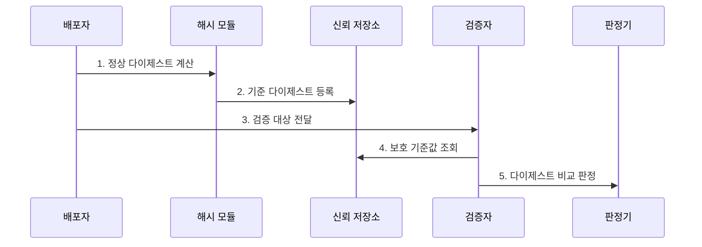

---
sidebar:
  order: 4
  label: "004. 해시 알고리즘 (Hash Algorithm)"
  badge:
    text: "미출제 · 50%"
    variant: note
title: "해시 알고리즘 (Hash Algorithm)"
date: "2026-07-30T19:00:00+09:00"
tags:
  - "notes-security"
weight: 4
extra:
  question_no: "004"
  source_status: "미출제"
  source_history: ""
  priority: 50
  priority_note: "전자서명·무결성·공급망 답안의 공통 선행개념임"
---

## 미리 알고가기

- **해시 알고리즘(Hash Algorithm)**: 길이가 다른 입력을 고정 길이 값으로 압축해 변경 탐지와 서명 입력 등에 사용하는 단방향 함수다.
- **다이제스트(Digest)**: 해시 함수가 입력 전체를 계산해 만든 고정 길이 출력값이다.
- **역상 저항성(Preimage Resistance)**: 주어진 해시값과 일치하는 원문을 찾기 어려운 성질이다.
- **제2역상 저항성(Second-preimage Resistance)**: 주어진 원문과 같은 해시값을 만드는 다른 원문을 찾기 어려운 성질이다.
- **충돌 저항성(Collision Resistance)**: 같은 해시값을 만드는 서로 다른 두 입력을 찾기 어려운 성질이다.
- **쇄도 효과(Avalanche Effect)**: 입력 한 비트만 달라져도 출력 비트가 전반적으로 달라지는 성질이다.
- **솔트(Salt)**: 같은 비밀번호도 서로 다른 저장값이 되도록 비밀번호마다 추가하는 임의값이다.
- **메시지 인증 코드(Message Authentication Code, MAC)**: 비밀키로 메시지 무결성과 송신자 정당성을 검증하는 인증값이다.
- **해시 기반 메시지 인증 코드(Hash-based Message Authentication Code, HMAC)**: 해시 함수와 비밀키를 결합해 메시지 인증 코드를 생성하는 방식이다.
- **보안 해시 알고리즘 1(Secure Hash Algorithm 1, SHA-1)**: 충돌 공격이 실용화돼 새로운 보안 설계에서는 사용하지 않는 해시 알고리즘이다.
- **보안 해시 알고리즘 2(Secure Hash Algorithm 2, SHA-2)**: SHA-256·SHA-512 등을 포함하며 서명과 무결성 검증에 사용하는 알고리즘군이다.
- **보안 해시 알고리즘 3(Secure Hash Algorithm 3, SHA-3)**: 스펀지 구조로 입력을 흡수하고 해시값을 출력하는 알고리즘군이다.
- **SHA-256·SHA-512**: 각각 256비트와 512비트 해시값을 생성하는 SHA-2 계열 알고리즘이다.
- **아르곤2아이디(Argon2id)**: 자료·주소 의존 방식을 결합해 부채널·GPU 공격에 대응하는 메모리 경화 비밀번호 해시다.
- **NIST FIPS 180-4**: SHA-1과 SHA-2 계열의 메시지 다이제스트 생성 절차를 규정한다.
- **NIST FIPS 202**: SHA-3 해시와 SHAKE 확장 출력 함수를 규정한 연방 표준이다.

## Ⅰ. 개요

- 정의/개념: 임의 길이 입력을 고정 길이 값으로 압축
- 배경/필요성: 원문 전체 비교 없이 변경 여부 판정

### 쉽게 이해하기 (학습용)

- 긴 문서에서 짧은 지문을 만들면 두 문서가 같은지 빠르게 비교할 수 있지만, 지문만 보고 원문이나 진짜 작성자를 확인할 수는 없다.

## Ⅱ. 특징

- 입력 한 비트 변화의 **출력 전반 확산**
- 공격 목표별 **역상·제2역상·충돌 저항성**
- 키 없는 해시의 **송신자 인증 불가**

### 쉽게 이해하기 (학습용)

- 공격자가 파일과 해시값을 함께 바꾸면 계산 결과가 일치하므로, 정상 해시값은 서명이나 신뢰 경로로 따로 보호해야 한다.

## Ⅲ. 구조 및 구성요소

| 구성요소 | 책임 |
|:---|:---|
| 입력 전처리 | 입력 인코딩·길이 맞춤·블록 분할 |
| 상태 변환 함수 | 메시지 블록으로 내부 상태 갱신 |
| 내부 상태 | 블록별 계산 결과를 연쇄 유지 |
| 다이제스트 출력 | 최종 상태를 고정 길이로 반환 |

### 쉽게 이해하기 (학습용)

- 입력을 작은 조각으로 나눠 이전 계산 결과에 계속 섞고, 마지막 내부 상태에서 고정 길이 지문을 꺼낸다.

## Ⅳ. 흐름도

1. **정상 다이제스트 계산**: 정규화 입력으로 기준값 생성
2. **기준 다이제스트 등록**: 신뢰 경로에 기준값 저장
3. **검증 대상 전달**: 원본과 검증 범위를 제공
4. **보호 기준값 조회**: 변조되지 않은 기준값 확보
5. **다이제스트 비교 판정**: 재계산값 일치 시에만 승인

### 쉽게 이해하기 (학습용)

- 파일 지문을 다시 계산하는 것보다 비교할 정상 지문을 공격자가 바꾸지 못하는 곳에서 가져오는 일이 무결성 판단의 출발점이다.

## Ⅴ. 종류 및 비교

| 해시 알고리즘 | SHA-2 | SHA-3 | SHA-1 |
|:---|:---|:---|:---|
| 적용 기준 | 서명·HMAC·파일 무결성 | 다른 내부 구조가 필요한 설계 | 기존 식별값 호환 검증만 |
| 핵심 특징 | **FIPS 180-4 SHA-2** | **FIPS 202 스펀지 구조** | **160비트 구형 해시** |
| 한계 | 입력 규칙 불일치 시 검증 실패 | 구현·프로토콜 지원 확인 | 충돌 공격으로 보안 적용 부적합 |

> 요약: 범용은 SHA-2, 구조 대안은 SHA-3

### 쉽게 이해하기 (학습용)

- SHA-1은 숫자가 길어 보여도 같은 지문을 가진 두 문서를 만들 수 있으므로 새 보안 설계에서 제외하고, 호환성과 구조 요구에 따라 SHA-2나 SHA-3를 쓴다.

## Ⅵ. 실무 고려사항 및 대책

| 고려사항 | 대책 | 효과 |
|:---|:---|:---|
| 기준 해시값의 동시 변조 | **서명·신뢰 저장소 보호** | 비교 기준 신뢰성 확보 |
| 입력 정규화 규칙 불일치 | **인코딩·범위 명시·시험** | 재현 가능한 검증 |
| SHA-1 충돌 위험 | **FIPS 180-4·202 전환** | 충돌 저항성 확보 |

### 쉽게 이해하기 (학습용)

- 기준값은 서명된 신뢰 경로에 보관하고 같은 입력 규칙과 승인된 SHA-2·SHA-3로 다시 계산해야 한다.

## Ⅶ. 결론

- **보호 목적·충돌 저항성·기준값 신뢰**로 해시 결정

### 쉽게 이해하기 (학습용)

- 해시값이 같다는 사실만 보지 말고, 충돌 공격에 안전한 알고리즘인지와 비교한 기준값이 신뢰 경로에서 왔는지를 함께 확인해야 한다.
