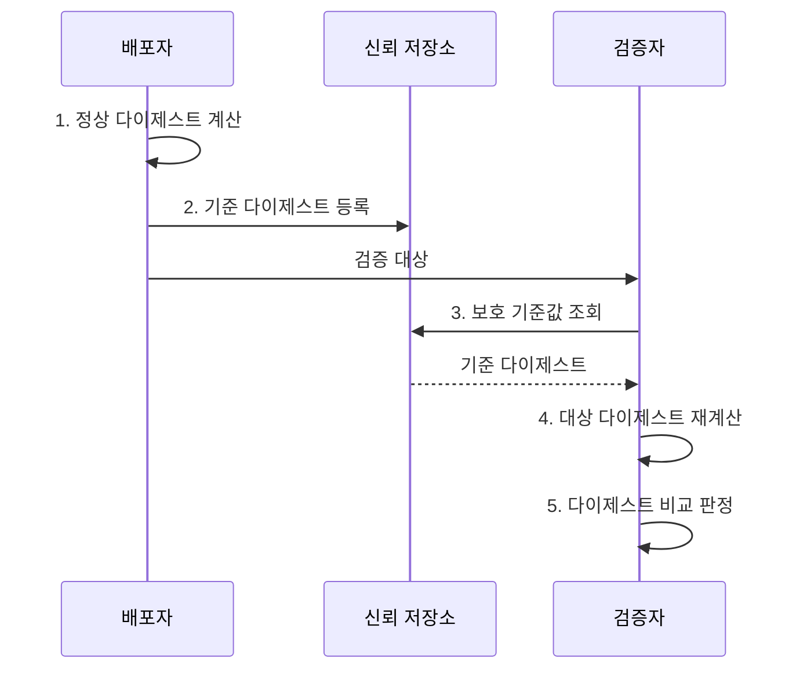

---
sidebar:
  order: 4
  label: "004. 해시 알고리즘 (Hash Algorithm)"
  badge:
    text: "미출제 · 50%"
    variant: note
title: "해시 알고리즘 (Hash Algorithm)"
date: "2026-08-02T09:46:00+09:00"
tags:
  - "notes-security"
weight: 4
extra:
  question_no: "004"
  source_status: "미출제"
  source_history: ""
  priority: 50
  priority_note: "전자서명·무결성·공급망 답안의 공통 선행개념임"
---

## Ⅰ. 개요

핵심 용어

- **해시 알고리즘**은 임의 길이 입력을 고정 길이 다이제스트로 변환하여 변경 탐지와 서명 입력에 사용하는 단방향 함수이다.
- **다이제스트**는 해시 함수가 입력 전체를 계산하여 만든 고정 길이 출력값이다.

- 정의/개념: **해시 함수**는 임의 길이 입력을 고정 길이 다이제스트로 단방향 변환하여 무결성 비교와 데이터 식별에 사용하는 함수
- 배경/필요성: 원문 전체 저장·비교는 **전송·검증 비용 증가**

#### 한줄 요약

- 긴 문서에서 짧은 지문을 만들면 두 문서가 같은지 빠르게 비교할 수 있지만, 지문만 보고 원문이나 진짜 작성자를 확인할 수는 없다.

## Ⅱ. 특징

핵심 용어

- **쇄도 효과**는 입력 한 비트만 바뀌어도 출력 비트가 전반적으로 달라지는 성질이다.
- **역상·제2역상·충돌 저항성**은 각각 해시값의 원문, 같은 해시를 갖는 다른 원문, 같은 해시를 갖는 임의의 두 입력을 찾기 어렵게 한다.

- 입력 한 비트 변화가 전체 출력에 퍼지는 **쇄도 효과**
- 공격 목표별 **역상·제2역상·충돌 저항성**
- 키 없는 해시의 **송신자 인증 불가**

#### 한줄 요약

- 공격자가 파일과 해시값을 함께 바꾸면 계산 결과가 일치하므로, 정상 해시값은 서명이나 신뢰 경로로 따로 보호해야 한다.

## Ⅲ. 구조 및 구성요소

핵심 용어

- **입력 전처리**는 메시지를 정해진 인코딩과 길이 규칙에 맞추어 블록으로 나눈다.
- **내부 상태**는 각 메시지 블록을 변환 함수로 처리한 중간 결과를 연쇄적으로 유지한다.

| 구성요소 | 책임 |
|:---|:---|
| 입력 전처리 | **입력 인코딩·길이 맞춤·블록 분할** |
| 상태 변환 함수 | 메시지 블록으로 **내부 상태 갱신** |
| 내부 상태 | **블록별 계산 결과**를 연쇄 유지 |
| 다이제스트 출력 | 최종 상태를 **고정 길이로 반환** |

#### 한줄 요약

- 입력을 작은 조각으로 나눠 이전 계산 결과에 계속 섞고, 마지막 내부 상태에서 고정 길이 지문을 꺼낸다.

## Ⅳ. 흐름도

핵심 용어

- **보호된 기준 다이제스트**는 공격자가 검증 대상과 함께 바꿀 수 없도록 서명이나 신뢰 저장소로 무결성을 보장한 비교값이다.
- **재현 가능한 해시**는 배포자와 검증자가 동일한 입력 인코딩과 범위를 사용하여 같은 다이제스트를 계산하게 한다.

**동작 원리**

1. **정상 다이제스트 계산**: 정규화 입력으로 기준값 생성
2. **기준 다이제스트 등록**: 신뢰 경로에 기준값 저장
3. **보호 기준값 조회**: 변조되지 않은 기준값 확보
4. **대상 다이제스트 재계산**: 같은 입력 규칙으로 해시 생성
5. **다이제스트 비교 판정**: 재계산값 일치 시에만 승인

#### 한줄 요약

- 파일 지문을 다시 계산하는 것보다 비교할 정상 지문을 공격자가 바꾸지 못하는 곳에서 가져오는 일이 무결성 판단의 출발점이다.

## Ⅴ. 종류 및 비교

핵심 용어

- **SHA-2**는 SHA-256·SHA-512 등을 포함하며 서명·HMAC·파일 무결성에 널리 사용하는 알고리즘군이다.
- **SHA-3**는 스펀지 구조로 입력을 흡수하고 해시값을 출력하는 알고리즘군이다.
- **SHA-1**은 실용적인 충돌 공격이 가능하므로 새로운 보안 설계에는 사용하지 않는다.

| 해시 알고리즘 | SHA-2 | SHA-3 | SHA-1 |
|:---|:---|:---|:---|
| 적용 기준 | **서명·HMAC·파일 무결성** | 다른 **내부 구조가 필요한 설계** | 기존 **식별값 호환 검증**만 |
| 핵심 특징 | **FIPS 180-4 SHA-2** | **FIPS 202 스펀지 구조** | **160비트 구형 해시** |
| 한계 | **입력 규칙 불일치 시 검증 실패** | **구현·프로토콜 지원 확인** | **충돌 공격으로 보안 적용 부적합** |

> 요약: 범용은 SHA-2, 구조 대안은 SHA-3

#### 한줄 요약

- SHA-1은 숫자가 길어 보여도 같은 지문을 가진 두 문서를 만들 수 있으므로 새 보안 설계에서 제외하고, 호환성과 구조 요구에 따라 SHA-2나 SHA-3를 쓴다.

## Ⅵ. 실무 고려사항 및 대책

핵심 용어

- **솔트**는 같은 비밀번호도 서로 다른 저장값이 되도록 비밀번호마다 추가하는 임의값이다.
- **Argon2id**는 메모리 사용 비용을 높여 GPU 전수조사와 부채널 공격에 대응하는 비밀번호 해시이다.
- **HMAC**은 해시 함수와 비밀키를 결합하여 메시지의 무결성과 송신자 정당성을 검증한다.

| 문제 | 대책 | 효과 |
|:---|:---|:---|
| 기준 해시값의 **동시 변조** | **서명·신뢰 저장소 보호** | **비교 기준 신뢰성** 확보 |
| 입력 **정규화 규칙 불일치** | **인코딩·범위 명시·시험** | **재현 가능한 검증** |
| **SHA-1 충돌 위험** | **FIPS 180-4·202 전환** | **충돌 저항성** 확보 |
| 비밀번호의 **고속 전수조사** | **솔트·Argon2id** 적용 | **메모리 경화**로 공격 비용 증가 |

#### 한줄 요약

- 기준값은 서명된 신뢰 경로에 보관하고 같은 입력 규칙과 승인된 SHA-2·SHA-3로 다시 계산해야 한다.

## Ⅶ. 결론

핵심 용어

- **용도 분리**는 일반 무결성·서명에는 SHA-2 계열을 사용하고 비밀번호 저장에는 전용 메모리 경화 함수인 Argon2id를 적용한다.

- 무결성·서명은 **SHA-2**, 비밀번호 저장은 **Argon2id** 선택

#### 한줄 요약

- 해시값이 같다는 사실만 보지 말고, 충돌 공격에 안전한 알고리즘인지와 비교한 기준값이 신뢰 경로에서 왔는지를 함께 확인해야 한다.
