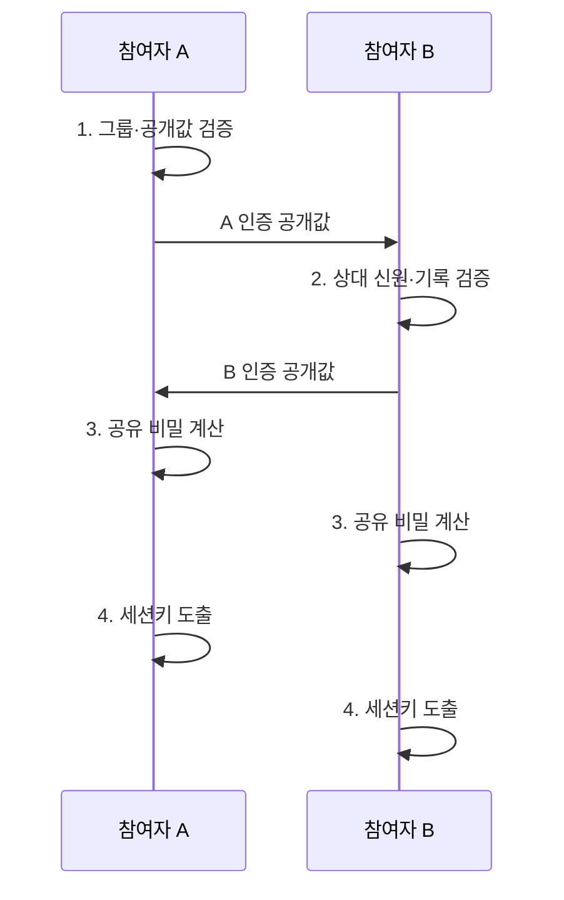

---
sidebar:
  order: 5
  label: "005. 디피-헬만 키 교환 (Diffie-Hellman Key Exchange)"
  badge:
    text: "기출 · 30%"
    variant: note
title: "디피-헬만 키 교환 (Diffie-Hellman Key Exchange)"
date: "2026-08-02T09:48:00+09:00"
tags:
  - "notes-security"
weight: 5
extra:
  question_no: "005"
  source_status: "기출"
  source_history: "128회"
  priority: 30
  priority_note: "128회 기출이나 키 교환 단독 반복 흐름은 제한적임"
---

## Ⅰ. 개요

핵심 용어

- **디피-헬만 키 교환**은 비밀값을 직접 전송하지 않고 공개값만 교환하여 양측이 같은 공유 비밀을 계산하는 키 합의 방식이다.

- 정의/개념: **Diffie-Hellman 키 교환**은 두 참여자가 개인 비밀값을 노출하지 않고 공개값을 교환하여 동일한 공유 비밀을 계산하는 키 합의 방식
- 배경/필요성: 대칭키의 **통신 경로 직접 전송 위험** 해소

#### 한줄 요약

- 두 사람이 각자 숨긴 색을 공개된 색과 섞어 중간 결과만 교환하면, 숨긴 색을 보내지 않고도 같은 최종 색을 만들 수 있다.

## Ⅱ. 특징

핵심 용어

- **공유 비밀**은 양측이 각자의 개인값과 상대 공개값으로 동일하게 계산하며 이후 세션키의 원재료가 된다.
- **순방향 비밀성**은 연결마다 임시 개인값을 사용하여 장기키 유출 뒤에도 과거 세션키를 보호한다.
- **중간자 공격**은 인증되지 않은 공개값을 공격자가 바꿔 양측과 각각 다른 비밀을 합의하는 공격이다.

- 비밀값 미전송의 **공유 비밀 합의**
- 임시 개인값의 **순방향 비밀성**
- 인증 결합의 **중간자 공격 차단**

#### 한줄 요약

- DH 계산이 맞아도 공개값의 주인을 확인하지 않으면 공격자가 양쪽과 따로 비밀을 만들어 통신을 중계할 수 있다.

## Ⅲ. 구조 및 구성요소

핵심 용어

- **도메인 매개변수**는 DH 계산에 사용할 그룹과 생성원 등 참여자가 공유하는 공개 설정이다.
- **개인값과 공개값**은 참여자가 각각 비밀로 생성하는 입력과 그 입력을 도메인 매개변수로 계산하여 상대에게 전달하는 값이다.
- **KDF**는 공유 비밀에서 용도와 통신 방향별 세션키를 생성한다.

| 구성요소 | 책임 |
|:---|:---|
| 도메인 매개변수 | 검증된 **그룹·생성원** 제공 |
| 임시 키 생성기 | 세션별 **개인값·공개값** 생성 |
| 공유 비밀 계산기 | **상대 공개값·개인값** 결합 |
| 키 유도 함수 | 공유 비밀에서 **세션키 분리** |

#### 한줄 요약

- 공통 계산 규칙에서 각자 임시 비밀과 공개값을 만들고, 상대 공개값에 자기 비밀을 섞어 같은 결과를 만든 뒤 KDF가 실제 암호키로 나눈다.

## Ⅳ. 흐름도

핵심 용어

- **공개값 검증**은 상대가 보낸 값이 선택한 안전한 그룹에 속하고 금지된 값이 아닌지 확인한다.
- **협상 기록 인증**은 교환한 공개값과 알고리즘 선택을 실제 통신 상대의 신원에 결합한다.

**동작 원리**

1. **그룹·공개값 검증**: 안전한 그룹과 값 확인
2. **상대 신원·기록 검증**: 인증서와 협상 기록 확인
3. **공유 비밀 계산**: 상대 공개값과 개인값 결합
4. **세션키 도출**: KDF로 용도·방향별 키 분리

#### 한줄 요약

- 상대 공개값이 정한 그룹에 속하는지 확인하지 않으면 공격자가 결과 후보가 적은 값으로 유도해 공유 비밀을 추측할 수 있다.

## Ⅴ. 종류 및 비교

핵심 용어

- **정적 DH**는 장기 개인값을 재사용하므로 그 값이 유출되면 과거 공유 비밀이 노출될 수 있다.
- **DHE**는 연결마다 새로운 유한체 개인값을 사용하고, **ECDHE**는 새로운 타원곡선 개인값을 사용한다.

| DH 키 교환 방식 | DH | DHE | ECDHE |
|:---|:---|:---|:---|
| 적용 기준 | 기존 **정적 DH 호환** | TLS의 **유한체 임시 합의** | 작은 키의 **임시 합의** 요구 |
| 핵심 특징 | **장기 DH 개인값 재사용** | 세션별 **유한체 개인값** | 세션별 **타원곡선 개인값** |
| 한계 | 장기키 유출 시 **과거 노출** | **큰 매개변수 처리 비용** | **곡선·공개값 검증 누락** |

> 요약: 과거 세션 보호에는 DHE·ECDHE 선택

#### 한줄 요약

- 같은 개인값을 오래 쓰면 나중에 그 값이 새었을 때 과거 통신도 풀리지만, 연결마다 새 값을 만들고 버리면 과거 세션키 복구를 제한할 수 있다.

## Ⅵ. 실무 고려사항 및 대책

핵심 용어

- **RFC 7919 FFDHE**는 TLS에서 협상할 검증된 표준 유한체 임시 DH 그룹을 규정한다.
- **RFC 7748 X25519**는 타원곡선 DH 함수와 공개값 인코딩 규칙을 규정한다.

| 문제 | 대책 | 효과 |
|:---|:---|:---|
| **임의 유한체 그룹** | **IETF RFC 7919 FFDHE** | **매개변수 공격 억제** |
| **곡선·공개값 구현 오류** | **IRTF RFC 7748 X25519** | **상호운용성** 확보 |
| **중간자 공격** | **인증서·협상 기록 서명** | **상대 신원 보장** |

#### 한줄 요약

- TLS 인증서는 DH 계산을 대신하지 않고 임시 공개값이 실제 서버가 보낸 것인지 확인하며, ECDHE가 양쪽의 세션키 원재료를 만든다.

## Ⅶ. 결론

핵심 용어

- **인증된 임시 키 합의**는 세션별 개인값으로 순방향 비밀성을 확보하고 인증서로 공개값의 실제 소유자를 확인한다.

- 유한체 호환은 **DHE**, 작은 키의 순방향 비밀성은 **ECDHE** 선택

#### 한줄 요약

- 비밀값을 보내지 않는 수학만으로는 상대가 누구인지 알 수 없으므로, 임시값과 공개값 검증에 신원 인증을 결합해야 안전한 키 교환이 된다.
