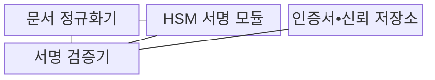
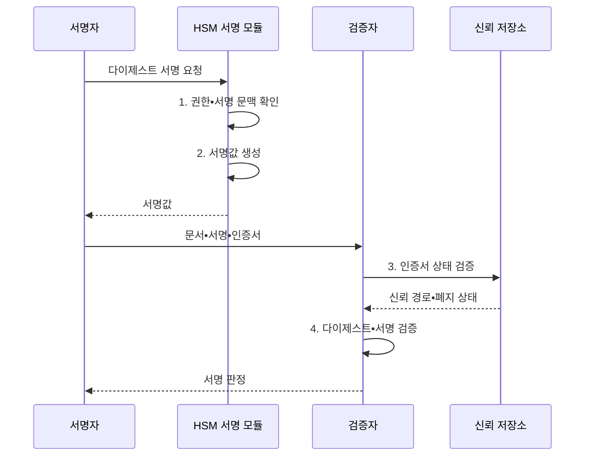

---
sidebar:
  order: 6
  label: "006. 전자 서명 (Digital Signature)"
  badge:
    text: "미출제 • 50%"
    variant: note
title: "전자 서명 (Digital Signature)"
date: "2026-08-03T08:48:47+09:00"
tags:
  - "notes-security"
weight: 6
extra:
  question_no: "006"
  source_status: "미출제"
  source_history: ""
  priority: 50
  priority_note: "PKI와 PQC 서명 전환을 잇는 독립 기반 주제임"
---

## Ⅰ. 개요

핵심 용어

- **전자서명** 은 개인키로 서명값을 만들고 공개키로 메시지 무결성과 서명 주체를 검증하는 기술이다.

- 정의/개념: **전자서명** 은 서명자가 개인키로 메시지 다이제스트에 서명하고 검증자가 공개키로 서명 주체와 메시지 무결성을 확인하는 암호 기술
- 배경/필요성: 무서명 전자문서는 **승인 주체•변경 여부 확인 불가**

#### 한줄 요약
- 전자 인감은 누구나 공개키로 모양을 확인할 수 있지만, 인증서가 공개키의 주인을 증명해야 누가 찍은 인감인지 알 수 있다.

## Ⅱ. 특징

핵심 용어

- **서명 생성과 검증** 은 각각 문서 다이제스트를 개인키로 처리하고 공개키로 서명값과 다이제스트의 관계를 확인한다.
- **무결성•인증** 은 서명 뒤 문서가 바뀌지 않았는지와 검증된 공개키의 소유자가 서명했는지를 확인하는 성질이다.
- **부인방지** 는 신원•키 통제•시각 증거를 결합하여 서명자가 서명 사실을 사후에 부정하기 어렵게 한다.
- **정규화** 는 같은 의미의 문서가 항상 같은 바이트열이 되도록 인코딩•필드 순서•공백 규칙을 고정한다.

- **개인키 보유자 생성•공개키 검증** 의 비대칭성
- **무결성•인증•부인방지** 제공과 원문 기밀성 미제공
- **문서 정규화** 차이에 따른 동일 원문 검증 실패

#### 한줄 요약

- 서명은 봉투를 봉인해 내용 변경과 도장을 확인하는 기능이지 내용을 숨기는 기능은 아니므로, 비밀 문서는 별도로 암호화해야 한다.

## Ⅲ. 구조 및 구성요소

핵심 용어

- **HSM 서명 모듈** 은 개인키를 외부로 노출하지 않고 승인된 문서 다이제스트의 서명값을 생성한다.
- **공개키 인증서** 는 공개키•소유자•용도•유효기간을 인증기관의 서명으로 연결한다.
- **문서 정규화기•서명 검증기** 는 문서를 동일한 바이트열로 확정하고 그 해시와 서명값 및 신뢰 경로를 판정한다.

| 구성요소 | 책임 |
|:---|:---|
| 문서 정규화기 | **문서 바이트열•서명 문맥** 확정 |
| HSM 서명 모듈 | 개인키 반출 없이 **서명값 생성** |
| 인증서•신뢰 저장소 | **공개키 주체•유효 상태** 제공 |
| 서명 검증기 | **서명•다이제스트•신뢰 경로** 판정 |

#### 한줄 요약

- 화면에 같은 문서라도 공백이나 필드 순서로 바이트가 달라질 수 있으므로, 서명자와 검증자가 같은 정규화 규칙을 써야 한다.

## Ⅳ. 흐름도

핵심 용어

- **서명 문맥** 은 서명 대상과 용도를 서명값에 결합하여 같은 서명이 다른 업무에 재사용되는 것을 막는다.
- **인증서 폐지 검증** 은 유효기간 전이라도 개인키 유출 등으로 인증서의 신뢰가 중단되었는지 확인한다.

**동작 원리**

1. **권한•서명 문맥 확인**: 승인 주체와 대상•용도 대조
2. **서명값 생성**: HSM 내부 개인키로 다이제스트 서명
3. **인증서 상태 검증**: 신뢰 경로•유효기간•폐지 확인
4. **다이제스트•서명 검증**: 정규 문서 해시와 서명값 판정

#### 한줄 요약

- 서명 수학이 맞아도 인증서가 폐지된 뒤인지 알 수 없으면 과거 효력을 판단하기 어려우므로, 당시의 시각과 인증서 상태 증거를 함께 보관한다.

## Ⅴ. 종류 및 비교

핵심 용어

- **RSA-PSS** 는 RSA에 무작위 솔트와 확률적 패딩을 적용한 전자서명 방식이다.
- **ECDSA** 는 타원곡선 암호를 기반으로 작은 키에서 높은 보안 강도를 제공한다.
- **ML-DSA** 는 모듈 격자 문제를 기반으로 양자 공격에 대응하는 전자서명 방식이다.

| 전자서명 방식 | RSA-PSS | ECDSA | ML-DSA |
|:---|:---|:---|:---|
| 적용 기준 | 기존 **RSA 인증서•코드 서명** | 작은 키가 필요한 **인증서** | **양자 대응 신규 서명 체계** |
| 핵심 특징 | **RSA 확률적 서명** | 작은 키의 **타원곡선 서명** | **격자 기반 양자내성 서명** |
| 한계 | **큰 키•서명 연산 비용** | **논스 오류 시 개인키 노출** | **큰 서명•인증서 크기** |

> 요약: 호환성•키 크기•양자 대응으로 선택

#### 한줄 요약

- 기존 장비 호환은 RSA-PSS, 작은 키는 ECDSA, 양자 대응은 ML-DSA가 유리하지만 서명과 인증서 크기를 시스템이 처리할 수 있어야 한다.

## Ⅵ. 실무 고려사항 및 대책

핵심 용어

- **FIPS 186-5** 는 RSA•ECDSA•EdDSA의 서명 생성과 검증을 규정한다.
- **FIPS 204** 는 양자 내성 모듈 격자 전자서명인 ML-DSA를 규정한다.
- **타임스탬프** 는 특정 전자 데이터가 해당 시각에 존재했음을 신뢰기관의 서명으로 증명한다.
- **HSM•승인 산출물 통제** 는 개인키를 장치에 격리하고 검증된 결과물에만 서명 권한을 허용하는 대책이다.

| 문제 | 대책 | 효과 |
|:---|:---|:---|
| **기존 전자서명** | **NIST FIPS 186-5 준수** | **검증 알고리즘 일관화** |
| **양자내성 전환** | **NIST FIPS 204 ML-DSA** | **양자 공격 대비** |
| **서명키 유출** | **HSM•승인 산출물 통제** | **위조 서명 차단** |
| 장기 증거의 **시각 부재** | **타임스탬프•폐지 증거** 보존 | **부인방지** 강화 |

#### 한줄 요약

- 코드 서명 키가 안전해도 변조된 빌드 결과에 서명하면 공격 코드가 정품처럼 보이므로, 승인된 산출물만 HSM 서명 권한을 받게 한다.

## Ⅶ. 결론

핵심 용어

- **장기 서명 증거** 는 서명값뿐 아니라 당시 인증서 상태와 신뢰할 수 있는 시각 정보를 함께 보존해야 한다.
- **FIPS 186-5 서명•ML-DSA 선택** 은 기존 서명 호환성에는 전자를, 양자 공격 대비에는 후자를 적용하는 판단이다.

- 기존 호환은 **FIPS 186-5 서명**, 양자 대응은 **ML-DSA** 선택

#### 한줄 요약

- 수학식이 맞는지만 보면 누가 언제 서명했는지 알 수 없으므로, 인증서•키 사용 권한•시각 증거까지 이어져야 서명의 의미가 완성된다.
