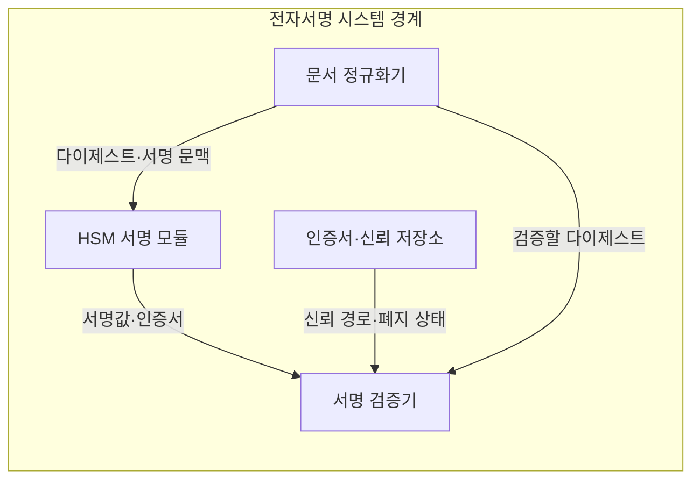
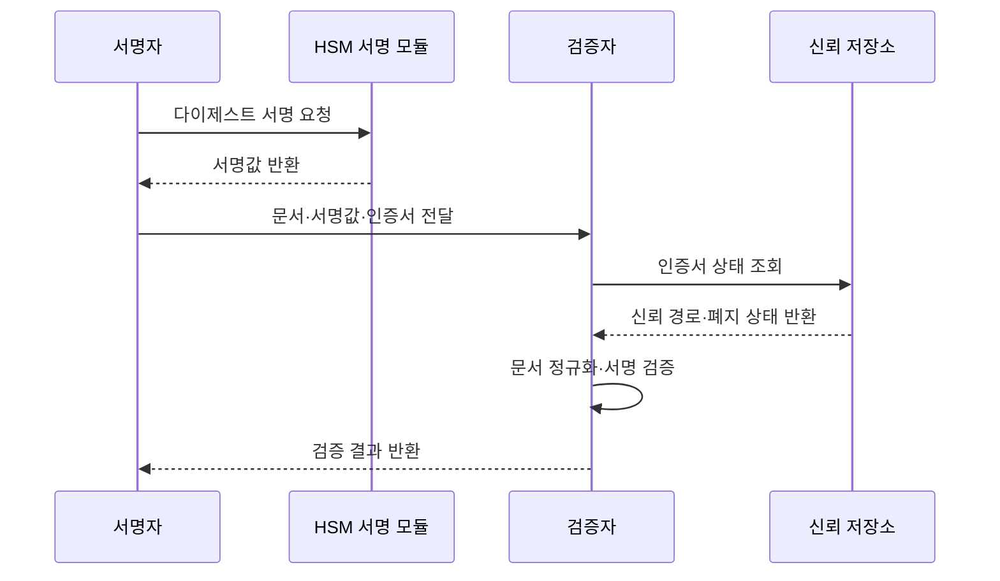

---
sidebar:
  order: 6
  label: "006. 전자 서명 (Digital Signature)"
  badge:
    text: "미출제 · 50%"
    variant: note
title: "전자 서명 (Digital Signature)"
date: "2026-07-25T01:05:00+09:00"
tags:
  - "notes-security"
weight: 6
extra:
  question_no: "006"
  source_status: "미출제"
  source_history: ""
  priority: 50
  priority_note: "PKI와 PQC 서명 전환을 잇는 독립 기반 주제임"
---

## 미리 알고가기

- **전자서명(Digital Signature)**: 개인키로 메시지의 서명값을 만들고 공개키로 무결성과 서명 주체를 검증하는 기술
- **서명 생성(Signing)**: 문서 다이제스트와 서명 문맥을 개인키로 처리해 서명값을 만드는 절차
- **서명 검증(Signature Verification)**: 공개키로 서명값과 문서 다이제스트의 관계가 유효한지 확인하는 절차
- **해시(Hash)**: 길이가 다른 입력을 고정 길이 다이제스트로 압축하는 단방향 함수
- **정규화(Canonicalization)**: 같은 의미의 문서가 항상 같은 바이트열이 되도록 인코딩·필드 순서·공백 규칙을 고정하는 과정
- **공개키 인증서(Public Key Certificate)**: 공개키·소유자·용도·유효기간을 인증기관의 서명으로 연결한 전자 문서
- **하드웨어 보안 모듈(Hardware Security Module, HSM)**: 개인키를 외부로 노출하지 않고 내부에서 전자서명을 수행하는 전용 보안 장치
- **인증서 폐지(Certificate Revocation)**: 유효기간 전이라도 개인키 유출 등으로 인증서를 더 이상 신뢰하지 않도록 무효화하는 조치
- **타임스탬프(Time Stamp)**: 특정 전자 데이터가 해당 시각에 존재했음을 신뢰기관의 서명으로 증명하는 값
- **부인방지(Non-repudiation)**: 신원·키 통제·시각 증거를 결합해 서명자가 자신의 서명 사실을 사후 부정하기 어렵게 하는 성질
- **RSA 확률적 서명 방식(Rivest-Shamir-Adleman Probabilistic Signature Scheme, RSA-PSS)**: RSA에 무작위 솔트와 확률적 패딩을 적용하여 서명 안전성을 높인 방식
- **타원곡선 전자서명 알고리즘(Elliptic Curve Digital Signature Algorithm, ECDSA)**: 타원곡선 암호를 기반으로 작은 키에서도 높은 보안 강도를 제공하는 전자서명 알고리즘
- **모듈 격자 전자서명 알고리즘(Module-Lattice-Based Digital Signature Algorithm, ML-DSA)**: 모듈 격자 문제를 기반으로 양자 공격에 대응하는 전자서명 알고리즘

## Ⅰ. 개요

- 정의/개념: 개인키로 서명하고 공개키로 주체·무결성 검증
- **배경/필요성**: 비대면 문서의 승인 주체·변경 여부 확인

### 쉽게 이해하기 (학습용)
- 전자 인감은 누구나 공개키로 모양을 확인할 수 있지만, 인증서가 공개키의 주인을 증명해야 누가 찍은 인감인지 알 수 있다.

## Ⅱ. 특징

- 개인키 보유자만 생성하고 누구나 검증한다
- 서명은 원문 기밀성을 제공하지 않는다
- 정규화 차이는 같은 문서도 검증에 실패시킨다

### 쉽게 이해하기 (학습용)

- 서명은 봉투를 봉인해 내용 변경과 도장을 확인하는 기능이지 내용을 숨기는 기능은 아니므로, 비밀 문서는 별도로 암호화해야 한다.

## Ⅲ. 아키텍처 및 구성요소

| 설계 요소 | 설명 |
|:---|:---|
| 문서 정규화기 | 문서 바이트열과 서명 문맥 확정 |
| HSM 서명 모듈 | 개인키 반출 없이 서명값 생성 |
| 인증서·신뢰 저장소 | 공개키 주체·유효 상태 제공 |
| 서명 검증기 | 서명·다이제스트·신뢰 경로 판정 |

> 요약: 정규 문서 서명과 인증 공개키 검증

### 쉽게 이해하기 (학습용)

- 화면에 같은 문서라도 공백이나 필드 순서로 바이트가 달라질 수 있으므로, 서명자와 검증자가 같은 정규화 규칙을 써야 한다.

## Ⅳ. 원리 및 절차 흐름도

| 절차 | 설명 |
|:---|:---|
| 다이제스트 서명 요청 | 정규 문서 해시와 문맥 전달 |
| 서명값 반환 | 권한 확인 후 HSM 내부 서명 |
| 문서·서명값·인증서 전달 | 검증 입력과 공개키 증거 제공 |
| 인증서 상태 조회 | 신뢰 경로·유효기간·폐지 확인 |
| 신뢰 경로·폐지 상태 반환 | 공개키 신뢰 여부 제공 |
| 문서 정규화·서명 검증 | 재계산 해시와 서명 관계 판정 |
| 검증 결과 반환 | 성공 또는 거부 결과 전달 |

> 요약: 서명값과 인증서 신뢰를 함께 검증

### 쉽게 이해하기 (학습용)

- 서명 수학이 맞아도 인증서가 폐지된 뒤인지 알 수 없으면 과거 효력을 판단하기 어려우므로, 당시의 시각과 인증서 상태 증거를 함께 보관한다.

## Ⅴ. 종류 및 비교

| 판단 기준 | RSA-PSS | ECDSA | ML-DSA |
|:---|:---|:---|:---|
| 핵심 특징 | RSA 기반 확률적 서명 | 작은 키의 타원곡선 서명 | 격자 기반 양자 대응 서명 |
| 적용 기준 | 기존 RSA 인증서·코드 서명 | 작은 키가 필요한 인증서 | 양자 대응 신규 서명 체계 |
| 주요 위험 | 큰 키·서명 연산 비용 | 논스 오류 시 개인키 노출 | 큰 서명·인증서 크기 |

> 요약: 호환성·키 크기·양자 대응으로 선택

### 쉽게 이해하기 (학습용)

- 기존 장비 호환은 RSA-PSS, 작은 키는 ECDSA, 양자 대응은 ML-DSA가 유리하지만 서명과 인증서 크기를 시스템이 처리할 수 있어야 한다.

## Ⅵ. 실무 사례

1. 배포 코드는 격리된 키로 산출물 서명

### 쉽게 이해하기 (학습용)

- 코드 서명 키가 안전해도 변조된 빌드 결과에 서명하면 공격 코드가 정품처럼 보이므로, 승인된 산출물만 HSM 서명 권한을 받게 한다.

## Ⅶ. 결론

- 전자문서의 무결성과 서명자 인증을 보장하기 위해 문서 정규화·개인키 격리·인증서·시각 증거를 검토하여, 검증 가능한 전자서명 체계를 설계해야 한다.

### 쉽게 이해하기 (학습용)

- 수학식이 맞는지만 보면 누가 언제 서명했는지 알 수 없으므로, 인증서·키 사용 권한·시각 증거까지 이어져야 서명의 의미가 완성된다.
