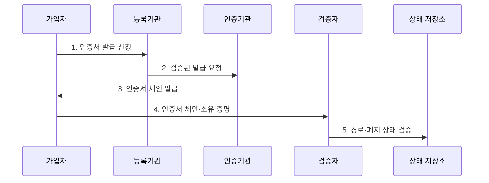

---
sidebar:
  order: 7
  label: "007. PKI 공개키 기반구조 (Public Key Infrastructure)"
  badge:
    text: "기출 · 70%"
    variant: note
title: "PKI 공개키 기반구조 (Public Key Infrastructure)"
date: "2026-07-27T23:59:59+09:00"
tags:
  - "notes-security"
weight: 7
extra:
  question_no: "007"
  source_status: "기출"
  source_history: "120회, 138회"
  priority: 70
  priority_note: "120·138회 반복으로 인증 신뢰체인 답안 가치가 큼"
---

## 미리 알고가기

- **공개키 기반구조(Public Key Infrastructure, PKI)**: 인증서의 발급·검증·폐지를 통해 공개키와 소유자의 신원을 연결하는 신뢰 체계다.
- **공개키 인증서(Public Key Certificate)**: 공개키·소유자·용도·유효기간을 인증기관의 서명으로 묶은 전자 문서다.
- **인증기관(Certificate Authority, CA)**: 신청자의 신원과 공개키를 검증하여 인증서에 서명하고 상태를 관리하는 신뢰기관이다.
- **루트 인증기관(Root CA)**: 검증자가 미리 신뢰하는 최상위 인증기관으로 하위 인증기관의 인증서에 서명하는 기관이다.
- **중간 인증기관(Intermediate CA)**: 루트 인증기관에서 제한된 권한을 위임받아 하위 인증기관이나 가입자 인증서에 서명하는 기관이다.
- **등록기관(Registration Authority, RA)**: 인증서 발급 전에 신청자의 신원과 공개키 통제권을 확인하는 기관이다.
- **가입자(Subscriber)**: 자신의 공개키와 신원을 연결한 인증서를 발급받아 사용하는 주체다.
- **검증자(Relying Party)**: 인증서의 서명·경로·이름·용도·기간·폐지 상태를 확인하고 공개키 신뢰 여부를 결정하는 주체다.
- **신뢰 기준점(Trust Anchor)**: 검증자가 신뢰 저장소에 미리 등록해 인증서 경로 검증의 출발점으로 삼는 루트 인증서다.
- **인증서 체인(Certificate Chain)**: 가입자 인증서부터 중간·루트 인증기관까지 서명 관계로 이어진 인증서 목록이다.
- **인증서 폐지 목록(Certificate Revocation List, CRL)**: 인증기관이 폐지된 인증서의 식별자와 사유를 서명하여 주기적으로 배포하는 목록이다.
- **온라인 인증서 상태 프로토콜(Online Certificate Status Protocol, OCSP)**: 특정 인증서의 유효·폐지 상태를 온라인으로 조회하는 프로토콜이다.
- **하드웨어 보안 모듈(Hardware Security Module, HSM)**: 인증기관의 개인키를 외부로 노출하지 않고 내부에서 서명을 수행하는 전용 보안 장치다.
- **상호 전송 계층 보안(Mutual Transport Layer Security, mTLS)**: 서버와 클라이언트가 인증서를 교환하여 서로의 신원을 검증하는 TLS 인증 방식이다.
- **IETF RFC 5280**: 인터넷 X.509 인증서·CRL과 경로 검증을 규정한 PKI 표준이다.
- **IETF RFC 6960**: 인증서의 현재 상태를 온라인으로 확인하는 OCSP 표준이다.

## Ⅰ. 개요

- 정의/개념: 공개키·주체를 **인증서로 연결·운영하는 신뢰 체계**
- **배경/필요성**: 임의 공개키의 **소유자·용도 검증 한계** 해소

### 쉽게 이해하기 (학습용)

- 누구나 열쇠를 만들 수 있으므로 신뢰기관이 열쇠 주인의 신분과 용도를 확인해 서명한 신분증을 발급하고, 검증자는 그 서명 경로를 따라간다.

## Ⅱ. 특징

- 루트 CA는 중간 CA에 발급 권한을 위임한다
- 신뢰 기준점부터 가입자까지 체인을 검증한다
- 유효기간 중에도 폐지 상태를 별도 확인한다

### 쉽게 이해하기 (학습용)

- 인증서가 스스로 믿을 만하다고 주장하는 것은 의미가 없으며, 검증자가 미리 신뢰한 루트 인증서까지 서명이 이어져야 공개키를 믿을 수 있다.

## Ⅲ. 구조 및 구성요소

| 설계 요소 | 설명 |
|:---|:---|
| 오프라인 루트 CA | 최상위 키를 격리하고 권한 위임 |
| 중간·발급 CA | 제한된 정책으로 인증서 서명 |
| 등록기관 | 신청자 신원·키 통제권 확인 |
| 인증서·상태 저장소 | 체인·CRL·OCSP 배포 |
| 가입자·검증자 | 인증서 사용·신뢰 여부 판정 |

> 요약: 루트 위임부터 가입자 검증까지 신뢰 연결

### 쉽게 이해하기 (학습용)

- 가장 중요한 루트 열쇠는 오프라인에 두고 중간 기관에 제한된 발급 권한만 맡기면, 일상 발급 중 사고가 나도 최상위 신뢰 전체를 바로 교체하지 않아도 된다.

## Ⅳ. 흐름도

| 절차 | 설명 |
|:---|:---|
| 인증서 발급 신청 | 공개키와 신원 증명 제출 |
| 검증된 발급 요청 | 신원·키 통제권 확인 결과 전달 |
| 인증서 체인 발급 | CA 서명으로 공개키·주체 연결 |
| 인증서 체인·소유 증명 | 인증서와 개인키 보유 증명 제시 |
| 경로·폐지 상태 검증 | 이름·용도·기간·폐지 판정 |

> 요약: 발급 신원과 사용 시점 상태를 모두 검증

### 쉽게 이해하기 (학습용)

- 신분증의 만료일이 남아도 분실 신고가 되면 쓸 수 없듯, 인증서도 기간뿐 아니라 키 유출이나 오발급에 따른 폐지 상태를 확인해야 한다.

## Ⅴ. 종류 및 비교

| PKI 운영 범위 | 공개 웹 PKI | 사설 조직 PKI |
|:---|:---|:---|
| 적용 기준 | 불특정 사용자의 공개 서비스 | 관리 가능한 내부 장비·사용자 |
| 핵심 특징 | **공개 신뢰 저장소 CA** | **조직 루트 CA·정책 운영** |
| 한계 | 오발급 영향의 공개 확산 | 루트 누락 시 내부 연결 실패 |

> 요약: 검증자 범위로 공개·사설 신뢰 선택

### 쉽게 이해하기 (학습용)

- 공개 서비스는 이미 널리 배포된 루트를 사용하고, 사설 조직은 관리하는 장비에 자체 루트를 직접 배포하므로 누가 검증자인지가 선택을 가른다.

## Ⅵ. 실무 고려사항 및 대책

| 고려사항 | 대책 | 효과 |
|:---|:---|:---|
| 인증서 경로 | **IETF RFC 5280 검증** | 공개키 주체·용도 보장 |
| 실시간 폐지 | **IETF RFC 6960 OCSP** | 유출 인증서 차단 |
| CA 개인키 | **오프라인 루트·HSM** | 신뢰점 침해 억제 |

### 쉽게 이해하기 (학습용)

- 내부 서비스는 사설 PKI가 서버와 클라이언트에 각각 인증서를 발급하고, mTLS에서 양쪽 체인과 폐지 상태를 검증한다.

## Ⅶ. 결론

- **검증자 범위·신뢰점·폐지성**으로 PKI 체계를 결정한다.

### 쉽게 이해하기 (학습용)

- 인증서 한 장만 보는 것이 아니라 누가 어떤 절차로 발급했고 검증자가 어느 루트를 믿으며 사고 난 인증서를 어떻게 폐지하는지까지 이어져야 한다.
