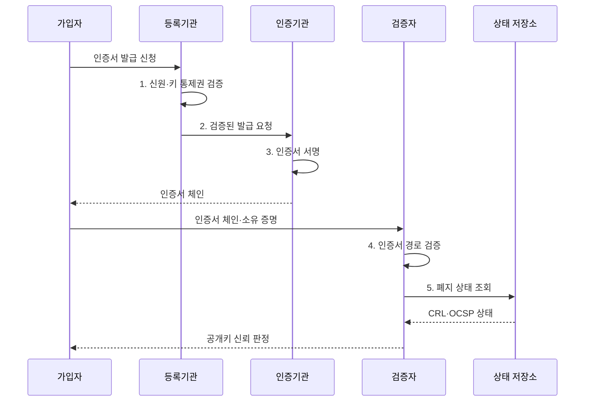

---
sidebar:
  order: 7
  label: "007. PKI 공개키 기반구조 (Public Key Infrastructure)"
  badge:
    text: "기출 · 70%"
    variant: note
title: "PKI 공개키 기반구조 (Public Key Infrastructure)"
date: "2026-08-02T09:52:00+09:00"
tags:
  - "notes-security"
weight: 7
extra:
  question_no: "007"
  source_status: "기출"
  source_history: "120회, 138회"
  priority: 70
  priority_note: "120·138회 반복으로 인증 신뢰체인 답안 가치가 큼"
---

## Ⅰ. 개요

핵심 용어

- **PKI**는 인증서의 발급·검증·폐지를 통해 공개키와 소유자의 신원을 연결하는 신뢰 체계이다.

- 정의/개념: **PKI**는 공개키와 소유 주체·용도·유효기간을 인증서로 연결하고 발급·검증·폐지 수명주기를 운영하는 신뢰 체계
- 배경/필요성: 임의 공개키의 **소유자·용도 검증 한계** 해소

#### 한줄 요약

- 누구나 열쇠를 만들 수 있으므로 신뢰기관이 열쇠 주인의 신분과 용도를 확인해 서명한 신분증을 발급하고, 검증자는 그 서명 경로를 따라간다.

## Ⅱ. 특징

핵심 용어

- **신뢰 기준점**은 검증자가 신뢰 저장소에 미리 등록하여 인증서 경로 검증의 출발점으로 삼는 루트 인증서이다.
- **인증서 체인**은 가입자 인증서부터 중간 CA와 루트 CA까지 서명 관계로 이어진 인증서 목록이다.
- **CRL과 OCSP**는 각각 폐지된 인증서 목록을 배포하고 특정 인증서의 현재 상태를 온라인으로 조회하게 한다.

- **루트 CA·중간 CA** 계층에 따른 발급 권한 위임
- **신뢰 기준점부터 가입자까지** 인증서 체인 검증
- 유효기간과 별개인 **CRL·OCSP 폐지 상태** 확인

#### 한줄 요약

- 인증서가 스스로 믿을 만하다고 주장하는 것은 의미가 없으며, 검증자가 미리 신뢰한 루트 인증서까지 서명이 이어져야 공개키를 믿을 수 있다.

## Ⅲ. 구조 및 구성요소

핵심 용어

- **루트 CA**는 검증자가 미리 신뢰하는 최상위 기관이고, **중간 CA**는 루트에서 제한된 발급 권한을 위임받는다.
- **등록기관**은 인증서 발급 전에 신청자의 신원과 공개키 통제권을 확인한다.
- **검증자**는 인증서의 서명·경로·이름·용도·기간·폐지 상태를 확인하여 공개키 신뢰 여부를 결정한다.

| 구성요소 | 책임 |
|:---|:---|
| 오프라인 루트 CA | **최상위 키 격리·권한 위임** |
| 중간·발급 CA | 제한된 정책으로 **인증서 서명** |
| 등록기관 | 신청자 **신원·키 통제권** 확인 |
| 인증서·상태 저장소 | **인증서 체인·CRL·OCSP** 배포 |
| 가입자·검증자 | 인증서 사용과 **신뢰 여부 판정** |

#### 한줄 요약

- 가장 중요한 루트 열쇠는 오프라인에 두고 중간 기관에 제한된 발급 권한만 맡기면, 일상 발급 중 사고가 나도 최상위 신뢰 전체를 바로 교체하지 않아도 된다.

## Ⅳ. 흐름도

핵심 용어

- **키 통제권 검증**은 인증서 신청자가 해당 공개키와 짝을 이루는 개인키를 실제로 보유하는지 확인한다.
- **경로 검증**은 가입자 인증서에서 신뢰 기준점까지 서명과 제약 조건이 유효하게 이어지는지 판정한다.

**동작 원리**

1. **신원·키 통제권 검증**: 신청자와 공개키 소유 관계 확인
2. **검증된 발급 요청**: 신원·키 통제권 확인 결과 전달
3. **인증서 서명**: CA 서명으로 공개키·주체 연결
4. **인증서 경로 검증**: 이름·용도·기간·신뢰 기준점 판정
5. **폐지 상태 조회**: CRL·OCSP로 현재 유효성 확인

#### 한줄 요약

- 신분증의 만료일이 남아도 분실 신고가 되면 쓸 수 없듯, 인증서도 기간뿐 아니라 키 유출이나 오발급에 따른 폐지 상태를 확인해야 한다.

## Ⅴ. 종류 및 비교

핵심 용어

- **공개 웹 PKI**는 널리 배포된 공개 신뢰 저장소의 CA를 사용하여 불특정 사용자가 서비스를 검증하게 한다.
- **사설 조직 PKI**는 조직이 관리하는 장비와 사용자에게 자체 루트 CA를 배포하여 내부 신뢰를 운영한다.

| PKI 운영 범위 | 공개 웹 PKI | 사설 조직 PKI |
|:---|:---|:---|
| 적용 기준 | 불특정 사용자의 **공개 서비스** | 관리 가능한 **내부 장비·사용자** |
| 핵심 특징 | **공개 신뢰 저장소 CA** | **조직 루트 CA·정책 운영** |
| 한계 | **오발급 영향의 공개 확산** | **루트 누락 시 내부 연결 실패** |

> 요약: 검증자 범위로 공개·사설 신뢰 선택

#### 한줄 요약

- 공개 서비스는 이미 널리 배포된 루트를 사용하고, 사설 조직은 관리하는 장비에 자체 루트를 직접 배포하므로 누가 검증자인지가 선택을 가른다.

## Ⅵ. 실무 고려사항 및 대책

핵심 용어

- **HSM**은 CA 개인키를 외부로 노출하지 않고 내부에서 인증서 서명을 수행한다.
- **mTLS**는 서버와 클라이언트가 인증서를 서로 교환하고 양쪽 신원을 검증하는 TLS 인증 방식이다.
- **RFC 5280**은 인터넷 X.509 인증서·CRL과 경로 검증 절차를 규정한다.

| 문제 | 대책 | 효과 |
|:---|:---|:---|
| **인증서 경로 오류** | **IETF RFC 5280 검증** | **공개키 주체·용도** 보장 |
| **실시간 폐지 필요** | **IETF RFC 6960 OCSP** | **유출 인증서 차단** |
| **CA 개인키 유출** | **오프라인 루트·HSM** | **신뢰점 침해 억제** |
| 내부 상호 인증의 **신원 위조** | **사설 PKI·mTLS** 적용 | **양방향 신원 검증** |

#### 한줄 요약

- 내부 서비스는 사설 PKI가 서버와 클라이언트에 각각 인증서를 발급하고, mTLS에서 양쪽 체인과 폐지 상태를 검증한다.

## Ⅶ. 결론

핵심 용어

- **검증자 범위**는 불특정 외부 사용자를 위한 공개 PKI와 관리 가능한 내부 주체를 위한 사설 PKI의 선택 기준이다.

- 불특정 검증자는 **공개 PKI**, 관리 단말은 **사설 PKI** 선택

#### 한줄 요약

- 인증서 한 장만 보는 것이 아니라 누가 어떤 절차로 발급했고 검증자가 어느 루트를 믿으며 사고 난 인증서를 어떻게 폐지하는지까지 이어져야 한다.
