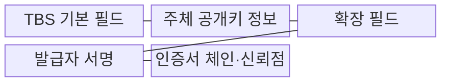
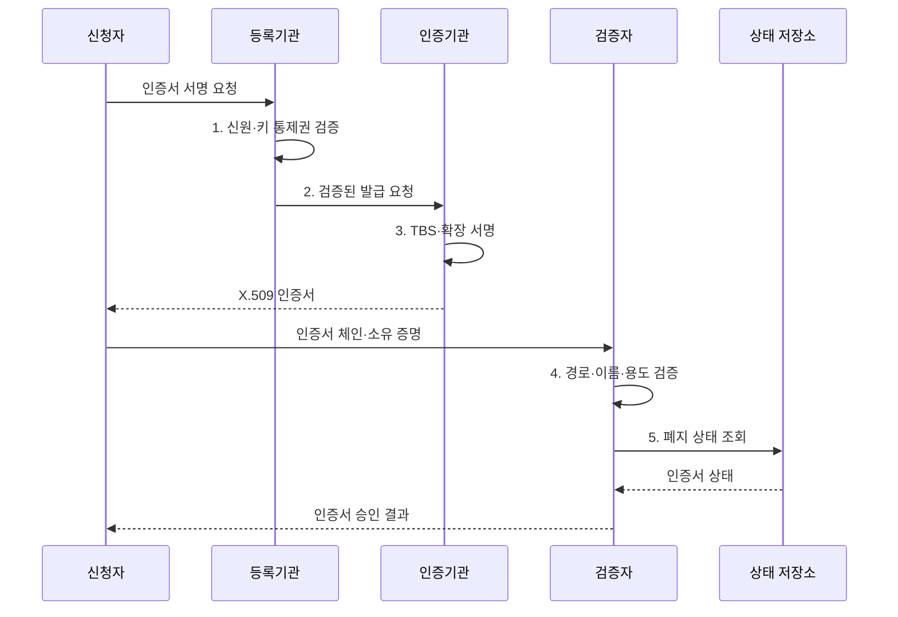

---
sidebar:
  order: 8
  label: "008. X.509 인증서 (X.509 Certificate)"
  badge:
    text: "기출 · 70%"
    variant: note
title: "X.509 인증서 (X.509 Certificate)"
date: "2026-07-31T02:49:00+09:00"
tags:
  - "notes-security"
weight: 8
extra:
  question_no: "008"
  source_status: "기출"
  source_history: "120회, 138회"
  priority: 70
  priority_note: "120·138회 반복이며 인증서 검증 설계로 확장 가능함"
---

## 미리 알고가기

- **X.509 인증서(X.509 Certificate)**: 공개키·소유자·용도·유효기간을 인증기관의 전자서명으로 연결하는 표준 인증서다.
- **인증기관(Certificate Authority, CA)**: 신청자의 신원과 공개키 통제권을 확인하여 인증서에 서명하는 신뢰기관이다.
- **주체(Subject)**: 인증서가 공개키와 연결하는 서버·사용자·장비 등의 소유자다.
- **발급자(Issuer)**: 인증서에 서명한 인증기관이다.
- **일련번호(Serial Number)**: 발급자가 인증서를 고유하게 식별하기 위해 부여하는 번호다.
- **서명 대상 인증서(To-Be-Signed Certificate, TBS Certificate)**: 주체·공개키·유효기간·확장 정보를 담아 발급자 서명의 입력이 되는 인증서 본문이다.
- **주체 공개키 정보(Subject Public Key Info, SPKI)**: 공개키 알고리즘과 주체의 공개키를 담는 인증서 필드다.
- **주체 대체 이름(Subject Alternative Name, SAN)**: 인증서가 유효한 도메인·IP 등 주체의 대체 식별자를 나열하는 확장 필드다.
- **키 용도(Key Usage, KU)**: 전자서명·키 설정 등 인증서 공개키에 허용된 연산을 지정하는 확장 필드다.
- **확장 키 용도(Extended Key Usage, EKU)**: 서버 인증·클라이언트 인증·코드 서명 등 인증서의 구체적 용도를 제한하는 확장 필드다.
- **인증서 서명 요청(Certificate Signing Request, CSR)**: 공개키·주체 정보와 개인키 보유 증명을 담아 인증기관에 제출하는 발급 요청이다.
- **인증서 체인(Certificate Chain)**: 주체 인증서부터 중간·루트 인증기관까지 서명 관계로 이어진 인증서 목록이다.
- **신뢰 기준점(Trust Anchor)**: 검증자가 미리 신뢰 저장소에 등록해 인증서 경로 검증의 출발점으로 삼는 루트 인증서다.
- **인증서 폐지(Certificate Revocation)**: 유효기간 전이라도 키 유출·오발급 등으로 인증서를 무효화하는 조치다.
- **전송 계층 보안(Transport Layer Security, TLS)**: 통신 상대를 인증하고 전송 데이터의 기밀성과 무결성을 보호하는 프로토콜이다.
- **상호 전송 계층 보안(Mutual TLS, mTLS)**: 서버와 클라이언트가 인증서를 교환하여 서로의 신원을 검증하는 TLS 인증 방식이다.
- **하드웨어 보안 모듈(Hardware Security Module, HSM)**: 개인키를 외부로 노출하지 않고 내부에서 서명하는 전용 보안 장치다.
- **ITU-T X.509**: 공개키·속성 인증서와 인증서 검증 체계를 규정한 국제 표준이다.
- **IETF RFC 5280**: 인터넷 X.509 v3 인증서·CRL 프로파일과 경로 검증을 규정한 표준이다.

## Ⅰ. 개요

- 정의/개념: 공개키·주체·용도·기간의 **CA 서명 연결**
- 배경/필요성: 공개키 파일의 **소유자·용도 판정 한계** 해소

### 쉽게 이해하기 (학습용)

- X.509 인증서는 공개키만 담은 파일이 아니라 주인·사용처·유효기간을 적고 발급기관이 위조 방지 서명을 한 디지털 신분증이다.

## Ⅱ. 특징

- **공개키·주체 정보**를 담되 개인키는 제외
- CA 서명에 의한 **TBS 필드 무결성·발급자 인증**
- **SAN·KU·EKU**에 따른 이름·키·확장 용도 제한

### 쉽게 이해하기 (학습용)

- 인증서 서명이 맞다는 것은 문서가 발급 뒤 바뀌지 않았다는 뜻이고, 그 발급기관을 믿을지는 검증자의 신뢰 저장소가 별도로 결정한다.

## Ⅲ. 구조 및 구성요소

| 구성요소 | 책임 |
|:---|:---|
| TBS 기본 필드 | **주체·발급자·일련번호·기간** 기록 |
| 주체 공개키 정보 | **공개키 알고리즘·매개변수·값** 기록 |
| 확장 필드 | **SAN·KU·EKU**로 이름·용도 제한 |
| 발급자 서명 | TBS 전체의 **발급자·무결성** 증명 |
| 인증서 체인·신뢰점 | **상위 CA 서명**을 루트까지 연결 |

### 쉽게 이해하기 (학습용)

- 신분증의 발급 도장을 상위 기관 도장으로 차례로 확인해, 검증자가 미리 믿기로 한 최상위 기관까지 이어지는지 살핀다.

## Ⅳ. 흐름도

**동작 원리**

1. **신원·키 통제권 검증**: 발급 대상과 공개키 소유 확인
2. **검증된 발급 요청**: 확인된 주체·공개키를 CA에 전달
3. **TBS·확장 서명**: CA가 기본 필드와 확장에 서명
4. **경로·이름·용도 검증**: 신뢰·기간·SAN·EKU 판정
5. **폐지 상태 조회**: 유효기간 전 무효화 여부 확인

### 쉽게 이해하기 (학습용)

- 주소가 맞는 신분증이라도 사용처가 다르거나 만료됐거나 믿지 않는 기관이 발급했다면 거부하듯, SAN 외 조건도 모두 통과해야 한다.

## Ⅴ. 종류 및 비교

| X.509 인증서 용도 | 서버 인증서 | 클라이언트 인증서 | 코드 서명 인증서 |
|:---|:---|:---|:---|
| 적용 기준 | **TLS 서버 신원 검증** | **mTLS 클라이언트 신원 검증** | **소프트웨어 서명 검증** |
| 핵심 특징 | **도메인·서버 키 연결** | **사용자·장비 키 연결** | **배포자·서명키 연결** |
| 한계 | **SAN 오검증 시 사칭 허용** | **과다 발급 시 권한 확산** | 빌드 침해 시 **악성 코드 서명** |

> 요약: 식별 주체·EKU에 맞는 인증서 선택

### 쉽게 이해하기 (학습용)

- 서버용 신분증으로 코드를 승인할 수 없듯, 인증서마다 식별 대상과 EKU가 다르므로 검증자는 기대한 용도인지 확인해야 한다.

## Ⅵ. 실무 고려사항 및 대책

| 고려사항 | 대책 | 효과 |
|:---|:---|:---|
| **인증서 프레임워크 불일치** | **ITU-T X.509 준수** | **필드 의미 일관화** |
| **인터넷 경로 오검증** | **IETF RFC 5280 적용** | **이름·용도 오용 차단** |
| **개인키·중간 인증서 누락** | **HSM·체인 자동 배포** | **키 유출·연결 실패 억제** |

### 쉽게 이해하기 (학습용)

- 서버는 자신의 인증서와 필요한 중간 인증서를 보내지만, 루트 인증서는 클라이언트가 미리 보유한 신뢰 저장소에서 선택해야 한다.

## Ⅶ. 결론

- **신뢰 경로·SAN·EKU·폐지 상태**를 모두 통과한 인증서만 승인

### 쉽게 이해하기 (학습용)

- 인증서가 있다는 사실만 믿지 말고, 기대한 루트에서 이어졌는지와 현재 이름·용도·기간·폐지 상태가 모두 맞는지 확인해야 한다.
