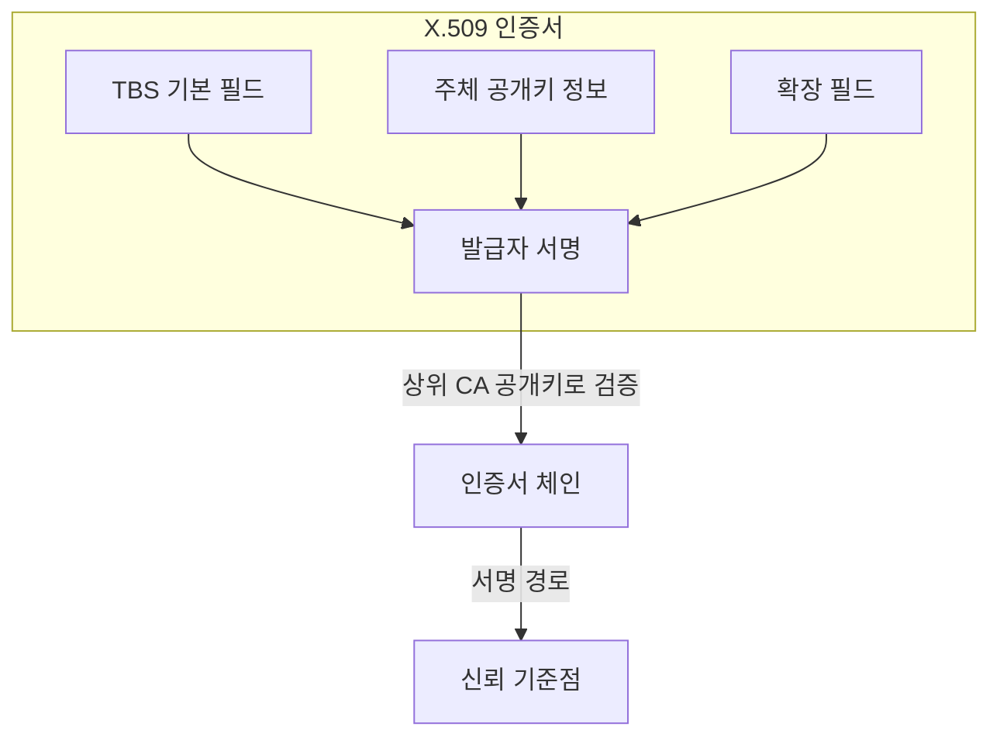
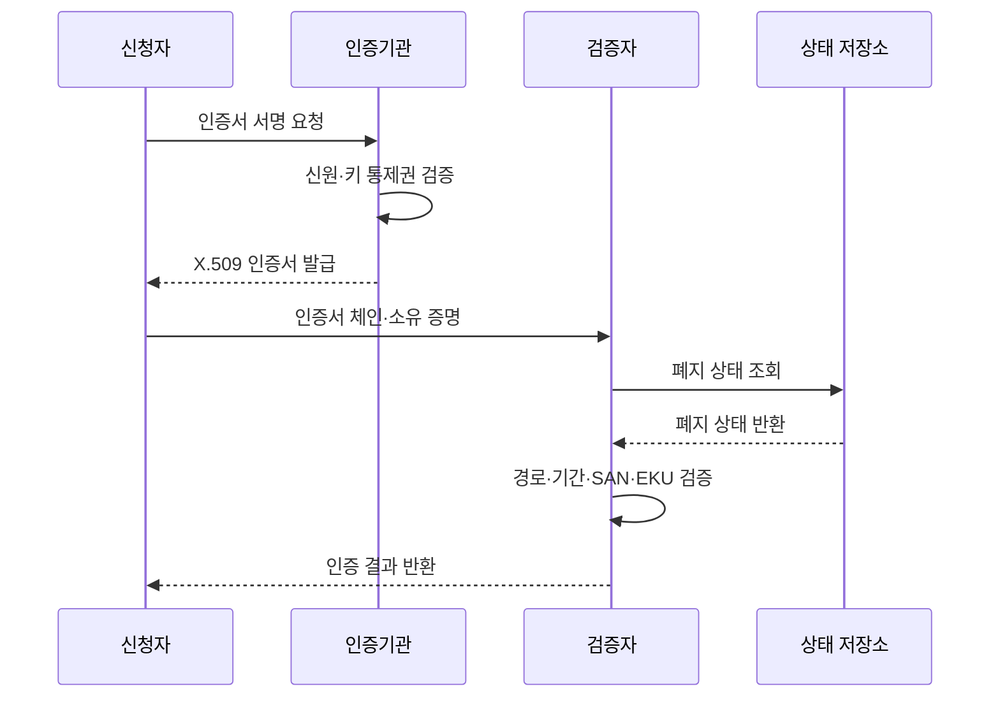

---
sidebar:
  order: 8
  label: "008. X.509 인증서 (X.509 Certificate)"
  badge:
    text: "기출 · 70%"
    variant: note
title: "X.509 인증서 (X.509 Certificate)"
date: "2026-07-25T01:05:00+09:00"
tags:
  - "notes-security"
weight: 8
extra:
  question_no: "008"
  source_status: "기출"
  source_history: "120회, 138회"
  priority: 70
  priority_note: "120·138회 반복이며 인증서 검증 설계로 확장 가능함"
---

## 미리 알고가기

- **X.509 인증서(X.509 Certificate)**: '엑스 점 오공구'로 읽고 X 계열 권고의 509번 표준임을 점과 번호로 표시하며 공개키·소유자·용도·기간을 CA 서명으로 연결
- **인증기관(Certificate Authority, CA)**: '시에이'로 읽고 영문 머리글자로 인증서 권한 기관임을 표시하며 신원·키 통제권 확인 뒤 인증서를 서명
- **주체(Subject)**: 인증서가 공개키와 연결하는 서버·사용자·장비 등의 소유자
- **발급자(Issuer)**: 인증서에 서명한 인증기관
- **일련번호(Serial Number)**: 발급자가 인증서를 고유하게 식별하기 위해 부여하는 번호
- **서명 대상 인증서(To-Be-Signed Certificate, TBS Certificate)**: '티비에스 인증서'로 읽고 영문 머리글자로 서명 전 본문임을 표시하며 주체·키·기간·확장을 발급자 서명 입력으로 제공
- **주체 공개키 정보(Subject Public Key Info, SPKI)**: '에스피케이아이'로 읽고 영문 머리글자로 주체의 공개키 정보 필드임을 표시
- **주체 대체 이름(Subject Alternative Name, SAN)**: '샌'으로 읽고 영문 머리글자로 주체의 대체 이름 필드임을 표시하며 유효한 도메인·IP를 나열
- **키 용도(Key Usage, KU)**: '케이유'로 읽고 영문 머리글자로 키 사용 제한 필드임을 표시하며 서명·키 설정 등의 허용 연산을 지정
- **확장 키 용도(Extended Key Usage, EKU)**: '이케이유'로 읽고 확장(Extended)의 E를 KU 앞에 붙여 서버·클라이언트·코드 서명 같은 구체 용도를 제한
- **인증서 서명 요청(Certificate Signing Request, CSR)**: '시에스알'로 읽고 영문 머리글자로 인증서 발급 요청임을 표시하며 공개키·주체·키 소유 증명을 제출
- **인증서 체인(Certificate Chain)**: 주체 인증서부터 중간·루트 인증기관까지 서명 관계로 이어진 인증서 목록
- **신뢰 기준점(Trust Anchor)**: 검증자가 미리 신뢰 저장소에 등록해 인증서 경로 검증의 출발점으로 삼는 루트 인증서
- **인증서 폐지(Certificate Revocation)**: 유효기간 전이라도 키 유출·오발급 등으로 인증서를 무효화하는 조치
- **전송 계층 보안(Transport Layer Security, TLS)**: '티엘에스'로 읽고 영문 머리글자로 전송 보안 규약임을 표시하며 상대 인증·암호화·무결성을 제공
- **상호 전송 계층 보안(Mutual TLS, mTLS)**: '엠티엘에스'로 읽고 상호(mutual)의 소문자 m을 TLS 앞에 붙여 서버·클라이언트 양쪽 인증을 표시

## Ⅰ. 개요

- **정의/개념**: 공개키·주체·용도·기간을 CA 서명으로 연결
- **배경/필요성**: 공개키 소유자와 허용 용도의 표준 검증

### 쉽게 이해하기 (학습용)

- X.509 인증서는 공개키만 담은 파일이 아니라 주인·사용처·유효기간을 적고 발급기관이 위조 방지 서명을 한 디지털 신분증이다.

## Ⅱ. 특징

- 인증서는 공개 정보이며 개인키를 포함하지 않는다
- CA 서명은 TBS 필드 전체를 보호한다
- SAN·KU·EKU가 이름·용도를 제한한다

### 쉽게 이해하기 (학습용)

- 인증서 서명이 맞다는 것은 문서가 발급 뒤 바뀌지 않았다는 뜻이고, 그 발급기관을 믿을지는 검증자의 신뢰 저장소가 별도로 결정한다.

## Ⅲ. 아키텍처 및 구성요소

| 설계 요소 | 설명 |
|:---|:---|
| TBS 기본 필드 | 주체·발급자·일련번호·기간 기록 |
| 주체 공개키 정보 | 공개키 알고리즘·매개변수·값 기록 |
| 확장 필드 | SAN·KU·EKU로 이름·용도 제한 |
| 발급자 서명 | TBS 전체의 발급자·무결성 증명 |
| 인증서 체인 | 상위 CA 서명을 신뢰점까지 연결 |
| 신뢰 기준점 | 검증자가 미리 신뢰한 루트 인증서 |

> 요약: TBS 서명을 신뢰 기준점까지 검증

### 쉽게 이해하기 (학습용)

- 신분증의 발급 도장을 상위 기관 도장으로 차례로 확인해, 검증자가 미리 믿기로 한 최상위 기관까지 이어지는지 살핀다.

## Ⅳ. 원리 및 절차 흐름도

| 절차 | 설명 |
|:---|:---|
| 인증서 서명 요청 | 공개키·주체·소유 증명 제출 |
| 신원·키 통제권 검증 | 발급 대상과 공개키 소유 확인 |
| X.509 인증서 발급 | CA가 TBS에 서명해 반환 |
| 인증서 체인·소유 증명 | 체인과 대응 개인키 보유 제시 |
| 폐지 상태 조회 | 인증서 조기 무효화 여부 질의 |
| 폐지 상태 반환 | 서명된 유효·폐지 상태 제공 |
| 경로·기간·SAN·EKU 검증 | 신뢰·시점·이름·용도 판정 |
| 인증 결과 반환 | 허용 또는 거부 결과 전달 |

> 요약: 발급 필드와 사용 시점 조건을 모두 검증

### 쉽게 이해하기 (학습용)

- 주소가 맞는 신분증이라도 사용처가 다르거나 만료됐거나 믿지 않는 기관이 발급했다면 거부하듯, SAN 외 조건도 모두 통과해야 한다.

## Ⅴ. 종류 및 비교

| 판단 기준 | 서버 인증서 | 클라이언트 인증서 | 코드 서명 인증서 |
|:---|:---|:---|:---|
| 핵심 특징 | 도메인과 서버 공개키 연결 | 사용자·장비 공개키 연결 | 배포자와 서명키 연결 |
| 적용 기준 | TLS 서버 신원 검증 | mTLS 클라이언트 신원 검증 | 소프트웨어 서명 검증 |
| 주요 위험 | SAN 불일치 시 사칭 허용 | 발급 범위 과다 시 권한 확산 | 빌드 침해 시 악성 코드 서명 |

> 요약: 식별 주체·EKU에 맞는 인증서 선택

### 쉽게 이해하기 (학습용)

- 서버용 신분증으로 코드를 승인할 수 없듯, 인증서마다 식별 대상과 EKU가 다르므로 검증자는 기대한 용도인지 확인해야 한다.

## Ⅵ. 실무 사례

1. TLS 서버는 최종·중간 인증서 체인 제공
2. 자동 갱신은 실제 TLS 인증서까지 확인

### 쉽게 이해하기 (학습용)

- 서버는 자신의 인증서와 필요한 중간 인증서를 보내지만, 루트 인증서는 클라이언트가 미리 보유한 신뢰 저장소에서 선택해야 한다.
- 새 인증서 파일을 받았어도 서비스가 이전 파일을 계속 사용할 수 있으므로, 자동 갱신 뒤 실제 TLS 연결에서 새 기간과 체인을 확인한다.

## Ⅶ. 결론

- 경로·기간·SAN·EKU·폐지로 인증서 판정

### 쉽게 이해하기 (학습용)

- 인증서가 있다는 사실만 믿지 말고, 기대한 루트에서 이어졌는지와 현재 이름·용도·기간·폐지 상태가 모두 맞는지 확인해야 한다.
