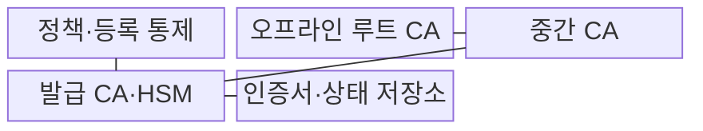
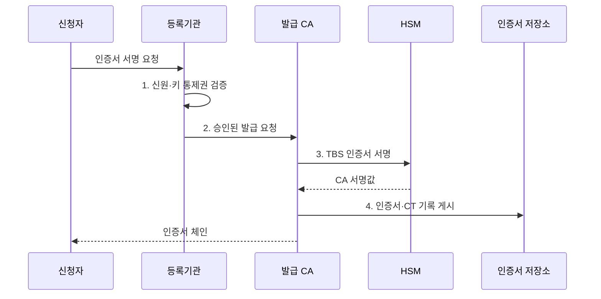

---
sidebar:
  order: 9
  label: "009. CA 인증 기관·인증서 발급 절차 (Certificate Authority)"
  badge:
    text: "기출 · 30%"
    variant: note
title: "CA 인증 기관·인증서 발급 절차 (Certificate Authority)"
date: "2026-08-02T09:56:00+09:00"
tags:
  - "notes-security"
weight: 9
extra:
  question_no: "009"
  source_status: "기출"
  source_history: "120회"
  priority: 30
  priority_note: "120회 발급 절차는 공개키 기반구조 구성요소로 압축 가능함"
---

## Ⅰ. 개요

핵심 용어

- **인증기관**은 신청자의 신원과 공개키 통제권을 확인하여 공개키·주체·용도를 연결한 인증서에 서명한다.

- 정의/개념: **인증기관(CA)**은 신청 주체와 공개키의 관계를 검증하고 인증서를 전자서명하여 발급·갱신·폐지하는 PKI 신뢰기관
- 배경/필요성: 자체 주장만으로는 **공개키 신뢰 형성 불가**

#### 한줄 요약
- 신청자가 실제 주인인지 확인하고 공개키·용도·기간이 적힌 신분증에 기관 도장을 찍어, 다른 사람이 그 공개키를 믿을 근거를 만든다.

## Ⅱ. 특징

핵심 용어

- **루트 CA**는 검증자가 미리 신뢰하는 최상위 기관으로 하위 CA 인증서에만 제한적으로 서명한다.
- **중간 CA**는 루트에서 제한된 권한을 위임받아 조직이나 용도별 발급 범위와 사고 영향을 분리한다.
- **CP와 CPS**는 각각 인증서의 신뢰·용도·책임 정책과 이를 실행하는 발급·운영 절차를 규정한다.

- **오프라인 루트 CA 격리**를 통한 최상위 개인키 노출 제한
- **중간 CA 위임**에 따른 용도·사고 범위 분리
- **CP·CPS** 기반 발급 정책·운영 절차·책임 명문화

#### 한줄 요약

- 최상위 도장을 매일 꺼내지 않고 용도가 제한된 하위 도장을 맡기면, 하위 기관 사고 때 해당 범위만 중단·교체할 수 있다.

## Ⅲ. 구조 및 구성요소

핵심 용어

- **등록기관**은 인증서 발급 전에 신청자의 신원·도메인·공개키 통제권을 확인한다.
- **발급 CA**는 등록 검증을 통과한 신청자에게 최종 인증서를 발급한다.
- **HSM**은 CA 서명키를 외부로 노출하지 않고 내부에서 인증서 서명을 수행한다.

| 구성요소 | 책임 |
|:---|:---|
| 정책·등록 통제 | **CP·CPS·신청자 검증** 적용 |
| 오프라인 루트 CA | **최상위 키 격리·권한 위임** |
| 중간 CA | 용도별 **발급 권한·사고 범위** 분리 |
| 발급 CA·HSM | 승인 인증서를 **격리 키로 서명** |
| 인증서·상태 저장소 | **체인·폐지 상태·CT 기록** 배포 |

#### 한줄 요약

- 등록기관이 신원을 확인하고 정책이 허용한 요청만 발급기관에 넘기며, 발급기관은 HSM 안의 도장으로 인증서에 서명한다.

## Ⅳ. 흐름도

핵심 용어

- **CSR**은 공개키·주체 정보와 개인키 보유 증명을 담아 CA에 제출하는 발급 요청이다.
- **CT 로그**는 인증서 발급 기록을 검증 가능한 공개 로그에 남겨 도메인 소유자가 오발급을 탐지하게 한다.

**동작 원리**

1. **신원·키 통제권 검증**: 신청자·도메인·공개키 소유 확인
2. **승인된 발급 요청**: 발급 근거와 허용 용도 전달
3. **TBS 인증서 서명**: HSM 내부 CA 키로 서명값 생성
4. **인증서·CT 기록 게시**: 검증·감사·오발급 탐지 지원

#### 한줄 요약

- 인증기관은 도장을 찍는 곳에 그치지 않고, 어떤 근거로 발급했는지 기록하고 잘못 발급한 인증서를 폐지해 검증자에게 알려야 한다.

## Ⅴ. 종류 및 비교

핵심 용어

- **CA 계층 분리**는 최상위 신뢰 위임, 정책별 하위 위임, 일상적인 가입자 발급을 서로 다른 키와 기관에 맡긴다.

| CA 계층 | 루트 CA | 중간 CA | 발급 CA |
|:---|:---|:---|:---|
| 적용 기준 | **하위 CA 서명** 때만 사용 | **조직·용도별 경계** 분리 | **온라인 발급·갱신** 처리 |
| 핵심 특징 | **최상위 신뢰 기준점** | **정책별 권한 위임** | **가입자 인증서 발급** |
| 한계 | 침해 시 **전체 신뢰 재배포** | 침해 시 **하위 체인 폐지** | **오발급 인증서 대량 폐지** |

> 요약: 권한 사용 빈도·사고 범위로 계층 분리

#### 한줄 요약

- 매일 쓰는 발급 도장은 제한된 인증서만 만들고 최상위 도장은 하위 도장에만 서명하게 해야, 자주 쓰는 키의 사고가 전체 신뢰로 번지지 않는다.

## Ⅵ. 실무 고려사항 및 대책

핵심 용어

- **CAA**는 도메인 소유자가 인증서 발급을 허용한 CA를 DNS 레코드로 지정한다.
- **RFC 3647**은 X.509 인증서 정책과 인증업무 수행준칙의 문서 구성 체계를 제시한다.
- **다중 승인**은 루트 키 사용에 여러 관리자의 독립 승인을 요구하여 단일 주체의 오용을 막는다.

| 문제 | 대책 | 효과 |
|:---|:---|:---|
| **발급 정책·준칙 불명확** | **IETF RFC 3647 적용** | **책임·심사 기준 명확화** |
| **인증서 프로파일 오류** | **IETF RFC 5280 검증** | **경로·용도 오류 차단** |
| **최상위 서명키 오용** | **오프라인 HSM·다중 승인** | **루트 키 오용 억제** |
| 비인가 CA의 **도메인 오발급** | **CAA 확인·CT 감시** | **오발급 조기 탐지** |

#### 한줄 요약

- 루트 CA는 네트워크에서 분리하고 여러 관리자의 승인을 받아 HSM 서명을 실행해 한 사람이나 온라인 침해로 최상위 키가 사용되지 않게 한다.

## Ⅶ. 결론

핵심 용어

- **최소 권한 발급**은 각 CA가 필요한 인증서 종류와 하위 위임만 수행하도록 제약하여 침해 영향을 줄인다.

- 최상위 위임은 **루트 CA**, 온라인 발급은 **발급 CA**로 분리

#### 한줄 요약

- 인증기관의 신뢰는 도장 수학만으로 생기지 않으며, 발급 근거·서명 권한·사고 범위를 계층별로 제한하고 오발급을 폐지할 수 있어야 한다.
