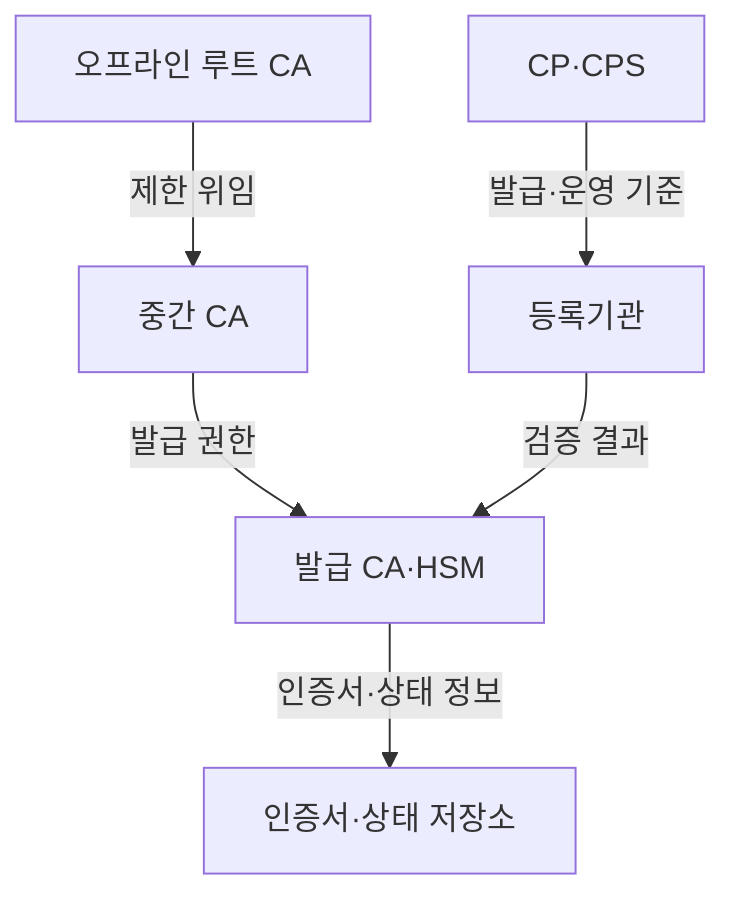
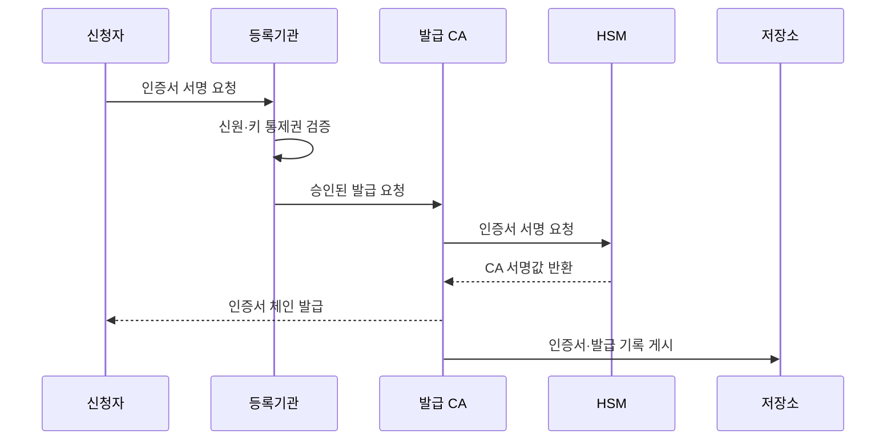

---
sidebar:
  order: 9
  label: "009. CA 인증 기관·인증서 발급 절차 (Certificate Authority)"
  badge:
    text: "기출 · 30%"
    variant: note
title: "CA 인증 기관·인증서 발급 절차 (Certificate Authority)"
date: "2026-07-27T23:59:59+09:00"
tags:
  - "notes-security"
weight: 9
extra:
  question_no: "009"
  source_status: "기출"
  source_history: "120회"
  priority: 30
  priority_note: "120회 발급 절차는 공개키 기반구조 구성요소로 압축 가능함"
---

## 미리 알고가기

- **인증기관(Certificate Authority, CA)**: '씨에이'로 읽고 영문 머리글자로 인증서 발급·서명 기관을 표시하며 신청자의 신원과 공개키 통제권을 확인
- **루트 인증기관(Root CA)**: 검증자가 미리 신뢰하며 하위 인증기관에만 서명하는 최상위 인증기관
- **중간 인증기관(Intermediate CA)**: 루트에서 제한된 권한을 위임받아 하위 인증기관이나 가입자 인증서에 서명하는 기관
- **발급 인증기관(Issuing CA)**: 등록 검증을 통과한 신청자에게 최종 인증서를 발급하는 인증기관
- **인증서 서명 요청(Certificate Signing Request, CSR)**: '씨에스알'로 읽고 영문 머리글자로 공개키·주체 정보·개인키 소유 증명을 담은 발급 요청을 표시
- **등록기관(Registration Authority, RA)**: '알에이'로 읽고 영문 머리글자로 발급 전 신원·도메인·공개키 통제권을 확인하는 기관을 표시
- **인증서 정책(Certificate Policy, CP)**: '씨피'로 읽고 영문 머리글자로 인증서의 신뢰 수준·용도·책임 범위를 정한 정책을 표시
- **인증업무 수행준칙(Certification Practice Statement, CPS)**: '씨피에스'로 읽고 영문 머리글자로 인증서 정책을 실제 발급·운영 절차로 이행하는 방법을 표시
- **하드웨어 보안 모듈(Hardware Security Module, HSM)**: '에이치에스엠'으로 읽고 영문 머리글자로 서명키를 반출하지 않고 내부 서명하는 장치를 표시
- **인증서 투명성(Certificate Transparency, CT)**: '씨티'로 읽고 영문 머리글자로 공개 발급 기록을 검증 가능한 로그에 남겨 오발급을 탐지하는 체계를 표시
- **인증기관 허가(Certification Authority Authorization, CAA)**: '씨에이에이'로 읽고 영문 머리글자로 도메인이 발급을 허용한 인증기관을 지정하는 정보를 표시
- **인증서 폐지(Certificate Revocation)**: 유효기간 전이라도 키 유출·오발급으로 인증서를 무효화하는 조치
- **전송 계층 보안(Transport Layer Security, TLS)**: '티엘에스'로 읽고 영문 머리글자로 인증서 기반 통신 상대 확인과 전송 보호 프로토콜을 표시
## Ⅰ. 개요

- 정의/개념: 검증된 주체·공개키에 **인증서를 서명하는 기관**
- **배경/필요성**: 자체 주장만으로는 **공개키 신뢰 형성 불가**

### 쉽게 이해하기 (학습용)
- 신청자가 실제 주인인지 확인하고 공개키·용도·기간이 적힌 신분증에 기관 도장을 찍어, 다른 사람이 그 공개키를 믿을 근거를 만든다.

## Ⅱ. 특징

- 루트 CA 격리는 개인키 노출을 제한한다
- 중간 CA 위임은 용도·사고 범위를 분리한다
- CP·CPS는 발급 근거와 책임을 명문화한다

### 쉽게 이해하기 (학습용)

- 최상위 도장을 매일 꺼내지 않고 용도가 제한된 하위 도장을 맡기면, 하위 기관 사고 때 해당 범위만 중단·교체할 수 있다.

## Ⅲ. 아키텍처 및 구성요소

| 설계 요소 | 설명 |
|:---|:---|
| CP·CPS | 신뢰 수준·검증·운영 절차 규정 |
| 등록기관 | 신청자 신원·키 통제권 확인 |
| 오프라인 루트 CA | 최상위 키 격리·권한 위임 |
| 중간 CA | 용도별 발급 권한과 사고 범위 분리 |
| 발급 CA·HSM | 승인된 인증서를 격리 키로 서명 |
| 인증서·상태 저장소 | 체인·폐지 상태·발급 기록 배포 |

> 요약: 정책 검증과 계층 위임으로 발급 통제

### 쉽게 이해하기 (학습용)

- 등록기관이 신원을 확인하고 정책이 허용한 요청만 발급기관에 넘기며, 발급기관은 HSM 안의 도장으로 인증서에 서명한다.

## Ⅳ. 원리 및 절차 흐름도

| 절차 | 설명 |
|:---|:---|
| 인증서 서명 요청 | 공개키·주체·소유 증명 제출 |
| 신원·키 통제권 검증 | CP에 맞는 발급 근거 확인 |
| 승인된 발급 요청 | 허용 용도·기간·확장 전달 |
| 인증서 서명 요청 | HSM에 TBS 서명 요청 |
| CA 서명값 반환 | 권한 확인 후 내부 키로 서명 |
| 인증서 체인 발급 | 최종 인증서와 중간 체인 제공 |
| 인증서·발급 기록 게시 | 검증·감사·오발급 탐지 지원 |

> 요약: 검증 승인된 TBS만 HSM으로 서명

### 쉽게 이해하기 (학습용)

- 인증기관은 도장을 찍는 곳에 그치지 않고, 어떤 근거로 발급했는지 기록하고 잘못 발급한 인증서를 폐지해 검증자에게 알려야 한다.

## Ⅴ. 종류 및 비교

| CA 계층 | 루트 CA | 중간 CA | 발급 CA |
|:---|:---|:---|:---|
| 적용 기준 | 하위 CA 서명 때만 사용 | 조직·용도별 경계 분리 | 온라인 발급·갱신 처리 |
| 핵심 특징 | 최상위 신뢰 기준점 | 정책별 권한 위임 | 가입자 인증서 발급 |
| 한계 | 침해 시 전체 신뢰 재배포 | 침해 시 하위 체인 폐지 | 오발급 인증서 대량 폐지 |

> 요약: 권한 사용 빈도·사고 범위로 계층 분리

### 쉽게 이해하기 (학습용)

- 매일 쓰는 발급 도장은 제한된 인증서만 만들고 최상위 도장은 하위 도장에만 서명하게 해야, 자주 쓰는 키의 사고가 전체 신뢰로 번지지 않는다.

## Ⅵ. 실무 사례

1. 공개 TLS 발급은 CAA 확인·CT 기록
2. 루트 CA 서명은 오프라인 다중 승인

### 쉽게 이해하기 (학습용)

- 공개 TLS 인증기관은 도메인이 허용한 기관인지 CAA로 확인하고 발급 인증서를 CT에 기록해 소유자가 오발급을 발견하게 한다.
- 루트 CA는 네트워크에서 분리하고 여러 관리자의 승인을 받아 HSM 서명을 실행해 한 사람이나 온라인 침해로 최상위 키가 사용되지 않게 한다.

## Ⅶ. 결론

- 신뢰 영향에 따라 CA 위임·키 사용 범위 분리

### 쉽게 이해하기 (학습용)

- 인증기관의 신뢰는 도장 수학만으로 생기지 않으며, 발급 근거·서명 권한·사고 범위를 계층별로 제한하고 오발급을 폐지할 수 있어야 한다.
