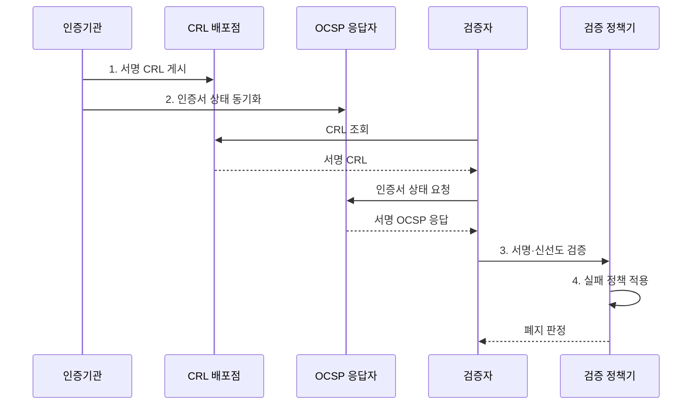

---
sidebar:
  order: 10
  label: "010. CRL·OCSP 인증서 폐지 (CRL OCSP Certificate Revocation)"
  badge:
    text: "기출 · 30%"
    variant: note
title: "CRL·OCSP 인증서 폐지 (CRL OCSP Certificate Revocation)"
date: "2026-07-31T02:57:00+09:00"
tags:
  - "notes-security"
weight: 10
extra:
  question_no: "010"
  source_status: "기출"
  source_history: "120회"
  priority: 30
  priority_note: "120회 폐지 방식은 인증서 검증의 비교 항목으로 충분함"
---

## 미리 알고가기

- **인증서 폐지(Certificate Revocation)**: 유효기간 전이라도 개인키 유출·오발급·권한 상실로 인증서를 신뢰 대상에서 제외하는 조치다.
- **공개키 기반구조(Public Key Infrastructure, PKI)**: 인증서의 발급·검증·갱신·폐지를 관리하여 공개키 신뢰를 제공하는 체계다.
- **인증기관(Certificate Authority, CA)**: 인증서의 폐지 상태를 기록하고 전자서명하여 배포하는 신뢰기관이다.
- **일련번호(Serial Number)**: 인증기관이 발급한 인증서를 고유하게 식별하는 번호다.
- **인증서 폐지 목록(Certificate Revocation List, CRL)**: 폐지된 인증서의 일련번호와 사유를 인증기관이 서명하여 주기적으로 배포하는 목록이다.
- **온라인 인증서 상태 프로토콜(Online Certificate Status Protocol, OCSP)**: 특정 인증서의 유효·폐지 상태를 온라인으로 조회하는 프로토콜이다.
- **OCSP 스테이플링(OCSP Stapling)**: 서버가 미리 받은 서명 OCSP 응답을 통신 연결에 첨부해 검증자에게 전달하는 방식이다.
- **정상·폐지·알 수 없음(good·revoked·unknown)**: OCSP가 각각 폐지 기록 없음·폐지됨·상태 판단 불가를 나타내는 응답 상태다.
- **현재 갱신 시각·다음 갱신 시각(thisUpdate·nextUpdate)**: 상태 정보 생성 기준 시각과 다음 정보가 나와야 하는 한계 시각이다.
- **소프트 실패(Soft-fail)**: 상태 조회 실패에도 인증서 사용을 허용하는 정책이다.
- **하드 실패(Hard-fail)**: 상태 조회 실패 시 인증서 사용을 거부하는 정책이다.
- **전송 계층 보안(Transport Layer Security, TLS)**: 서버 인증서와 폐지 상태를 검증하고 전송 구간을 보호하는 프로토콜이다.
- **IETF RFC 5280**: 인터넷 X.509 인증서와 CRL 프로파일·검증 절차를 규정한 표준이다.
- **IETF RFC 6960**: 인증서별 현재 상태를 질의·응답하는 OCSP를 규정한 표준이다.
## Ⅰ. 개요

- 정의/개념: 만료 전 인증서의 **폐지 상태 배포·검증**
- 배경/필요성: 유효기간 검사만으로는 **사고 인증서 차단 불가**

### 쉽게 이해하기 (학습용)
- 만료일이 남은 신분증도 분실 신고가 되면 사용할 수 없듯, 인증서도 폐지 신고가 검증자에게 전달되면 즉시 거부해야 한다.

## Ⅱ. 특징

- **폐지 정보 전파 지연** 동안 인증서 허용 가능성
- OCSP `good`의 **폐지 기록 없음**에 한정된 의미
- **실패 시 허용·차단 정책**에 따른 가용성·보안성 상충

### 쉽게 이해하기 (학습용)

- 폐지 목록에 없다는 것은 분실 신고가 없다는 뜻일 뿐 이름·용도·기간이 맞다는 뜻은 아니므로, 인증서의 다른 조건도 계속 검증해야 한다.

## Ⅲ. 구조 및 구성요소

| 구성요소 | 책임 |
|:---|:---|
| CA 폐지 상태 저장소 | **폐지 일련번호·사유·시각** 보관 |
| CRL 배포점 | **서명된 폐지 목록** 게시 |
| OCSP 응답자 | 인증서별 **상태·적용 시각** 서명 |
| 검증자 캐시·정책 | **신선도·조회 실패 처리** 결정 |
| CA·응답자 검증키 | **CRL·OCSP 응답 출처** 검증 |

### 쉽게 이해하기 (학습용)

- 폐지 정보도 공격자가 바꾸거나 오래된 정상 응답을 다시 보낼 수 있으므로, 검증자는 서명과 갱신 시각을 함께 확인한다.

## Ⅳ. 흐름도

**동작 원리**

1. **서명 CRL 게시**: 폐지 일련번호·시각 배포
2. **인증서 상태 동기화**: 응답자에 최신 폐지 상태 반영
3. **서명·신선도 검증**: 출처와 thisUpdate·nextUpdate 확인
4. **실패 정책 적용**: 위험에 따라 소프트·하드 실패 선택

### 쉽게 이해하기 (학습용)

- 상태 서버가 안 보일 때 무조건 허용하면 공격자가 조회를 방해해 폐지 인증서를 계속 쓸 수 있고, 무조건 거부하면 상태 장애가 서비스 중단으로 이어진다.

## Ⅴ. 종류 및 비교

| 인증서 폐지 확인 | CRL | OCSP | OCSP 스테이플링 |
|:---|:---|:---|:---|
| 적용 기준 | **대량 검증·폐쇄망** | 최신 **개별 상태가 필요한 검증** | TLS의 **조회 지연·노출 완화** |
| 핵심 특징 | **폐지 목록 일괄 검사** | **인증서별 온라인 질의** | **서명 응답 서버 첨부** |
| 한계 | **목록 증가·배포 지연** | **응답 장애·조회 정보 노출** | 서버의 **응답 갱신 누락** |

> 요약: 목록 규모·신선도·조회 경로로 선택

### 쉽게 이해하기 (학습용)

- CRL은 전체 분실자 명단을 받아 두고 찾으며, OCSP는 신분증 하나씩 물어보고, 스테이플링은 서버가 미리 받은 공식 답변을 함께 내민다.

## Ⅵ. 실무 고려사항 및 대책

| 고려사항 | 대책 | 효과 |
|:---|:---|:---|
| **CRL 형식·검증 오류** | **IETF RFC 5280 적용** | **목록 상호운용성** 확보 |
| **OCSP 상태·신선도 오류** | **IETF RFC 6960 검증** | **재전송·오판정 억제** |
| **상태 서비스 장애** | **위험별 실패 정책·캐시** | **보안·가용성 균형** |

### 쉽게 이해하기 (학습용)

- 공개 TLS 서버가 최신 OCSP 응답을 연결에 첨부하면 클라이언트가 인증기관에 직접 질의하지 않고도 폐지 상태를 확인할 수 있다.

## Ⅶ. 결론

- 대량·폐쇄망은 **CRL**, 공개 TLS의 저지연 검증은 **OCSP 스테이플링** 선택

### 쉽게 이해하기 (학습용)

- 새 폐지 정보의 도착 시점과 조회 실패 때 연결 허용 여부를 서비스 위험에 맞춰 정한다.
