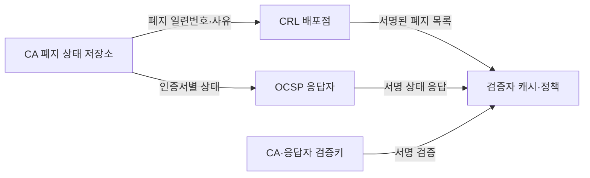
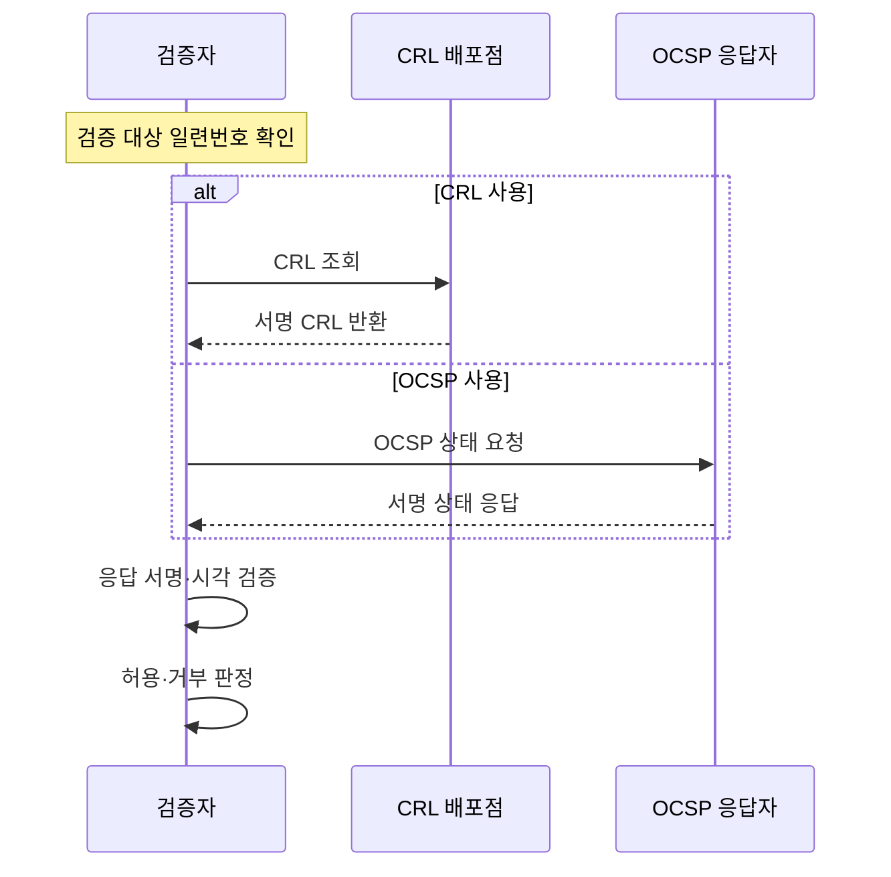

---
sidebar:
  order: 10
  label: "010. CRL·OCSP 인증서 폐지 (CRL OCSP Certificate Revocation)"
  badge:
    text: "기출 · 30%"
    variant: note
title: "CRL·OCSP 인증서 폐지 (CRL OCSP Certificate Revocation)"
date: "2026-07-27T23:59:59+09:00"
tags:
  - "notes-security"
weight: 10
extra:
  question_no: "010"
  source_status: "기출"
  source_history: "120회"
  priority: 30
  priority_note: "120회 폐지 방식은 인증서 검증의 비교 항목으로 충분함"
---

## 미리 알고가기

- **인증서 폐지(Certificate Revocation)**: 유효기간 전이라도 개인키 유출·오발급·권한 상실로 인증서를 신뢰 대상에서 제외하는 조치
- **공개키 기반구조(Public Key Infrastructure, PKI)**: '피케이아이'로 읽고 영문 머리글자로 인증서 발급·검증·갱신·폐지를 관리하는 체계를 표시
- **인증기관(Certificate Authority, CA)**: '씨에이'로 읽고 영문 머리글자로 폐지 상태를 기록하고 서명해 배포하는 기관을 표시
- **일련번호(Serial Number)**: 인증기관이 발급한 인증서를 고유하게 식별하는 번호
- **인증서 폐지 목록(Certificate Revocation List, CRL)**: '씨알엘'로 읽고 영문 머리글자로 폐지 인증서의 일련번호·사유를 서명해 배포하는 목록을 표시
- **온라인 인증서 상태 프로토콜(Online Certificate Status Protocol, OCSP)**: '오씨에스피'로 읽고 영문 머리글자로 특정 인증서의 상태를 온라인 질의하는 프로토콜을 표시
- **OCSP 스테이플링(OCSP Stapling)**: 서버가 미리 받은 서명 OCSP 응답을 통신 연결에 첨부해 검증자에게 전달하는 방식
- **정상·폐지·알 수 없음(good·revoked·unknown)**: OCSP가 각각 폐지 기록 없음·폐지됨·상태 판단 불가를 나타내는 응답 상태
- **현재 갱신 시각·다음 갱신 시각(thisUpdate·nextUpdate)**: 상태 정보 생성 기준 시각과 다음 정보가 나와야 하는 한계 시각
- **소프트 실패(Soft-fail)**: 상태 조회 실패에도 인증서 사용을 허용하는 정책
- **하드 실패(Hard-fail)**: 상태 조회 실패 시 인증서 사용을 거부하는 정책
- **전송 계층 보안(Transport Layer Security, TLS)**: '티엘에스'로 읽고 영문 머리글자로 서버 인증서와 OCSP 응답을 검증하는 통신 보호 프로토콜을 표시
## Ⅰ. 개요

- 정의/개념: 만료 전 인증서의 **폐지 상태 배포·검증**
- **배경/필요성**: 유효기간 검사만으로는 **사고 인증서 차단 불가**

### 쉽게 이해하기 (학습용)
- 만료일이 남은 신분증도 분실 신고가 되면 사용할 수 없듯, 인증서도 폐지 신고가 검증자에게 전달되면 즉시 거부해야 한다.

## Ⅱ. 특징

- 폐지 정보 전파 전에는 인증서가 허용될 수 있다
- `good`은 폐지 기록이 없다는 뜻에 한정된다
- 조회 실패 정책이 가용성·보안성을 좌우한다

### 쉽게 이해하기 (학습용)

- 폐지 목록에 없다는 것은 분실 신고가 없다는 뜻일 뿐 이름·용도·기간이 맞다는 뜻은 아니므로, 인증서의 다른 조건도 계속 검증해야 한다.

## Ⅲ. 아키텍처 및 구성요소

| 설계 요소 | 설명 |
|:---|:---|
| CA 폐지 상태 저장소 | 폐지 일련번호·사유·시각 보관 |
| CRL 배포점 | 서명된 폐지 목록 게시 |
| OCSP 응답자 | 인증서별 상태·적용 시각 서명 |
| 검증자 캐시·정책 | 신선도·조회 실패 처리 결정 |
| CA·응답자 검증키 | CRL·OCSP 응답 출처 검증 |

> 요약: CA 상태를 서명 목록·응답으로 전달

### 쉽게 이해하기 (학습용)

- 폐지 정보도 공격자가 바꾸거나 오래된 정상 응답을 다시 보낼 수 있으므로, 검증자는 서명과 갱신 시각을 함께 확인한다.

## Ⅳ. 원리 및 절차 흐름도

| 절차 | 설명 |
|:---|:---|
| CRL 조회 | 최신 목록 배포점에 요청 |
| 서명 CRL 반환 | 폐지 일련번호 목록 제공 |
| OCSP 상태 요청 | 발급자·일련번호 상태 질의 |
| 서명 상태 응답 | 상태와 적용 시각 제공 |
| 응답 서명·시각 검증 | 출처·대상·신선도 판정 |
| 허용·거부 판정 | 폐지·조회 실패 정책 적용 |

> 요약: 서명·신선도 검증 후 상태 정책 적용

### 쉽게 이해하기 (학습용)

- 상태 서버가 안 보일 때 무조건 허용하면 공격자가 조회를 방해해 폐지 인증서를 계속 쓸 수 있고, 무조건 거부하면 상태 장애가 서비스 중단으로 이어진다.

## Ⅴ. 종류 및 비교

| 인증서 폐지 확인 | CRL | OCSP | OCSP 스테이플링 |
|:---|:---|:---|:---|
| 적용 기준 | 대량 검증·폐쇄망 | 최신 개별 상태가 필요한 검증 | TLS의 조회 지연·노출 완화 |
| 핵심 특징 | 폐지 목록 다운로드 검사 | 인증서별 상태 온라인 질의 | 서버의 서명 응답 첨부 |
| 한계 | 목록 증가·배포 지연 | 응답 장애·조회 정보 노출 | 서버의 응답 갱신 누락 |

> 요약: 목록 규모·신선도·조회 경로로 선택

### 쉽게 이해하기 (학습용)

- CRL은 전체 분실자 명단을 받아 두고 찾으며, OCSP는 신분증 하나씩 물어보고, 스테이플링은 서버가 미리 받은 공식 답변을 함께 내민다.

## Ⅵ. 실무 사례

1. 공개 TLS 서버는 OCSP 스테이플링 적용

### 쉽게 이해하기 (학습용)

- 공개 TLS 서버가 최신 OCSP 응답을 연결에 첨부하면 클라이언트가 인증기관에 직접 질의하지 않고도 폐지 상태를 확인할 수 있다.

## Ⅶ. 결론

- 유효기간 전 신뢰 상실을 반영하기 위해 상태 신선도·응답 지연·개인정보·조회 실패 영향을 검토하여, 환경에 맞게 CRL·OCSP·스테이플링을 선택해야 한다.

### 쉽게 이해하기 (학습용)

- 새 폐지 정보의 도착 시점과 조회 실패 때 연결 허용 여부를 서비스 위험에 맞춰 정한다.
