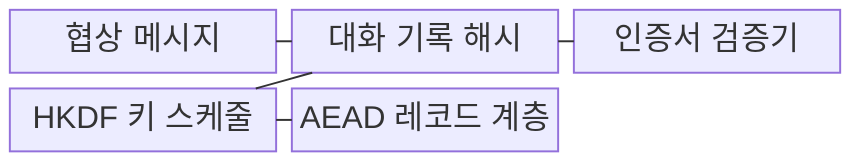
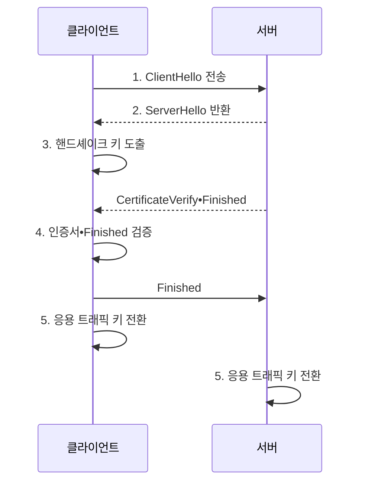

---
sidebar:
  order: 11
  label: "011. TLS 1.3 핸드셰이크 (TLS 1.3 Handshake)"
  badge:
    text: "미출제 • 70%"
    variant: note
title: "TLS 1.3 핸드셰이크 (TLS 1.3 Handshake)"
date: "2026-08-04T10:13:00+09:00"
tags:
  - "notes-security"
weight: 11
extra:
  question_no: "011"
  source_status: "미출제"
  source_history: ""
  priority: 70
  priority_note: "핸드셰이크•0-RTT•키 갱신을 묻는 현대 설계 주제임"
---

## Ⅰ. 개요

핵심 용어

- **전송 계층 보안(Transport Layer Security, TLS) 1.3 핸드셰이크** 는 서버 인증과 임시 키 합의를 결합하는 연결 설정 절차이다.
- **연관 데이터 포함 인증 암호(Authenticated Encryption with Associated Data, AEAD)** 는 트래픽의 기밀성과 무결성을 함께 보호한다.

- 정의/개념: 서버 인증•임시 키 합의로 **AEAD 트래픽 키를 설정하는 절차**
- 배경/필요성: 구형 TLS의 다중 왕복•취약 조합으로 **지연•공격면 증가**

#### 한줄 요약

- 첫 왕복에서 임시 열쇠 재료와 서버 신분증을 확인해, 다음 응용 데이터부터 양쪽만 아는 키로 보호한다.

## Ⅱ. 특징

핵심 용어

- **한 번 왕복 시간(One Round-Trip Time, 1-RTT)** 은 한 번의 왕복으로 키 합의와 서버 인증을 마친 뒤 응용 데이터를 전송한다.
- **사전 공유키(Pre-Shared Key, PSK)** 는 이전 연결에서 공유한 비밀을 재개 연결의 키 재료로 사용한다.
- **0-RTT 조기 데이터** 는 PSK로 첫 요청부터 보호하지만 공격자가 요청을 재전송할 수 있다.
- **멱등 요청** 은 반복 실행해도 시스템 상태가 추가로 변하지 않는 요청이다.

- **1-RTT 서버 인증•임시 키 합의** 로 연결 지연 단축
- **AEAD 전용 암호군** 으로 기밀성•무결성 결합
- **0-RTT 재전송 가능성** 에 따른 멱등 요청 제한

#### 한줄 요약

- TLS 1.3 연결이라도 0-RTT 요청은 공격자가 복사해 다시 보낼 수 있으므로, 같은 요청을 반복해도 안전한 작업에만 사용한다.

## Ⅲ. 구조 및 구성요소

핵심 용어

- **대화 기록 해시** 는 현재까지 교환한 핸드셰이크 메시지 전체의 순서와 내용을 해시에 결합한다.
- **HMAC 기반 키 유도 함수(HMAC-based Extract-and-Expand Key Derivation Function, HKDF) 키 스케줄** 은 공유 비밀과 대화 기록 해시에서 단계•방향별 키를 도출한다.
- **CertificateVerify** 는 서버가 인증서의 개인키를 보유했음을 증명한다.
- **Finished** 는 대화 기록 해시로 전체 핸드셰이크의 무결성을 증명한다.

| 구성요소 | 책임 |
|:---|:---|
| 협상 메시지 | **버전•암호군•키 공유값** 교환 |
| 대화 기록 해시 | 협상 전체의 **순서•무결성** 결합 |
| 인증서 검증기 | **서버 신원•대화 서명** 검증 |
| HKDF 키 스케줄 | **단계•방향별 트래픽 키** 도출 |
| AEAD 레코드 계층 | **응용 데이터 암호화•태그 검증** |

#### 한줄 요약

- ServerHello 뒤에는 이미 임시 키를 만들었으므로, 서버 인증서와 나머지 협상 내용도 암호화된 레코드 안에서 교환한다.

## Ⅳ. 흐름도

핵심 용어

- **ClientHello** 는 지원 암호군•그룹과 클라이언트 키 공유값을 제안한다.
- **ServerHello** 는 선택한 암호군•그룹과 서버 키 공유값을 반환한다.
- **임시 타원곡선 디피-헬먼(Elliptic Curve Diffie-Hellman Ephemeral, ECDHE)** 은 연결마다 새 임시 키로 공유 비밀을 합의한다.
- **핸드셰이크 키** 는 서버 인증과 Finished 메시지를 보호한다.
- **응용 트래픽 키** 는 검증 완료 뒤 실제 응용 데이터를 방향별로 보호한다.

**동작 원리**

1. **ClientHello 전송**: 암호군•그룹•키 공유값 제안
2. **ServerHello 반환**: 선택 결과•서버 키 공유값 반환
3. **핸드셰이크 키 도출**: ECDHE•대화 해시로 보호키 생성
4. **인증서•Finished 검증**: 서버 신원•협상 무결성 판정
5. **응용 트래픽 키 전환**: 방향별 AEAD 키 활성화

#### 한줄 요약

- 양쪽이 본 협상 전체를 해시해 서명과 키 계산에 넣으므로, 공격자가 중간 메시지만 바꾸면 Finished 검증이 실패한다.

## Ⅴ. 종류 및 비교

핵심 용어

- **완전 순방향 비밀성(Perfect Forward Secrecy, PFS)** 은 장기 키가 유출되어도 과거 세션키를 복구할 수 없게 하는 성질이다.

| TLS 1.3 연결 방식 | 전체 1-RTT | PSK 재개 1-RTT | 0-RTT 조기 데이터 |
|:---|:---|:---|:---|
| 적용 기준 | **최초 연결•새 서버 인증** | 반복 연결의 **안전한 재개** | 반복 실행해도 같은 **조회 요청** |
| 핵심 특징 | **인증서•임시 키 설정** | **PSK•선택적 임시 키** 사용 | **첫 요청을 PSK로 보호** |
| 한계 | **인증서 검증 실패** | PSK 전용이면 **PFS 미제공** | **요청 재전송•PFS 미제공** |

> 요약: 재개 지연과 PFS•재전송 위험으로 선택

#### 한줄 요약

- 이전 입장권으로 문이 열리기 전 주문부터 넣는 0-RTT는 빠르지만, 복사된 주문이 다시 실행될 수 있어 조회처럼 반복 안전한 요청만 허용한다.

## Ⅵ. 실무 고려사항 및 대책

핵심 용어

- **KeyUpdate** 는 연결 중 새 트래픽 비밀을 도출하여 사용 한계 전에 송수신 키를 교체한다.
- **재전송 방지 정책** 은 상태 변경 요청을 0-RTT에서 제외하고 조기 데이터의 중복 실행을 차단한다.
- **의견 요청 문서(Request for Comments, RFC) 8446** 은 TLS 1.3의 핸드셰이크, 키 스케줄, 레코드 보호 절차를 규정한다.

| 문제 | 대책 | 효과 |
|:---|:---|:---|
| **프로토콜 구현 불일치** | **IETF RFC 8446 준수** | **협상•키 스케줄 일관화** |
| **0-RTT 재전송** | **멱등 요청만 조기 허용** | **중복 실행 피해 차단** |
| **트래픽 키 수명 초과** | 사용 한계 전 **KeyUpdate** | **키•논스 재사용 억제** |

#### 한줄 요약

- 결제나 계정 생성은 같은 요청이 다시 실행되면 결과가 중복되므로 전체 핸드셰이크가 끝난 뒤에만 보낸다.

## Ⅶ. 결론

핵심 용어

- **연결 방식 선택** 은 첫 요청의 재전송 안전성과 새 임시 비밀을 통한 과거 세션 보호 필요성을 함께 고려한다.

- 상태 변경 요청은 **전체 1-RTT**, 멱등 조회만 **0-RTT** 허용

#### 한줄 요약

- 연결 속도만 보지 말고 새 임시 비밀을 쓰는지와 첫 요청이 복사돼 다시 실행돼도 안전한지를 기준으로 재개 방식을 정해야 한다.
