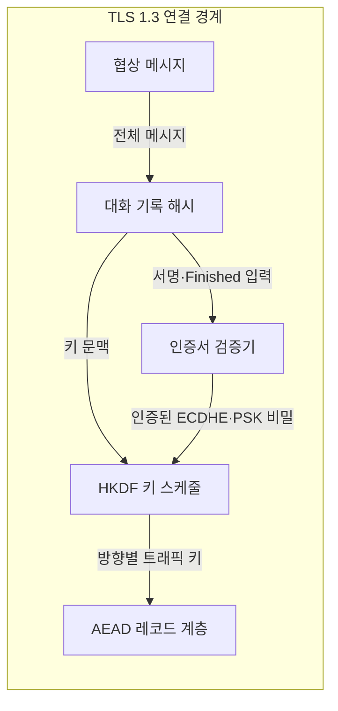
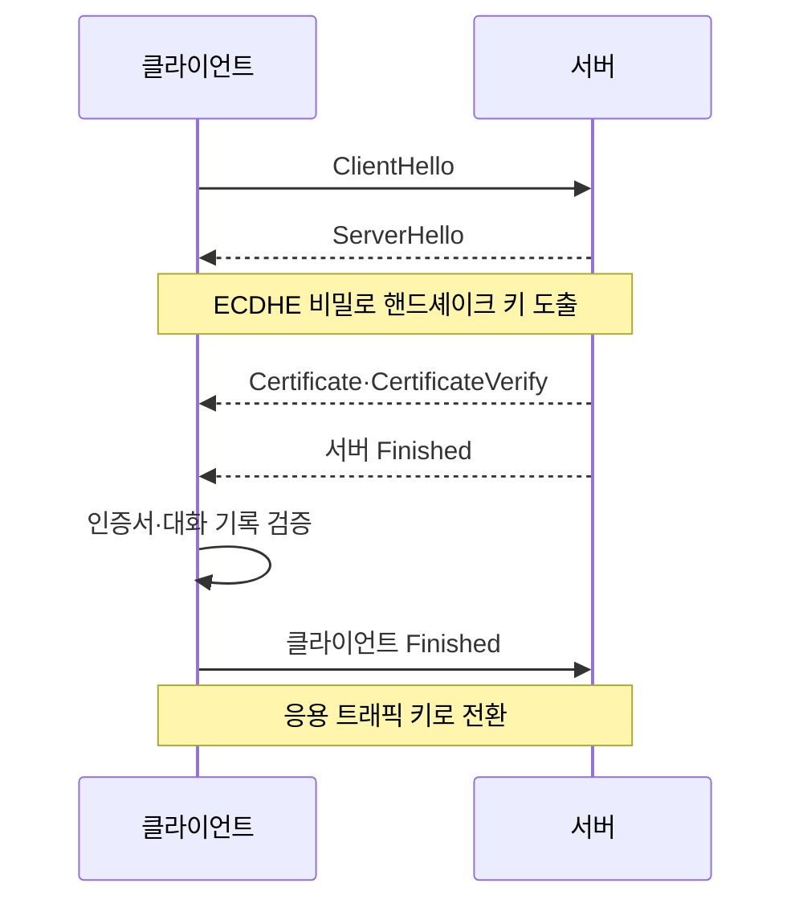

---
sidebar:
  order: 11
  label: "011. TLS 1.3 핸드셰이크 (TLS 1.3 Handshake)"
  badge:
    text: "미출제 · 70%"
    variant: note
title: "TLS 1.3 핸드셰이크 (TLS 1.3 Handshake)"
date: "2026-07-25T01:05:00+09:00"
tags:
  - "notes-security"
weight: 11
extra:
  question_no: "011"
  source_status: "미출제"
  source_history: ""
  priority: 70
  priority_note: "핸드셰이크·0-RTT·키 갱신을 묻는 현대 설계 주제임"
---

## 미리 알고가기

- **TLS 1.3(Transport Layer Security 1.3)**: 서버 인증·키 합의·인증 암호화를 결합하여 통신을 보호하는 전송 계층 보안 프로토콜
- **왕복 시간(Round-Trip Time, RTT)**: 메시지가 상대에게 전달된 뒤 응답이 돌아오기까지 걸리는 시간
- **1-RTT 핸드셰이크**: 한 번의 왕복으로 키 합의와 서버 인증을 마친 뒤 응용 데이터를 전송하는 절차
- **0-RTT 조기 데이터**: 이전 연결의 키 재료로 첫 요청부터 암호화하지만 재전송 공격에 노출될 수 있는 데이터
- **순방향 비밀성(Perfect Forward Secrecy, PFS)**: 장기 개인키가 유출되어도 폐기된 임시 키로 보호한 과거 통신은 복호화되지 않는 성질
- **인증 암호화(Authenticated Encryption with Associated Data, AEAD)**: 데이터의 기밀성과 무결성을 함께 제공하는 대칭키 암호 방식
- **사전 공유키(Pre-Shared Key, PSK)**: 통신 전에 공유했거나 이전 연결에서 얻어 재개 핸드셰이크에 사용하는 키 재료
- **ECDHE(Elliptic Curve Diffie-Hellman Ephemeral)**: 연결마다 새로운 타원곡선 임시 키로 공유 비밀을 합의하는 방식
- **HKDF(HMAC-based Key Derivation Function)**: 공유 비밀과 대화 기록 해시로 단계·방향별 트래픽 키를 도출하는 함수
- **대화 기록 해시(Transcript Hash)**: 현재까지 교환한 핸드셰이크 메시지 전체를 해시한 값
- **암호군(Cipher Suite)**: TLS 1.3에서 사용할 인증 암호화와 해시 알고리즘의 조합
- **ClientHello·ServerHello**: 클라이언트의 지원 항목과 서버의 선택·키 공유값을 전달하는 TLS 1.3 메시지
- **CertificateVerify·Finished**: 서버의 개인키 보유와 전체 핸드셰이크 무결성을 각각 증명하는 메시지

## Ⅰ. 개요

- 정의/개념: 인증·키 합의로 AEAD 트래픽 키 설정
- **배경/필요성**: 취약 암호 제거와 핸드셰이크 지연 단축

### 쉽게 이해하기 (학습용)

- 첫 왕복에서 임시 열쇠 재료와 서버 신분증을 확인해, 다음 응용 데이터부터 양쪽만 아는 키로 보호한다.

## Ⅱ. 특징

- 1-RTT에서 서버 인증·임시 키 합의를 끝낸다
- AEAD만 허용해 기밀성·무결성을 결합한다
- 0-RTT는 재전송 공격을 자체 방지하지 못한다

### 쉽게 이해하기 (학습용)

- TLS 1.3 연결이라도 0-RTT 요청은 공격자가 복사해 다시 보낼 수 있으므로, 같은 요청을 반복해도 안전한 작업에만 사용한다.

## Ⅲ. 아키텍처 및 구성요소

| 설계 요소 | 설명 |
|:---|:---|
| 협상 메시지 | 버전·암호군·키 공유값 교환 |
| 대화 기록 해시 | 협상 전체의 순서·무결성 결합 |
| 인증서 검증기 | 서버 신원·대화 서명 검증 |
| HKDF 키 스케줄 | 단계·방향별 트래픽 키 도출 |
| AEAD 레코드 계층 | 응용 데이터 암호화·태그 검증 |

> 요약: 인증된 대화 기록으로 트래픽 키 도출

### 쉽게 이해하기 (학습용)

- ServerHello 뒤에는 이미 임시 키를 만들었으므로, 서버 인증서와 나머지 협상 내용도 암호화된 레코드 안에서 교환한다.

## Ⅳ. 원리 및 절차 흐름도

| 절차 | 설명 |
|:---|:---|
| ClientHello | 암호군·그룹·키 공유값 제안 |
| ServerHello | 선택 결과·서버 키 공유값 반환 |
| Certificate·CertificateVerify | 인증서와 대화 서명 제공 |
| 서버 Finished | 서버 측 대화 무결성 증명 |
| 인증서·대화 기록 검증 | 신원·협상 변조 여부 판정 |
| 클라이언트 Finished | 클라이언트 측 대화 무결성 증명 |

> 요약: 키 합의·서버 인증 후 AEAD로 전환

### 쉽게 이해하기 (학습용)

- 양쪽이 본 협상 전체를 해시해 서명과 키 계산에 넣으므로, 공격자가 중간 메시지만 바꾸면 Finished 검증이 실패한다.

## Ⅴ. 종류 및 비교

| 판단 기준 | 전체 1-RTT | PSK 재개 1-RTT | 0-RTT 조기 데이터 |
|:---|:---|:---|:---|
| 핵심 특징 | 인증서·ECDHE로 새 키 설정 | PSK와 선택적 ECDHE 사용 | 첫 요청을 이전 PSK로 보호 |
| 적용 기준 | 최초 연결·새 서버 인증 | 반복 연결의 안전한 재개 | 반복 실행해도 같은 조회 요청 |
| 주요 위험 | 인증서 검증 실패 | PSK 전용이면 PFS 미제공 | 요청 재전송·PFS 미제공 |

> 요약: 재개 지연과 PFS·재전송 위험으로 선택

### 쉽게 이해하기 (학습용)

- 이전 입장권으로 문이 열리기 전 주문부터 넣는 0-RTT는 빠르지만, 복사된 주문이 다시 실행될 수 있어 조회처럼 반복 안전한 요청만 허용한다.

## Ⅵ. 실무 사례

1. 결제·생성 요청은 0-RTT를 거부

### 쉽게 이해하기 (학습용)

- 결제나 계정 생성은 같은 요청이 다시 실행되면 결과가 중복되므로 전체 핸드셰이크가 끝난 뒤에만 보낸다.

## Ⅶ. 결론

- 통신 지연을 줄이면서 세션 안전성을 확보하기 위해 순방향 비밀성과 재전송 영향을 검토하여, 요청 특성에 맞게 1-RTT와 0-RTT를 선택해야 한다.

### 쉽게 이해하기 (학습용)

- 연결 속도만 보지 말고 새 임시 비밀을 쓰는지와 첫 요청이 복사돼 다시 실행돼도 안전한지를 기준으로 재개 방식을 정해야 한다.
