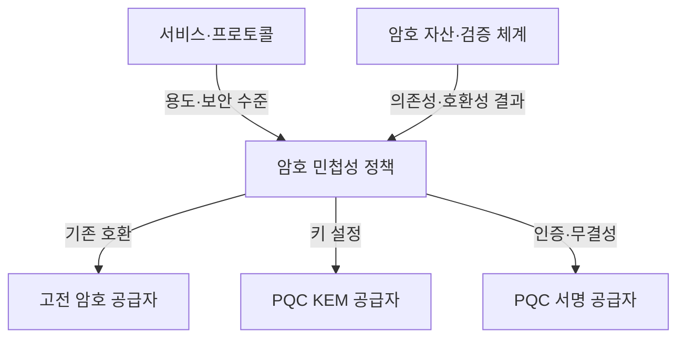
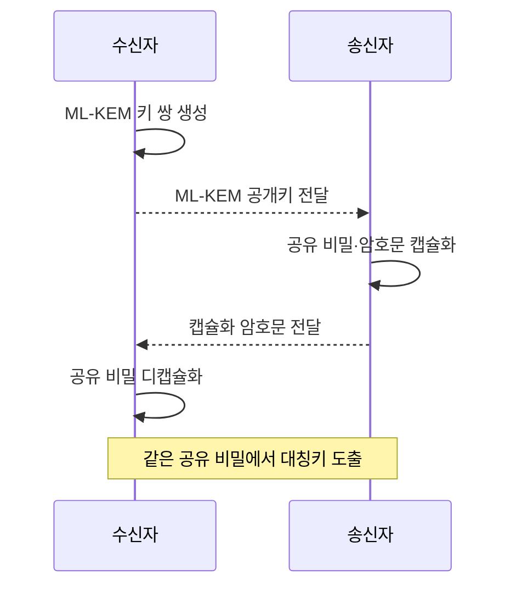

---
sidebar:
  order: 12
  label: "012. 양자내성암호 PQC (Post-Quantum Cryptography)"
  badge:
    text: "기출 · 85%"
    variant: note
title: "양자내성암호 PQC (Post-Quantum Cryptography)"
date: "2026-07-27T23:59:59+09:00"
tags:
  - "notes-security"
weight: 12
extra:
  question_no: "012"
  source_status: "기출"
  source_history: "126회, 129회, 135회"
  priority: 85
  priority_note: "126·129·135회 반복과 표준 전환 수요가 모두 강함"
---

## 미리 알고가기

- **양자내성암호(Post-Quantum Cryptography, PQC)**: 양자·고전 컴퓨터의 공격에 견디도록 설계한 공개키 암호 기술
- **쇼어 알고리즘(Shor's Algorithm)**: 양자컴퓨터에서 소인수분해와 이산대수를 다항시간에 계산하는 알고리즘
- **RSA(Rivest-Shamir-Adleman)**: 큰 정수의 소인수분해 난도를 기반으로 하는 공개키 암호
- **디피-헬만(Diffie-Hellman, DH)**: 이산대수 문제를 기반으로 공유 비밀을 설정하는 키 합의 방식
- **타원곡선 암호(Elliptic Curve Cryptography, ECC)**: 타원곡선 이산대수 문제를 기반으로 하는 공개키 암호
- **지금 수집·나중 해독(Harvest Now, Decrypt Later, HNDL)**: 현재 암호문을 수집·보관한 뒤 미래의 양자컴퓨터로 해독하려는 위협
- **키 캡슐화 메커니즘(Key Encapsulation Mechanism, KEM)**: 공유 비밀과 캡슐화 암호문을 생성하고 개인키로 동일한 비밀을 복구하는 방식
- **디캡슐화(Decapsulation)**: KEM의 개인키와 캡슐화 암호문으로 공유 비밀을 복구하는 연산
- **암호 민첩성(Crypto Agility)**: 암호 알고리즘과 매개변수를 신속하게 교체할 수 있는 설계 특성
- **ML-KEM(Module-Lattice-Based Key-Encapsulation Mechanism)**: 모듈 격자 문제를 기반으로 양자 공격에 대응하는 키 캡슐화 방식
- **ML-DSA(Module-Lattice-Based Digital Signature Algorithm)**: 모듈 격자 문제를 기반으로 양자 공격에 대응하는 전자서명 알고리즘
- **SLH-DSA(Stateless Hash-Based Digital Signature Algorithm)**: 해시 함수의 안전성을 기반으로 하는 상태 비저장 전자서명 알고리즘
- **하이브리드 키 설정(Hybrid Key Establishment)**: 기존 키 합의와 PQC가 생성한 비밀을 결합하는 전환 방식
- **다운그레이드 공격(Downgrade Attack)**: 협상 정보를 조작하여 지원 가능한 방식보다 약한 암호를 선택하게 하는 공격

## Ⅰ. 개요

- 정의/개념: 양자 공격에 대비한 공개키 암호군
- 기존 한계: RSA·DH·ECC는 양자 공격에 취약
- **배경/필요성**: HNDL 대응과 장기 기밀성 확보

### 쉽게 이해하기 (학습용)

- 양자 통신 장비를 설치하는 기술이 아니라, 지금 쓰는 컴퓨터와 네트워크에서 RSA·DH·ECC를 새로운 공개키 알고리즘으로 바꾸는 기술이다.

## Ⅱ. 특징

- 기존 네트워크에서 동작해 양자 채널이 불필요하다
- KEM과 서명이 키 설정·인증을 분담한다
- 키·암호문·서명 크기가 호환성을 좌우한다

### 쉽게 이해하기 (학습용)

- PQC 하나가 모든 일을 하는 것이 아니므로, 통신 비밀을 만드는 KEM과 소프트웨어·인증서 주체를 증명하는 서명을 따로 선택해야 한다.

## Ⅲ. 아키텍처 및 구성요소

| 설계 요소 | 설명 |
|:---|:---|
| 서비스·프로토콜 | 키 설정·서명 요구사항 전달 |
| 암호 민첩성 정책 | 허용 알고리즘·결합·폐기 결정 |
| 고전 암호 공급자 | 전환기 기존 호환 기능 제공 |
| PQC KEM 공급자 | 양자내성 공유 비밀 설정 |
| PQC 서명 공급자 | 인증서·코드·문서 서명 |
| 암호 자산·검증 체계 | 기존 의존성·크기·실패 검증 |

> 요약: 정책 경계에서 고전·PQC 공급자 전환

### 쉽게 이해하기 (학습용)

- 새 자물쇠를 설치해도 숨은 문이 옛 자물쇠를 쓰면 전환되지 않으므로, 먼저 모든 서비스와 라이브러리에서 기존 공개키 암호 위치를 찾아야 한다.

## Ⅳ. 원리 및 절차 흐름도

| 절차 | 설명 |
|:---|:---|
| ML-KEM 키 쌍 생성 | 공개키 배포·개인키 격리 |
| ML-KEM 공개키 전달 | 송신자에게 캡슐화 키 제공 |
| 공유 비밀·암호문 캡슐화 | 공개키로 비밀과 암호문 생성 |
| 캡슐화 암호문 전달 | 개인키 소유자에게 복구값 제공 |
| 공유 비밀 디캡슐화 | 개인키로 같은 비밀 복구 |

> 요약: 공개키 캡슐화로 같은 대칭키 원재료 설정

### 쉽게 이해하기 (학습용)

- 공격자는 지금 암호문을 저장해 미래에 풀 수 있으므로, 오래 비밀이어야 하는 데이터는 양자컴퓨터가 등장한 뒤가 아니라 보관 기간을 거꾸로 계산해 먼저 전환한다.

## Ⅴ. 종류 및 비교

| 판단 기준 | ML-KEM | ML-DSA | SLH-DSA |
|:---|:---|:---|:---|
| 적용 기준 | 세션키 원재료 설정 | 범용 인증서·코드 서명 | 큰 서명을 허용하는 장기 서명 |
| 핵심 특징 | 격자 기반 키 캡슐화 | 격자 기반 전자서명 | 상태 없는 해시 기반 서명 |
| 한계 | 실패 처리 오류 시 비밀 노출 | 키·서명 크기 증가 | 큰 서명·검증 비용 |

> 요약: 키 설정은 KEM, 인증은 서명 선택

### 쉽게 이해하기 (학습용)

- ML-KEM은 양쪽이 같은 통신 열쇠를 만들게 하고, ML-DSA와 SLH-DSA는 누가 데이터에 서명했는지 확인하게 한다.

## Ⅵ. 실무 사례

1. 장기 비밀 통신은 ML-KEM 우선 전환

### 쉽게 이해하기 (학습용)

- 지금 수집된 암호문이 미래에도 가치가 있는 통신부터 ML-KEM을 적용해, 데이터 비밀 유지 기간보다 전환 시점이 늦어지지 않게 한다.

## Ⅶ. 결론

- 양자컴퓨터의 기존 공개키 암호 위협에 대비하기 위해 데이터 보존기간·알고리즘 역할·성능·상호운용성을 검토하여, 장기 비밀 자산부터 PQC로 전환해야 한다.

### 쉽게 이해하기 (학습용)

- 오래 비밀이어야 하는 데이터부터 KEM과 서명을 역할별로 바꾸고, 실제 연결에서 옛 알고리즘으로 몰래 내려가지 않는지 확인해야 한다.
