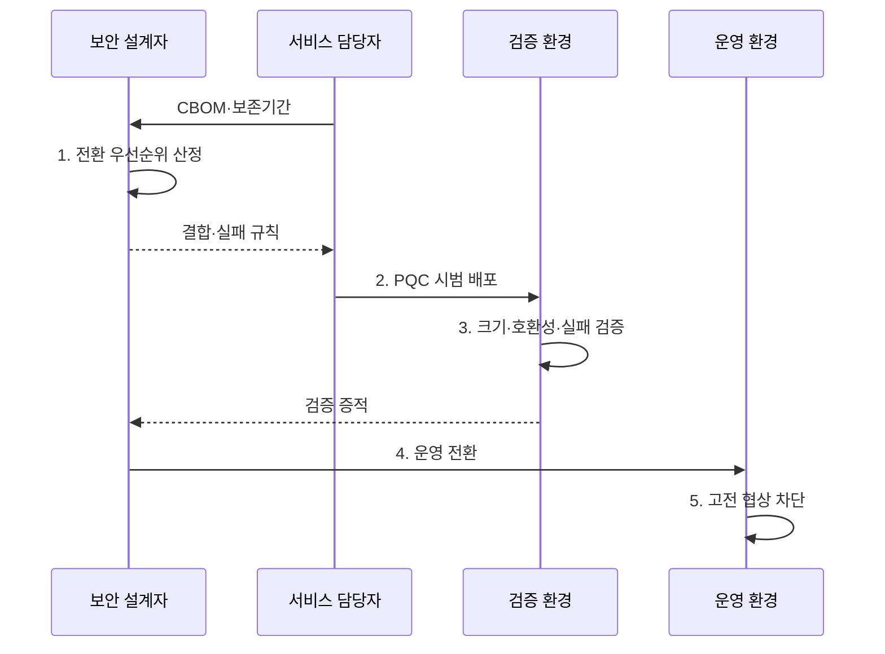

---
sidebar:
  order: 13
  label: "013. PQC 전환 로드맵·하이브리드 방식 (PQC Migration Hybrid)"
  badge:
    text: "미출제 · 70%"
    variant: note
title: "PQC 전환 로드맵·하이브리드 방식 (PQC Migration Hybrid)"
date: "2026-08-02T10:04:00+09:00"
tags:
  - "notes-security"
weight: 13
extra:
  question_no: "013"
  source_status: "미출제"
  source_history: ""
  priority: 70
  priority_note: "암호 자산 전환·하이브리드 설계가 실무 핵심이 됨"
---

## Ⅰ. 개요

핵심 용어

- **PQC 전환(Post-Quantum Cryptography Migration)**은 양자 공격에 취약한 공개키 암호를 양자내성 키 설정·서명 방식으로 단계적으로 교체하는 작업이다.
- **지금 수집·나중 해독(Harvest Now, Decrypt Later, HNDL)**은 현재 암호문을 수집·보관한 뒤 미래의 양자컴퓨터로 해독하려는 위협이다.

- 정의/개념: 양자 취약 암호를 **PQC KEM·서명으로 교체하는 활동**
- 배경/필요성: 숨은 암호 의존성으로 **HNDL 위험순 전환 불가**

### 쉽게 이해하기 (학습용)

- 새 암호를 설치하기 전에 낡은 자물쇠가 어느 서비스·인증서·장비에 숨어 있고 무엇이 그 자물쇠에 의존하는지 찾아야 한다.

## Ⅱ. 특징

핵심 용어

- **하이브리드 방식(Hybrid Mode)**은 기존 공개키 암호와 양자내성암호의 결과를 결합하여 전환기 호환성과 보안을 함께 확보하는 방식이다.
- **암호 민첩성(Crypto Agility)**은 알고리즘과 매개변수를 코드에 고정하지 않고 정책과 공급자 경계에서 교체할 수 있는 설계 특성이다.

- **데이터 보존기간·위협 시점** 기반 전환 우선순위
- **고전·PQC 비밀 결합**을 통한 단일 알고리즘 실패 완화
- **자동 약화 금지**에 따른 PQC 협상 실패 가시화

### 쉽게 이해하기 (학습용)

- 두 자물쇠를 달아도 연결 장치가 한쪽만 열리면 통과시키도록 만들면 약한 자물쇠 하나가 전체 보안을 결정한다.

## Ⅲ. 구조 및 구성요소

핵심 용어

- **암호 자재명세서(Cryptographic Bill of Materials, CBOM)**는 시스템이 사용하는 알고리즘·키·인증서·암호 라이브러리와 의존 관계를 기록한 목록이다.
- **결합기(Combiner)**는 기존 방식과 PQC 방식이 생성한 비밀을 하나의 세션키 원재료로 결합하는 함수다.

| 구성요소 | 책임 |
|:---|:---|
| 서비스·민첩성 결합기 | **알고리즘 교체·비밀 결합** 통제 |
| 고전 암호 공급자 | 전환기 **기존 호환 기능** 제공 |
| PQC 공급자 | **양자내성 KEM·서명** 제공 |
| CBOM·위험 우선순위 | **암호 위치·의존성·보존기간** 연결 |
| 검증·전환 정책 | **호환성·실패·고전 암호 폐기** 판정 |

### 쉽게 이해하기 (학습용)

- 서비스 이름만 적으면 교체가 실패하므로, 그 서비스가 쓰는 인증서·라이브러리·장비와 다른 시스템의 의존성까지 CBOM에 연결한다.

## Ⅳ. 흐름도

핵심 용어

- **키 캡슐화 메커니즘(Key Encapsulation Mechanism, KEM)**은 공유 비밀과 캡슐화 암호문을 생성하고 개인키로 동일한 비밀을 복구하는 방식이다.
- **시범 배포**는 제한된 대표 서비스에서 PQC의 크기·호환성·실패 처리를 먼저 검증하는 단계다.

**동작 원리**

1. **전환 우선순위 산정**: 취약 암호 위치·기밀 수명 평가
2. **PQC 시범 배포**: 대표 서비스에 새 공급자 적용
3. **크기·호환성·실패 검증**: 장비·프로토콜 한계 확인
4. **운영 전환**: 검증 통과 범위에 새 알고리즘 확대
5. **고전 협상 차단**: 전환 완료 범위의 자동 약화 금지

### 쉽게 이해하기 (학습용)

- 새 자물쇠 사용률이 높아도 옛 열쇠로 들어오는 문이 하나 남으면 전환이 끝난 것이 아니므로, 마지막에는 실제 연결에서 옛 방식이 거부되는지 확인한다.

## Ⅴ. 종류 및 비교

핵심 용어

- **고전 방식 유지**는 기존 공개키 알고리즘만 사용하는 단기 예외 방식이다.
- **PQC 단독 전환**은 모든 구간이 PQC를 지원한 뒤 고전 방식 선택지를 제거하는 방식이다.

| PQC 전환 방식 | 하이브리드 전환 | 고전 방식 유지 | PQC 단독 전환 |
|:---|:---|:---|:---|
| 적용 기준 | 지원 장비가 **혼재한 전환기** | 불가피한 **단기 예외** | **전 구간 PQC 지원 완료** |
| 핵심 특징 | **고전·PQC 비밀 결합** | **기존 알고리즘만 사용** | **PQC KEM·서명 사용** |
| 한계 | **결합·실패 처리 복잡성** | **HNDL 노출 지속** | 미지원 장비와 **연결 단절** |

> 요약: 지원 범위에 따라 하이브리드에서 단독 전환

### 쉽게 이해하기 (학습용)

- 모든 장비가 새 암호를 이해하기 전에는 두 결과를 결합하고, 전체 경로가 PQC를 지원하면 고전 방식 선택지를 제거한다.

## Ⅵ. 실무 고려사항 및 대책

핵심 용어

- **NIST CSWP 15**는 PQC 도입 과제와 암호 자산 식별·전환 계획을 제시한 공식 지침이다.
- **NIST SP 800-227**은 KEM의 안전한 구현·사용과 공유 비밀 설정 권고를 제시한 공식 지침이다.
- **다운그레이드 공격(Downgrade Attack)**은 협상 정보를 조작하여 지원 가능한 방식보다 약한 암호를 선택하게 하는 공격이다.

| 문제 | 대책 | 효과 |
|:---|:---|:---|
| **암호 자산·우선순위 누락** | **NIST CSWP 15 기반 조사** | **HNDL 위험순 전환** |
| **KEM 결합·실패 처리 오류** | **NIST SP 800-227 검증** | **비밀 결합 오류 억제** |
| **자동 약화 협상** | **정책 고정·연결 증적 감사** | **다운그레이드 차단** |

### 쉽게 이해하기 (학습용)

- 오늘 암호문이 수년 뒤에도 가치가 있는 서비스부터 KEM을 바꿔, 데이터 보존기간이 예상 전환 완료 시점보다 길면 HNDL 위험을 먼저 줄인다.

## Ⅶ. 결론

핵심 용어

- **전환 완료 기준**은 PQC 적용률뿐 아니라 실제 연결에서 고전 방식이 더 이상 선택되지 않는 상태까지 포함한다.

- 지원 혼재 구간은 **하이브리드**, 전 구간 지원 후 **PQC 단독** 전환

### 쉽게 이해하기 (학습용)

- 새 알고리즘을 켜는 데서 끝나지 않고, 데이터 수명과 장비 지원을 확인한 뒤 옛 알고리즘이 실제로 선택되지 않게 해야 전환이 끝난다.
