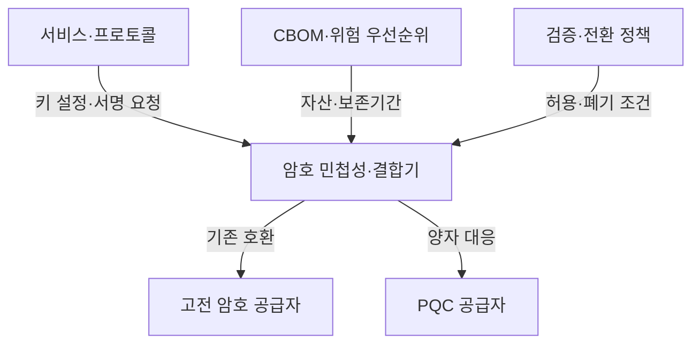
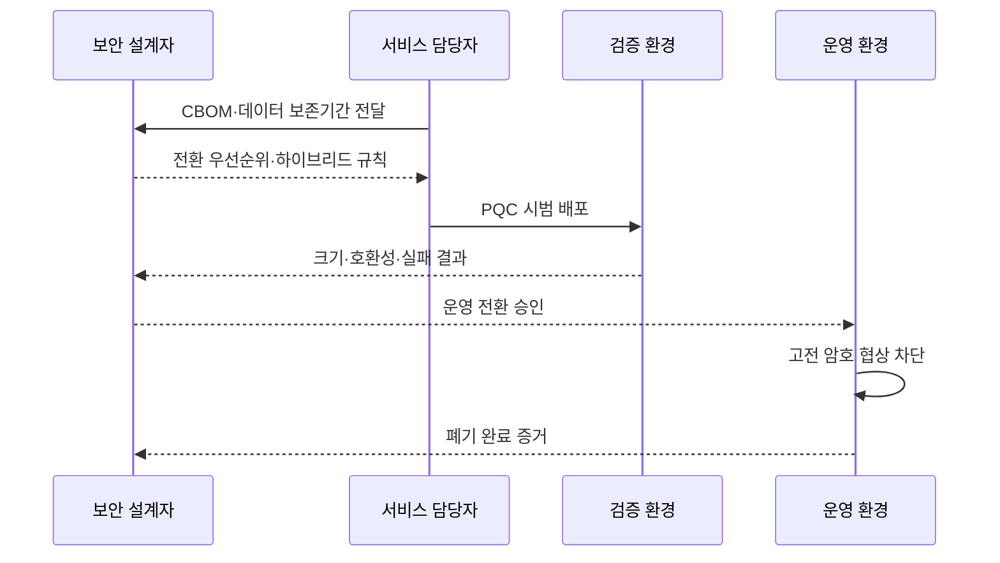

---
sidebar:
  order: 13
  label: "013. PQC 전환 로드맵·하이브리드 방식 (PQC Migration Hybrid)"
  badge:
    text: "미출제 · 70%"
    variant: note
title: "PQC 전환 로드맵·하이브리드 방식 (PQC Migration Hybrid)"
date: "2026-07-25T01:05:00+09:00"
tags:
  - "notes-security"
weight: 13
extra:
  question_no: "013"
  source_status: "미출제"
  source_history: ""
  priority: 70
  priority_note: "암호 자산 전환·하이브리드 설계가 실무 핵심이 됨"
---

## 미리 알고가기

- **PQC 전환(Post-Quantum Cryptography Migration)**: 양자 공격에 취약한 공개키 암호를 양자내성 키 설정·서명 방식으로 단계적으로 교체하는 작업
- **지금 수집·나중 해독(Harvest Now, Decrypt Later, HNDL)**: 현재 암호문을 수집·보관한 뒤 미래의 양자컴퓨터로 해독하려는 위협
- **암호 민첩성(Crypto Agility)**: 알고리즘과 매개변수를 코드에 고정하지 않고 정책과 공급자 경계에서 교체할 수 있는 설계 특성
- **하이브리드 방식(Hybrid Mode)**: 기존 공개키 암호와 양자내성암호의 결과를 결합하여 전환기 호환성과 보안을 함께 확보하는 방식
- **암호 자재명세서(Cryptographic Bill of Materials, CBOM)**: 시스템이 사용하는 알고리즘·키·인증서·암호 라이브러리와 의존 관계를 기록한 목록
- **키 캡슐화 메커니즘(Key Encapsulation Mechanism, KEM)**: 공유 비밀과 캡슐화 암호문을 생성하고 개인키로 동일한 비밀을 복구하는 방식
- **결합기(Combiner)**: 기존 방식과 PQC 방식이 생성한 비밀을 하나의 세션키 원재료로 결합하는 함수
- **다운그레이드 공격(Downgrade Attack)**: 협상 정보를 조작하여 지원 가능한 방식보다 약한 암호를 선택하게 하는 공격

## Ⅰ. 개요

- 정의/개념: 양자 취약 암호를 PQC KEM·서명으로 교체
- **배경/필요성**: 장기 기밀성·복잡한 의존성의 선제 전환

### 쉽게 이해하기 (학습용)

- 새 암호를 설치하기 전에 낡은 자물쇠가 어느 서비스·인증서·장비에 숨어 있고 무엇이 그 자물쇠에 의존하는지 찾아야 한다.

## Ⅱ. 특징

- 데이터 보존기간이 전환 우선순위를 결정한다
- 결합기는 두 비밀을 모두 세션키에 반영한다
- 자동 약화 허용은 PQC 실패를 숨긴다

### 쉽게 이해하기 (학습용)

- 두 자물쇠를 달아도 연결 장치가 한쪽만 열리면 통과시키도록 만들면 약한 자물쇠 하나가 전체 보안을 결정한다.

## Ⅲ. 아키텍처 및 구성요소

| 설계 요소 | 설명 |
|:---|:---|
| 서비스·프로토콜 | 키 설정·서명 요구사항 제공 |
| 암호 민첩성·결합기 | 알고리즘 교체·비밀 결합 통제 |
| 고전 암호 공급자 | 전환기 기존 호환 기능 제공 |
| PQC 공급자 | 양자내성 KEM·서명 제공 |
| CBOM·위험 우선순위 | 암호 위치·의존성·보존기간 연결 |
| 검증·전환 정책 | 호환성·실패·고전 암호 폐기 판정 |

> 요약: CBOM 위험에 따라 공급자·결합기 전환

### 쉽게 이해하기 (학습용)

- 서비스 이름만 적으면 교체가 실패하므로, 그 서비스가 쓰는 인증서·라이브러리·장비와 다른 시스템의 의존성까지 CBOM에 연결한다.

## Ⅳ. 원리 및 절차 흐름도

| 절차 | 설명 |
|:---|:---|
| CBOM·데이터 보존기간 전달 | 취약 암호 위치·기밀 수명 제공 |
| 전환 우선순위·하이브리드 규칙 | 위험순서와 결합·실패 정책 결정 |
| PQC 시범 배포 | 대표 서비스에 새 공급자 적용 |
| 크기·호환성·실패 결과 | 장비·프로토콜 한계 검증 |
| 운영 전환 승인 | 통과 범위만 단계적으로 확대 |
| 고전 암호 협상 차단 | 옛 방식 자동 선택을 금지 |
| 폐기 완료 증거 | 실제 연결·코드에서 제거 확인 |

> 요약: 자산 위험부터 고전 암호 차단까지 전환

### 쉽게 이해하기 (학습용)

- 새 자물쇠 사용률이 높아도 옛 열쇠로 들어오는 문이 하나 남으면 전환이 끝난 것이 아니므로, 마지막에는 실제 연결에서 옛 방식이 거부되는지 확인한다.

## Ⅴ. 종류 및 비교

| 판단 기준 | 하이브리드 전환 | 고전 방식 유지 | PQC 단독 전환 |
|:---|:---|:---|:---|
| 핵심 특징 | 고전·PQC 비밀을 결합 | 기존 알고리즘만 사용 | PQC KEM·서명만 사용 |
| 적용 기준 | 지원 장비가 혼재한 전환기 | 불가피한 단기 예외 | 전 구간 PQC 지원 완료 |
| 주요 위험 | 결합·실패 처리 복잡성 | HNDL 노출 지속 | 미지원 장비와 연결 단절 |

> 요약: 지원 범위에 따라 하이브리드에서 단독 전환

### 쉽게 이해하기 (학습용)

- 모든 장비가 새 암호를 이해하기 전에는 두 결과를 결합하고, 전체 경로가 PQC를 지원하면 고전 방식 선택지를 제거한다.

## Ⅵ. 실무 사례

1. 장기 보관 데이터 서비스부터 KEM 전환

### 쉽게 이해하기 (학습용)

- 오늘 암호문이 수년 뒤에도 가치가 있는 서비스부터 KEM을 바꿔, 데이터 보존기간이 예상 전환 완료 시점보다 길면 HNDL 위험을 먼저 줄인다.

## Ⅶ. 결론

- 장기 기밀성을 확보하기 위해 데이터 보존기간·장비 지원 범위·상호운용성·다운그레이드 위험을 검토하여, 하이브리드 결합과 기존 암호 폐기 시점을 결정해야 한다.

### 쉽게 이해하기 (학습용)

- 새 알고리즘을 켜는 데서 끝나지 않고, 데이터 수명과 장비 지원을 확인한 뒤 옛 알고리즘이 실제로 선택되지 않게 해야 전환이 끝난다.
