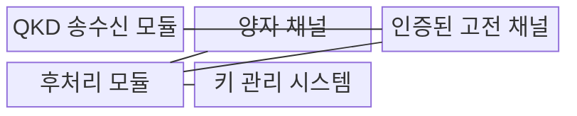
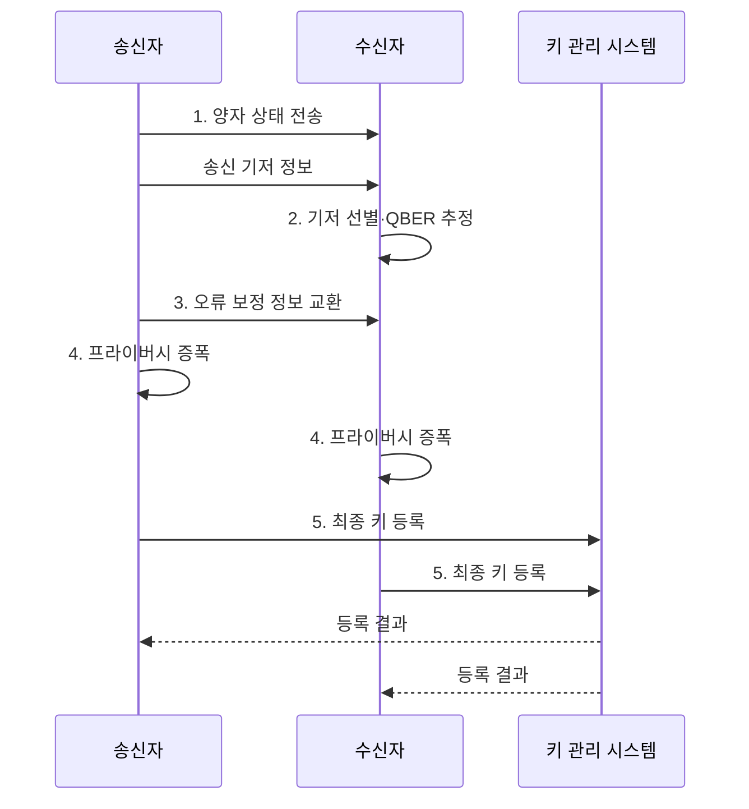

---
sidebar:
  order: 14
  label: "014. QKD 양자 키 분배 (Quantum Key Distribution)"
  badge:
    text: "기출 · 30%"
    variant: note
title: "QKD 양자 키 분배 (Quantum Key Distribution)"
date: "2026-08-02T10:06:00+09:00"
tags:
  - "notes-security"
weight: 14
extra:
  question_no: "014"
  source_status: "기출"
  source_history: "126회"
  priority: 30
  priority_note: "126회 기출이나 PQC 대비 독립 반복 가능성은 낮음"
---

## Ⅰ. 개요

핵심 용어

- **양자 키 분배(Quantum Key Distribution, QKD)** 는 양자 상태의 측정 교란을 이용하여 도청 가능성을 탐지하고 대칭키 원재료를 생성하는 기술이다.
- **비복제 정리(No-Cloning Theorem)** 는 알려지지 않은 양자 상태를 완벽하게 복제할 수 없다는 원리다.

- 정의/개념: **비복제 정리와 양자 상태 교란** 을 이용하는 도청 탐지형 키 분배
- 배경/필요성: 공개 통신 경로에서 키를 합의할 때 **도청 개입 여부를 물리적으로 판별** 할 필요

#### 한줄 요약

- 누군가 광자를 몰래 측정하면 일부 결과가 달라지므로, 송수신자가 오류 비율을 확인하고 안전 범위의 비트만 압축해 같은 비밀키를 만든다.

## Ⅱ. 특징

핵심 용어

- **양자 비트 오류율(Quantum Bit Error Rate, QBER)** 은 같은 기저로 측정한 비트 중 결과가 다른 비율로, 잡음과 도청 가능성을 판단하는 지표다.
- **인증된 고전 채널(Authenticated Classical Channel)** 은 기저 비교·오류 보정 메시지의 출처와 무결성을 확인하는 일반 통신 채널이다.

- 데이터가 아닌 **대칭키 원재료 생성** 기능
- **QBER** 에 의한 잡음·도청 가능성 통합 판정
- 고전 채널 미인증 시 **중간자 공격 허용** 위험

#### 한줄 요약

- 오류가 늘었다고 모두 도청은 아니므로 장비 잡음과 회선 상태를 포함한 허용 한계를 정하고, QBER가 넘으면 키 생성을 중단한다.

## Ⅲ. 구조 및 구성요소

핵심 용어

- **양자 상태(Quantum State)** 는 양자 입자의 측정 결과 확률을 나타내며 측정 과정에서 달라질 수 있는 상태다.
- **광자(Photon)** 는 빛의 최소 에너지 단위로, QKD에서 비트와 기저를 전달하는 매체다.
- **키 관리 시스템(Key Management System, KMS)** 은 QKD가 생성한 최종 키를 저장·동기화하여 대칭키 암호 장비에 공급하는 시스템이다.

| 구성요소 | 책임 |
|:---|:---|
| QKD 송수신 모듈 | **광자 준비·기저 측정** 수행 |
| 양자 채널 | **양자 상태** 를 수신 측에 전달 |
| 인증된 고전 채널 | **기저·통계·보정 정보** 보호 |
| 후처리 모듈 | **선별·오류 보정·증폭** 수행 |
| 키 관리 시스템 | **최종 키 저장·동기화·공급** |

#### 한줄 요약

- 양자 회선은 원료 비트를 만들고, 인증된 일반 회선에서 서로 같은 부분만 골라 오류와 노출분을 제거해야 실제 암호키가 된다.

## Ⅳ. 흐름도

핵심 용어

- **기저(Basis)** 는 양자 비트를 표현하고 측정할 때 선택하는 방향 또는 규칙이다.
- **QBER·KMS** 는 선별한 비트의 오류율로 키 사용 여부를 판정하고 통과한 최종 키를 저장·동기화하는 지표와 시스템이다.
- **오류 보정(Error Correction)** 은 공개 정보 교환으로 송수신 원시 비트의 차이를 맞추는 후처리다.
- **프라이버시 증폭(Privacy Amplification)** 은 공격자가 알 수 있는 정보를 줄이도록 비트열을 더 짧은 키로 압축하는 후처리다.

**동작 원리**

1. **양자 상태 전송**: 무작위 비트·기저로 광자 전달
2. **기저 선별·QBER 추정**: 동일 기저·오류율 한계 판정
3. **오류 보정 정보 교환**: 남은 비트 차이를 일치시킴
4. **프라이버시 증폭**: 노출 가능 정보를 압축 제거
5. **최종 키 등록**: 키 일치 검증 후 KMS 저장

#### 한줄 요약

- 오류를 맞추려고 공개한 정보는 공격자도 들을 수 있으므로, 공개량만큼 키를 더 짧게 압축해 알려진 부분을 제거한다.

## Ⅴ. 종류 및 비교

핵심 용어

- **BB84(Bennett-Brassard 1984)** 는 무작위로 선택한 기저가 일치한 비트만 남겨 공유키를 생성하는 QKD 방식이다.
- **미끼 상태 BB84(Decoy-state BB84)** 는 여러 광자 세기를 혼합하여 광자 수 분할 공격을 탐지하는 QKD 방식이다.
- **측정 장치 독립 QKD(Measurement-Device-Independent QKD, MDI-QKD)** 는 중간 공동 측정을 이용하여 검출기에 대한 신뢰 가정을 줄이는 QKD 방식이다.

| QKD 방식 | BB84 | 미끼 상태 BB84 | MDI-QKD |
|:---|:---|:---|:---|
| 적용 기준 | 단일광자에 가까운 **기본 구조** | 약한 광원의 **실용 링크** | **검출기 신뢰를 줄여야 할 링크** |
| 핵심 특징 | **무작위 기저 교란 추정** | **광자 수 분할 공격 추정** | **중간 장치의 공동 측정** |
| 한계 | **실제 광원·검출기 편차** | **세기 통계·매개변수 오류** | **복잡한 동기화·낮은 키 생성률** |

> 요약: 광원·검출기 신뢰 가정으로 방식 선택

#### 한줄 요약

- 실제 광원은 한 번에 여러 광자를 보낼 수 있으므로 미끼 상태는 세기를 바꿔 분할 공격을 찾고, MDI-QKD는 검출기를 믿어야 하는 범위를 줄인다.

## Ⅵ. 실무 고려사항 및 대책

핵심 용어

- **광자 수 분할 공격(Photon-number-splitting Attack)** 은 다광자 신호에서 일부 광자를 빼내 키 정보를 얻으려는 공격이다.
- **국제전기통신연합 전기통신표준화 부문(International Telecommunication Union Telecommunication Standardization Sector, ITU-T) Y.3800** 은 QKD 네트워크의 계층 구조·기능·설계 고려사항을 규정한 국제 표준이다.

| 문제 | 대책 | 효과 |
|:---|:---|:---|
| **QKD 네트워크 구조 오류** | **ITU-T Y.3800 계층 적용** | **제어·키 관리 역할 분리** |
| 다광자 신호의 **광자 수 분할 공격** | **미끼 상태 세기 통계 검증** | **분할 공격 탐지** |
| **QBER 임계치 초과** | **원시 키 폐기·링크 중단** | **노출 키 사용 차단** |
| **고전 채널 위조** | **상호 인증·무결성 보호** | **중간자 공격 억제** |

#### 한줄 요약

- 데이터센터 사이 전용 링크는 정상 잡음 범위로 QBER 한계를 정하고, 이를 넘으면 도청 여부와 관계없이 해당 원시 키를 폐기한다.

## Ⅶ. 결론

핵심 용어

- **키 등록 조건** 은 QBER 임계치, 고전 채널 인증, 후처리 검증을 모두 통과한 경우로 한정한다.
- **QBER·KMS 처리** 는 오류율이 임계치를 넘으면 원시 키를 폐기하고 모든 검증을 통과한 키만 관리 시스템에 등록하는 원칙이다.

- **QBER 초과는 원시 키 폐기**, 임계치·인증 통과만 KMS 등록

#### 한줄 요약

- 광자를 보냈다는 사실만으로 안전하지 않으며, 오류 한계·측정 장비·후처리와 링크 장애 때의 키 정책까지 맞아야 사용할 수 있다.
