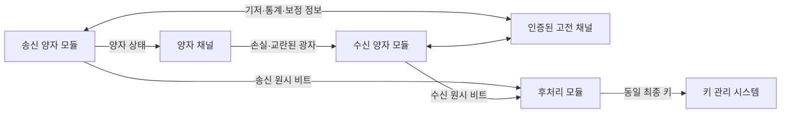
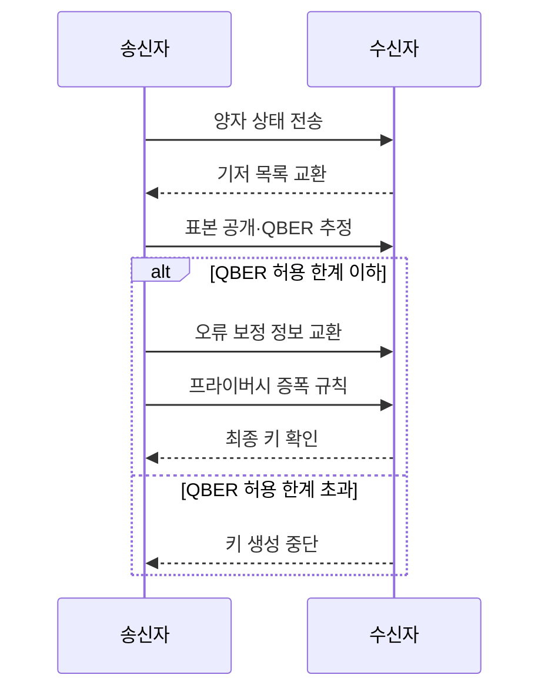

---
sidebar:
  order: 14
  label: "014. QKD 양자 키 분배 (Quantum Key Distribution)"
  badge:
    text: "기출 · 30%"
    variant: note
title: "QKD 양자 키 분배 (Quantum Key Distribution)"
date: "2026-07-27T23:59:59+09:00"
tags:
  - "notes-security"
weight: 14
extra:
  question_no: "014"
  source_status: "기출"
  source_history: "126회"
  priority: 30
  priority_note: "126회 기출이나 PQC 대비 독립 반복 가능성은 낮음"
---

## 미리 알고가기

- **양자 키 분배(Quantum Key Distribution, QKD)**: 양자 상태의 측정 교란을 이용하여 도청 가능성을 탐지하고 대칭키 원재료를 생성하는 기술
- **양자 상태(Quantum State)**: 양자 입자의 측정 결과 확률을 나타내며 측정 과정에서 달라질 수 있는 상태
- **광자(Photon)**: 빛의 최소 에너지 단위로, QKD에서 비트와 기저를 전달하는 매체
- **비복제 정리(No-Cloning Theorem)**: 알려지지 않은 양자 상태를 완벽하게 복제할 수 없다는 원리
- **기저(Basis)**: 양자 비트를 표현하고 측정할 때 선택하는 방향 또는 규칙
- **양자 비트 오류율(Quantum Bit Error Rate, QBER)**: 같은 기저로 측정한 비트 중 결과가 다른 비율로, 잡음과 도청 가능성을 판단하는 지표
- **인증된 고전 채널(Authenticated Classical Channel)**: 기저 비교·오류 보정 메시지의 출처와 무결성을 확인하는 일반 통신 채널
- **오류 보정(Error Correction)**: 공개 정보 교환으로 송수신 원시 비트의 차이를 맞추는 후처리
- **프라이버시 증폭(Privacy Amplification)**: 공격자가 알 수 있는 정보를 줄이도록 비트열을 더 짧은 키로 압축하는 후처리
- **키 관리 시스템(Key Management System, KMS)**: QKD가 생성한 최종 키를 저장·동기화하여 대칭키 암호 장비에 공급하는 시스템
- **BB84(Bennett-Brassard 1984)**: 무작위로 선택한 기저가 일치한 비트만 남겨 공유키를 생성하는 QKD 방식
- **미끼 상태 BB84(Decoy-state BB84)**: 여러 광자 세기를 혼합하여 광자 수 분할 공격을 탐지하는 QKD 방식
- **측정 장치 독립 QKD(Measurement-Device-Independent QKD, MDI-QKD)**: 중간 공동 측정을 이용하여 검출기에 대한 신뢰 가정을 줄이는 QKD 방식
- **광자 수 분할 공격(Photon-number-splitting Attack)**: 다광자 신호에서 일부 광자를 빼내 키 정보를 얻으려는 공격

## Ⅰ. 개요

- 정의/개념: 양자 상태 교란으로 도청을 추정해 키 생성
- 기존 한계: 수학 난제 기반 키 합의는 양자 공격에 취약
- **배경/필요성**: 물리 법칙 기반의 도청 탐지형 키 분배

### 쉽게 이해하기 (학습용)

- 누군가 광자를 몰래 측정하면 일부 결과가 달라지므로, 송수신자가 오류 비율을 확인하고 안전 범위의 비트만 압축해 같은 비밀키를 만든다.

## Ⅱ. 특징

- QKD는 데이터가 아닌 대칭키 원재료를 만든다
- QBER는 잡음·도청 가능성을 함께 반영한다
- 고전 채널 미인증은 중간자 공격을 허용한다

### 쉽게 이해하기 (학습용)

- 오류가 늘었다고 모두 도청은 아니므로 장비 잡음과 회선 상태를 포함한 허용 한계를 정하고, QBER가 넘으면 키 생성을 중단한다.

## Ⅲ. 아키텍처 및 구성요소

| 설계 요소 | 설명 |
|:---|:---|
| 송신 양자 모듈 | 무작위 비트·기저로 광자 준비 |
| 양자 채널 | 양자 상태를 수신 측에 전달 |
| 수신 양자 모듈 | 무작위 기저로 광자 측정 |
| 인증된 고전 채널 | 기저·통계·보정 정보 보호 |
| 후처리 모듈 | 선별·오류 보정·증폭 수행 |
| 키 관리 시스템 | 최종 키 저장·동기화·공급 |

> 요약: 양자 측정값을 인증 후처리로 같은 키로 변환

### 쉽게 이해하기 (학습용)

- 양자 회선은 원료 비트를 만들고, 인증된 일반 회선에서 서로 같은 부분만 골라 오류와 노출분을 제거해야 실제 암호키가 된다.

## Ⅳ. 원리 및 절차 흐름도

| 절차 | 설명 |
|:---|:---|
| 양자 상태 전송 | 무작위 비트·기저로 광자 전달 |
| 기저 목록 교환 | 같은 기저로 측정한 비트 선별 |
| 표본 공개·QBER 추정 | 오류율·정보 노출 상한 판정 |
| 오류 보정 정보 교환 | 남은 비트 차이를 일치시킴 |
| 프라이버시 증폭 규칙 | 노출 가능 정보를 압축 제거 |
| 최종 키 확인 | 양측 키 일치 여부 검증 |
| 키 생성 중단 | QBER 초과 시 원시 비트 폐기 |

> 요약: QBER 통과 비트만 보정·압축해 키 생성

### 쉽게 이해하기 (학습용)

- 오류를 맞추려고 공개한 정보는 공격자도 들을 수 있으므로, 공개량만큼 키를 더 짧게 압축해 알려진 부분을 제거한다.

## Ⅴ. 종류 및 비교

| 판단 기준 | BB84 | 미끼 상태 BB84 | MDI-QKD |
|:---|:---|:---|:---|
| 적용 기준 | 단일광자에 가까운 기본 구조 | 약한 광원을 쓰는 실용 링크 | 검출기 신뢰를 줄여야 할 링크 |
| 핵심 특징 | 무작위 기저로 교란 추정 | 여러 광자 세기로 공격 추정 | 중간 장치에서 공동 측정 |
| 한계 | 실제 광원·검출기 편차 | 세기 통계·매개변수 오류 | 복잡한 동기화·낮은 키 생성률 |

> 요약: 광원·검출기 신뢰 가정으로 방식 선택

### 쉽게 이해하기 (학습용)

- 실제 광원은 한 번에 여러 광자를 보낼 수 있으므로 미끼 상태는 세기를 바꿔 분할 공격을 찾고, MDI-QKD는 검출기를 믿어야 하는 범위를 줄인다.

## Ⅵ. 실무 사례

1. 데이터센터 전용 링크는 QBER 초과 시 중단

### 쉽게 이해하기 (학습용)

- 데이터센터 사이 전용 링크는 정상 잡음 범위로 QBER 한계를 정하고, 이를 넘으면 도청 여부와 관계없이 해당 원시 키를 폐기한다.

## Ⅶ. 결론

- 도청 흔적을 물리적으로 탐지하는 키 분배를 위해 QBER·채널 거리·장비 신뢰·인증 채널·장애 정책을 검토하여, 전용 링크의 고가치 통신에 QKD 적용을 결정해야 한다.

### 쉽게 이해하기 (학습용)

- 광자를 보냈다는 사실만으로 안전하지 않으며, 오류 한계·측정 장비·후처리와 링크 장애 때의 키 정책까지 맞아야 사용할 수 있다.
