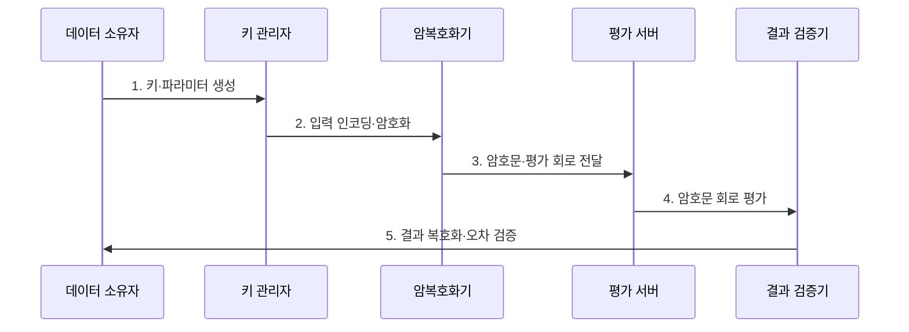

---
sidebar:
  order: 15
  label: "015. 동형 암호 (Homomorphic Encryption)"
  badge:
    text: "기출 · 70%"
    variant: note
title: "동형 암호 (Homomorphic Encryption)"
date: "2026-07-30T19:00:00+09:00"
tags:
  - "notes-security"
weight: 15
extra:
  question_no: "015"
  source_status: "기출"
  source_history: "132회, 135회"
  priority: 70
  priority_note: "132·135회 반복과 데이터 사용 중 보호 수요가 큼"
---

## 미리 알고가기

- **동형 암호(Homomorphic Encryption)**: 암호문을 복호화하지 않고 연산해도 그 결과를 복호화하면 평문 연산 결과와 대응하는 공개키 암호다.
- **평문·암호문(Plaintext·Ciphertext)**: 원본 데이터와 비밀키 없이는 내용을 알기 어렵게 변환한 데이터다.
- **동형성(Homomorphism)**: 암호문 연산의 복호화 결과가 동일한 평문 연산 결과와 대응하는 성질이다.
- **제한 동형 암호(Leveled Homomorphic Encryption)**: 미리 정한 회로 깊이 안에서 덧셈·곱셈을 수행하는 방식이다.
- **완전 동형 암호(Fully Homomorphic Encryption, FHE)**: 부트스트래핑으로 노이즈를 갱신하여 임의 깊이의 연산을 지원하는 동형 암호다.
- **회로 깊이(Circuit Depth)**: 앞 연산에 의존해 순차적으로 이어지는 곱셈 단계 수다.
- **노이즈 예산(Noise Budget)**: 계산 후에도 정확히 복호화할 수 있는 노이즈 허용 범위다.
- **모듈러스(Modulus)**: 계수 계산 범위와 노이즈 예산·보안 수준을 결정하는 나눗셈 기준값이다.
- **레벨(Level)**: 남은 모듈러스 단계와 추가로 수행할 수 있는 곱셈 범위다.
- **스케일(Scale)**: CKKS에서 실숫값의 정밀도를 관리하는 배율이다.
- **부트스트래핑(Bootstrapping)**: 암호문의 노이즈를 줄여 추가 연산 여유를 확보하는 기법이다.
- **재선형화(Relinearization)**: 곱셈 후 커진 암호문 차수를 평가 키로 줄이는 기법이다.
- **평가 키(Evaluation Key)**: 재선형화·회전·부트스트래핑을 지원하는 공개 보조 키다.
- **암호문 슬롯(Ciphertext Slot)**: 한 암호문에서 같은 연산을 병렬 적용하는 논리적 위치다.
- **BFV(Brakerski-Fan-Vercauteren)**: 정확한 정수·모듈러 연산을 지원하는 동형 암호 방식이다.
- **BGV(Brakerski-Gentry-Vaikuntanathan)**: 레벨별로 깊은 정수 연산을 지원하는 동형 암호 방식이다.
- **CKKS(Cheon-Kim-Kim-Song)**: 실수·복소수의 근사 연산을 지원하는 동형 암호 방식이다.
- **ISO/IEC 18033-6:2019**: Exponential ElGamal·Paillier 동형 암호 메커니즘을 규정한 국제 표준이다.

## Ⅰ. 개요

- 정의/개념: 암호문 계산 결과가 평문 계산과 대응
- 배경/필요성: 계산 전 평문 복호화 없이 원문 비공개 상태로 외부 분석을 위탁할 수단 필요

### 쉽게 이해하기 (학습용)

- 서버가 잠긴 상자를 열지 않고도 안의 숫자를 계산해 새 상자로 돌려주면, 비밀키를 가진 소유자만 결과를 확인한다.

## Ⅱ. 특징

- **곱셈 깊이**에 따른 노이즈 증가·복호화 성공 제약
- 평문 대비 **암호문 크기·연산량 증가**
- 데이터 **기밀성 제공·계산 무결성 미보장**

### 쉽게 이해하기 (학습용)

- 서버는 원문을 볼 수 없지만 계산을 빼먹거나 다른 회로를 실행할 수 있으므로, 암호화와 별도로 계산 결과가 맞는지 검증해야 한다.

## Ⅲ. 구조 및 구성요소

| 구성요소 | 책임 |
|:---|:---|
| 인코더·암복호화기 | 값을 슬롯에 넣고 암호화·복호화 |
| 키·파라미터 저장소 | 키·차수·모듈러스·보안수준 보관 |
| 동형 평가 엔진 | 암호문 상태에서 회로 실행 |
| 노이즈·레벨 관리자 | 재선형화·스케일·깊이 추적 |

### 쉽게 이해하기 (학습용)

- 한 상자에 여러 숫자를 칸별로 넣으면 서버가 한 번의 암호문 연산으로 모든 칸에 같은 계산을 적용해 비용을 나눌 수 있다.

## Ⅳ. 흐름도

1. **키·파라미터 생성**: 회로 깊이·보안·오차 한도 반영
2. **입력 인코딩·암호화**: 슬롯 구성·입력 암호문 생성
3. **암호문·평가 회로 전달**: 평가 키와 허용 연산 제공
4. **암호문 회로 평가**: 노이즈·레벨을 관리하며 계산
5. **결과 복호화·오차 검증**: 평문 결과와 허용 오차 판정

### 쉽게 이해하기 (학습용)

- 계산 도중 노이즈 예산이 다 떨어지면 결과를 열 수 없으므로, 실행할 곱셈 깊이를 먼저 정하고 키와 파라미터를 만들어야 한다.

## Ⅴ. 종류 및 비교

| 동형 암호 방식 | BFV | BGV | CKKS |
|:---|:---|:---|:---|
| 적용 기준 | 정확한 합계·횟수 계산 | 깊은 정수 회로 계산 | 통계·기계학습 추론 |
| 핵심 특징 | **정확한 정수·모듈러 연산** | 레벨별 정확한 정수 연산 | **실수·복소수 근사 연산** |
| 한계 | 깊이에 따른 파라미터 증가 | 레벨 관리 복잡성 | 스케일 오류·근사 오차 누적 |

> 요약: 정수 정확도·실수 오차·깊이로 방식 선택

### 쉽게 이해하기 (학습용)

- 한 건도 틀리면 안 되는 정수 집계는 BFV·BGV를 쓰고, 작은 오차를 허용하는 실수 통계와 기계학습은 CKKS를 쓴다.

## Ⅵ. 실무 고려사항 및 대책

| 고려사항 | 대책 | 효과 |
|:---|:---|:---|
| 부분 동형 방식 | **ISO/IEC 18033-6 준수** | 구현 기준 일관화 |
| 깊이·노이즈 예산 | **회로 사전 산정·파라미터 검증** | 복호화 실패 방지 |
| 계산 결과 무결성 | **별도 증명·표본 재계산** | 오연산·누락 탐지 |

### 쉽게 이해하기 (학습용)

- 의료기관은 환자 값을 암호화한 채 외부 서버에서 평균을 계산하고, 허용 오차 안의 결과만 복호화해 원문 노출을 줄인다.

## Ⅶ. 결론

- **연산형·깊이·정확도·성능**으로 동형암호 방식을 결정한다.

### 쉽게 이해하기 (학습용)

- 원문을 숨긴 채 계산할 수 있어도 계산 회로와 결과가 맞다는 보장은 없으므로, 데이터형·깊이·오차에 맞는 방식과 별도 결과 검증을 정해야 한다.
