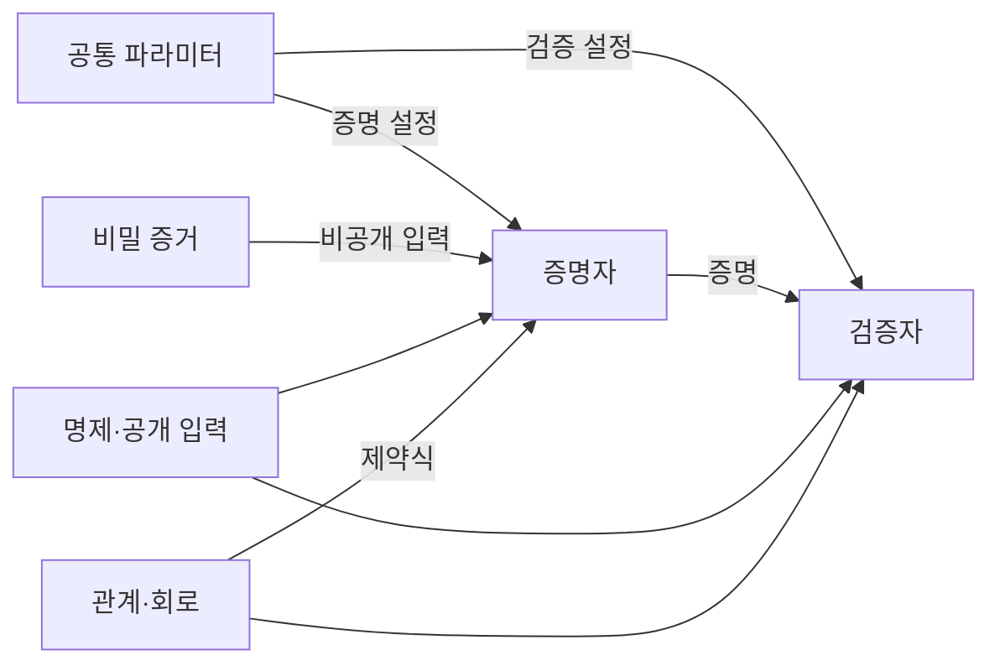
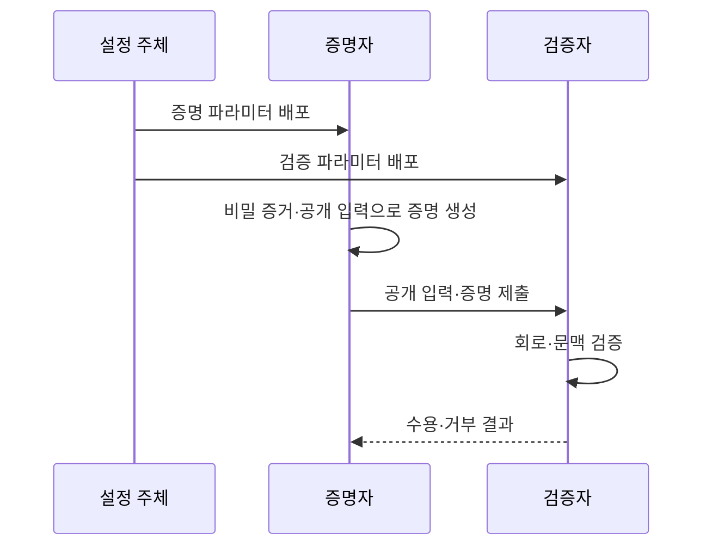

---
sidebar:
  order: 16
  label: "016. 영지식 증명 ZKP (Zero-Knowledge Proof)"
  badge:
    text: "기출 · 50%"
    variant: note
title: "영지식 증명 ZKP (Zero-Knowledge Proof)"
date: "2026-07-25T01:05:00+09:00"
tags:
  - "notes-security"
weight: 16
extra:
  question_no: "016"
  source_status: "기출"
  source_history: "132회"
  priority: 50
  priority_note: "132회 기출이며 증명·인증·프라이버시에 교차 활용됨"
---

## 미리 알고가기

- **영지식 증명(Zero-Knowledge Proof, ZKP)**: [읽기: 지케이피; 표기 이유: 영문 머리글자와 구분 기호] 비밀값을 공개하지 않고도 그 비밀값이 정해진 관계를 만족한다는 사실만 검증하게 하는 암호 프로토콜
- **명제(Statement)**: [읽기: 에스티에이티이엠이엔티; 표기 이유: 영문 머리글자와 구분 기호] 증명자가 참이라고 주장하고 검증자가 확인할 공개된 주장
- **비밀 증거(Witness)**: [읽기: 더블유아이티엔이에스에스; 표기 이유: 영문 머리글자와 구분 기호] 공개하지 않지만 명제를 참으로 만드는 비밀 입력
- **완전성(Completeness)**: [읽기: 씨오엠피엘이티이엔이에스에스; 표기 이유: 영문 머리글자와 구분 기호] 참인 명제와 올바른 비밀 증거로 만든 증명을 검증자가 수용하는 성질
- **건전성(Soundness)**: [읽기: 에스오유엔디엔이에스에스; 표기 이유: 영문 머리글자와 구분 기호] 거짓 명제나 잘못된 비밀 증거로 검증을 통과할 가능성을 제한하는 성질
- **영지식성(Zero-knowledge)**: [읽기: 지이알오; 표기 이유: 영문 머리글자와 구분 기호] 검증자가 명제의 참 이외에 비밀 증거 정보를 얻지 못하는 성질
- **관계·회로(Relation·Circuit)**: [읽기: 알이엘에이티아이오엔씨아이알씨유아이티; 표기 이유: 영문 머리글자와 구분 기호] 공개 입력과 비밀 증거가 만족해야 할 계산 조건을 제약식으로 표현한 구조
- **증명자·검증자(Prover·Verifier)**: [읽기: 피알오브이이알브이이알아이에프아이이알; 표기 이유: 영문 머리글자와 구분 기호] 비밀 증거로 증명을 만드는 주체와 공개 입력으로 증명의 유효성을 판정하는 주체
- **공통 파라미터(Common Parameters)**: [읽기: 씨오엠엠오엔; 표기 이유: 영문 머리글자와 구분 기호] 증명 생성과 검증에 함께 사용하는 공개 설정값
- **zk-SNARK(Zero-Knowledge Succinct Non-Interactive Argument of Knowledge)**: [읽기: 에스엔에이알케이; 표기 이유: 영문 머리글자와 구분 기호] 짧은 비대화형 증명과 빠른 검증을 제공하는 영지식 증명 계열
- **zk-STARK(Zero-Knowledge Scalable Transparent Argument of Knowledge)**: [읽기: 에스티에이알케이; 표기 이유: 영문 머리글자와 구분 기호] 별도의 비밀 설정 없이 해시 기반으로 확장 가능한 증명을 만드는 계열
- **범위 증명(Range Proof)**: [읽기: 알에이엔지이; 표기 이유: 영문 머리글자와 구분 기호] 비밀값을 공개하지 않고 값이 정해진 수치 구간에 속함을 증명하는 방식
- **롤업(Rollup)**: [읽기: 알오엘엘유피; 표기 이유: 영문 머리글자와 구분 기호] 여러 거래나 상태 전이를 묶어 외부에서 계산하고 압축된 증명과 결과를 기본 시스템에 제출하는 구조

## Ⅰ. 개요

- **정의/개념**: 비밀 증거 없이 정해진 명제의 참만 증명
- **배경/필요성**: 원본 노출 없는 신원·계산 조건 검증

### 쉽게 이해하기 (학습용)

- 비밀번호를 보여 주지 않고도 올바른 비밀번호를 안다는 사실만 확인시켜, 검증자가 비밀번호 자체를 저장하거나 볼 필요를 없앤다.

## Ⅱ. 특징

- 회로에 표현한 관계만 참으로 증명한다
- 증명 비용은 회로 크기·시스템에 의존한다
- 외부 입력의 현실 진실성은 별도 검증한다

### 쉽게 이해하기 (학습용)

- 회로가 나이 숫자만 검사하면 가짜 숫자도 통과할 수 있으므로, 그 숫자가 신뢰기관이 발급한 신분증에서 왔다는 조건까지 관계에 넣어야 한다.

## Ⅲ. 아키텍처 및 구성요소

| 설계 요소 | 설명 |
|:---|:---|
| 공통 파라미터 | 증명·검증에 사용할 설정 제공 |
| 증명자 | 비밀 증거로 증명 생성 |
| 검증자 | 공개 입력과 증명 유효성 판정 |
| 비밀 증거 | 명제를 만족하는 비공개 입력 |
| 명제·공개 입력 | 확인할 주장과 공개 범위 고정 |
| 관계·회로 | 참 조건을 제약식으로 표현 |

> 요약: 비밀 증거는 숨기고 관계 만족만 검증

### 쉽게 이해하기 (학습용)

- 검사표에 빠진 조건은 검증할 수 없으므로, 회로가 실제 업무 규칙을 모두 표현하는지 감사해야 거짓 상태의 증명 통과를 방지할 수 있다.

## Ⅳ. 원리 및 절차 흐름도

| 절차 | 설명 |
|:---|:---|
| 증명 파라미터 배포 | 증명 생성용 공개 설정 제공 |
| 검증 파라미터 배포 | 검증용 공개 설정 제공 |
| 비밀 증거·공개 입력으로 증명 생성 | 회로 만족 증거를 압축 생성 |
| 공개 입력·증명 제출 | 비밀값 없이 검증 자료 전달 |
| 회로·문맥 검증 | 대상·버전·제약 만족 여부 판정 |
| 수용·거부 결과 | 건전성 기준에 따라 처리 |

> 요약: 같은 회로·문맥에서 비밀 없이 참 검증

### 쉽게 이해하기 (학습용)

- 다른 서비스에서 만든 증명을 재사용하지 못하게 서비스 식별자·회로 버전·요청값을 공개 입력에 묶어 검증한다.

## Ⅴ. 종류 및 비교

| 판단 기준 | zk-SNARK | zk-STARK | 범위 증명 |
|:---|:---|:---|:---|
| 핵심 특징 | 짧은 비대화형 증명 | 투명 설정·해시 기반 증명 | 비밀값의 구간만 증명 |
| 적용 기준 | 증명 크기·검증 비용 제한 | 대규모 계산·비밀 설정 회피 | 나이·잔액 등 수치 범위 검증 |
| 주요 위험 | 설정 비밀 유출 시 건전성 훼손 | 큰 증명 크기 | 복잡한 관계 증명에는 부적합 |

> 요약: 설정 신뢰·증명 크기·관계로 선택

### 쉽게 이해하기 (학습용)

- 증명이 작아도 초기 설정의 비밀이 남으면 가짜 증명을 만들 수 있으므로, 통신 비용과 함께 설정을 누구에게 신뢰할지도 선택 기준이다.

## Ⅵ. 실무 사례

1. 성인 인증은 생년월일 없이 범위 증명
2. 롤업은 상태 전이 회로의 증명만 제출

### 쉽게 이해하기 (학습용)

- 성인 인증은 생년월일 전체를 보내지 않고 신뢰된 신분 정보의 나이가 기준 이상이라는 사실만 증명한다.
- 롤업은 여러 상태 변경을 외부에서 계산하고, 공개된 이전·다음 상태가 회로 규칙대로 이어졌다는 증명을 제출한다.

## Ⅶ. 결론

- 공개 범위·회로·설정 신뢰로 ZKP 선택

### 쉽게 이해하기 (학습용)

- 영지식이라는 이름만 믿지 말고 무엇을 숨기며 어떤 관계의 참을 증명하는지와 초기 설정을 누구에게 신뢰하는지를 정해야 한다.
