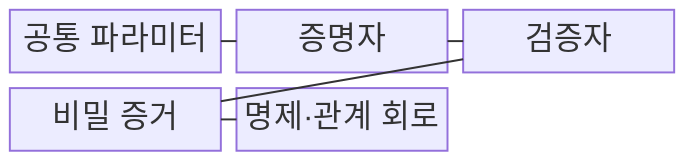
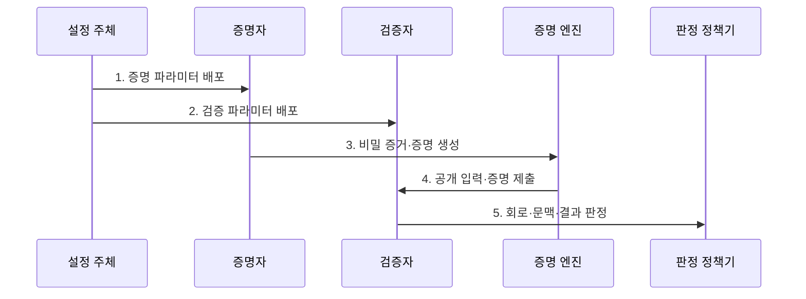

---
sidebar:
  order: 16
  label: "016. 영지식 증명 ZKP (Zero-Knowledge Proof)"
  badge:
    text: "기출 · 50%"
    variant: note
title: "영지식 증명 ZKP (Zero-Knowledge Proof)"
date: "2026-07-30T19:00:00+09:00"
tags:
  - "notes-security"
weight: 16
extra:
  question_no: "016"
  source_status: "기출"
  source_history: "132회"
  priority: 50
  priority_note: "132회 기출이며 증명·인증·프라이버시에 교차 활용됨"
---

## 미리 알고가기

- **영지식 증명(Zero-Knowledge Proof, ZKP)**: 비밀값을 공개하지 않고 정해진 관계가 성립한다는 사실만 증명하는 암호 프로토콜이다.
- **명제(Statement)**: 증명자가 참이라고 주장하고 검증자가 확인할 공개 주장이다.
- **비밀 증거(Witness)**: 외부에 공개하지 않지만 명제를 참으로 만드는 비밀 입력이다.
- **완전성(Completeness)**: 참인 명제와 올바른 비밀 증거의 증명을 수용하는 성질이다.
- **건전성(Soundness)**: 거짓 명제가 검증을 통과할 가능성을 제한하는 성질이다.
- **영지식성(Zero-knowledge)**: 검증자가 명제의 참 이외에 비밀 증거 정보를 얻지 못하는 성질이다.
- **관계·회로(Relation·Circuit)**: 공개 입력과 비밀 증거가 만족할 조건을 제약식으로 표현한 구조다.
- **증명자·검증자(Prover·Verifier)**: 증명을 만드는 주체와 유효성을 판정하는 주체다.
- **공통 파라미터(Common Parameters)**: 증명 생성과 검증에 공통으로 쓰는 공개 설정값이다.
- **zk-SNARK(Zero-Knowledge Succinct Non-Interactive Argument of Knowledge)**: 짧은 증명과 빠른 검증을 제공하는 비대화형 영지식 증명 방식이다.
- **zk-STARK(Zero-Knowledge Scalable Transparent Argument of Knowledge)**: 신뢰 설정 없이 해시 함수로 확장 가능한 증명을 생성하는 영지식 증명 방식이다.
- **범위 증명(Range Proof)**: 비밀값을 공개하지 않고 정해진 수치 구간에 속함을 증명한다.
- **롤업(Rollup)**: 다수의 거래·상태 전이를 외부에서 계산한 뒤 결과와 유효성 증명을 제출하는 확장 구조다.
- **ISO/IEC 9798-5:2009**: 영지식 기법을 이용한 엔티티 인증 메커니즘을 규정한 국제 표준이다.

## Ⅰ. 개요

- 정의/개념: 비밀 증거를 공개하지 않고 명제의 참을 증명
- 배경/필요성: 비밀 원본을 제출·노출하지 않고 신원과 조건을 검증할 수단 필요

### 쉽게 이해하기 (학습용)

- 비밀번호를 보여 주지 않고도 올바른 비밀번호를 안다는 사실만 확인시켜, 검증자가 비밀번호 자체를 저장하거나 볼 필요를 없앤다.

## Ⅱ. 특징

- 회로에 표현한 **명제 관계만 증명**하는 범위 제한
- **회로 크기·증명 시스템**에 따른 생성·검증 비용
- 외부 입력의 **현실 진실성 별도 검증** 필요

### 쉽게 이해하기 (학습용)

- 회로가 나이 숫자만 검사하면 가짜 숫자도 통과할 수 있으므로, 그 숫자가 신뢰기관이 발급한 신분증에서 왔다는 조건까지 관계에 넣어야 한다.

## Ⅲ. 구조 및 구성요소

| 구성요소 | 책임 |
|:---|:---|
| 공통 파라미터 | 증명·검증에 사용할 설정 제공 |
| 증명자 | 비밀 증거로 증명 생성 |
| 검증자 | 공개 입력과 증명 유효성 판정 |
| 비밀 증거 | 명제를 만족하는 비공개 입력 |
| 명제·관계 회로 | 공개 주장·참 조건을 제약화 |

### 쉽게 이해하기 (학습용)

- 검사표에 빠진 조건은 검증할 수 없으므로, 회로가 실제 업무 규칙을 모두 표현하는지 감사해야 거짓 상태의 증명 통과를 방지할 수 있다.

## Ⅳ. 흐름도

1. **증명 파라미터 배포**: 증명 생성용 공개 설정 제공
2. **검증 파라미터 배포**: 검증용 공개 설정 제공
3. **비밀 증거·증명 생성**: 회로 만족 증거를 압축 생성
4. **공개 입력·증명 제출**: 비밀값 없이 검증 자료 전달
5. **회로·문맥·결과 판정**: 대상·버전·제약 만족 처리

### 쉽게 이해하기 (학습용)

- 다른 서비스에서 만든 증명을 재사용하지 못하게 서비스 식별자·회로 버전·요청값을 공개 입력에 묶어 검증한다.

## Ⅴ. 종류 및 비교

| 영지식 증명 방식 | zk-SNARK | zk-STARK | 범위 증명 |
|:---|:---|:---|:---|
| 적용 기준 | 증명 크기·검증 비용 제한 | 대규모 계산·비밀 설정 회피 | 나이·잔액 등 수치 범위 검증 |
| 핵심 특징 | **짧은 비대화형 증명** | **투명 설정·해시 기반** | 비밀값의 구간만 증명 |
| 한계 | 설정 비밀 유출 시 건전성 훼손 | 큰 증명 크기 | 복잡한 관계 증명에는 부적합 |

> 요약: 설정 신뢰·증명 크기·관계로 선택

### 쉽게 이해하기 (학습용)

- 증명이 작아도 초기 설정의 비밀이 남으면 가짜 증명을 만들 수 있으므로, 통신 비용과 함께 설정을 누구에게 신뢰할지도 선택 기준이다.

## Ⅵ. 실무 고려사항 및 대책

| 고려사항 | 대책 | 효과 |
|:---|:---|:---|
| 영지식 엔티티 인증 | **ISO/IEC 9798-5 적용** | 인증 절차 일관화 |
| 회로 누락·버전 혼선 | **회로 감사·문맥 버전 결합** | 거짓 명제 수용 차단 |
| 신뢰 설정 비밀 | **다자 설정·폐기 증적** | 위조 증명 위험 억제 |

### 쉽게 이해하기 (학습용)

- 성인 인증은 생년월일 전체를 보내지 않고 신뢰된 신분 정보의 나이가 기준 이상이라는 사실만 증명한다.

## Ⅶ. 결론

- **명제범위·설정신뢰·증명비용**으로 ZKP 방식을 결정한다.

### 쉽게 이해하기 (학습용)

- 영지식이라는 이름만 믿지 말고 무엇을 숨기며 어떤 관계의 참을 증명하는지와 초기 설정을 누구에게 신뢰하는지를 정해야 한다.
