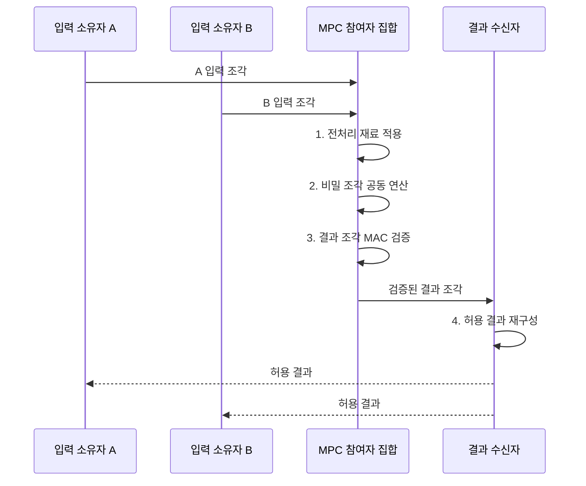

---
sidebar:
  order: 17
  label: "017. 안전한 다자간 연산 MPC (Secure Multi-Party Computation)"
  badge:
    text: "기출 • 50%"
    variant: note
title: "안전한 다자간 연산 MPC (Secure Multi-Party Computation)"
date: "2026-08-05T00:00:00+09:00"
tags:
  - "notes-security"
weight: 17
extra:
  question_no: "017"
  source_status: "기출"
  source_history: "135회"
  priority: 50
  priority_note: "135회 기출이며 PET 비교와 협업 연산 설계에 유용함"
---

## Ⅰ. 개요

<details>
<summary>핵심 용어</summary>

- **안전한 다자간 연산(Secure Multi-Party Computation, MPC)** 은 여러 참여자가 각자의 원본 입력을 공개하지 않고 정해진 함수의 결과만 공동 계산하는 기술이다.
- **프라이버시 강화 기술(Privacy-Enhancing Technology, PET)** 은 데이터 활용 과정에서 원본 노출과 개인 식별 가능성을 줄이는 기술군이다.

</details>

- 정의/개념: 원본 입력을 숨기고 결과만 공동 계산하는 **PET**
- 배경/필요성: 중앙 집중 분석은 **조직 간 원본 노출•이전 제약** 유발

#### 한줄 요약

- 각 기관이 숫자를 조각내 나눠 보내면 누구도 원래 숫자를 보지 못하지만, 조각끼리 계산해 전체 합계만 복구할 수 있다.

## Ⅱ. 특징

<details>
<summary>핵심 용어</summary>

- **공모(Collusion)** 는 참여자들이 정보와 조각을 합쳐 다른 참여자의 비밀을 추론하는 행위다.
- **반정직 공격자** 는 정해진 절차를 따르면서 관찰한 정보로 비밀을 추론한다.
- **악의적 공격자** 는 잘못된 입력•메시지•중단으로 결과를 왜곡한다.
- **반복•세분 출력 추론** 은 결과 범위나 참여자 구성을 바꿔 여러 번 조회하여 특정 입력을 역산하는 위험이다.

</details>

- **허용 공모 임계값** 에 따른 원본 비밀성
- **악의적 공격자 모델** 의 부정 메시지 검증
- **반복•세분 출력** 에 따른 개인 입력 추론 위험

#### 한줄 요약

- 원본을 숨겨도 참여자 한 명만 빼고 합계를 반복 조회하면 빠진 사람의 값을 계산할 수 있으므로, 출력 조건과 횟수도 제한해야 한다.

## Ⅲ. 구조 및 구성요소

<details>
<summary>핵심 용어</summary>

- **비밀 분산(Secret Sharing)** 은 비밀을 여러 조각으로 나누고 임계값 이상의 조각이 모일 때만 원본을 복구하는 방식이다.
- **비버 트리플(Beaver Triple)** 은 비밀 분산 곱셈에 필요한 값을 미리 계산하여 온라인 통신량을 줄이는 기법이다.
- **메시지 인증 코드(MAC)** 는 비밀키를 이용해 메시지 변조 여부와 송신자 정당성을 검증하는 값이다.
- **출력 정책** 은 결과를 공개할 대상•범위•횟수를 제한한다.
- **재구성기** 는 결과 조각의 MAC을 확인하고 허용된 결과만 복구한다.

</details>

```text
            [참여자 A]   [참여자 B]   [참여자 C]
                    \         |         /
                       [전처리 저장소]
                              |
                    [출력 정책•재구성기]
```

선의 의미: 위 세 가지는 각 참여자가 공동 연산용 비버 트리플•MAC 재료를 제공받는 정적 MPC 참여 경계이고, 아래 선은 전처리 저장소와 출력 정책•재구성기가 결과의 무결성과 공개 범위를 함께 통제하는 관계를 뜻한다.

| 구성요소 | 책임 |
|:---|:---|
| 참여자 A | A의 **입력 조각•중간 상태** 보유 |
| 참여자 B | B의 **입력 조각•중간 상태** 보유 |
| 참여자 C | C의 **입력 조각•중간 상태** 보유 |
| 전처리 저장소 | 곱셈용 **비버 트리플•MAC 재료** 제공 |
| 출력 정책•재구성기 | MAC 검증 후 **허용 결과만 복구** |


#### 한줄 요약

- 각 참여자는 원본 대신 의미 없는 조각만 들고 서로 계산하며, 임계값 이상의 올바른 결과 조각이 모일 때만 허용된 답을 복구한다.

## Ⅳ. 흐름도

<details>
<summary>핵심 용어</summary>

- **임계값(Threshold)** 은 비밀 재구성이나 공동 연산에 필요한 최소 참여자•조각 수다.
- **재구성(Reconstruction)** 은 임계값 이상의 결과 조각을 모아 허용된 최종 출력을 복구하는 절차다.

</details>



**동작 원리**

1. **전처리 재료 적용**: 곱셈•무결성용 무작위 값 준비
2. **비밀 조각 공동 연산**: 조각 상태의 결과•MAC 계산
3. **결과 조각 MAC 검증**: 부정 참여자의 변조 여부 판정
4. **허용 결과 재구성**: 임계 조각으로 최종 출력 복구


#### 한줄 요약

- 한 참여자가 다른 결과를 먼저 본 뒤 자기 조각을 보내지 않으면 나머지만 손해를 볼 수 있으므로, 중단과 결과 공개 순서도 프로토콜에 정해야 한다.

## Ⅴ. 종류 및 비교

<details>
<summary>핵심 용어</summary>

- **가블드 회로(Garbled Circuit)** 는 회로의 와이어 값을 암호화하여 입력을 공개하지 않고 출력을 계산하는 방식이다.
- **동형 암호(Homomorphic Encryption)** 는 암호문을 복호화하지 않고 계산하는 암호 방식이다.

</details>

| MPC 방식 | 비밀 분산 MPC | 가블드 회로 MPC | 동형 암호 기반 MPC |
|:---|:---|:---|:---|
| 적용 기준 | **덧셈•곱셈 중심 통계** | **비교•분기 중심 정책** | 통신 횟수를 줄일 **집계** |
| 핵심 특징 | **조각 기반 산술 연산** | **암호화 논리 회로 평가** | **암호문 상태 연산** |
| 한계 | **많은 통신 왕복•전처리** | 회로 크기에 따른 **통신 증가** | **큰 암호문•연산 비용** |

> 요약: 함수 구조•통신•연산 비용으로 방식 선택

#### 한줄 요약

- 합계처럼 산술이 많으면 비밀 분산이 맞고, 조건 비교가 많으면 가블드 회로가 맞으며, 통신이 비싸면 동형 암호로 일부 계산을 줄일 수 있다.

## Ⅵ. 실무 고려사항 및 대책

<details>
<summary>핵심 용어</summary>

- **국제표준화기구/국제전기기술위원회(International Organization for Standardization/International Electrotechnical Commission, ISO/IEC) 4922-1:2023** 은 MPC의 용어•절차•참여자•암호 속성을 규정한다.
- **ISO/IEC 4922-2:2024** 는 비밀 분산 기반 MPC의 안전한 함수 계산 절차를 규정한 국제 표준이다.

</details>

| 문제 | 대책 | 효과 |
|:---|:---|:---|
| **MPC 공통 절차 불일치** | **ISO/IEC 4922-1 적용** | **역할•속성 해석 일관화** |
| **비밀 분산 연산 불일치** | **ISO/IEC 4922-2 적용** | **조각 계산 상호운용성** 확보 |
| **공모•반복 출력** | **임계값•출력 횟수 통제** | **입력 역추론 억제** |

#### 한줄 요약

- 은행들은 고객 원장을 보내지 않고 금액 조각만 교환해 전체 의심 거래 합계를 계산하며, 출력 횟수를 제한해 개별 은행 값 추론을 줄인다.

## Ⅶ. 결론

<details>
<summary>핵심 용어</summary>

- **출력 통제** 는 반복•세분 결과로 개인 입력을 역추론하지 못하도록 공개 대상과 횟수를 제한하는 정책이다.

</details>

- 산술 중심은 **비밀 분산**, 비교•분기 중심은 **가블드 회로** 선택

#### 한줄 요약

- 원본을 모으지 않아도 공모자 수와 반복 결과에서 비밀이 드러날 수 있으므로, 계산 함수•임계값•출력 대상을 함께 정해야 한다.
